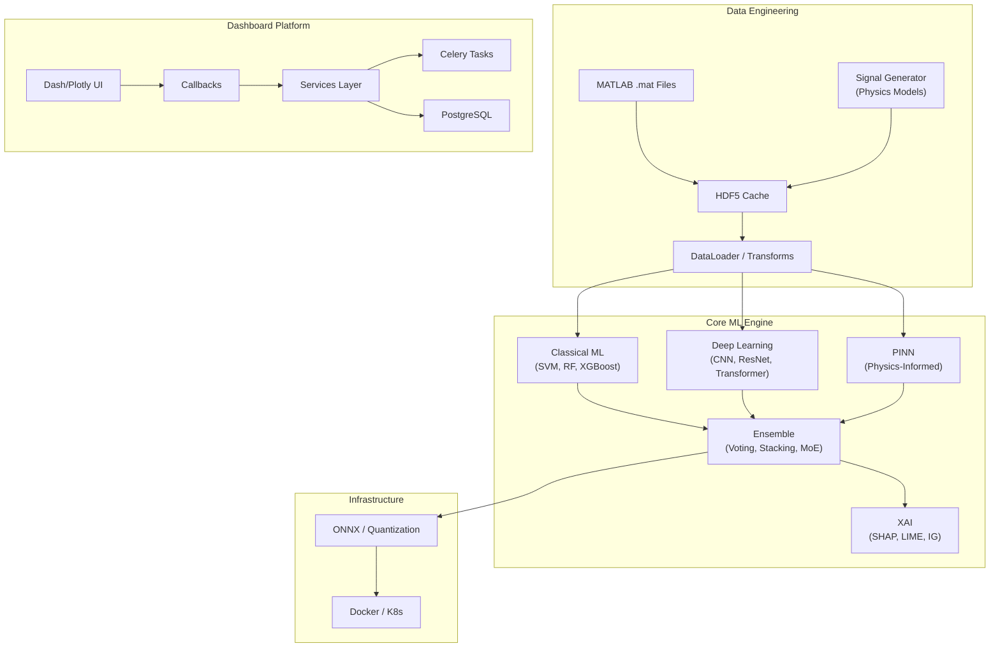

# LSTM-PFD: Physics-Informed Fault Diagnosis

> LSTM-based bearing fault diagnosis with physics-informed neural networks, explainable AI, and an enterprise dashboard.

## Overview

**LSTM-PFD** is a research-grade bearing fault diagnosis system that progresses from classical machine learning to physics-informed deep learning. The project combines multiple model architectures — classical ML, CNNs, Transformers, Physics-Informed Neural Networks (PINNs), and ensembles — to classify 11 bearing fault types from vibration signals.

The system includes a full-stack enterprise dashboard (Dash/Plotly) for no-code model training, experiment management, and explainable AI visualization, backed by a PostgreSQL database and Celery task queue.

> ⚠️ **Performance benchmarks**: `[PENDING — run experiments to fill]`. All accuracy, latency, and coverage numbers in this repository are pending experimental validation on the current codebase.

## Features

- **11 Fault Types** — Normal, Ball Fault, Inner Race, Outer Race, Combined, Imbalance, Misalignment, Oil Whirl, Cavitation, Looseness, Oil Deficiency
- **Multiple Model Architectures** — SVM, Random Forest, XGBoost, 1D CNN, ResNet, EfficientNet, Transformers, PINNs, Ensembles (voting, stacking, mixture of experts)
- **Explainable AI (XAI)** — SHAP, LIME, Integrated Gradients, Grad-CAM, attention visualization
- **Physics-Informed Learning** — Domain constraints from bearing dynamics (energy conservation, momentum conservation)
- **Enterprise Dashboard** — Web-based UI for data generation, training, experiment comparison, and XAI visualization
- **Production Deployment** — Model quantization (INT8/FP16), ONNX export, Docker/Kubernetes deployment
- **HDF5 Data Pipeline** — Efficient caching of MATLAB vibration data with configurable transforms

## Architecture



## Quick Start

### Prerequisites

- Python 3.8+ (3.10 recommended)
- CUDA 11.8+ (optional, for GPU acceleration)
- PostgreSQL (for dashboard features)

### Installation

```bash
git clone https://github.com/abbas-ahmad-cowlar/LSTM_PFD.git
cd LSTM_PFD
python -m venv venv

# Linux/Mac
source venv/bin/activate
# Windows
venv\Scripts\activate

# Install PyTorch (with CUDA)
pip install torch torchvision torchaudio --index-url https://download.pytorch.org/whl/cu118

# Install project dependencies
pip install -r requirements.txt
```

### Verify Installation

```bash
python -c "import torch; print(f'PyTorch {torch.__version__} | CUDA: {torch.cuda.is_available()}')"
```

### Run the Dashboard

```bash
cp .env.example .env
# Edit .env: set DATABASE_URL, SECRET_KEY, JWT_SECRET_KEY
cd packages/dashboard
python app.py
# Open http://localhost:8050
```

> 📖 **Full setup guide**: [docs/GETTING_STARTED.md](docs/GETTING_STARTED.md)

## Project Structure

```
LSTM_PFD/
├── packages/
│   ├── core/                  # Core ML Engine
│   │   ├── models/            # Model architectures (IDB 1.1)
│   │   ├── training/          # Training pipeline (IDB 1.2)
│   │   ├── evaluation/        # Metrics & evaluation (IDB 1.3)
│   │   ├── features/          # Feature extraction (IDB 1.4)
│   │   └── explainability/    # XAI methods (IDB 1.5)
│   ├── dashboard/             # Enterprise Dashboard (IDB 2.x)
│   │   ├── layouts/           # UI layouts
│   │   ├── components/        # UI components
│   │   ├── services/          # Backend services
│   │   ├── callbacks/         # Dash callbacks
│   │   ├── tasks/             # Celery async tasks
│   │   ├── database/          # DB operations
│   │   └── models/            # SQLAlchemy models
│   └── deployment/            # Deployment utilities (IDB 4.2)
├── data/                      # Data engineering (IDB 3.x)
├── config/                    # Configuration files (IDB 4.4)
├── tests/                     # Test suite (IDB 4.3)
├── deploy/                    # Deployment scripts (IDB 4.2)
├── integration/               # Cross-module integration (IDB 6.0)
├── utils/                     # Shared utilities (IDB 6.0)
├── visualization/             # Research visualization (IDB 5.2)
├── scripts/research/          # Research experiment scripts (IDB 5.1)
└── docs/                      # Documentation hub
```

## Documentation

| Resource                    | Location                                                           |
| --------------------------- | ------------------------------------------------------------------ |
| **Documentation Hub**       | [docs/index.md](docs/index.md)                                     |
| **Architecture Overview**   | [docs/ARCHITECTURE.md](docs/ARCHITECTURE.md)                       |
| **Getting Started**         | [docs/GETTING_STARTED.md](docs/GETTING_STARTED.md)                 |
| **Documentation Standards** | [docs/DOCUMENTATION_STANDARDS.md](docs/DOCUMENTATION_STANDARDS.md) |
| **Contributing**            | [CONTRIBUTING.md](CONTRIBUTING.md)                                 |

Each module has its own `README.md` and guide — see [docs/index.md](docs/index.md) for the full navigation map.

## Performance

> ⚠️ **Results pending.** Performance metrics below will be populated after experiments are run on the current codebase.

| Metric         | Value       |
| -------------- | ----------- |
| Accuracy       | `[PENDING]` |
| F1 Score       | `[PENDING]` |
| Precision      | `[PENDING]` |
| Recall         | `[PENDING]` |
| Inference Time | `[PENDING]` |

## Contributing

We welcome contributions! See [CONTRIBUTING.md](CONTRIBUTING.md) for guidelines.

```bash
pip install -r requirements-test.txt
pytest -v
black . && isort . && flake8 .
```

## License

MIT License

## Citation

```bibtex
@software{lstm_pfd_2025,
  author = {Syed Abbas Ahmad},
  title = {LSTM-PFD: Physics-Informed Fault Diagnosis},
  year = {2025},
  url = {https://github.com/abbas-ahmad-cowlar/LSTM_PFD}
}
```
