# Configuration Module

> Typed, dataclass-based configuration system with YAML serialization and JSON schema validation.

## Overview

The `config/` module provides the central configuration management layer for the LSTM_PFD pipeline. All configuration objects inherit from an abstract `BaseConfig` class, which provides automatic YAML load/save, JSON schema validation, dictionary conversion, and config merging. Each domain (data generation, model architecture, training, experiment tracking) has a dedicated master config that aggregates its sub-configurations.

The module is pure data — it has **no logic dependencies** on any other part of the codebase except `utils.constants` for shared project-wide constants (e.g., `SAMPLING_RATE`, `NUM_CLASSES`, `SIGNAL_LENGTH`).

## Architecture

```mermaid
graph TB
    subgraph "Base Layer"
        BC["BaseConfig (ABC)"]
        CV["ConfigValidator"]
    end

    subgraph "Data Generation"
        DC["DataConfig"]
        SC["SignalConfig"]
        FC["FaultConfig"]
        SVC["SeverityConfig"]
        NC["NoiseConfig"]
        OC["OperatingConfig"]
        PC["PhysicsConfig"]
        TC["TransientConfig"]
        AC["AugmentationConfig"]
        DC --> SC
        DC --> FC
        DC --> SVC
        DC --> NC
        DC --> OC
        DC --> PC
        DC --> TC
        DC --> AC
    end

    subgraph "Model Architecture"
        MC["ModelConfig"]
        CNN["CNN1DConfig"]
        RN["ResNet1DConfig"]
        TF["TransformerConfig"]
        LSTM["LSTMConfig"]
        HP["HybridPINNConfig"]
        EN["EnsembleConfig"]
        MC --> CNN
        MC --> RN
        MC --> TF
        MC --> LSTM
        MC --> HP
        MC --> EN
    end

    subgraph "Training"
        TRC["TrainingConfig"]
        OPC["OptimizerConfig"]
        SCC["SchedulerConfig"]
        CBC["CallbackConfig"]
        MPC["MixedPrecisionConfig"]
        RGC["RegularizationConfig"]
        TRC --> OPC
        TRC --> SCC
        TRC --> CBC
        TRC --> MPC
        TRC --> RGC
    end

    subgraph "Experiment Tracking"
        EC["ExperimentConfig"]
        MLF["MLflowConfig"]
        LC["LoggingConfig"]
        EC --> MLF
        EC --> LC
    end

    BC --> DC
    BC --> MC
    BC --> TRC
    BC --> EC
    BC --> SC
    BC --> FC
    BC --> SVC
    BC --> NC
    BC --> OC
    BC --> PC
    BC --> TC
    BC --> AC
    BC --> CNN
    BC --> RN
    BC --> TF
    BC --> LSTM
    BC --> HP
    BC --> EN
    BC --> OPC
    BC --> SCC
    BC --> CBC
    BC --> MPC
    BC --> RGC
    BC --> MLF
    BC --> LC
```



## Config File Catalog

| File                   | Purpose                                            | Key Classes                                                                                                                                               |
| ---------------------- | -------------------------------------------------- | --------------------------------------------------------------------------------------------------------------------------------------------------------- |
| `__init__.py`          | Package exports — re-exports all 23 config classes | —                                                                                                                                                         |
| `base_config.py`       | Abstract base with YAML I/O, validation, merging   | `BaseConfig`, `ConfigValidator`                                                                                                                           |
| `data_config.py`       | Synthetic signal generation parameters             | `DataConfig`, `SignalConfig`, `FaultConfig`, `SeverityConfig`, `NoiseConfig`, `OperatingConfig`, `PhysicsConfig`, `TransientConfig`, `AugmentationConfig` |
| `model_config.py`      | Deep learning model architectures                  | `ModelConfig`, `CNN1DConfig`, `ResNet1DConfig`, `TransformerConfig`, `LSTMConfig`, `HybridPINNConfig`, `EnsembleConfig`                                   |
| `training_config.py`   | Training loop, optimizers, schedulers, callbacks   | `TrainingConfig`, `OptimizerConfig`, `SchedulerConfig`, `CallbackConfig`, `MixedPrecisionConfig`, `RegularizationConfig`                                  |
| `experiment_config.py` | MLflow tracking and experiment logging             | `ExperimentConfig`, `MLflowConfig`, `LoggingConfig`                                                                                                       |

## Quick Start

### Creating a Config with Defaults

```python
from config import DataConfig, ModelConfig, TrainingConfig

data_cfg = DataConfig()
model_cfg = ModelConfig(model_type='resnet1d')
train_cfg = TrainingConfig(num_epochs=50, batch_size=64)
```

### Loading from YAML

```python
from config import TrainingConfig

cfg = TrainingConfig.from_yaml('path/to/training.yaml')
cfg.validate()  # Validates against JSON schema
```

### Saving to YAML

```python
cfg = TrainingConfig(num_epochs=100)
cfg.to_yaml('config/training_config.yaml')
```

### Merging Configurations

```python
from config import TrainingConfig

base = TrainingConfig(num_epochs=100, batch_size=32)
override = TrainingConfig(num_epochs=200, batch_size=32)
merged = TrainingConfig.merge_configs(base, override)
# merged.num_epochs == 200
```

### Getting Active Model Config

```python
from config import ModelConfig

cfg = ModelConfig(model_type='transformer')
active = cfg.get_active_config()  # Returns TransformerConfig instance
```

## Key Components

| Component          | Description                                                                                                     | File                   |
| ------------------ | --------------------------------------------------------------------------------------------------------------- | ---------------------- |
| `BaseConfig`       | Abstract base with `from_yaml()`, `to_yaml()`, `validate()`, `merge_configs()`, `to_dict()`                     | `base_config.py`       |
| `ConfigValidator`  | Static utility methods: `validate_positive()`, `validate_range()`, `validate_probability()`                     | `base_config.py`       |
| `DataConfig`       | Master data config aggregating 8 sub-configs; includes `get_total_signals()`, deprecated `from_matlab_struct()` | `data_config.py`       |
| `ModelConfig`      | Master model config with `get_active_config()` factory pattern for 6 model types                                | `model_config.py`      |
| `TrainingConfig`   | Master training config with `get_total_training_steps()` for step calculation                                   | `training_config.py`   |
| `ExperimentConfig` | Master experiment config with `get_run_name()` and `get_tags_with_defaults()`                                   | `experiment_config.py` |

## Dependencies

- **Requires:** `utils.constants` (for `SAMPLING_RATE`, `SIGNAL_DURATION`, `NUM_CLASSES`, `SIGNAL_LENGTH`), `pyyaml`, `jsonschema`
- **Provides:** All 23 typed configuration dataclasses, exported via `config.__init__`

## Related Documentation

- [Signal Generation](../data/SIGNAL_GENERATION_README.md) — Uses `DataConfig`, `SignalConfig`, `PhysicsConfig`
- [Dataset Guide](../data/DATASET_GUIDE.md) — Uses `DataConfig` for dataset generation parameters
- [Storage Layer](../data/STORAGE_README.md) — Uses output directory from `DataConfig`
- [CONFIGURATION_GUIDE.md](./CONFIGURATION_GUIDE.md) — Complete parameter reference for all config classes
