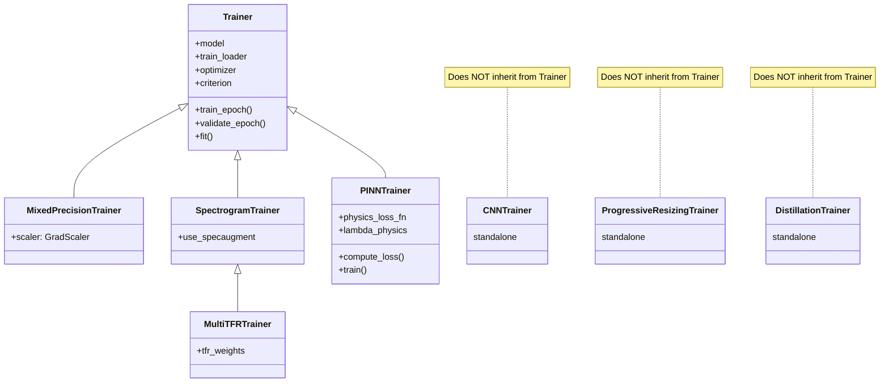

# IDB 1.2 Training Sub-Block — Consolidated Audit Report (March 2026)

**IDB ID:** 1.2  
**Domain:** Core ML Engine — Training & Pipelines  
**Audit Date:** 2026-03-15  
**Supersedes:** `IDB_1_2_TRAINING_ANALYSIS.md` (Jan 2026), `IDB_1_2_TRAINING_BEST_PRACTICES.md` (Jan 2026)

---

## Executive Summary

This report consolidates and replaces the January 2026 analysis and best practices documents for IDB 1.2. A fresh source-code audit was performed against all 26 Python files + 5 contrastive sub-module files in `packages/core/training/`, plus 5 files in `packages/core/pipelines/`.

**Key Changes Since January 2026:**

| Item | Jan 2026 Status | Mar 2026 Status | Notes |
|---|---|---|---|
| `PINNTrainer` inheritance | ❌ Standalone | ✅ Inherits `Trainer` | Now calls `super().__init__()` |
| LR scheduler bug (P1-7) | ❌ Broken | ✅ Fixed | `cnn_trainer.py:274-279` handles `ReduceLROnPlateau` |
| `losses.py` duplication (P0-3) | ❌ Duplicate code | ✅ Re-export shim | `losses.py` re-exports from `cnn_losses.py` |
| `__init__.py` empty (P0-4) | ❌ Empty | ❌ Still Empty | Still says "Will be populated" |
| Callback duplication (P0-2) | ❌ Duplicated | ❌ Still Duplicated | `callbacks.py` vs `cnn_callbacks.py` |
| `sys.path` hacks | ❌ Present | ❌ 3 Remaining | `pinn_trainer.py`, `spectrogram_trainer.py`, `physics_loss_functions.py` |
| Test code in production | ❌ 6+ files | ❌ 13 files | Worsened — every major file has `if __name__` blocks |

**Overall Assessment:** 3 of 10 issues from the Jan audit have been fixed. The training infrastructure remains architecturally fragmented with significant code duplication, but the most critical bugs (LR scheduler, loss duplication) are resolved. The remaining work is primarily **structural consolidation** (Phase 2 of the master plan).

---

## 1. Current State Assessment (March 2026)

### 1.1 File Inventory

| Category | Files | Total Size |
|---|---|---|
| Trainers | 6 files (`trainer.py`, `cnn_trainer.py`, `pinn_trainer.py`, `spectrogram_trainer.py`, `progressive_resizing.py`, `knowledge_distillation.py`) | ~86KB |
| Callbacks | 2 files (`callbacks.py`, `cnn_callbacks.py`) | ~25KB |
| Losses | 3 files (`losses.py`, `cnn_losses.py`, `physics_loss_functions.py`) | ~32KB |
| Optimizers | 2 files (`optimizers.py`, `cnn_optimizer.py`) | ~17KB |
| Schedulers | 2 files (`cnn_schedulers.py`, `transformer_schedulers.py`) | ~26KB |
| Augmentation | 2 files (`advanced_augmentation.py`, `transformer_augmentation.py`) | ~28KB |
| HPO | 3 files (`bayesian_optimizer.py`, `grid_search.py`, `random_search.py`) | ~20KB |
| Support | 3 files (`metrics.py`, `mixed_precision.py`, `__init__.py`) | ~10KB |
| Contrastive | 5 files under `contrastive/` | ~25KB |
| **Total** | **28 files** | **~269KB** |

Also related: **`packages/core/pipelines/`** (5 files, ~34KB) — `classical_ml_pipeline.py`, `feature_pipeline.py`, `pipeline_validator.py`, `matlab_compat.py`.

### 1.2 Trainer Inheritance Hierarchy (Updated)



**Correction from Jan analysis:** `PINNTrainer` now inherits from `Trainer` (line 67: `class PINNTrainer(Trainer)`). However, it still defines its own `train()` method (instead of `fit()`), which is an API inconsistency.

### 1.3 sys.path Hacks Remaining

| File | Line | Hack |
|---|---|---|
| [pinn_trainer.py:34](file:///c:/Users/COWLAR/projects/LSTM_PFD/packages/core/training/pinn_trainer.py#L34) | 34 | `sys.path.append(str(Path(__file__).parent.parent))` |
| [spectrogram_trainer.py:34](file:///c:/Users/COWLAR/projects/LSTM_PFD/packages/core/training/spectrogram_trainer.py#L34) | 34 | `sys.path.insert(0, str(Path(__file__).parent))` |
| [physics_loss_functions.py:23](file:///c:/Users/COWLAR/projects/LSTM_PFD/packages/core/training/physics_loss_functions.py#L23) | 23 | `sys.path.append(os.path.dirname(...))` |

> [!WARNING]
> These were supposed to be removed in Phase 1 (step 1.5). The IDB 1.1 audit removed 8 `sys.path` hacks from the models domain, but these 3 in training were missed.

### 1.4 Test Code in Production Files

**13 files** contain `if __name__ == "__main__":` blocks with test/demo code:

| File | Lines of test code (approx) |
|---|---|
| `cnn_trainer.py` | ~90 lines (373-465) |
| `pinn_trainer.py` | ~43 lines (488-531) |
| `spectrogram_trainer.py` | ~17 lines (402-419) |
| `progressive_resizing.py` | ~35 lines (310-345) |
| `knowledge_distillation.py` | ~38 lines (386-424) |
| `cnn_callbacks.py` | ~3 lines (542-544) |
| `cnn_losses.py` | ~2 lines (340-342) |
| `cnn_optimizer.py` | ~2 lines (402-404) |
| `cnn_schedulers.py` | ~2 lines (492-494) |
| `physics_loss_functions.py` | ~60 lines (501-560) |
| `transformer_schedulers.py` | ~58 lines (243-301) |
| `transformer_augmentation.py` | ~66 lines (376-442) |
| `advanced_augmentation.py` | ~32 lines (451-483) |

---

## 2. Issue Registry

### 2.1 Resolved Issues (Since Jan 2026)

| ID | Issue | Resolution | Evidence |
|---|---|---|---|
| P0-3 | Duplicate `FocalLoss` and `LabelSmoothingCrossEntropy` | `losses.py` converted to re-export shim from `cnn_losses.py` | [losses.py:22-28](file:///c:/Users/COWLAR/projects/LSTM_PFD/packages/core/training/losses.py#L22-L28) |
| P1-7 | LR scheduler `step()` called without metric for `ReduceLROnPlateau` | Fixed with `isinstance` check | [cnn_trainer.py:274-279](file:///c:/Users/COWLAR/projects/LSTM_PFD/packages/core/training/cnn_trainer.py#L274-L279) |
| P0-1 (partial) | `PINNTrainer` standalone | Now inherits from `Trainer` | [pinn_trainer.py:67](file:///c:/Users/COWLAR/projects/LSTM_PFD/packages/core/training/pinn_trainer.py#L67) |

### 2.2 Open Issues — P0 (Critical)

| ID | Issue | Files Affected | Impact |
|---|---|---|---|
| **P0-1** | **Trainer hierarchy still fragmented** — `CNNTrainer`, `ProgressiveResizingTrainer`, `DistillationTrainer` don't inherit `Trainer` | `cnn_trainer.py`, `progressive_resizing.py`, `knowledge_distillation.py` | 3/6 trainers are standalone; bug fixes must be applied separately to each |
| **P0-2** | **Dual callback systems** — `callbacks.py` (trainer-centric, no batch hooks) vs `cnn_callbacks.py` (logs-centric, batch hooks, `CallbackList`) | `callbacks.py`, `cnn_callbacks.py` | Maintenance nightmare; no single callback API for dashboard integration |
| **P0-4** | **Empty `__init__.py`** — no public API exports; `__all__ = []` | `__init__.py` | Consumers cannot do `from training import CNNTrainer` |
| **P0-5** | **3 remaining `sys.path` hacks** | `pinn_trainer.py:34`, `spectrogram_trainer.py:34`, `physics_loss_functions.py:23` | Path pollution, breaks portability, should use relative imports |

### 2.3 Open Issues — P1 (High Priority)

| ID | Issue | Files Affected | Impact |
|---|---|---|---|
| **P1-1** | **Mixed precision implemented redundantly** — `trainer.py` has inline AMP, `mixed_precision.py` has a subclass, `cnn_trainer.py` has its own inline AMP | 3 files | Inconsistent AMP behavior, maintenance burden |
| **P1-2** | **Deprecated `optimizers.py` still present** — delegation works but parameter order differs, causes confusion | `optimizers.py` | Callers may silently pass args in wrong order |
| **P1-3** | **No reproducibility enforcement** — `set_seed()` exists in `utils/reproducibility.py` but no trainer calls it automatically | All trainers | Training results not reproducible by default |
| **P1-4** | **Distributed training: config only, no implementation** — `training_config.py` has `distributed`, `world_size`, `rank` fields but no DDP code exists | All trainers | Misleading config; dead code |
| **P1-5** | **Checkpoint format inconsistency** — `CNNTrainer` saves `{epoch, model_state_dict, optimizer_state_dict, best_val_acc, best_val_loss, history}`, no version field, no scaler state, no model config | Various | Evaluation team can't reliably load checkpoints from different trainers |
| **P1-6** | **`PINNTrainer.train()` vs `Trainer.fit()` naming** — `PINNTrainer` has `train()` while base class has `fit()`; different signatures | `pinn_trainer.py` | API inconsistency; callers need to know which trainer they have |
| **P1-8** | **`ProgressiveResizingTrainer` uses batch-level loss averaging** — `total_loss / len(train_loader)` instead of sample-weighted | `progressive_resizing.py:191` | Incorrect metric if last batch is smaller; violates best practices (Section 1.3 of old BP doc) |
| **P1-9** | **`DistillationTrainer` uses batch-level loss averaging** — same pattern as P1-8 | `knowledge_distillation.py:206` | Same issue as P1-8 |
| **P1-10** | **Contrastive training sub-module not documented** — `contrastive/` has 5 files (dataset, losses, physics_similarity, pretrainer) but not covered in any IDB report | `contrastive/` | Unknown state, unmaintained |

### 2.4 Open Issues — P2 (Medium Priority)

| ID | Issue | Files Affected | Impact |
|---|---|---|---|
| **P2-1** | **Unused `SIGNAL_LENGTH` import** in many files | `trainer.py`, `optimizers.py`, `knowledge_distillation.py`, `progressive_resizing.py` | Dead imports, linting noise |
| **P2-2** | **Test code in 13 production files** | See list in Section 1.4 | Violates separation of concerns; ~450 lines should be in `tests/` |
| **P2-3** | **HPO limited to classical ML** — `bayesian_optimizer.py`, `grid_search.py`, `random_search.py` have factory funcs hardcoded for SVM, RF, MLP | HPO files | Can't optimize deep learning hyperparameters through these utilities |
| **P2-4** | **No gradient checkpointing** — memory optimization for large models not available | All trainers | Large transformer/ResNet models may OOM |
| **P2-5** | **`ProgressiveResizingTrainer` scheduler step is ReduceLROnPlateau-unsafe** — calls `scheduler.step()` without metric at [progressive_resizing.py:289](file:///c:/Users/COWLAR/projects/LSTM_PFD/packages/core/training/progressive_resizing.py#L289) | `progressive_resizing.py` | Same bug that was already fixed in `cnn_trainer.py` but not here |
| **P2-6** | **`DistillationTrainer` scheduler step is ReduceLROnPlateau-unsafe** | `knowledge_distillation.py:297` | Same as P2-5 |
| **P2-7** | **Scheduler files should be consolidated** — `cnn_schedulers.py` (8 schedulers) + `transformer_schedulers.py` (3 schedulers) are split by model type but schedulers are model-agnostic | 2 files | Confusing organization; schedulers don't depend on model type |
| **P2-8** | **`optimizers.py` has its own `create_scheduler()` duplicating `cnn_schedulers.py`** — 5 schedulers supported directly in `optimizers.py:87-173` | `optimizers.py` | Third location for scheduler creation logic |

---

## 3. Best Practices (Updated March 2026)

> [!IMPORTANT]
> This section replaces the full content of `IDB_1_2_TRAINING_BEST_PRACTICES.md`. The original best practices document remains correct in its **patterns** — the training loop structure, callback conventions, loss function patterns, checkpoint conventions, reproducibility requirements, and cross-team coordination sections are all still valid. The following updates and additions apply.

### 3.1 Trainer API Contract (Unchanged)

All trainers **MUST** provide:
- `fit(num_epochs) → history` as the primary training entry point
- `train_epoch() → Dict[str, float]` returning at minimum `{train_loss, train_acc}`
- `validate_epoch() → Dict[str, float]` returning at minimum `{val_loss, val_acc}`
- History keys: `train_loss`, `train_acc`, `val_loss`, `val_acc`, `lr`

### 3.2 Updated: ReduceLROnPlateau Handling

The fix applied in `cnn_trainer.py` is the canonical pattern. **All trainers must replicate this:**

```python
if self.lr_scheduler is not None:
    if isinstance(self.lr_scheduler, torch.optim.lr_scheduler.ReduceLROnPlateau):
        metric = val_metrics.get('loss', train_metrics['loss']) if val_metrics else train_metrics['loss']
        self.lr_scheduler.step(metric)
    else:
        self.lr_scheduler.step()
```

> [!CAUTION]
> `ProgressiveResizingTrainer` and `DistillationTrainer` still have the old unsafe `scheduler.step()` pattern. These must be fixed.

### 3.3 Updated: Loss Function Imports

**Canonical import pattern (correct):**
```python
# Classification losses — always import from cnn_losses
from training.cnn_losses import FocalLoss, LabelSmoothingCrossEntropy, SupConLoss, create_criterion

# OR via the re-export shim (also correct)
from training.losses import FocalLoss, LabelSmoothingCrossEntropy, create_criterion

# Physics losses
from training.physics_loss_functions import FrequencyConsistencyLoss, PhysicalConstraintLoss

# Distillation
from training.knowledge_distillation import DistillationLoss

# Contrastive
from training.contrastive.losses import NTXentLoss, PhysicsAwareNTXentLoss
```

### 3.4 Updated: Checkpoint Format Recommendation

The existing checkpoint format in `CNNTrainer` should be upgraded to:

```python
checkpoint = {
    'version': '2.0',
    'timestamp': datetime.now().isoformat(),
    'model_state_dict': model.state_dict(),
    'model_class': model.__class__.__name__,
    'model_config': model.get_config() if hasattr(model, 'get_config') else None,
    'optimizer_state_dict': optimizer.state_dict(),
    'scheduler_state_dict': scheduler.state_dict() if scheduler else None,
    'scaler_state_dict': scaler.state_dict() if scaler else None,
    'epoch': epoch,
    'best_val_acc': best_val_acc,
    'best_val_loss': best_val_loss,
    'history': history,
    'config': training_config.to_dict() if hasattr(training_config, 'to_dict') else {},
}
```

### 3.5 New: sys.path Elimination Pattern

Replace `sys.path` hacks with relative imports:

```python
# BAD (current)
import sys
sys.path.append(str(Path(__file__).parent.parent))
from training.trainer import Trainer

# GOOD (target)
from .trainer import Trainer
# or
from training.trainer import Trainer  # if package is properly installed
```

### 3.6 New: Test Code Extraction Pattern

Move `if __name__ == "__main__"` blocks to proper test files:

```
tests/
├── training/
│   ├── test_cnn_trainer.py       ← from cnn_trainer.py:373-465
│   ├── test_pinn_trainer.py      ← from pinn_trainer.py:488-531
│   ├── test_progressive.py       ← from progressive_resizing.py:310-345
│   ├── test_distillation.py      ← from knowledge_distillation.py:386-424
│   └── test_schedulers.py        ← from transformer_schedulers.py:243-301
```

---

## 4. Integration Risk Assessment (Updated)

### 4.1 Cross-IDB Dependencies

| From IDB 1.2 | To IDB | Interface | Risk if Changed |
|---|---|---|---|
| `CNNTrainer.history` | 2.1 Dashboard UI | History dict keys | 🔴 High — Dashboard plots break |
| `CNNTrainer.save_checkpoint()` | 1.3 Evaluation | Checkpoint format | 🔴 High — Evaluators can't load models |
| `Trainer.fit()` / `PINNTrainer.train()` | 2.4 Async Tasks | API method name | 🟡 Medium — Celery tasks call trainer |
| `create_criterion()` | 2.2 Services | Loss factory | 🟢 Low — Stable API |
| `create_optimizer()` | 5.1 Research Scripts | Optimizer factory | 🟡 Medium — Deprecated API still in use |
| Callback interface | 2.3 Callbacks | Callback hooks | 🔴 High — Two incompatible systems |

### 4.2 Assumptions That Must Hold

| Assumption | Used By | Current Status |
|---|---|---|
| Model has `forward(x) → logits` | All trainers | ✅ Holds for CNN, Transformer |
| Model returns single tensor | `trainer.py:129-130` | ⚠️ PINN models may return tuples |
| Labels are integer class indices | All loss functions | ⚠️ Soft labels not supported |
| Batch is `(inputs, targets)` | `trainer.py`, `cnn_trainer.py` | ⚠️ PINN uses 3-tuple via `_extract_metadata()` |

---

## 5. Prioritized Action Plan

### Priority 0 — Must Fix Before Any Training (Blocks Phase 3)

| # | Action | Est. Effort | Impl Plan Step |
|---|---|---|---|
| 1 | **Remove 3 remaining `sys.path` hacks** in `pinn_trainer.py`, `spectrogram_trainer.py`, `physics_loss_functions.py` — replace with relative imports | 30 min | New: 1.5b |
| 2 | **Populate `training/__init__.py`** with public API exports | 30 min | Existing: 2.28 |

### Priority 1 — Architectural Consolidation (Phase 2)

| # | Action | Est. Effort | Impl Plan Step |
|---|---|---|---|
| 3 | **Create `BaseTrainer` abstract class** with template method pattern (`_forward_pass`, `_compute_loss`, `_backward_pass`, `_optimizer_step`) | 2-3 hours | Existing: 2.1 |
| 4 | **Refactor `CNNTrainer`, `ProgressiveResizingTrainer`, `DistillationTrainer`** to inherit `BaseTrainer` | 3-4 hours | Existing: 2.2 |
| 5 | **Rename `PINNTrainer.train()` → `PINNTrainer.fit()`** with backward-compat alias | 30 min | New: 2.2b |
| 6 | **Merge callback systems** — consolidate `callbacks.py` into `cnn_callbacks.py` (which is more complete) | 2-3 hours | Existing: 1.10 |
| 7 | **Standardize checkpoint format** — add `version`, `model_class`, `scaler_state_dict`, `config` to all trainers | 1-2 hours | Existing: 2.4 |
| 8 | **Consolidate schedulers** — merge `cnn_schedulers.py` + `transformer_schedulers.py` → `training/schedulers.py` | 1-2 hours | Existing: 2.6 |
| 9 | **Remove deprecated `optimizers.py`** — update any remaining callers to use `cnn_optimizer.py` | 1 hour | Existing: 2.7 |
| 10 | **Fix ReduceLROnPlateau in `ProgressiveResizingTrainer` and `DistillationTrainer`** | 15 min | New: 2.2c |
| 11 | **Fix batch-level loss averaging in `ProgressiveResizingTrainer` and `DistillationTrainer`** | 30 min | New: 2.2d |
| 12 | **Implement mixin architecture** — `MixedPrecisionMixin`, `PhysicsLossMixin`, `SpecAugmentMixin` | 2-3 hours | Existing: 2.3 |
| 13 | **Consolidate loss functions** into `training/losses/` subdirectory | 1-2 hours | Existing: 2.5 |

### Priority 2 — Code Quality (Phase 2/7)

| # | Action | Est. Effort | Impl Plan Step |
|---|---|---|---|
| 14 | **Extract test code from 13 files** into proper `tests/training/` | 2-3 hours | Existing: 2.27 |
| 15 | **Audit contrastive training sub-module** — `contrastive/` is undocumented | 1 hour | New: 2.8b |
| 16 | **Remove unused `SIGNAL_LENGTH` imports** | 15 min | N/A (cleanup) |
| 17 | **Extend HPO to deep learning** — generalize `bayesian_optimizer.py` search spaces | 2-3 hours | Deferred to Phase 4 |

### Priority 3 — Future Enhancements

| # | Action | Est. Effort | Impl Plan Step |
|---|---|---|---|
| 18 | Implement DDP distributed training plugin | 3-4 hours | Phase 9 |
| 19 | Add gradient checkpointing support | 1-2 hours | Phase 3+ |
| 20 | Implement EMA (Exponential Moving Average) | 1-2 hours | Phase 3+ |

---

## 6. Positive Patterns to Preserve

| Pattern | Where | Recommendation |
|---|---|---|
| ✅ `PINNTrainer` adaptive lambda scheduling | `pinn_trainer.py:158-191` | Adopt as standard for multi-loss training |
| ✅ Factory functions (`create_criterion`, `create_optimizer`) | `cnn_losses.py`, `cnn_optimizer.py` | Standard pattern for all configurable components |
| ✅ Comprehensive docstrings with examples | Most files | Maintain across all new code |
| ✅ Structured logging via `get_logger()` | `cnn_trainer.py` | Adopt project-wide instead of `print()` |
| ✅ Gradient accumulation support | `trainer.py`, `cnn_trainer.py` | Keep in `BaseTrainer` |
| ✅ Progress bars via `tqdm` | Most trainers | Standardize format |
| ✅ `DistillationLoss` returns breakdown dict | `knowledge_distillation.py:111-115` | All multi-component losses should return breakdowns |
| ✅ `ResizableSignalDataset` | `progressive_resizing.py:30-121` | Clean, reusable dataset wrapper |

---

## 7. Concordance: This Report vs Implementation Plan

| Impl Plan Step | Status | Audit Notes |
|---|---|---|
| 1.5 (sys.path removal) | 🟡 Partial | 3 hacks remain in training/ — insert step 1.5b |
| 1.10 (callback merge) | ⬜ Open | Still required; deferred with reason "divergent interfaces" |
| 1.13 (LR scheduler bug) | ✅ Done | Confirmed fixed in `cnn_trainer.py` |
| 2.1 (BaseTrainer) | ⬜ Open | Critical for training unification |
| 2.2 (Refactor trainers) | ⬜ Open | 3 trainers still standalone (was 5, now 3 after PINNTrainer fix) |
| 2.3 (Mixin architecture) | ⬜ Open | Correct approach; proceed as planned |
| 2.4 (Checkpoint format) | ⬜ Open | Add version field, model config, scaler state |
| 2.5 (Loss consolidation) | 🟡 Partial | `losses.py` is now a shim, but no `losses/` directory yet |
| 2.6 (Scheduler merge) | ⬜ Open | Also need to remove scheduler logic from `optimizers.py` |
| 2.7 (Remove optimizers.py) | ⬜ Open | Confirm no callers still use the old API |
| 2.27 (Move test code) | ⬜ Open | 13 files affected |
| 2.28 (Populate __init__.py) | ⬜ Open | Still empty |

### New Steps to Insert

| New Step | Insert After | Description | Priority |
|---|---|---|---|
| **1.5b** | 1.5 | Remove 3 remaining `sys.path` hacks in `training/` | P0 |
| **2.2b** | 2.2 | Rename `PINNTrainer.train()` → `fit()` with backward-compat alias | P1 |
| **2.2c** | 2.2b | Fix ReduceLROnPlateau in `ProgressiveResizingTrainer` and `DistillationTrainer` | P1 |
| **2.2d** | 2.2c | Fix batch-level loss averaging in standalone trainers | P1 |
| **2.8b** | 2.8 | Audit and document `training/contrastive/` sub-module (5 files) | P2 |

---

_Report generated by IDB 1.2 Training Sub-Block Auditor — March 2026_
