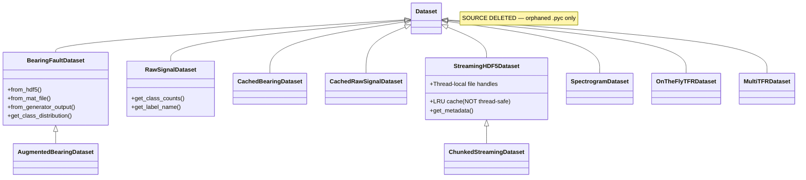

# IDB 3.2: Data Loading — Consolidated Audit Report

**Audit Date:** 2026-03-15  
**Auditor:** AI Agent (IDB 3.2 Data Engineering)  
**Supersedes:** `IDB_3_2_DATA_LOADING_ANALYSIS.md`, `IDB_3_2_DATA_LOADING_BEST_PRACTICES.md`  
**Status:** Complete

---

## Executive Summary

This report is a **fresh, comprehensive audit** of the IDB 3.2 Data Loading domain spanning **12 production files**, **12+ dataset classes**, **15+ transform classes**, and **2 dataloader factory modules**. It supersedes the January 2026 analysis and best-practices documents.

### Key Findings Since Previous Audit (2026-01-23)

| Area | Previous State | Current State |
|---|---|---|
| `cwru_dataset.py` source | Existed (539 lines) | **Source deleted** — only orphaned `.pyc` remains |
| `sys.path` hacks | Not flagged | **2 files** (`streaming_hdf5_dataset.py`, `contrast_learning_tfr.py`) still inject `sys.path` |
| Duplicate dataloaders | Not flagged | **2 parallel modules** (`dataloader.py` + `cnn_dataloader.py`) with overlapping functionality |
| `__init__.py` coverage | Not flagged | **5 modules** missing from package exports |
| `print()` vs `logger` | Not flagged | `tfr_dataset.py` uses raw `print()` throughout (7 occurrences) |
| HDF5 handle leak (P0-1) | Flagged | **Still unfixed** in `OnTheFlyTFRDataset` and `MultiTFRDataset` |
| Bare `except` (P0-2) | Flagged | **Still unfixed** — 4 bare `except:` clauses remain |
| Thread-safety (P0-3) | Flagged | **Still unfixed** in `StreamingHDF5Dataset` LRU cache |

---

## 1. File Inventory & Coverage

### 1.1 Files in Scope (12 production files)

| File | Lines | Size | Dataset Classes | Transform Classes | Discovered by Previous Audit? |
|---|---|---|---|---|---|
| [dataset.py](file:///c:/Users/COWLAR/projects/LSTM_PFD/data/dataset.py) | 588 | 19KB | 3 (`BearingFaultDataset`, `AugmentedBearingDataset`, `CachedBearingDataset`) | — | ✅ |
| [dataloader.py](file:///c:/Users/COWLAR/projects/LSTM_PFD/data/dataloader.py) | 433 | 12KB | 1 (`InfiniteDataLoader`) | — | ✅ |
| [cnn_dataset.py](file:///c:/Users/COWLAR/projects/LSTM_PFD/data/cnn_dataset.py) | 411 | 13KB | 2 (`RawSignalDataset`, `CachedRawSignalDataset`) | — | ✅ |
| [cnn_dataloader.py](file:///c:/Users/COWLAR/projects/LSTM_PFD/data/cnn_dataloader.py) | 343 | 11KB | 1 (`DataLoaderConfig`) | — | ❌ **Missed** |
| [streaming_hdf5_dataset.py](file:///c:/Users/COWLAR/projects/LSTM_PFD/data/streaming_hdf5_dataset.py) | 380 | 13KB | 2 (`StreamingHDF5Dataset`, `ChunkedStreamingDataset`) | — | ✅ |
| [tfr_dataset.py](file:///c:/Users/COWLAR/projects/LSTM_PFD/data/tfr_dataset.py) | 424 | 14KB | 3 (`SpectrogramDataset`, `OnTheFlyTFRDataset`, `MultiTFRDataset`) | — | ✅ |
| [transforms.py](file:///c:/Users/COWLAR/projects/LSTM_PFD/data/transforms.py) | 475 | 12KB | — | 10 + `Compose` + `get_default_transform` | ✅ |
| [cnn_transforms.py](file:///c:/Users/COWLAR/projects/LSTM_PFD/data/cnn_transforms.py) | 396 | 12KB | — | 5 + `Compose` (dup) + `get_train/test_transforms` | ✅ |
| [contrast_learning_tfr.py](file:///c:/Users/COWLAR/projects/LSTM_PFD/data/contrast_learning_tfr.py) | 96 | 3KB | Re-export shim | — | ❌ **Missed** |
| [__init__.py](file:///c:/Users/COWLAR/projects/LSTM_PFD/data/__init__.py) | 84 | 2KB | — (exports) | — | ❌ **Missed** |
| `cwru_dataset.py` | **DELETED** | — | `CWRUDataset` (orphaned) | — | ✅ (outdated) |

**Not in IDB 3.2 scope** (IDB 3.1 Signal Generation / IDB 3.3 Storage):
`signal_generator.py`, `signal_augmentation.py`, `spectrogram_generator.py`, `spectrogram_augmentation.py`, `wavelet_transform.py`, `wigner_ville.py`, `cache_manager.py`, `data_validator.py`, `matlab_importer.py`

### 1.2 Dataset Class Hierarchy (Updated)



> [!WARNING]
> `CWRUDataset` was documented in the previous analysis as a full dataset class. Its source file has been deleted — only a stale `__pycache__/cwru_dataset.cpython-314.pyc` remains. No live imports reference it. The cached bytecode should be cleaned up.

---

## 2. Critical Issues (P0)

### P0-1: HDF5 File Handle Leak in TFR Datasets *(STILL OPEN)*

**Files:** [tfr_dataset.py:148](file:///c:/Users/COWLAR/projects/LSTM_PFD/data/tfr_dataset.py#L148), [tfr_dataset.py:239](file:///c:/Users/COWLAR/projects/LSTM_PFD/data/tfr_dataset.py#L239)

Both `OnTheFlyTFRDataset` and `MultiTFRDataset` open HDF5 in `__init__` and rely on `__del__` for cleanup:

```python
# OnTheFlyTFRDataset.__init__ (line 148)
self.h5_file = h5py.File(signals_cache, 'r')

# Only closed in __del__ (line 201-207) or if cache_in_memory=True (line 158)
```

> [!CAUTION]
> With DataLoader `num_workers > 0`, forked processes inherit the open file descriptor. If the parent process's `__del__` runs before workers finish reading, workers access a closed file → crash. Additionally, `__del__` is **not guaranteed to run** in Python; file handles may leak until process exit.

**Recommended Fix:** Adopt the `StreamingHDF5Dataset` pattern — use `threading.local()` for per-worker lazy file handles. Alternatively, use context manager protocol (`__enter__`/`__exit__`).

---

### P0-2: Bare `except` Clauses *(STILL OPEN)*

**Locations (4 instances):**

| File | Line | Context |
|---|---|---|
| [streaming_hdf5_dataset.py:139](file:///c:/Users/COWLAR/projects/LSTM_PFD/data/streaming_hdf5_dataset.py#L139) | `except: pass` | `__del__` file close |
| [tfr_dataset.py:206](file:///c:/Users/COWLAR/projects/LSTM_PFD/data/tfr_dataset.py#L206) | `except: pass` | `OnTheFlyTFRDataset.__del__` |
| [tfr_dataset.py:285](file:///c:/Users/COWLAR/projects/LSTM_PFD/data/tfr_dataset.py#L285) | `except: pass` | `MultiTFRDataset.__del__` |
| [streaming_hdf5_dataset.py:359](file:///c:/Users/COWLAR/projects/LSTM_PFD/data/streaming_hdf5_dataset.py#L359) | `except: pass` | Test cleanup |

**Impact:** Swallows `KeyboardInterrupt`, `SystemExit`, and all other exceptions. Makes debugging impossible.

**Fix:** Replace with `except Exception:` (or `except OSError:` where only I/O errors are expected).

---

### P0-3: Thread-Safety Issues in LRU Cache *(STILL OPEN)*

**File:** [streaming_hdf5_dataset.py:104-121](file:///c:/Users/COWLAR/projects/LSTM_PFD/data/streaming_hdf5_dataset.py#L104-L121)

```python
# Race condition: check-then-act without lock
if idx in self._cache:          # Thread A reads
    signal = self._cache[idx]
else:
    ...
    self._cache[idx] = signal    # Thread B writes simultaneously
    self._cache_order.append(idx)  # list.append is atomic, but pop(0) is not
```

The `_cache` dict and `_cache_order` list are shared across threads when `num_workers > 0` (forked processes get copies, but threads in the same process share state). With `cache_size > 0` and threaded workers, this produces data races.

**Fix Options:**
1. Add `threading.Lock` around cache operations
2. Use `functools.lru_cache` (thread-safe in CPython due to GIL, but not fork-safe)
3. Disable caching when `num_workers > 0` (documented limitation)

---

### P0-4: `sys.path` Hacks in Data Loading Files *(NEW)*

**Files:**

| File | Line | Code |
|---|---|---|
| [streaming_hdf5_dataset.py:27-29](file:///c:/Users/COWLAR/projects/LSTM_PFD/data/streaming_hdf5_dataset.py#L27-L29) | `sys.path.insert(0, str(project_root))` |
| [contrast_learning_tfr.py:34-35](file:///c:/Users/COWLAR/projects/LSTM_PFD/data/contrast_learning_tfr.py#L34-L35) | `sys.path.insert(0, str(project_root))` |

**Impact:** Breaks package installs, pollutes `sys.path` at import time, can cause import shadowing.

**Fix:** Remove `sys.path` hacks and use relative imports (e.g., `from utils.logging import ...` → works when package is installed or run from project root).

---

## 3. High Priority Issues (P1)

### P1-1: Duplicate `Compose` Class *(STILL OPEN)*

**Files:** [transforms.py:27-52](file:///c:/Users/COWLAR/projects/LSTM_PFD/data/transforms.py#L27-L52), [cnn_transforms.py:241-274](file:///c:/Users/COWLAR/projects/LSTM_PFD/data/cnn_transforms.py#L241-L274)

Two `Compose` classes with identical logic. The `cnn_transforms.py` version adds `__repr__` but is otherwise a copy.

**Fix:** Delete `Compose` from `cnn_transforms.py`, import from `transforms.py`. Add `__repr__` to the canonical version.

---

### P1-2: `CachedRawSignalDataset` Opens HDF5 Per-Sample *(STILL OPEN)*

**File:** [cnn_dataset.py:248](file:///c:/Users/COWLAR/projects/LSTM_PFD/data/cnn_dataset.py#L248)

```python
with h5py.File(self.cache_path, 'r') as f:  # Opens+closes every __getitem__ call
    signal = f[self.split]['signals'][idx]
```

**Impact:** ~100x slower than `StreamingHDF5Dataset` with thread-local handles.

**Fix:** Adopt `StreamingHDF5Dataset`'s `_get_file_handle()` pattern with `threading.local()`.

---

### P1-3: Duplicate DataLoader Modules *(NEW)*

**Files:** [dataloader.py](file:///c:/Users/COWLAR/projects/LSTM_PFD/data/dataloader.py) (433 lines) and [cnn_dataloader.py](file:///c:/Users/COWLAR/projects/LSTM_PFD/data/cnn_dataloader.py) (343 lines)

Both provide:
- `create_*_dataloader()` factory functions
- `create_*_dataloaders()` multi-split factory
- Collate functions
- Utility classes

| Feature | `dataloader.py` | `cnn_dataloader.py` |
|---|---|---|
| Dataloader factory | `create_dataloader()` | `create_cnn_dataloader()` |
| Multi-split factory | `create_train_val_test_loaders()` | `create_cnn_dataloaders()` |
| Collate fn | `collate_fn_with_metadata()` | `collate_fn()` |
| Auto batch sizing | `estimate_optimal_batch_size()` | ❌ |
| Config presets | ❌ | `DataLoaderConfig` |
| `InfiniteDataLoader` | ✅ | ❌ |
| `prefetch_to_device` | ✅ | ❌ |
| `compute_class_weights` | ✅ | ❌ |

**Impact:** Confusing API surface; callers don't know which to use. Duplicated worker init and pin_memory logic.

**Fix:** Merge into a single `dataloader.py` with all features. Re-export the CNN-specific collate as an alias.

---

### P1-4: Inconsistent Label Handling *(STILL OPEN)*

| Dataset | Label Input | Label Storage | Label Output |
|---|---|---|---|
| `BearingFaultDataset` | String labels | `torch.LongTensor` | `int` |
| `RawSignalDataset` | String or int labels | `np.int64` array | `np.integer` |
| `CachedRawSignalDataset` | String or int labels | HDF5 native | `int` (via `label_to_idx`) |
| `StreamingHDF5Dataset` | N/A (from HDF5) | `np.ndarray` (from HDF5) | `int()` cast |
| `SpectrogramDataset` | N/A (from NPZ) | `np.ndarray` (from NPZ) | `torch.tensor(long)` |

**Impact:** Mixed `int` vs `np.integer` vs `torch.Tensor` return types. Loss functions may behave differently depending on which dataset is used.

**Fix:** Standardize all `__getitem__` to return `(torch.Tensor, int)` — the PyTorch conventional tuple.

---

### P1-5: `__init__.py` Missing Exports *(NEW)*

The `data/__init__.py` does not export the following public modules:

| Missing Export | Module |
|---|---|
| `RawSignalDataset`, `CachedRawSignalDataset`, `create_cnn_datasets_from_arrays` | `cnn_dataset.py` |
| `create_cnn_dataloader`, `create_cnn_dataloaders`, `DataLoaderConfig` | `cnn_dataloader.py` |
| `StreamingHDF5Dataset`, `ChunkedStreamingDataset`, `create_streaming_dataloaders` | `streaming_hdf5_dataset.py` |
| `SpectrogramDataset`, `OnTheFlyTFRDataset`, `MultiTFRDataset`, `create_tfr_dataloaders` | `tfr_dataset.py` |
| CNN transforms (`ToTensor1D`, `Normalize1D`, `RandomCrop1D`, etc.) | `cnn_transforms.py` |

**Impact:** Users must use verbose direct imports instead of `from data import RawSignalDataset`.

**Fix:** Add all public classes/functions to `__init__.py` and `__all__`.

---

### P1-6: `print()` Instead of Logger in `tfr_dataset.py` *(NEW)*

**File:** [tfr_dataset.py](file:///c:/Users/COWLAR/projects/LSTM_PFD/data/tfr_dataset.py) — 7 instances of raw `print()` (lines 78, 156, 170, 400–421)

**Impact:** No log level control, no timestamp, no structured logging.

**Fix:** Replace with `logger.info()` using the standard `get_logger(__name__)` pattern.

---

### P1-7: Orphaned `cwru_dataset.py` Bytecode *(NEW)*

**Location:** `data/__pycache__/cwru_dataset.cpython-314.pyc`

The `.py` source has been deleted, but the `.pyc` remains. No live Python imports reference it.

**Impact:** Stale cache may cause confusion; `import data.cwru_dataset` would silently succeed on Python 3.14 until the `.pyc` is invalidated.

**Fix:** Delete `data/__pycache__/cwru_dataset.cpython-314.pyc`. If CWRU dataset support is still needed, document its removal reason or re-implement.

---

## 4. Medium Priority Issues (P2)

### P2-1: Tests Embedded in Production Code *(STILL OPEN)*

Every dataset/dataloader/transform file has a `test_*()` function + `if __name__ == "__main__"` block:

| File | Test Function | Lines |
|---|---|---|
| `cnn_dataset.py` | `test_cnn_dataset()` | 346–410 |
| `cnn_dataloader.py` | `test_cnn_dataloader()` | 261–342 |
| `cnn_transforms.py` | `test_transforms()` | 324–395 |
| `streaming_hdf5_dataset.py` | `test_streaming_dataset()` | 271–378 |

**Impact:** Inflates production code size; test code using undefined variable `signal_length` (should be `SIGNAL_LENGTH`) — see `cnn_dataset.py:372` and `cnn_dataloader.py:295`.

**Fix:** Move all test functions to `tests/test_data_loading.py`.

---

### P2-2: Undefined Variable Bugs in Test Functions *(NEW)*

**Files:**
- [cnn_dataset.py:372](file:///c:/Users/COWLAR/projects/LSTM_PFD/data/cnn_dataset.py#L372): `signal.shape == (1, signal_length)` — `signal_length` is undefined (should be `SIGNAL_LENGTH`)
- [cnn_dataset.py:382](file:///c:/Users/COWLAR/projects/LSTM_PFD/data/cnn_dataset.py#L382): Same issue
- [cnn_dataloader.py:295](file:///c:/Users/COWLAR/projects/LSTM_PFD/data/cnn_dataloader.py#L295): Same issue

**Impact:** These tests **will crash with `NameError`** if run via `python -m data.cnn_dataset`.

---

### P2-3: Inconsistent Transform Type Handling *(STILL OPEN)*

| Transform | Accepts NumPy? | Accepts Tensor? |
|---|---|---|
| `Normalize` (transforms.py) | ✅ | ❌ |
| `Normalize1D` (cnn_transforms.py) | ✅ | ✅ |
| `AddNoise` (transforms.py) | ✅ | ❌ |
| `AddGaussianNoise` (cnn_transforms.py) | ✅ | ✅ |
| `Unsqueeze` (transforms.py) | ✅ | ✅ |
| `ToTensor` (transforms.py) | ✅ | ❌ |
| `ToTensor1D` (cnn_transforms.py) | ✅ | ❌ |

**Impact:** Composing transforms from both modules will fail if type expectations don't match.

---

### P2-4: Missing Data Validation in Dataset Classes *(STILL OPEN)*

- No NaN/Inf checks on loaded signals in any dataset
- No shape validation beyond basic assertions in `SpectrogramDataset`
- No label range validation
- `data_validator.py` (17KB) exists but is **never called** from any dataset class

---

### P2-5: `AugmentedBearingDataset` Reproducibility Issue *(NEW)*

**File:** [dataset.py:346](file:///c:/Users/COWLAR/projects/LSTM_PFD/data/dataset.py#L346)

```python
if np.random.rand() < self.augmentation_prob:  # Uses global numpy RNG
```

While `self.augmenter.rng` is seeded, the probability check uses the **global** `np.random.rand()` — not reproducible across runs.

**Fix:** Use `self.augmenter.rng.random()` for the probability check.

---

### P2-6: `CachedBearingDataset` Uses `pickle` for Storage *(NEW)*

**File:** [dataset.py:437-448](file:///c:/Users/COWLAR/projects/LSTM_PFD/data/dataset.py#L437-L448)

Individual samples saved as pickle files. This is:
1. **Slow** — pickle has high overhead per file (1 file per sample)
2. **Insecure** — pickle allows arbitrary code execution on load
3. **Fragile** — class renames break deserialization

**Fix:** Use HDF5 or NumPy `.npz` files for caching instead of pickle.

---

### P2-7: `get_default_transform()` Orders Unsqueeze Before ToTensor *(NEW)*

**File:** [transforms.py:463-472](file:///c:/Users/COWLAR/projects/LSTM_PFD/data/transforms.py#L463-L472)

```python
transforms = []
if normalize: transforms.append(Normalize(method='zscore'))
if add_channel_dim: transforms.append(Unsqueeze(dim=0))  # NumPy unsqueeze
if to_tensor: transforms.append(ToTensor())                # Then convert to Tensor
```

This works, but `Unsqueeze` on a NumPy array then `ToTensor` creates a copy. The CNN pipeline (`cnn_transforms.py`) does it the other way: `Normalize1D` → `ToTensor1D` (which adds channel dim internally). The inconsistency means signals have different shapes depending on which pipeline is used.

---

## 5. Best Practices (Retained from Codebase)

The following patterns from the codebase are well-designed and should be preserved:

| Practice | Location | Why It's Good |
|---|---|---|
| Thread-local HDF5 handles | `StreamingHDF5Dataset._get_file_handle()` | Fork-safe; each worker opens its own file |
| SWMR mode | `streaming_hdf5_dataset.py:93` | Enables concurrent reads from same file |
| Factory class methods | `BearingFaultDataset.from_hdf5()`, `.from_mat_file()` | Clean API for multiple data sources |
| Memory-mapped NPZ | `SpectrogramDataset` (`mmap_mode='r'`) | Zero-copy loading for large spectrograms |
| Chunked prefetching | `ChunkedStreamingDataset` | Reduces random I/O for spinning disks |
| Probabilistic augmentations with `p` param | `RandomAmplitudeScale`, `AddGaussianNoise` | Easy toggle for train/test pipelines |
| Pre-built transform factories | `get_train_transforms()`, `get_test_transforms()` | Consistent pipelines, one-liner usage |
| `persistent_workers=True` | DataLoader configs | Avoids re-initialization overhead |
| Stratified splitting | `train_val_test_split()` | Maintains class balance |
| Detailed HDF5 docstrings | `BearingFaultDataset.from_hdf5()` | Full schema documented in code |
| DataLoaderConfig presets | `cnn_dataloader.py` | Pre-tuned configs for fast/debug/memory-efficient modes |

---

## 6. Recommended Architecture (Unified Interface)

The previous analysis proposed a `BaseSignalDataset` ABC. This audit reinforces that recommendation with updated scope:

```python
class BaseSignalDataset(Dataset, ABC):
    """Unified interface for all signal datasets."""

    @abstractmethod
    def get_signal_shape(self) -> Tuple[int, ...]: ...

    @abstractmethod
    def get_num_classes(self) -> int: ...

    @abstractmethod
    def get_class_names(self) -> List[str]: ...

    @property
    @abstractmethod
    def is_streaming(self) -> bool: ...

    @abstractmethod
    def get_metadata(self) -> Dict[str, Any]: ...
```

All 8 active dataset classes should inherit from this. This enables:
- Uniform metadata access across datasets
- Type checking in trainers/evaluators
- Consistent class distribution queries

---

## 7. Prioritized Action Plan

### Immediate (P0 — Required before any training)

| # | Action | Files | Effort |
|---|---|---|---|
| 1 | Fix HDF5 file handle leak — adopt thread-local handles in `OnTheFlyTFRDataset` and `MultiTFRDataset` | `tfr_dataset.py` | 1h |
| 2 | Replace 4 bare `except:` → `except Exception:` | `streaming_hdf5_dataset.py`, `tfr_dataset.py` | 15min |
| 3 | Add `threading.Lock` to `StreamingHDF5Dataset` LRU cache (or disable when `num_workers > 0`) | `streaming_hdf5_dataset.py` | 30min |
| 4 | Remove 2 `sys.path` hacks | `streaming_hdf5_dataset.py`, `contrast_learning_tfr.py` | 15min |

### Short-term (P1 — Before Phase 3 experimentation)

| # | Action | Files | Effort |
|---|---|---|---|
| 5 | Delete duplicate `Compose` from `cnn_transforms.py`, add `__repr__` to canonical | `cnn_transforms.py`, `transforms.py` | 30min |
| 6 | Refactor `CachedRawSignalDataset` to use thread-local HDF5 handles | `cnn_dataset.py` | 1h |
| 7 | Merge `dataloader.py` + `cnn_dataloader.py` into single module | Both files | 2h |
| 8 | Standardize `__getitem__` return types to `(torch.Tensor, int)` | All dataset files | 1h |
| 9 | Add missing exports to `data/__init__.py` | `__init__.py` | 30min |
| 10 | Replace `print()` with `logger` in `tfr_dataset.py` | `tfr_dataset.py` | 15min |
| 11 | Delete orphaned `cwru_dataset.cpython-314.pyc` | `__pycache__/` | 5min |

### Medium-term (P2 — Phase 7 quality gate)

| # | Action | Files | Effort |
|---|---|---|---|
| 12 | Move all `test_*()` functions to `tests/test_data_loading.py` | All dataset/transform files | 2h |
| 13 | Fix undefined `signal_length` bugs in test functions | `cnn_dataset.py`, `cnn_dataloader.py` | 15min |
| 14 | Standardize transforms to accept both NumPy and Tensor | `transforms.py` | 1h |
| 15 | Integrate `data_validator.py` into dataset `__init__`/`from_hdf5` calls | `dataset.py`, `cnn_dataset.py` | 1h |
| 16 | Fix `AugmentedBearingDataset` reproducibility (use seeded RNG for probability check) | `dataset.py` | 15min |
| 17 | Replace pickle caching in `CachedBearingDataset` with HDF5 | `dataset.py` | 2h |
| 18 | Create `BaseSignalDataset` ABC and refactor all datasets to inherit | All dataset files | 3h |

---

## 8. Mapping to Implementation Plan Items

| Audit Finding | Existing Plan Item | Status |
|---|---|---|
| P0-1: HDF5 handle leak | **1.11** (Phase 1D) | ❌ Open |
| P0-2: Bare except | *(not tracked)* | ❌ **Needs insertion** |
| P0-3: Thread-safety | *(not tracked)* | ❌ **Needs insertion** |
| P0-4: sys.path hacks | Related to **1.5b** (training only) | ❌ **Needs insertion for data/** |
| P1-1: Duplicate Compose | **2.C scope** (implied) | ❌ **Needs explicit step** |
| P1-3: Duplicate dataloaders | *(not tracked)* | ❌ **Needs insertion** |
| P1-5: Missing __init__ exports | *(not tracked)* | ❌ **Needs insertion** |
| P2-1: Tests in production code | **2.27** (Phase 2E) | ❌ Open |
| P2-4: Missing data validation | **2.20** (Phase 2C, partial) | ❌ Open |

---

_End of IDB 3.2 Data Loading Audit Report_
