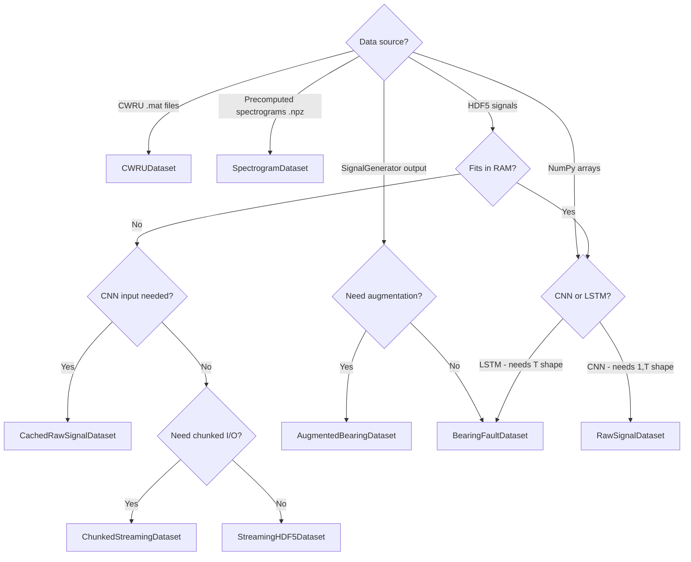

# Dataset Guide

> Choosing, configuring, and extending dataset classes for bearing fault diagnosis.

## Choosing the Right Dataset Class

Use this decision tree to select the appropriate class for your workflow:



### Summary Table

| Scenario                        | Class                     | Memory            | Source                |
| ------------------------------- | ------------------------- | ----------------- | --------------------- |
| Standard training (fits in RAM) | `BearingFaultDataset`     | In-memory         | HDF5, .mat, generator |
| Training with augmentation      | `AugmentedBearingDataset` | In-memory         | Arrays                |
| Large dataset on disk           | `CachedBearingDataset`    | Disk-cached       | Generator             |
| CNN training (raw waveforms)    | `RawSignalDataset`        | In-memory         | Arrays                |
| CNN training (large files)      | `CachedRawSignalDataset`  | Disk-streaming    | HDF5                  |
| Memory-efficient streaming      | `StreamingHDF5Dataset`    | Streaming         | HDF5                  |
| Better I/O on HDD/network       | `ChunkedStreamingDataset` | Chunked-streaming | HDF5                  |
| CWRU benchmark                  | `CWRUDataset`             | In-memory         | .mat files            |
| Precomputed spectrograms        | `SpectrogramDataset`      | In-memory         | .npz files            |
| On-the-fly TFR                  | `OnTheFlyTFRDataset`      | On-the-fly        | HDF5 signals          |
| Multi-stream TFR                | `MultiTFRDataset`         | On-the-fly        | HDF5 signals          |

---

## Custom Dataset Creation

All dataset classes follow the PyTorch `Dataset` interface. To create a custom dataset, follow the `BearingFaultDataset` pattern:

```python
import numpy as np
import torch
from torch.utils.data import Dataset
from typing import Optional, Callable, Dict, Any, List

class CustomBearingDataset(Dataset):
    """Custom dataset following project conventions."""

    def __init__(
        self,
        signals: np.ndarray,          # (N, T) array
        labels: np.ndarray,           # (N,) array
        metadata: Optional[List[Dict[str, Any]]] = None,
        transform: Optional[Callable] = None,
        label_to_idx: Optional[Dict[str, int]] = None
    ):
        self.signals = signals
        self.labels = labels
        self.metadata = metadata
        self.transform = transform

        # Build label mapping if string labels
        if label_to_idx is not None:
            self.label_to_idx = label_to_idx
        elif labels.dtype.kind in ('U', 'S', 'O'):
            unique = sorted(set(labels))
            self.label_to_idx = {name: i for i, name in enumerate(unique)}
        else:
            self.label_to_idx = None

    def __len__(self):
        return len(self.signals)

    def __getitem__(self, idx: int):
        signal = self.signals[idx].astype(np.float32)
        label = self.labels[idx]

        # Map string label to int
        if self.label_to_idx and isinstance(label, str):
            label = self.label_to_idx[label]

        # Apply transforms
        if self.transform:
            signal = self.transform(signal)

        if not isinstance(signal, torch.Tensor):
            signal = torch.tensor(signal, dtype=torch.float32)

        return signal, int(label)
```

### Key Conventions

1. **Constructor** accepts `signals`, `labels`, optional `metadata`, optional `transform`, optional `label_to_idx`
2. **`__getitem__`** returns `(signal_tensor, label_int)` tuple
3. **String labels** are auto-mapped to integer indices via `label_to_idx`
4. **Transforms** are applied inside `__getitem__` before returning
5. **Class methods** (`from_hdf5`, `from_mat_file`, `from_generator_output`) provide alternative constructors

---

## Data Augmentation Options

### Signal-Level Augmentation (`AugmentedBearingDataset`)

The `AugmentedBearingDataset` class applies augmentation on-the-fly during `__getitem__`. It uses `SignalAugmenter` from `data/augmentation.py`.

```python
from data.dataset import AugmentedBearingDataset

dataset = AugmentedBearingDataset(
    signals=signals,
    labels=labels,
    augmentation_prob=0.5,                          # probability per sample
    augmentation_methods=['time_warp', 'jittering'],  # methods to apply
    rng_seed=42                                      # reproducibility
)
```

### Transform-Based Augmentation (`cnn_transforms.py`)

For CNN workflows, compose augmentation transforms into the pipeline:

```python
from data.cnn_transforms import (
    Compose, Normalize1D, ToTensor1D,
    RandomCrop1D, RandomAmplitudeScale, AddGaussianNoise,
    get_train_transforms, get_test_transforms
)

# Option 1: Use factory functions
train_transform = get_train_transforms(augment=True)
test_transform  = get_test_transforms()

# Option 2: Custom pipeline
custom_transform = Compose([
    RandomCrop1D(crop_size=1024, padding_mode='reflect'),
    RandomAmplitudeScale(scale_range=(0.8, 1.2), p=0.5),
    AddGaussianNoise(noise_level=0.05, p=0.5),
    Normalize1D(eps=1e-8),
    ToTensor1D()
])
```

### General Transform Augmentation (`transforms.py`)

```python
from data.transforms import Compose, Normalize, AddNoise, WindowSlice, ToTensor

augmented_transform = Compose([
    WindowSlice(length=10240, random=True),   # random window crop
    AddNoise(snr_db=20.0),                    # add noise at 20 dB SNR
    Normalize(method='zscore'),
    ToTensor()
])
```

### Augmentation Parameter Reference

| Augmentation      | Class                  | Key Parameters                       | Effect                         |
| ----------------- | ---------------------- | ------------------------------------ | ------------------------------ |
| Random crop       | `RandomCrop1D`         | `crop_size`, `padding_mode`          | Extract random subsequence     |
| Amplitude scaling | `RandomAmplitudeScale` | `scale_range=(0.8, 1.2)`, `p=0.5`    | Simulate sensor gain variation |
| Gaussian noise    | `AddGaussianNoise`     | `noise_level=0.05`, `p=0.5`          | Noise robustness               |
| SNR-based noise   | `AddNoise`             | `snr_db=20.0`                        | Controlled noise injection     |
| Random window     | `WindowSlice`          | `length`, `random=True`              | Position-invariant crops       |
| Time warp         | via `SignalAugmenter`  | `augmentation_methods=['time_warp']` | Temporal distortion            |
| Jittering         | via `SignalAugmenter`  | `augmentation_methods=['jittering']` | Small random perturbations     |

---

## Streaming for Large Files

When the full dataset exceeds available RAM, use the streaming classes.

### StreamingHDF5Dataset

Reads individual samples on-demand from an HDF5 file. Thread-safe via thread-local file handles.

```python
from data.streaming_hdf5_dataset import StreamingHDF5Dataset

dataset = StreamingHDF5Dataset(
    hdf5_path='data/generated/large_dataset.h5',
    split='train',
    transform=transform,
    cache_size=0        # 0 = no in-memory caching
)

# Metadata introspection
meta = dataset.get_metadata()
# Returns: {'num_samples', 'signal_length', 'num_classes', ...}
```

### ChunkedStreamingDataset

Extends `StreamingHDF5Dataset` with chunked prefetching. Reads `chunk_size` contiguous samples at once, reducing random I/O. Recommended for HDDs and network-attached storage.

```python
from data.streaming_hdf5_dataset import ChunkedStreamingDataset

dataset = ChunkedStreamingDataset(
    hdf5_path='data/generated/large_dataset.h5',
    split='train',
    chunk_size=256,     # read 256 samples per I/O operation
    transform=transform
)
```

### Factory Function

```python
from data.streaming_hdf5_dataset import create_streaming_dataloaders

loaders = create_streaming_dataloaders(
    hdf5_path='data/generated/large_dataset.h5',
    batch_size=32,
    num_workers=4,
    train_transform=train_transform,
    test_transform=test_transform,
    use_chunked=True,
    chunk_size=256
)
# Returns dict with 'train', 'val', 'test' DataLoaders
```

---

## Data Format Specifications

### HDF5 File Structure

The standard HDF5 format (produced by `signal_generator._save_as_hdf5()` and consumed by `BearingFaultDataset.from_hdf5()`):

```
dataset.h5
├── train/
│   ├── signals    → float32 array [N_train, T]
│   └── labels     → int array [N_train]
├── val/
│   ├── signals    → float32 array [N_val, T]
│   └── labels     → int array [N_val]
├── test/
│   ├── signals    → float32 array [N_test, T]
│   └── labels     → int array [N_test]
└── attrs:
    ├── num_classes        → int
    ├── signal_length      → int
    ├── sampling_rate      → float
    ├── fault_types        → list[str]
    ├── label_to_idx       → dict (JSON)
    ├── train_samples      → int
    ├── val_samples        → int
    └── test_samples       → int
```

### CWRU .mat File Structure

CWRU files contain MATLAB arrays. The loader in `cwru_dataset.py` searches for keys containing:

- `DE_time` → Drive End accelerometer data (primary)
- `FE_time` → Fan End accelerometer data
- `BA_time` → Base accelerometer data
- `RPM` → Shaft speed

Sampling rate: **12,000 Hz** (12 kHz).

### Spectrogram .npz Structure

Consumed by `SpectrogramDataset`:

```
spectrograms.npz
├── spectrograms   → float32 array [N, H, W] or [N, C, H, W]
├── labels         → int array [N]
└── metadata       → optional dict
```

### Signal Tensor Shapes

| Dataset Class             | Output Shape                      | Notes                             |
| ------------------------- | --------------------------------- | --------------------------------- |
| `BearingFaultDataset`     | `(T,)` → `signal_length`          | 1D signal                         |
| `AugmentedBearingDataset` | `(T,)`                            | Same as parent, post-augmentation |
| `RawSignalDataset`        | `(1, T)`                          | Channel-first for CNN             |
| `CachedRawSignalDataset`  | `(1, T)`                          | Channel-first for CNN             |
| `StreamingHDF5Dataset`    | `(T,)`                            | Raw from HDF5                     |
| `CWRUDataset`             | `(T,)` where T = `segment_length` | Segmented windows                 |
| `SpectrogramDataset`      | `(C, H, W)`                       | 2D image-like                     |
| `OnTheFlyTFRDataset`      | `(C, H, W)`                       | Computed on-the-fly               |

---

## Time-Frequency Representation (TFR) Datasets

For models that operate on spectrograms, scalograms, or Wigner-Ville distributions:

### Precomputed (Recommended for Training)

```python
from data.tfr_dataset import SpectrogramDataset

dataset = SpectrogramDataset(
    spectrogram_file='data/spectrograms/train_specs.npz',
    labels_file=None,          # if labels are in the .npz
    transform=None,
    return_metadata=False
)
```

### On-the-Fly (Flexible for Experimentation)

```python
from data.tfr_dataset import OnTheFlyTFRDataset

dataset = OnTheFlyTFRDataset(
    signals_cache='data/generated/signals.h5',
    tfr_type='stft',           # 'stft', 'cwt', or 'wvd'
    tfr_params={'nperseg': 256, 'noverlap': 128},
    cache_in_memory=False
)
```

### Multi-Stream (Multiple TFRs per Sample)

```python
from data.tfr_dataset import MultiTFRDataset

dataset = MultiTFRDataset(
    signals_cache='data/generated/signals.h5',
    tfr_types=['stft', 'cwt'],
    tfr_params={
        'stft': {'nperseg': 256},
        'cwt': {'wavelet': 'morl', 'scales': 64}
    }
)

tfrs, label = dataset[0]
# tfrs['stft'].shape → (C, H, W)
# tfrs['cwt'].shape  → (C, H, W)
```

---

## Performance

> ⚠️ **Results pending.** Performance metrics below will be populated after experiments are run on the current codebase.

| Metric                             | Value                  |
| ---------------------------------- | ---------------------- |
| In-memory dataset creation time    | `[PENDING BENCHMARKS]` |
| Streaming throughput (samples/sec) | `[PENDING BENCHMARKS]` |
| Chunked vs. random I/O speedup     | `[PENDING BENCHMARKS]` |
| Augmentation overhead per sample   | `[PENDING BENCHMARKS]` |
| TFR on-the-fly computation time    | `[PENDING BENCHMARKS]` |
