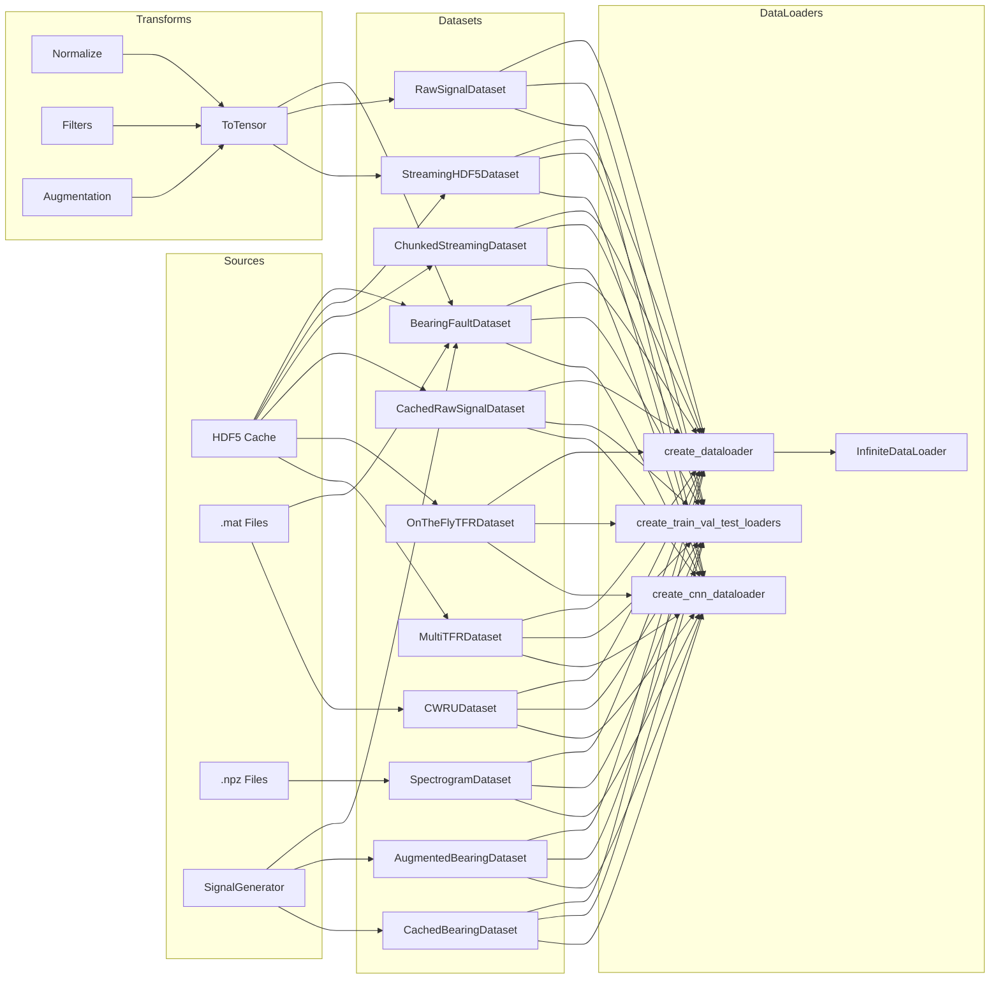
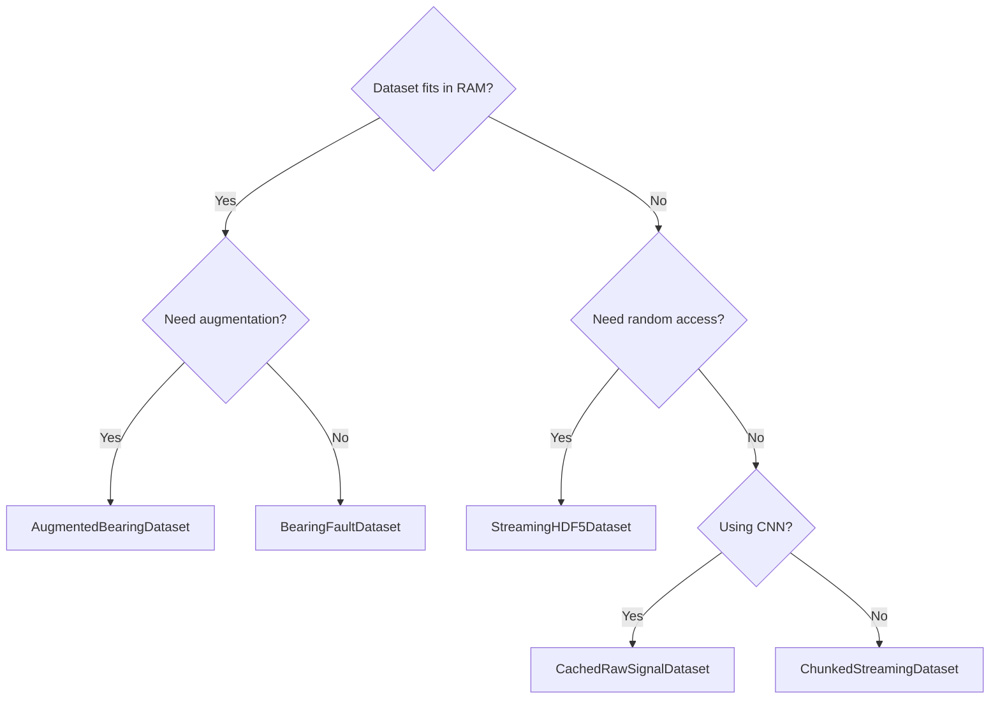

# Data Loading

> PyTorch Dataset, DataLoader, and Transform infrastructure for bearing fault diagnosis signals.

## Overview

The Data Loading sub-block provides the complete pipeline from raw data to model-ready tensors. It includes dataset classes for in-memory, streaming, and on-the-fly workflows; DataLoader factories with GPU-optimized defaults; and composable signal transforms for preprocessing and augmentation.

The module is organized into three layers:

1. **Datasets** — Classes implementing `torch.utils.data.Dataset` for different data sources and memory profiles
2. **DataLoaders** — Factory functions that wrap datasets in `torch.utils.data.DataLoader` with sensible defaults
3. **Transforms** — Composable signal preprocessing and augmentation callables

## Architecture



## Quick Start

```python
import numpy as np
from data.dataset import BearingFaultDataset
from data.dataloader import create_train_val_test_loaders
from data.transforms import Compose, Normalize, ToTensor

# 1. Create transform pipeline
transform = Compose([
    Normalize(method='zscore'),
    ToTensor()
])

# 2. Load dataset from HDF5
dataset = BearingFaultDataset.from_hdf5(
    hdf5_path='data/generated/bearing_signals.h5',
    split='train',
    transform=transform
)

# 3. Check dataset
print(f"Samples: {len(dataset)}")
print(f"Class distribution: {dataset.get_class_distribution()}")

# 4. Create DataLoaders
train_ds = BearingFaultDataset.from_hdf5('data/generated/bearing_signals.h5', split='train', transform=transform)
val_ds   = BearingFaultDataset.from_hdf5('data/generated/bearing_signals.h5', split='val',   transform=transform)
test_ds  = BearingFaultDataset.from_hdf5('data/generated/bearing_signals.h5', split='test',  transform=transform)

train_loader, val_loader, test_loader = create_train_val_test_loaders(
    train_ds, val_ds, test_ds,
    batch_size=32,
    num_workers=4
)

# 5. Training loop
for signals, labels in train_loader:
    # signals: (batch_size, signal_length) float tensor
    # labels:  (batch_size,) integer tensor
    pass
```

## Key Components

### Dataset Classes

| Class                     | File                        | Use Case                                   | Memory Model             |
| ------------------------- | --------------------------- | ------------------------------------------ | ------------------------ |
| `BearingFaultDataset`     | `dataset.py`                | General-purpose bearing fault signals      | In-memory                |
| `AugmentedBearingDataset` | `dataset.py`                | Training with on-the-fly augmentation      | In-memory + augmentation |
| `CachedBearingDataset`    | `dataset.py`                | Large datasets with disk caching           | Disk-cached              |
| `RawSignalDataset`        | `cnn_dataset.py`            | Raw signals for CNN training `[1, T]`      | In-memory                |
| `CachedRawSignalDataset`  | `cnn_dataset.py`            | CNN signals loaded from HDF5 on-the-fly    | Disk-streaming           |
| `StreamingHDF5Dataset`    | `streaming_hdf5_dataset.py` | Memory-efficient HDF5 streaming            | Streaming (thread-safe)  |
| `ChunkedStreamingDataset` | `streaming_hdf5_dataset.py` | Chunked prefetching for better I/O         | Streaming (chunked)      |
| `CWRUDataset`             | `cwru_dataset.py`           | CWRU bearing benchmark dataset             | In-memory                |
| `SpectrogramDataset`      | `tfr_dataset.py`            | Precomputed spectrograms from `.npz`       | In-memory                |
| `OnTheFlyTFRDataset`      | `tfr_dataset.py`            | On-the-fly TFR computation (STFT/CWT/WVD)  | On-the-fly               |
| `MultiTFRDataset`         | `tfr_dataset.py`            | Multiple TFR types for multi-stream models | On-the-fly               |

### DataLoader Utilities

| Function / Class                  | File                        | Purpose                                                                     |
| --------------------------------- | --------------------------- | --------------------------------------------------------------------------- |
| `create_dataloader()`             | `dataloader.py`             | Single DataLoader with GPU-optimized defaults                               |
| `create_train_val_test_loaders()` | `dataloader.py`             | Train/val/test loader triple with split-appropriate settings                |
| `create_cnn_dataloader()`         | `cnn_dataloader.py`         | Optimized loader for CNN training (pinned memory, persistent workers)       |
| `create_cnn_dataloaders()`        | `cnn_dataloader.py`         | Train/val/test CNN loaders                                                  |
| `create_streaming_dataloaders()`  | `streaming_hdf5_dataset.py` | Streaming HDF5 loaders                                                      |
| `create_cwru_dataloaders()`       | `cwru_dataset.py`           | CWRU benchmark loaders                                                      |
| `create_tfr_dataloaders()`        | `tfr_dataset.py`            | TFR/Spectrogram loaders                                                     |
| `InfiniteDataLoader`              | `dataloader.py`             | Wraps a DataLoader to loop infinitely (iteration-based training)            |
| `prefetch_to_device()`            | `dataloader.py`             | Generator that prefetches batches to GPU                                    |
| `DataLoaderConfig`                | `cnn_dataloader.py`         | Preset configurations (fast_training, debugging, memory_efficient, default) |
| `estimate_optimal_batch_size()`   | `dataloader.py`             | Binary search for max GPU-fitting batch size                                |
| `compute_class_weights()`         | `dataloader.py`             | Inverse-frequency weights for imbalanced datasets                           |

### Transform Classes

#### General Transforms (`transforms.py`)

| Transform                 | Purpose                       | Key Parameters                                            |
| ------------------------- | ----------------------------- | --------------------------------------------------------- |
| `Compose`                 | Chain multiple transforms     | `transforms: List[Callable]`                              |
| `Normalize`               | Amplitude normalization       | `method: 'zscore' \| 'minmax' \| 'robust'`                |
| `Resample`                | Change sampling rate          | `original_fs`, `target_fs`, `method: 'scipy' \| 'linear'` |
| `BandpassFilter`          | Butterworth bandpass          | `lowcut`, `highcut`, `fs`, `order`                        |
| `LowpassFilter`           | Butterworth lowpass           | `cutoff`, `fs`, `order`                                   |
| `HighpassFilter`          | Butterworth highpass          | `cutoff`, `fs`, `order`                                   |
| `ToTensor`                | NumPy → PyTorch tensor        | `dtype`                                                   |
| `Unsqueeze`               | Add dimension `(N,) → (1, N)` | `dim`                                                     |
| `Detrend`                 | Remove linear/constant trend  | `type: 'linear' \| 'constant'`                            |
| `Clip`                    | Clip values to range          | `min_val`, `max_val`                                      |
| `AddNoise`                | Gaussian noise at given SNR   | `snr_db`                                                  |
| `WindowSlice`             | Extract fixed/random window   | `start`, `length`, `random`                               |
| `get_default_transform()` | Factory for standard pipeline | `normalize`, `to_tensor`, `add_channel_dim`               |

#### CNN Transforms (`cnn_transforms.py`)

| Transform                | Purpose                                      | Key Parameters              |
| ------------------------ | -------------------------------------------- | --------------------------- |
| `ToTensor1D`             | NumPy → Tensor `[1, T]` for CNN              | —                           |
| `Normalize1D`            | Per-sample z-score normalization             | `eps`                       |
| `RandomCrop1D`           | Random subsequence cropping                  | `crop_size`, `padding_mode` |
| `RandomAmplitudeScale`   | Random gain variation                        | `scale_range`, `p`          |
| `AddGaussianNoise`       | Gaussian noise augmentation                  | `noise_level`, `p`          |
| `Compose`                | Chain CNN transforms                         | `transforms: list`          |
| `get_train_transforms()` | Factory: training pipeline with augmentation | `augment: bool`             |
| `get_test_transforms()`  | Factory: test pipeline (no augmentation)     | —                           |

## DataLoader Configuration

The `DataLoaderConfig` class in `cnn_dataloader.py` provides preset configurations:

| Preset             | Batch Size | Workers | Pin Memory | Persistent Workers | Use Case                  |
| ------------------ | ---------- | ------- | ---------- | ------------------ | ------------------------- |
| `fast_training`    | 64         | 8       | ✅         | ✅                 | Maximize throughput       |
| `debugging`        | 8          | 0       | ❌         | ❌                 | Single-threaded debugging |
| `memory_efficient` | 16         | 2       | ✅         | ❌                 | Limited RAM/GPU           |
| `default`          | 32         | 4       | ✅         | ✅                 | Balanced                  |

```python
from data.cnn_dataloader import create_cnn_dataloader, DataLoaderConfig

# Use preset
config = DataLoaderConfig.fast_training(batch_size=128)
loader = create_cnn_dataloader(dataset, **config)
```

## CWRU Benchmark

The CWRU (Case Western Reserve University) bearing dataset is integrated via `cwru_dataset.py`.

### Supported Fault Types

| Fault Type  | Label | Defect Size | Location   |
| ----------- | ----- | ----------- | ---------- |
| `normal`    | 0     | —           | —          |
| `ball_007`  | 1     | 0.007"      | Ball       |
| `ball_014`  | 2     | 0.014"      | Ball       |
| `ball_021`  | 3     | 0.021"      | Ball       |
| `inner_007` | 4     | 0.007"      | Inner race |
| `inner_014` | 5     | 0.014"      | Inner race |
| `inner_021` | 6     | 0.021"      | Inner race |
| `outer_007` | 7     | 0.007"      | Outer race |
| `outer_014` | 8     | 0.014"      | Outer race |
| `outer_021` | 9     | 0.021"      | Outer race |

### Usage

```python
from data.cwru_dataset import download_cwru_data, CWRUDataset, create_cwru_dataloaders

# 1. Download data
download_cwru_data(save_dir='data/raw/cwru/')

# 2. Create dataset
dataset = CWRUDataset(
    data_dir='data/raw/cwru/',
    split='train',
    segment_length=2048,
    overlap=0.5
)

# 3. Or use the factory
loaders = create_cwru_dataloaders(
    data_dir='data/raw/cwru/',
    batch_size=32,
    segment_length=2048
)
train_loader = loaders['train']
```

### Key Parameters

- **`segment_length`**: Length of each signal segment (default: 2048)
- **`overlap`**: Overlap ratio between segments (default: 0.5)
- **`fault_types`**: List of specific fault types to include (default: all 10)
- Data is loaded from `.mat` files at 12 kHz and segmented into fixed-length windows

## Memory Management

Choose the right dataset class based on your memory constraints:



### Streaming HDF5 Dataset

For datasets too large for RAM, `StreamingHDF5Dataset` reads samples directly from HDF5:

```python
from data.streaming_hdf5_dataset import StreamingHDF5Dataset, create_streaming_dataloaders

# Single dataset
dataset = StreamingHDF5Dataset(
    hdf5_path='data/generated/large_dataset.h5',
    split='train',
    transform=transform,
    cache_size=0  # optional in-memory cache
)

# Or create all loaders at once
loaders = create_streaming_dataloaders(
    hdf5_path='data/generated/large_dataset.h5',
    batch_size=32,
    num_workers=4,
    use_chunked=True,   # enable chunked prefetching
    chunk_size=256
)
```

**Thread safety**: `StreamingHDF5Dataset` uses thread-local HDF5 file handles for safe multi-worker data loading.

### Chunked Streaming

`ChunkedStreamingDataset` extends streaming with chunked prefetching — reads `chunk_size` samples at once to reduce random I/O overhead. Recommended for HDD and network storage.

## Performance

> ⚠️ **Results pending.** Performance metrics below will be populated after experiments are run on the current codebase.

| Metric                         | Value                  |
| ------------------------------ | ---------------------- |
| Data loading throughput        | `[PENDING BENCHMARKS]` |
| HDF5 streaming throughput      | `[PENDING BENCHMARKS]` |
| Chunked vs. random I/O speedup | `[PENDING BENCHMARKS]` |
| GPU prefetch overlap gain      | `[PENDING BENCHMARKS]` |

## Dependencies

- **Requires:**
  - `torch`, `numpy`, `scipy`, `h5py`, `sklearn`
  - `data/signal_generator.py` — for `BearingFaultDataset.from_generator_output()`
  - `data/augmentation.py` — for `AugmentedBearingDataset`
  - `data/cache_manager.py` — for `CachedBearingDataset`
  - `data/spectrogram_generator.py`, `data/wavelet_transform.py`, `data/wigner_ville.py` — for TFR datasets
  - `config/data_config.py` — `DataConfig`
  - `utils/constants.py` — `SAMPLING_RATE`, `SIGNAL_LENGTH`, `NUM_CLASSES`
  - `utils/logging.py` — structured logging

- **Provides:**
  - `BearingFaultDataset`, `AugmentedBearingDataset`, `CachedBearingDataset`
  - `RawSignalDataset`, `CachedRawSignalDataset`
  - `StreamingHDF5Dataset`, `ChunkedStreamingDataset`
  - `CWRUDataset`
  - `SpectrogramDataset`, `OnTheFlyTFRDataset`, `MultiTFRDataset`
  - `create_dataloader()`, `create_train_val_test_loaders()`, `create_cnn_dataloader()`, `create_cnn_dataloaders()`
  - All transform classes and factory functions

## Testing

Each module includes a `test_*` function that can be run directly:

```bash
python -m data.cnn_dataset       # Test CNN dataset classes
python -m data.streaming_hdf5_dataset  # Test streaming functionality
python -m data.cwru_dataset      # Test CWRU dataset (requires downloaded data)
python -m data.cnn_transforms    # Test CNN transforms
```

## Related Documentation

- **Signal Generation** (IDB 3.1): `data/SIGNAL_GENERATION_README.md` — upstream signal generation
- **Storage Layer** (IDB 3.3): `data/STORAGE_README.md` — HDF5 caching and storage
- **Models** (IDB 1.1): `packages/core/models/README.md` — model architectures consuming these datasets
- **Training** (IDB 1.2): `packages/core/training/README.md` — training pipelines using these DataLoaders
