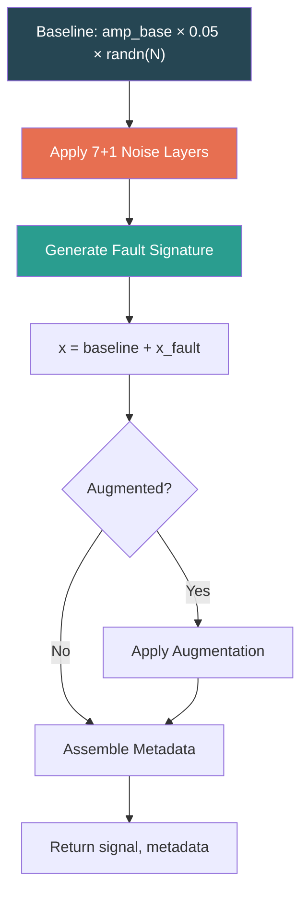

# Physics Model Guide — Signal Generation

> Detailed documentation of the physics-based bearing fault model implemented in `data/signal_generator.py`.

## 1. Model Overview

The signal generator implements a **Sommerfeld-scaled hydrodynamic bearing model** that produces synthetic vibration signals. Each signal is constructed by combining:

1. A **baseline vibration** — low-amplitude Gaussian noise scaled by operating conditions
2. A **fault-specific signature** — physics-based waveform unique to each fault type
3. A **7-layer noise model** — simulating realistic sensor/environmental interference
4. **Transient modulation** — optional non-stationary behavior

> [!IMPORTANT]
> The physics model implements **journal/hydrodynamic bearing** dynamics (Sommerfeld number, oil whirl, clearance ratio). The project also uses the **CWRU ball bearing** dataset for benchmarking — these are fundamentally different bearing types. Do not assume the synthetic signals are physically equivalent to CWRU data. See `docs/idb_reports/compiled/PROJECT_SCOPE_ANALYSIS.md` for details on this scope mismatch.

## 2. Core Equations

### 2.1 Sommerfeld Number Calculation

When `PhysicsConfig.calculate_sommerfeld = True` (default), the Sommerfeld number is calculated from operating conditions:

```
S = S_base × viscosity_factor × speed_factor × load_factor_inv
```

Where:

- `S_base = 0.15` (default, configurable via `PhysicsConfig.sommerfeld_base`)
- `viscosity_factor = exp(-0.03 × (T_°C - 60))` — temperature-dependent viscosity
- `speed_factor = Ω / Ω_base` — normalized rotational speed
- `load_factor_inv = 1.0 / load_factor` — inverse load scaling
- Result is clamped to `[0.05, 0.5]`

When `calculate_sommerfeld = False`, Sommerfeld is sampled randomly around `S_base ± 0.1`.

**Source:** [`signal_generator.py` lines 623–645](file:///c:/Users/COWLAR/projects/LSTM_PFD/data/signal_generator.py#L623-L645)

### 2.2 Reynolds Number

Sampled uniformly from `[500, 5000]` (configurable via `PhysicsConfig.reynolds_range`). Stored in metadata but not directly used in fault signal equations.

### 2.3 Clearance Ratio

Sampled uniformly from `[0.001, 0.003]` (configurable via `PhysicsConfig.clearance_ratio_range`). Stored in metadata but not directly used in fault signal equations.

### 2.4 Physics Factor

Derived from the Sommerfeld number to scale fault amplitudes:

```
physics_factor = √(S / S_base)
```

Used by `usure` (wear) and `mixed_wear_lube` fault models.

## 3. Fault Signature Equations

All equations are implemented in `FaultModeler.generate_fault_signal()` ([lines 104–289](file:///c:/Users/COWLAR/projects/LSTM_PFD/data/signal_generator.py#L104-L289)).

Notation:

- `ω = 2π × Ω` — angular velocity (rad/s)
- `t` — time vector `[0, T)` with `N` samples
- `S(t)` — severity curve (scalar or time-varying)
- `M(t)` — transient modulation

---

### 3.1 Healthy (`sain`)

```
x_fault(t) = 0
```

No fault signature added. Signal contains only baseline noise + 7 noise layers.

---

### 3.2 Misalignment (`desalignement`)

```
x_fault(t) = S(t) × [0.35 × sin(2ωt + φ₂) + 0.20 × sin(3ωt + φ₃)] × M(t)
```

- **2X harmonic** with amplitude 0.35 and random phase `φ₂`
- **3X harmonic** with amplitude 0.20 and random phase `φ₃`
- Modulated by severity curve and transient

---

### 3.3 Imbalance (`desequilibre`)

```
x_fault(t) = S(t) × [0.5 × L_f × sin(ωt + φ₁) × v²] × M(t)
```

- **1X dominant** with amplitude 0.5
- `L_f` = load factor (0.3–1.0)
- `v` = speed variation factor → **speed-squared** dependence
- Random phase `φ₁`

---

### 3.4 Bearing Clearance (`jeu`)

```
x_fault(t) = S(t) × [0.25 × T_f × sin(2π × f_sub × t) + 0.18 × sin(ωt) + 0.10 × sin(2ωt)] × M(t)
```

- **Sub-synchronous component** at `f_sub = (0.43 + 0.05r) × Ω` where `r ~ U(0,1)`
- **1X harmonic** (amplitude 0.18) + **2X harmonic** (amplitude 0.10)
- Temperature factor `T_f` scales sub-synchronous amplitude

---

### 3.5 Lubrication (`lubrification`)

```
stick_slip(t) = 0.30 × T_f × (0.3 / S) × sin(2π × f_ss × t)
x_fault(t) = S(t) × stick_slip(t) × M(t) + impact_events
```

- **Stick-slip oscillation** at frequency `f_ss = 2 + 3r` Hz
- **Inverse Sommerfeld scaling** (`0.3 / S`) — lower bearing number → more stick-slip
- **Metal contact impact events:** `1 + 3 × mean(S)` impulses, each with exponential decay (`τ = 0.4`), random position and Gaussian amplitude

---

### 3.6 Cavitation (`cavitation`)

```
x_fault(t) = Σᵢ burst_i(t)
burst_i(t) = 0.6 × mean(S) × sin(2π × f_b × t') × exp(-100 × t') × hann(t')
```

- `2 + 5 × mean(S)` bursts per signal
- Each burst: frequency `f_b = 1500 + 1000r` Hz, duration `0.008 × fs` samples
- Shaped by **Hann window** and **exponential decay** (`τ = 100`)
- Placed at random positions in the signal

---

### 3.7 Wear (`usure`)

```
wear_noise(t) = 0.25 × O_f × P_f × randn(N)
asperity(t) = 0.12 × [sin(ωt) + 0.5 × sin(2ωt)]
wear_mod(t) = 1 + 0.3 × sin(2π × f_m × t)
x_fault(t) = S(t) × [wear_noise(t) + asperity(t)] × wear_mod(t) × M(t)
```

- **Broadband noise** scaled by operating factor `O_f` and physics factor `P_f`
- **Asperity harmonics** at 1X and 2X
- **Amplitude modulation** at random frequency `f_m = 0.5 + 1.5r` Hz

---

### 3.8 Oil Whirl (`oilwhirl`)

```
f_whirl = (0.42 + 0.06r) × Ω
A_whirl = 0.40 × (1 / √S)
whirl(t) = A_whirl × sin(2π × f_whirl × t)
subsync_mod(t) = 1 + 0.2 × sin(2π × (f_whirl / 2) × t)
x_fault(t) = S(t) × whirl(t) × subsync_mod(t) × M(t)
```

- **Sub-synchronous whirl** at ~0.42–0.48× rotational speed
- **Inverse square-root Sommerfeld** scaling — physically correct relationship
- **Sub-synchronous modulation** at half the whirl frequency

---

### 3.9 Mixed: Misalignment + Imbalance (`mixed_misalign_imbalance`)

Additive combination of misalignment (2X + 3X) and imbalance (1X with speed²):

```
x_fault(t) = S(t) × [misalign_2X + misalign_3X + imbalance_1X] × M(t)
```

Amplitudes reduced from single-fault values (0.25, 0.15, 0.35 respectively).

---

### 3.10 Mixed: Wear + Lubrication (`mixed_wear_lube`)

Additive combination of wear (broadband + asperity) and lubrication (stick-slip + contact events):

```
x_fault(t) = S(t) × [wear_noise + asperity + stick_slip] × M(t) + contact_events
```

Amplitudes scaled down from single-fault versions. Contact events: `2 + 3 × mean(S)` impacts with decay `τ = 0.5`.

---

### 3.11 Mixed: Cavitation + Clearance (`mixed_cavit_jeu`)

Additive combination of cavitation bursts and clearance sub-synchronous + 1X:

```
x_fault(t) = bursts(t) + S(t) × [clearance_sub + clearance_1X] × M(t)
```

Burst count elevated (`3 + 4 × mean(S)`), clearance amplitudes slightly reduced.

---

## 4. Noise Model

The `NoiseGenerator` class applies **8 independent noise layers** (documentation refers to "7-layer" but impulse noise was added as layer 8):

| Layer | Name         | Physics                            | Level/Rate                    | Condition     |
| ----- | ------------ | ---------------------------------- | ----------------------------- | ------------- |
| 1     | Measurement  | Sensor thermal noise               | σ = 0.03                      | Always on     |
| 2     | EMI          | Power-line interference (50–60 Hz) | A = 0.01 × (1 + 0.5r)         | Always on     |
| 3     | Pink (1/f)   | Environmental low-freq noise       | σ = 0.02 (normalized)         | Always on     |
| 4     | Drift        | Low-frequency thermal drift        | A = 0.015, period = 1.5s      | Always on     |
| 5     | Quantization | ADC resolution                     | step = 0.001                  | Always on     |
| 6     | Sensor drift | Calibration decay                  | rate = 0.001/s                | Always on     |
| 7     | Aliasing     | Near-Nyquist artifact              | A = 0.005, 10% probability    | Probabilistic |
| 8     | Impulse      | Sporadic mechanical impacts        | 2 impacts/s, A ∈ [0.02, 0.05] | Always on     |

Each layer can be toggled independently via `NoiseConfig`. Default configuration enables all layers.

**Source:** [`signal_generator.py` lines 292–391](file:///c:/Users/COWLAR/projects/LSTM_PFD/data/signal_generator.py#L292-L391)

## 5. Signal Construction Pipeline



**Note:** Noise is applied to the **baseline** before fault injection. The fault signal is then added to the noisy baseline. This means the fault signature sits on top of realistic sensor noise.

## 6. Parameter Ranges and Physical Meaning

| Parameter               | Range         | Physical Meaning                                           |
| ----------------------- | ------------- | ---------------------------------------------------------- |
| Sommerfeld number (`S`) | 0.05 – 0.5    | Bearing load capacity indicator. Higher = thicker oil film |
| Reynolds number (`Re`)  | 500 – 5000    | Flow regime in bearing clearance. All values are laminar   |
| Clearance ratio (`c/R`) | 0.001 – 0.003 | Bearing gap relative to radius                             |
| Speed variation         | ±10%          | Operating speed fluctuation                                |
| Load factor             | 0.3 – 1.0     | Fraction of rated bearing load                             |
| Temperature             | 40°C – 80°C   | Operating temperature affecting viscosity                  |

## 7. Known Limitations and Assumptions

> [!WARNING]
> These are important caveats about the physics model's fidelity.

1. **Journal bearing assumption:** The model implements hydrodynamic (journal) bearing physics. The CWRU benchmark dataset uses ball bearings with fundamentally different failure modes (inner race, outer race, ball defects). The synthetic fault types (oil whirl, cavitation, Sommerfeld-based lubrication) do not correspond to ball bearing defects.

2. **Simplified equations:** The fault signature equations use empirical amplitude constants (e.g., 0.35 for 2X misalignment) that are not derived from finite-element or CFD simulations. These are heuristic coefficients chosen to produce distinguishable signatures.

3. **No frequency domain calibration:** Signal fidelity against real bearing vibration spectra has not been validated. Frequency content is plausible but unverified.

4. **Linear superposition for mixed faults:** Mixed fault types simply add individual fault signatures. Real multi-fault bearing conditions exhibit nonlinear interactions.

5. **Stationary within segments:** While transient modulation is supported, the fault model assumes quasi-stationary physics within each time step.

6. **No bearing geometry parameters:** The model does not take bearing dimensions (journal diameter, length, clearance) as explicit inputs. These are abstracted into the Sommerfeld number and clearance ratio.

## 8. Validation Status

> ⚠️ **Results pending.** The following validations will be populated after experiments are run on the current codebase.

| Validation                                | Status                 |
| ----------------------------------------- | ---------------------- |
| MATLAB vs Python numerical equivalence    | `[PENDING VALIDATION]` |
| Fault signature spectral correctness      | `[PENDING VALIDATION]` |
| Noise floor SNR measurement               | `[PENDING VALIDATION]` |
| Classification accuracy on synthetic data | `[PENDING VALIDATION]` |
| Transfer learning to real CWRU data       | `[PENDING VALIDATION]` |
| Sommerfeld-fault correlation analysis     | `[PENDING VALIDATION]` |

## Related Documentation

- **Signal Generation README:** [SIGNAL_GENERATION_README.md](./SIGNAL_GENERATION_README.md)
- **Data Config Reference:** `config/data_config.py`
- **Constants:** `utils/constants.py`
- **IDB Reports (PROTECTED):** `docs/idb_reports/IDB_3_1_SIGNAL_GEN_ANALYSIS.md`
