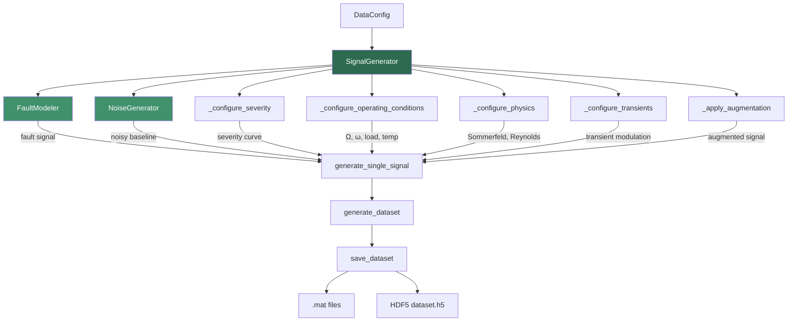

# Signal Generation

> Physics-informed synthetic vibration signal generator for bearing fault diagnosis.

## Overview

The Signal Generation sub-block produces synthetic vibration signals that model hydrodynamic bearing faults. It is a Python port of the original MATLAB `generator.m` (Production v2.0) and serves as the primary data source for training, evaluation, and inference across the project.

The generator creates realistic signals by combining:

- **Physics-based fault signatures** for 11 fault classes (1 healthy + 7 single + 3 mixed)
- **A 7-layer independent noise model** simulating real-world sensor conditions
- **Variable operating conditions** (speed, load, temperature)
- **Multi-severity progression** with optional temporal evolution
- **Non-stationary transient behavior** (speed ramps, load steps, thermal expansion)
- **Data augmentation** (time shift, amplitude scaling, noise injection)

The sub-block also provides advanced signal augmentation techniques (PyTorch-based) and STFT-based spectrogram generation for time-frequency analysis.

## Architecture



## Quick Start

```python
from data.signal_generator import SignalGenerator
from config.data_config import DataConfig

# Use default configuration
generator = SignalGenerator()

# Generate a complete dataset (all 11 fault types)
dataset = generator.generate_dataset()
# dataset['signals']  → List[np.ndarray], each shape (102400,)
# dataset['labels']   → List[str], e.g. ['sain', 'desalignement', ...]
# dataset['metadata'] → List[SignalMetadata]

# Save as HDF5 (recommended — 25× faster loading, 30% smaller)
paths = generator.save_dataset(dataset, format='hdf5')

# Save as .mat files (backward compatible)
paths = generator.save_dataset(dataset, format='mat')

# Generate a single signal
signal, metadata = generator.generate_single_signal('cavitation')
```

## Key Components

| Component              | Description                                             | File                       |
| ---------------------- | ------------------------------------------------------- | -------------------------- |
| `SignalGenerator`      | Main orchestrator — generates datasets of fault signals | `signal_generator.py`      |
| `FaultModeler`         | Physics-based fault injection for 11 fault types        | `signal_generator.py`      |
| `NoiseGenerator`       | 7-layer independent noise model                         | `signal_generator.py`      |
| `SignalMetadata`       | Dataclass capturing full provenance of each signal      | `signal_generator.py`      |
| `SignalAugmentation`   | Base class + 7 augmentation techniques (PyTorch)        | `signal_augmentation.py`   |
| `ComposeAugmentations` | Pipeline composer for chaining augmentations            | `signal_augmentation.py`   |
| `SpectrogramGenerator` | STFT/Mel spectrogram generation with normalization      | `spectrogram_generator.py` |
| `SpectrogramConfig`    | Predefined configurations (bearing, high-res)           | `spectrogram_generator.py` |

## Fault Types Implemented

All fault models are implemented in `FaultModeler.generate_fault_signal()`:

| #   | Fault Type                 | English Name             | Category | Physics Signature                                         |
| --- | -------------------------- | ------------------------ | -------- | --------------------------------------------------------- |
| 0   | `sain`                     | Healthy                  | Baseline | No fault — baseline noise only                            |
| 1   | `desalignement`            | Misalignment             | Single   | 2X + 3X harmonic components                               |
| 2   | `desequilibre`             | Imbalance                | Single   | 1X dominant, speed² amplitude dependence                  |
| 3   | `jeu`                      | Bearing Clearance        | Single   | Sub-synchronous (~0.43–0.48×Ω) + 1X + 2X                  |
| 4   | `lubrification`            | Lubrication              | Single   | Stick-slip (inverse Sommerfeld) + metal contact impacts   |
| 5   | `cavitation`               | Cavitation               | Single   | High-frequency bursts (1500–2500 Hz), Hann-windowed       |
| 6   | `usure`                    | Wear                     | Single   | Broadband noise + asperity harmonics + AM modulation      |
| 7   | `oilwhirl`                 | Oil Whirl                | Single   | Sub-synchronous whirl (~0.42–0.48×Ω), inverse √Sommerfeld |
| 8   | `mixed_misalign_imbalance` | Misalignment + Imbalance | Mixed    | Additive 2X/3X + 1X (speed²)                              |
| 9   | `mixed_wear_lube`          | Wear + Lubrication       | Mixed    | Broadband noise + stick-slip + contact events             |
| 10  | `mixed_cavit_jeu`          | Cavitation + Clearance   | Mixed    | HF bursts + sub-synchronous + 1X                          |

## Signal Parameters

All defaults are sourced from `config/data_config.py` and `utils/constants.py`:

| Parameter               | Type  | Default  | Meaning                                |
| ----------------------- | ----- | -------- | -------------------------------------- |
| `fs`                    | int   | 20480 Hz | Sampling frequency                     |
| `T`                     | float | 5.0 s    | Signal duration                        |
| `N`                     | int   | 102400   | Samples per signal (`fs × T`)          |
| `Omega_base`            | float | 60.0 Hz  | Base rotational speed (3600 RPM)       |
| `num_signals_per_fault` | int   | 100      | Base signals generated per fault class |
| `rng_seed`              | int   | 42       | Random seed for reproducibility        |

### Severity Configuration

| Level       | Factor Range | Description                          |
| ----------- | ------------ | ------------------------------------ |
| `incipient` | 0.20 – 0.45  | Early-stage fault, barely detectable |
| `mild`      | 0.45 – 0.70  | Noticeable fault signature           |
| `moderate`  | 0.70 – 0.90  | Clear fault presence                 |
| `severe`    | 0.90 – 1.00  | Full fault amplitude                 |

Temporal evolution (enabled for 30% of signals): severity ramps linearly from initial value to `min(1.0, initial + 0.3)` over the signal duration.

### Operating Conditions

| Condition   | Range                | Default Variation |
| ----------- | -------------------- | ----------------- |
| Speed       | ±10% of `Omega_base` | Random per signal |
| Load        | 30% – 100% of rated  | Uniform random    |
| Temperature | 40°C – 80°C          | Uniform random    |

### Transient Types (25% probability)

| Type                | Effect                                                      |
| ------------------- | ----------------------------------------------------------- |
| `speed_ramp`        | Linear speed modulation 0.85× → 1.15× over 20–60% of signal |
| `load_step`         | Step change from 0.7× to 1.0× at 40% of signal              |
| `thermal_expansion` | Exponential rise 0.9 → 1.1 with time constant 0.3N          |

## Augmentation Techniques

### Generator-Level Augmentation (`signal_generator.py`)

Applied during dataset generation when `augmentation.enabled = True` (default ratio: 30%):

| Method            | Description               | Parameters             |
| ----------------- | ------------------------- | ---------------------- |
| `time_shift`      | Circular shift in time    | `max_shift = 0.02 × N` |
| `amplitude_scale` | Random amplitude scaling  | Range: 0.85 – 1.15     |
| `noise_injection` | Additional Gaussian noise | Level: 0.02 – 0.05     |

### Advanced Augmentation (`signal_augmentation.py`)

PyTorch-based augmentation classes for use in training pipelines:

| Class                  | Description                                                   | Key Params                         |
| ---------------------- | ------------------------------------------------------------- | ---------------------------------- |
| `Mixup`                | Linear interpolation between two signals (Zhang et al., 2017) | `alpha=0.2`, `prob=0.5`            |
| `TimeWarping`          | Non-linear time stretching via cubic interpolation            | `sigma=0.2`, `num_knots=4`         |
| `MagnitudeWarping`     | Smooth non-linear amplitude changes                           | `sigma=0.2`, `num_knots=4`         |
| `Jittering`            | Additive Gaussian noise relative to signal std                | `sigma=0.05`                       |
| `Scaling`              | Random amplitude scaling (clamped ≥ 0.5)                      | `sigma=0.1`                        |
| `TimeShift`            | Circular time shift                                           | `max_shift=0.1`                    |
| `WindowSlicing`        | Extract random or center window                               | `window_size`, `strategy='random'` |
| `ComposeAugmentations` | Sequential pipeline of augmentations                          | `prob=0.5` per augmentation        |

## Spectrogram Generation (`spectrogram_generator.py`)

| Method                            | Description                           | Output Shape          |
| --------------------------------- | ------------------------------------- | --------------------- |
| `generate_stft_spectrogram`       | Standard STFT magnitude spectrogram   | `(n_freq, n_time)`    |
| `generate_log_spectrogram`        | Log-scale (dB) spectrogram            | `(n_freq, n_time)`    |
| `generate_normalized_spectrogram` | Normalized for neural network input   | `(n_freq, n_time)`    |
| `generate_mel_spectrogram`        | Mel-frequency scaled spectrogram      | `(n_mels, n_time)`    |
| `batch_generate`                  | Batch processing for multiple signals | `(N, n_freq, n_time)` |

Default STFT parameters: `nperseg=256`, `noverlap=128`, `window='hann'`, `fs=20480`

## Output Formats

### HDF5 (`dataset.h5`) — Recommended

```
dataset.h5
├── train/
│   ├── signals    (N_train, 102400) float32, gzip-compressed
│   └── labels     (N_train,) int64
├── val/
│   ├── signals    (N_val, 102400) float32
│   └── labels     (N_val,) int64
├── test/
│   ├── signals    (N_test, 102400) float32
│   └── labels     (N_test,) int64
├── metadata       JSON strings (utf-8)
└── attrs: num_classes=11, sampling_rate=20480, signal_length=102400, split_ratios=(0.7, 0.15, 0.15)
```

### `.mat` Files (Legacy)

One file per signal: `{fault_type}_{index:03d}.mat` (or `_aug.mat` for augmented).

Each file contains: `x` (signal array), `fs`, `fault` (label), `metadata` (struct).

## Dependencies

- **Requires:** `numpy`, `scipy` (signal processing, `.mat` I/O), `h5py` (HDF5), `scikit-learn` (stratified splits), `torch` (augmentation module)
- **Internal:** `config.data_config.DataConfig`, `utils.constants`, `utils.reproducibility`, `utils.logging`
- **Provides:** Raw signal arrays, HDF5 datasets, `.mat` files consumed by `data/dataset.py`, `data/dataloader.py`, training scripts

## Configuration

All parameters are configured via `config/data_config.py` which aggregates:

| Config Class         | Purpose                                     |
| -------------------- | ------------------------------------------- |
| `SignalConfig`       | `fs`, `T`, `Omega_base`                     |
| `FaultConfig`        | Enable/disable individual fault types       |
| `SeverityConfig`     | Severity levels, ranges, temporal evolution |
| `NoiseConfig`        | Toggle and tune 7 noise layers              |
| `OperatingConfig`    | Speed variation, load/temp ranges           |
| `PhysicsConfig`      | Sommerfeld calculation, Reynolds, clearance |
| `TransientConfig`    | Transient types and probability             |
| `AugmentationConfig` | Methods, ratio, parameter ranges            |

## Performance

> ⚠️ **Results pending.** Performance metrics below will be populated after experiments are run on the current codebase.

| Metric                                   | Value                  |
| ---------------------------------------- | ---------------------- |
| Classification accuracy (synthetic data) | `[PENDING]`            |
| Signal fidelity vs real bearings         | `[PENDING VALIDATION]` |
| Generation throughput (signals/sec)      | `[PENDING]`            |

## Related Documentation

- **Physics Model Details:** [PHYSICS_MODEL_GUIDE.md](./PHYSICS_MODEL_GUIDE.md) (IDB 3.1)
- **Data Loading:** IDB 3.2 scope
- **HDF5 Storage Layer:** IDB 3.3 scope
- **Configuration System:** IDB 4.4 scope
- **IDB Analysis Reports:** `docs/idb_reports/IDB_3_1_SIGNAL_GEN_ANALYSIS.md`, `docs/idb_reports/IDB_3_1_SIGNAL_GEN_BEST_PRACTICES.md` (PROTECTED)
