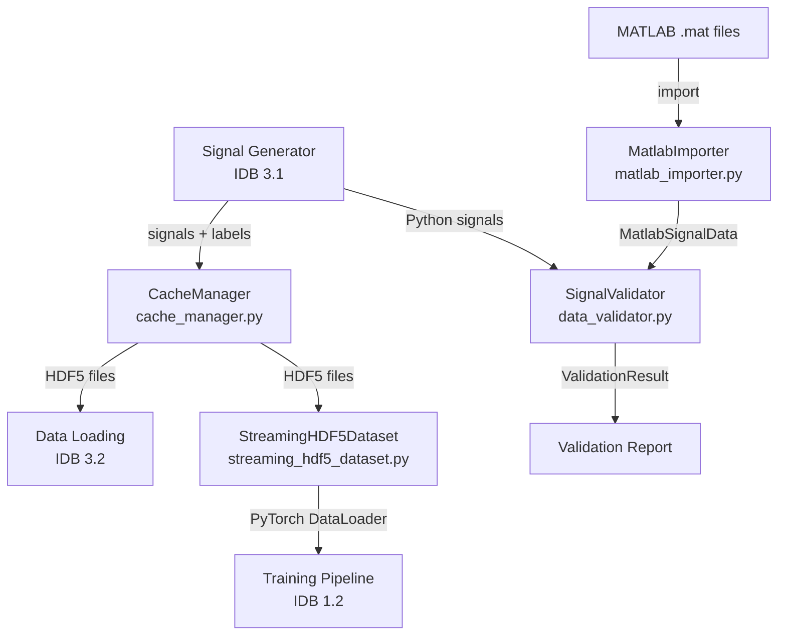

# Storage Layer

> Caching, data import, validation, and HDF5 storage for the bearing fault diagnosis pipeline.

## Overview

The Storage Layer manages all data persistence and retrieval in the LSTM_PFD project. It provides HDF5-based caching for generated signals, MATLAB `.mat` file import for cross-validation against the reference MATLAB generator, and a comprehensive signal validation framework for ensuring numerical equivalence between Python and MATLAB implementations.

This layer sits between the signal generation pipeline (IDB 3.1) and the data loading pipeline (IDB 3.2), enabling fast repeated experiments by caching generated datasets to disk and providing interoperability with the MATLAB codebase.

## Architecture



## Quick Start

### Cache a dataset to HDF5

```python
from data.cache_manager import CacheManager
import numpy as np

cache = CacheManager(cache_dir='./cache')
signals = np.random.randn(100, 102400).astype(np.float32)
labels = np.random.randint(0, 11, size=100)

# Simple cache (flat structure)
cache.cache_dataset(signals, labels, cache_name='my_dataset')

# Cache with train/val/test splits
cache.cache_dataset_with_splits(
    signals, labels,
    cache_name='split_dataset',
    split_ratios=(0.7, 0.15, 0.15),
    stratify=True
)
```

### Load MATLAB .mat files

```python
from data.matlab_importer import MatlabImporter

importer = MatlabImporter()
data = importer.load_mat_file('signal_sain_001.mat')
print(f"Signal: {data.signal.shape}, Label: {data.label}")
```

### Validate Python vs MATLAB signals

```python
from data.data_validator import SignalValidator

validator = SignalValidator(tolerance=0.01)
result = validator.compare_signals(python_signal, matlab_signal, label="sain")
print(result)  # ValidationResult(✅ PASSED, 0 errors, 0 warnings)
```

### Stream HDF5 data for training

```python
from data.streaming_hdf5_dataset import StreamingHDF5Dataset
from torch.utils.data import DataLoader

dataset = StreamingHDF5Dataset('data/processed/dataset.h5', split='train')
loader = DataLoader(dataset, batch_size=32, num_workers=4)

for signals, labels in loader:
    pass  # signals: [32, 1, 102400], labels: [32]
```

## Key Components

| Component                      | Description                                                                                       | File                             |
| ------------------------------ | ------------------------------------------------------------------------------------------------- | -------------------------------- |
| `CacheManager`                 | HDF5 dataset caching with compression, metadata, split support, and cache invalidation            | `data/cache_manager.py`          |
| `MatlabImporter`               | Loads and parses MATLAB `.mat` files; extracts signals, metadata, labels, severity, and config    | `data/matlab_importer.py`        |
| `MatlabSignalData`             | Dataclass container for imported MATLAB signal data                                               | `data/matlab_importer.py`        |
| `SignalValidator`              | Multi-level validation comparing Python vs MATLAB signals (statistics, correlation, coherence)    | `data/data_validator.py`         |
| `ValidationResult`             | Dataclass container for validation comparison results                                             | `data/data_validator.py`         |
| `StreamingHDF5Dataset`         | PyTorch `Dataset` that reads HDF5 signals on-demand with thread-safe file handles and LRU caching | `data/streaming_hdf5_dataset.py` |
| `ChunkedStreamingDataset`      | Extension of `StreamingHDF5Dataset` with chunked prefetching for better sequential I/O            | `data/streaming_hdf5_dataset.py` |
| `cache_dataset_simple`         | Convenience function for one-line HDF5 caching                                                    | `data/cache_manager.py`          |
| `load_cached_dataset_simple`   | Convenience function for one-line HDF5 loading                                                    | `data/cache_manager.py`          |
| `load_matlab_reference`        | Convenience function to load a single MATLAB reference signal                                     | `data/matlab_importer.py`        |
| `load_mat_dataset`             | Loads an entire MAT dataset organized by fault-type subdirectories                                | `data/matlab_importer.py`        |
| `validate_against_matlab`      | End-to-end convenience function for Python vs MATLAB validation                                   | `data/data_validator.py`         |
| `create_streaming_dataloaders` | Creates train/val/test `DataLoader` instances from a single HDF5 file                             | `data/streaming_hdf5_dataset.py` |

## API Summary

### CacheManager

| Method                                            | Description                                                            |
| ------------------------------------------------- | ---------------------------------------------------------------------- |
| `cache_dataset(signals, labels, ...)`             | Cache flat dataset to `{cache_name}.h5` with optional gzip compression |
| `load_cached_dataset(cache_name)`                 | Load `(signals, labels, metadata)` tuple from cache                    |
| `cache_exists(cache_name)`                        | Check if a named cache exists                                          |
| `invalidate_cache(cache_name)`                    | Delete a cache file                                                    |
| `list_caches()`                                   | List all `.h5` caches with metadata                                    |
| `get_cache_info(cache_name)`                      | Detailed info for a specific cache                                     |
| `compute_cache_key(config)`                       | SHA-256 hash of a config dict for automatic invalidation               |
| `cache_dataset_with_splits(signals, labels, ...)` | Cache with stratified train/val/test splits                            |

### MatlabImporter

| Method                              | Description                                     |
| ----------------------------------- | ----------------------------------------------- |
| `load_mat_file(path)`               | Load a single `.mat` file → `MatlabSignalData`  |
| `load_batch(mat_dir, pattern)`      | Load all `.mat` files in a directory            |
| `extract_signals_and_labels(batch)` | Convert batch to `(signals_array, labels_list)` |
| `get_statistics(batch)`             | Compute mean, std, min, max, RMS over a batch   |

### SignalValidator

| Method                                                  | Description                                   |
| ------------------------------------------------------- | --------------------------------------------- |
| `compare_signals(python_signal, matlab_signal, label)`  | Full comparison → `ValidationResult`          |
| `compare_batch(python_signals, matlab_signals, labels)` | Batch comparison → dict of `ValidationResult` |
| `generate_report(results, output_path)`                 | Human-readable validation report              |

### StreamingHDF5Dataset

| Method             | Description                                         |
| ------------------ | --------------------------------------------------- |
| `__getitem__(idx)` | Returns `(signal_tensor, label_int)` read on-demand |
| `get_metadata()`   | Returns dict of dataset metadata                    |

## File Formats Supported

| Format          | Reader                                                       | Writer                                                                     | Notes                                                    |
| --------------- | ------------------------------------------------------------ | -------------------------------------------------------------------------- | -------------------------------------------------------- |
| HDF5 (`.h5`)    | `CacheManager.load_cached_dataset()`, `StreamingHDF5Dataset` | `CacheManager.cache_dataset()`, `CacheManager.cache_dataset_with_splits()` | Primary storage format. Supports gzip/lzf compression.   |
| MATLAB (`.mat`) | `MatlabImporter.load_mat_file()`, `load_mat_dataset()`       | — (write handled by MATLAB `generator.m`)                                  | Used for cross-validation with MATLAB reference signals. |

## Cache Manager

### How Caching Works

1. **Cache creation**: `CacheManager` writes signals, labels, and optional metadata to an HDF5 file in `cache_dir/{cache_name}.h5`.
2. **Compression**: Gzip compression (level 4) is applied to signal datasets by default. Alternatives: `'lzf'` (faster, less compression) or `None`.
3. **Metadata storage**: Per-signal metadata dicts are serialized as JSON strings using `h5py.string_dtype`.
4. **Cache invalidation**: `invalidate_cache()` deletes the `.h5` file. `compute_cache_key()` hashes a config dict so cache names can encode the generation parameters.
5. **Split support**: `cache_dataset_with_splits()` creates HDF5 files with `train/`, `val/`, `test/` groups, each containing `signals` and `labels` datasets. Uses `sklearn.model_selection.train_test_split` with optional stratification.

### HDF5 Cache Structure

**Flat cache** (from `cache_dataset`):

```
{cache_name}.h5
├── signals    (N, 102400)  float32, gzip
├── labels     (N,)         int
├── metadata   (N,)         string (optional)
└── Attributes: cache_name, num_signals, signal_length, cached_at, compression
```

**Split cache** (from `cache_dataset_with_splits`):

```
{cache_name}.h5
├── train/
│   ├── signals  (N_train, 102400)  gzip
│   └── labels   (N_train,)
├── val/
│   ├── signals  (N_val, 102400)    gzip
│   └── labels   (N_val,)
├── test/
│   ├── signals  (N_test, 102400)   gzip
│   └── labels   (N_test,)
├── metadata     (optional)
└── Attributes: cache_name, num_signals, signal_length, cached_at,
                split_ratios, stratified, random_seed
```

## Data Validation

The `SignalValidator` performs four levels of comparison:

1. **Statistical comparison** — Mean, std, RMS, and percentiles (25th–99th) between Python and MATLAB signals.
2. **Point-wise error** — Absolute and relative error at each sample point, RMSE, and NRMSE.
3. **Time-domain correlation** — Pearson correlation coefficient and normalized cross-correlation with lag detection.
4. **Frequency-domain coherence** — Magnitude-squared coherence across the valid frequency range (using `scipy.signal.coherence` with `nperseg=256`).

Default thresholds:

- `tolerance`: 1% maximum relative error
- `correlation_threshold`: 0.99 minimum Pearson correlation
- `coherence_threshold`: 0.95 minimum mean coherence

## MATLAB Import

The `MatlabImporter` handles `.mat` files produced by the MATLAB `generator.m`. It supports:

- **Single-file loading** via `load_mat_file()` with automatic signal extraction (searches field names: `signal`, `x`, `data`, `y`, or falls back to largest numeric array).
- **Batch loading** via `load_batch()` from a directory with glob pattern filtering.
- **Metadata extraction** from MATLAB structs (field names: `metadata`, `info`, `params`).
- **Label extraction** from metadata fields (`label`, `fault_type`, `class`, `fault`) or from the filename pattern `signal_{fault}_{num}.mat`.
- **Directory-organized loading** via `load_mat_dataset()` which expects subdirectories named after fault types (e.g., `sain/`, `desalignement/`, etc.) using a hardcoded 11-class label map.

## Dependencies

- **Requires:**
  - `h5py` — HDF5 file I/O
  - `scipy` — `.mat` file loading (`scipy.io.loadmat`), signal coherence (`scipy.signal.coherence`), statistics (`scipy.stats`)
  - `numpy` — Array operations
  - `torch` — PyTorch tensors and `Dataset` base class (for `StreamingHDF5Dataset`)
  - `sklearn` — `train_test_split` (used inside `cache_dataset_with_splits`)
  - `utils.logging` — Project logging utilities
  - `utils.file_io` — `ensure_dir` helper
  - `utils.constants` — `FAULT_TYPES`, `SAMPLING_RATE`

- **Provides:**
  - `CacheManager` — HDF5 caching API for signal generation and training pipelines
  - `MatlabImporter` / `MatlabSignalData` — MATLAB interoperability
  - `SignalValidator` / `ValidationResult` — Cross-validation framework
  - `StreamingHDF5Dataset` / `ChunkedStreamingDataset` — Memory-efficient PyTorch datasets
  - `create_streaming_dataloaders` — One-call DataLoader factory

## Performance

> ⚠️ **Results pending.** Performance metrics below will be populated after experiments are run on the current codebase.

| Metric                     | Value                  |
| -------------------------- | ---------------------- |
| HDF5 load speed vs .mat    | `[PENDING BENCHMARKS]` |
| HDF5 file size vs .mat     | `[PENDING BENCHMARKS]` |
| Streaming memory reduction | `[PENDING BENCHMARKS]` |
| Cache hit rate             | `[PENDING BENCHMARKS]` |

## Related Documentation

- [Signal Generation (IDB 3.1)](SIGNAL_GENERATION_README.md) — Upstream signal producer
- [Data Loading (IDB 3.2)](DATA_LOADING_README.md) — Downstream data consumer
- [HDF5 Guide](HDF5_GUIDE.md) — Detailed HDF5 schema and usage reference
