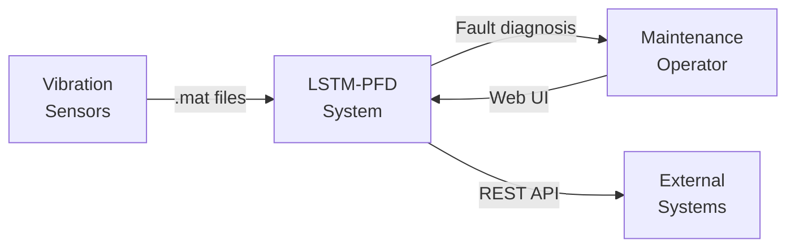
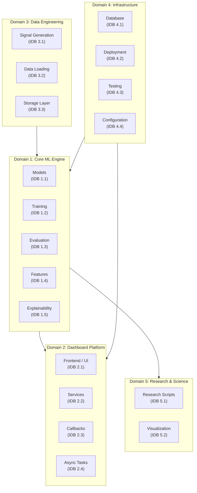
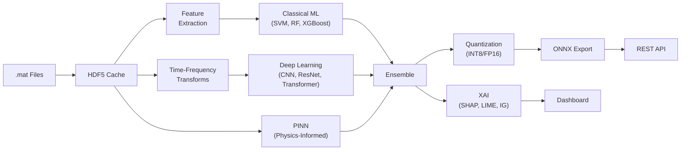

# Architecture Overview

> System architecture of the LSTM-PFD bearing fault diagnosis platform.

## System Context

LSTM-PFD ingests raw vibration signals (MATLAB `.mat` files), processes them through a multi-model ML/DL pipeline, and serves predictions via either a web dashboard or a REST API.

## Five-Domain Architecture

The project is organized into five independent development domains:

## Data Flow

## Technology Stack

| Layer                 | Technologies                              |
| --------------------- | ----------------------------------------- |
| **ML/DL Framework**   | PyTorch 2.0+, scikit-learn, XGBoost       |
| **Signal Processing** | SciPy, PyWavelets                         |
| **XAI**               | SHAP, LIME, Captum (Integrated Gradients) |
| **Dashboard**         | Dash/Plotly, Flask                        |
| **Database**          | PostgreSQL, SQLAlchemy                    |
| **Task Queue**        | Celery, Redis                             |
| **Data Storage**      | HDF5 (h5py), MATLAB (.mat)                |
| **Deployment**        | Docker, Kubernetes, ONNX Runtime          |
| **Testing**           | pytest, coverage                          |
| **Optimization**      | Optuna (HPO)                              |
| **Visualization**     | Matplotlib, Seaborn, Plotly, TensorBoard  |

## Key Design Decisions

### 1. Monorepo with `packages/` Layout

All Python modules live under `packages/core/` and `packages/dashboard/` to enforce clear domain boundaries while sharing a single virtual environment and test suite.

### 2. HDF5 Caching Layer

Raw MATLAB `.mat` files are converted to HDF5 once, then reused. This avoids repeated deserialization and enables efficient random access for large datasets.

### 3. Model Factory Pattern

All model architectures implement a common interface and are instantiated through a factory pattern (`packages/core/models/`), enabling uniform training, evaluation, and ensemble composition.

### 4. Physics-Informed Constraints

PINN models incorporate bearing dynamics equations (energy conservation, momentum conservation) as additional loss terms, regularizing the network with domain knowledge.

### 5. Independent Development Blocks (IDB)

The project uses an IDB decomposition (18 blocks across 5 domains + integration layer) to enable parallel development and isolated documentation ownership.

## Related Documentation

- [Project README](../README.md)
- [IDB Decomposition Reference](INDEPENDENT_DEVELOPMENT_BLOCKS.md)
- [Documentation Hub](index.md)
