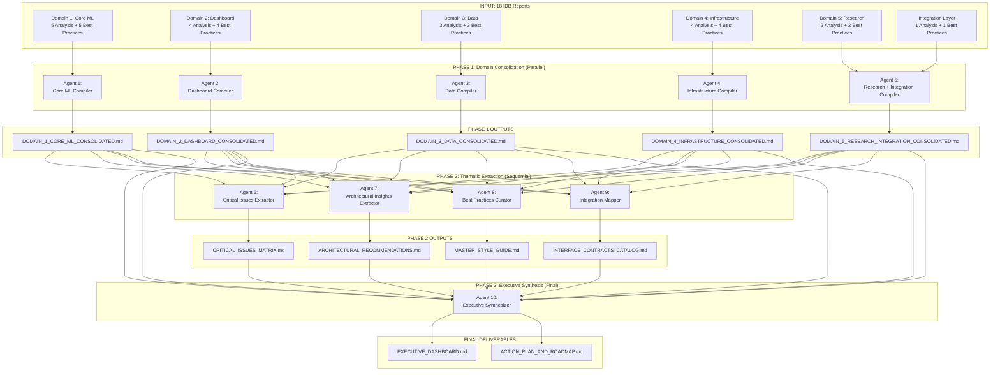

# IDB Compilation Strategy — Hierarchical Bottom-Up Synthesis

**Purpose:** Systematically compile 18 IDB reports (36 documents) into actionable, organized deliverables without information loss.

**Strategy:** 3-Phase Hierarchical Bottom-Up Compilation  
**Total Agents Required:** 10 agents (5 parallel + 4 sequential + 1 final)  
**Last Updated:** January 24, 2026

---

## 🎯 Design Philosophy

### Why Hierarchical Bottom-Up?

1. **Preserves Detail**: Domain experts consolidate first, preventing loss of technical nuance
2. **Enables Parallelization**: Phase 1 agents can work simultaneously
3. **Facilitates Cross-Cutting Analysis**: Phase 2 extracts themes across domains
4. **Produces Actionable Outputs**: Each phase has clear, usable deliverables
5. **Prevents Information Overload**: Progressive synthesis vs. one massive document

---

## 📊 Compilation Architecture



---

## 🔄 Phase 1: Domain Consolidation

**Objective:** Combine IDB reports within each domain while preserving all technical detail.

**Execution:** 5 agents working in **parallel** (can be run simultaneously)

### Agents & Scope

| Agent ID    | Domain                    | Input Files                 | Output File                                     |
| ----------- | ------------------------- | --------------------------- | ----------------------------------------------- |
| **Agent 1** | Core ML Engine 🧠         | IDB 1.1 - 1.5 (10 files)    | `DOMAIN_1_CORE_ML_CONSOLIDATED.md`              |
| **Agent 2** | Dashboard Platform 📊     | IDB 2.1 - 2.4 (8 files)     | `DOMAIN_2_DASHBOARD_CONSOLIDATED.md`            |
| **Agent 3** | Data Engineering 💾       | IDB 3.1 - 3.3 (6 files)     | `DOMAIN_3_DATA_CONSOLIDATED.md`                 |
| **Agent 4** | Infrastructure 🛠️         | IDB 4.1 - 4.4 (8 files)     | `DOMAIN_4_INFRASTRUCTURE_CONSOLIDATED.md`       |
| **Agent 5** | Research & Integration 🔬 | IDB 5.1, 5.2, 6.0 (6 files) | `DOMAIN_5_RESEARCH_INTEGRATION_CONSOLIDATED.md` |

### Domain Consolidated Document Structure

Each domain consolidation follows this format:

```markdown
# Domain X: {Name} — Consolidated Analysis

## 1. Domain Overview

- Purpose and responsibilities
- Sub-blocks covered
- Overall independence score
- Key interfaces

## 2. Current State Summary

- What's implemented
- What's working well
- What's problematic

## 3. Critical Issues Inventory (P0/P1/P2)

### P0 Issues (Critical)

- [Table with: IDB, Issue, Impact, Estimated Effort]

### P1 Issues (High)

- [Table format]

### P2 Issues (Medium)

- [Table format]

## 4. Technical Debt Registry

- Quick wins (< 1 hour)
- Medium tasks (1-4 hours)
- Large refactors (1+ days)

## 5. "If We Could Rewrite" Insights

- Common themes across sub-blocks
- Fundamental architectural changes recommended
- Patterns to preserve vs. eliminate

## 6. Best Practices Observed

### Code Conventions

- Naming, imports, docstrings, type hints

### Patterns Worth Preserving

- Design patterns that work well

### Testing Patterns

- How tests are structured

### Interface Contracts

- Critical APIs that must be preserved

## 7. Cross-Domain Dependencies

- What this domain depends on
- What depends on this domain
- Integration risks

## 8. Recommendations for This Domain

- Top 3 quick wins
- Top 3 strategic improvements
- Team coordination requirements
```

---

## 🎨 Phase 2: Thematic Extraction

**Objective:** Extract cross-cutting themes from all 5 domain consolidations.

**Execution:** 4 agents working **sequentially** (each needs all 5 domain reports)

### Agent 6: Critical Issues Extractor

**Input:** All 5 domain consolidated reports  
**Output:** `CRITICAL_ISSUES_MATRIX.md`

**Mission:** Create a unified, prioritized view of all critical issues across the entire codebase.

**Output Structure:**

```markdown
# Critical Issues Matrix — Project-Wide

## Executive Summary

- Total P0/P1/P2 counts
- Issues by domain
- Estimated total remediation effort

## Priority Matrix

| Priority | Domain | IDB | Issue | Impact | Effort | Dependencies |
| -------- | ------ | --- | ----- | ------ | ------ | ------------ |

## P0 Issues (Show Stoppers)

[Detailed breakdown with remediation steps]

## P1 Issues (High Priority)

[Categorized by type: Architecture, Code Quality, Testing, etc.]

## P2 Issues (Medium Priority)

[Categorized]

## Issue Clustering

- Security issues
- Performance issues
- Maintainability issues
- Testing gaps
- Documentation gaps

## Dependency Graph

[Which issues block which other issues]

## Recommended Remediation Order

[Based on dependencies and impact]
```

---

### Agent 7: Architectural Insights Extractor

**Input:** All 5 domain consolidated reports  
**Output:** `ARCHITECTURAL_RECOMMENDATIONS.md`

**Mission:** Synthesize all "If We Could Rewrite" insights into strategic architectural guidance.

**Output Structure:**

```markdown
# Architectural Recommendations — Strategic Insights

## Executive Summary

- Top 5 architectural changes recommended
- Patterns to preserve
- Patterns to eliminate

## Cross-Cutting Architectural Themes

### Theme 1: [e.g., Excessive Coupling]

- Evidence from multiple domains
- Root causes
- Recommended solution

### Theme 2: [e.g., Inconsistent Abstractions]

[...]

## Domain-Specific Deep Dives

### Core ML Engine

- Current architecture assessment
- Recommended changes
- Migration path

### Dashboard Platform

[...]

## Interface Redesign Recommendations

- Which APIs should be refactored
- Backward compatibility considerations
- Migration strategies

## Technology Stack Recommendations

- Libraries to add/remove
- Framework upgrades
- Tool improvements

## Greenfield Guidance

"If starting from scratch, we would..."

- Architecture patterns
- Technology choices
- File organization
```

---

### Agent 8: Best Practices Curator

**Input:** All 5 domain consolidated reports  
**Output:** `MASTER_STYLE_GUIDE.md`

**Mission:** Create a unified style guide capturing all best practices observed.

**Output Structure:**

```markdown
# Master Style Guide — LSTM_PFD Project

## Purpose

This guide documents observed best practices across all domains for consistency and onboarding.

## 1. Python Code Conventions

### Naming Conventions

- Classes: [Pattern and examples from codebase]
- Functions: [Pattern]
- Variables: [Pattern]
- Constants: [Pattern]
- Files: [Pattern]

### Import Organization

[Standard ordering observed]

### Type Hints

[When and how they're used]

### Docstrings

[Format: Google/NumPy/reStructuredText?]

## 2. Architecture Patterns

### Model Patterns

- [BaseModel pattern, factory pattern, etc.]

### Service Patterns

- [How services are structured]

### Callback Patterns

- [Dash callback conventions]

## 3. Testing Standards

### Test Organization

- [File naming, directory structure]

### Fixture Patterns

- [Scope, naming]

### Mock Patterns

- [When and how to mock]

### Coverage Requirements

- [Per domain/module]

## 4. Interface Contract Standards

### API Design

- [How to design cross-domain APIs]

### Configuration Patterns

- [How configs should be structured]

### Error Handling

- [Exception patterns]

## 5. Documentation Standards

### Code Comments

- [When to comment, how]

### Module Docstrings

- [What to include]

### README Requirements

- [What each module needs]

## 6. Domain-Specific Conventions

### Core ML

[Special conventions for ML code]

### Dashboard

[Dash-specific conventions]

### Data Engineering

[Data pipeline conventions]

## 7. Anti-Patterns to Avoid

[Common mistakes found in analysis]

## 8. Onboarding Checklist

"Before contributing to this codebase, ensure you understand..."
```

---

### Agent 9: Integration Mapper

**Input:** All 5 domain consolidated reports  
**Output:** `INTERFACE_CONTRACTS_CATALOG.md`

**Mission:** Document all cross-domain interfaces and integration points.

**Output Structure:**

```markdown
# Interface Contracts Catalog — Cross-Domain APIs

## Purpose

Comprehensive documentation of all interfaces where domains interact.

## 1. Interface Inventory

| From Domain | To Domain | Interface Name | Contract Type | Stability |
| ----------- | --------- | -------------- | ------------- | --------- |

## 2. Core ML ↔ Dashboard Interfaces

### Interface: Model Factory

- **API:** `create_model(name, config) → BaseModel`
- **Location:** `packages/core/models/model_factory.py`
- **Contract:**
  - Input: model name (str), config (dict)
  - Output: PyTorch nn.Module
  - Exceptions: ModelNotFoundError, InvalidConfigError
- **Consumers:** Dashboard Experiment Service
- **Stability:** STABLE (do not break!)
- **Testing:** [How to test this interface]

### Interface: Training API

[...]

## 3. Data ↔ Core ML Interfaces

### Interface: PyTorch DataLoader

[...]

## 4. Services ↔ Callbacks Interfaces

[High coupling area - document carefully]

## 5. Services ↔ Celery Tasks Interfaces

[...]

## 6. Database ↔ Services Interfaces

### ORM Models Used

[Which services use which models]

## 7. Integration Risk Assessment

### High-Risk Interfaces (Many Dependencies)

[List with remediation suggestions]

### Stable Interfaces (Safe to Depend On)

[List]

### Deprecated Interfaces

[Planned for removal]

## 8. Versioning Strategy

[How to version interfaces going forward]

## 9. Breaking Change Protocol

"If you need to change an interface, follow this process..."
```

---

## 🎯 Phase 3: Executive Synthesis

**Objective:** Create executive-level summary and action plan.

**Execution:** 1 agent working with ALL previous outputs

### Agent 10: Executive Synthesizer

**Input:**

- 5 domain consolidated reports
- 4 thematic extraction reports

**Output:**

- `EXECUTIVE_DASHBOARD.md`
- `ACTION_PLAN_AND_ROADMAP.md`

### EXECUTIVE_DASHBOARD.md Structure

```markdown
# Executive Dashboard — LSTM_PFD Codebase Health Report

## 📈 Project Health Scorecard

| Metric                  | Score          | Status   |
| ----------------------- | -------------- | -------- |
| Overall Code Quality    | [X/10]         | 🟢/🟡/🔴 |
| Test Coverage           | [%]            | 🟢/🟡/🔴 |
| Documentation Quality   | [X/10]         | 🟢/🟡/🔴 |
| Architectural Integrity | [X/10]         | 🟢/🟡/🔴 |
| Technical Debt Level    | [Low/Med/High] | 🟢/🟡/🔴 |

## 🎯 Key Findings

### Top 3 Strengths

1. [e.g., Highly modular ML core]
2. [e.g., Comprehensive XAI implementation]
3. [e.g., Strong testing infrastructure]

### Top 3 Concerns

1. [e.g., Dashboard callbacks have 4/10 coupling]
2. [e.g., settings.py is 42KB monolith]
3. [e.g., Missing integration tests]

## 📊 Domain Health Matrix

| Domain         | Files | Independence | Critical Issues | Tech Debt | Grade |
| -------------- | ----- | ------------ | --------------- | --------- | ----- |
| Core ML        | 120   | 8.2/10       | 12 (3 P0)       | Medium    | B+    |
| Dashboard      | 88    | 5.0/10       | 18 (5 P0)       | High      | C+    |
| Data           | 25    | 8.7/10       | 8 (1 P0)        | Low       | A-    |
| Infrastructure | 53    | 8.0/10       | 10 (2 P0)       | Medium    | B     |
| Research       | 21    | 9.0/10       | 5 (0 P0)        | Low       | A     |

## 🚨 Critical Issues Summary

- **Total P0 Issues:** [X] (must fix before production)
- **Total P1 Issues:** [X] (should fix soon)
- **Total P2 Issues:** [X] (backlog)
- **Estimated Remediation:** [X days]

## 🏗️ Architectural Assessment

### Current State

[2-3 sentences on overall architecture]

### If Starting Fresh

[Key changes that would be made]

### Recommended Evolution Path

[How to get from current to ideal state]

## 📚 Best Practices Status

### Strengths

- [What's being done well]

### Gaps

- [What's inconsistent or missing]

### Consistency Score

- [X/10] across domains

## 🔗 Integration Health

- **Total Interface Contracts:** [X]
- **High-Risk Interfaces:** [X]
- **Coupling Hotspots:** [List of high-coupling areas]

## 💡 Strategic Recommendations

1. **Immediate Actions** (This Sprint)
   - [P0 fixes]
2. **Short-Term** (Next Quarter)
   - [P1 fixes + quick wins]
3. **Long-Term** (Next Year)
   - [Architectural improvements]

## 📋 Next Steps

[Specific actionable next steps]
```

### ACTION_PLAN_AND_ROADMAP.md Structure

```markdown
# Action Plan and Roadmap — Codebase Remediation

## 🎯 Remediation Goals

1. Eliminate all P0 issues
2. Reduce coupling in Dashboard layer
3. Unify code conventions across domains
4. Achieve 85%+ test coverage
5. Complete documentation

## 📅 Phased Remediation Plan

### Phase 0: Immediate Fixes (Week 1-2)

**Goal:** Address show-stoppers

| Task             | Domain    | Priority | Effort | Owner | Status |
| ---------------- | --------- | -------- | ------ | ----- | ------ |
| Fix [P0 Issue 1] | Dashboard | P0       | 4h     | TBD   | ⬜     |
| Fix [P0 Issue 2] | Core ML   | P0       | 8h     | TBD   | ⬜     |

**Total Effort:** [X days]

### Phase 1: Foundation Stabilization (Week 3-6)

**Goal:** Fix P1 issues, reduce tech debt

[Task breakdown]

### Phase 2: Architecture Evolution (Month 2-3)

**Goal:** Address structural issues

[Task breakdown]

### Phase 3: Excellence & Polish (Month 4)

**Goal:** Achieve production-ready state

[Task breakdown]

## 🔄 Dependency-Ordered Task List

[Tasks ordered by dependencies so parallel work is possible]

## 👥 Team Allocation

### ML Core Team

- [Tasks assigned to this team]

### Dashboard Team

- [Tasks assigned to this team]

### Data Team

- [Tasks assigned to this team]

### Infrastructure Team

- [Tasks assigned to this team]

## 📊 Progress Tracking

### Metrics to Monitor

- P0/P1/P2 issue counts
- Test coverage
- Documentation coverage
- Code quality scores

### Weekly Check-ins

[What to review each week]

## 🎓 Knowledge Transfer Plan

### Onboarding New Developers

1. Read EXECUTIVE_DASHBOARD.md
2. Read MASTER_STYLE_GUIDE.md
3. Read domain-specific consolidated reports
4. Review INTERFACE_CONTRACTS_CATALOG.md

### Domain Handoff

[How to transition ownership]

## 📖 Living Document Status

This plan should be updated:

- Weekly during Phase 0-1
- Bi-weekly during Phase 2-3
- Monthly for maintenance
```

---

## 📁 Final Deliverables Summary

### Phase 1 Outputs (5 Documents)

1. `DOMAIN_1_CORE_ML_CONSOLIDATED.md`
2. `DOMAIN_2_DASHBOARD_CONSOLIDATED.md`
3. `DOMAIN_3_DATA_CONSOLIDATED.md`
4. `DOMAIN_4_INFRASTRUCTURE_CONSOLIDATED.md`
5. `DOMAIN_5_RESEARCH_INTEGRATION_CONSOLIDATED.md`

### Phase 2 Outputs (4 Documents)

6. `CRITICAL_ISSUES_MATRIX.md`
7. `ARCHITECTURAL_RECOMMENDATIONS.md`
8. `MASTER_STYLE_GUIDE.md`
9. `INTERFACE_CONTRACTS_CATALOG.md`

### Phase 3 Outputs (2 Documents)

10. `EXECUTIVE_DASHBOARD.md`
11. `ACTION_PLAN_AND_ROADMAP.md`

### Total: 11 Strategic Documents

---

## 🎯 Success Criteria

The compilation is successful if:

✅ **No Information Lost**: All findings from 36 input documents are preserved  
✅ **Actionable**: Every deliverable can drive concrete decisions  
✅ **Navigable**: Information is organized by multiple axes (domain, theme, priority)  
✅ **Concise**: Each document is focused and readable (not overwhelming)  
✅ **Reusable**: Documents serve as living references for development

---

## 📊 Comparison: Old vs. New Strategy

| Aspect                    | Old Strategy | New Strategy                 |
| ------------------------- | ------------ | ---------------------------- |
| **Agents**                | 1 mega-agent | 10 specialized agents        |
| **Parallelization**       | None         | Phase 1 fully parallel       |
| **Information Loss Risk** | High         | Low (hierarchical synthesis) |
| **Deliverable Count**     | 4 documents  | 11 documents                 |
| **Deliverable Focus**     | Generic      | Domain + Thematic views      |
| **Actionability**         | Low          | High (priority-ordered)      |
| **Onboarding Value**      | Low          | High (MASTER_STYLE_GUIDE)    |
| **Executive Summary**     | Missing      | Comprehensive dashboard      |

---

**Document Status:** ✅ Strategy Complete — Ready for Prompt Generation  
**Next Step:** Generate detailed prompts for all 10 agents
