# Independent Development Blocks (IDB) — Architectural Decomposition

**Role:** Senior Technical Architect Analysis  
**Last Updated:** January 18, 2026

---

## Executive Summary

This document proposes a logical decomposition of the **LSTM_PFD** codebase into **Independent Development Blocks (IDBs)**. The goal is to create a structure where separate teams can own specific domains with minimal friction and clear boundaries.

The project naturally decomposes into **5 Top-Level Domains** with **18 Sub-Blocks**:

```mermaid
graph TD
    ROOT[LSTM-PFD Ecosystem] --> CORE[🧠 Core ML Engine]
    ROOT --> DASH[📊 Dashboard Platform]
    ROOT --> DATA[💾 Data Engineering]
    ROOT --> INFRA[🛠️ Infrastructure]
    ROOT --> RESEARCH[🔬 Research & Science]

    CORE --> CORE_MODELS[Models]
    CORE --> CORE_TRAINING[Training]
    CORE --> CORE_EVAL[Evaluation]
    CORE --> CORE_FEATURES[Features]
    CORE --> CORE_XAI[Explainability]

    DASH --> DASH_UI[Frontend/UI]
    DASH --> DASH_BACKEND[Backend Services]
    DASH --> DASH_TASKS[Async Tasks]

    DATA --> DATA_GEN[Signal Generation]
    DATA --> DATA_LOAD[Data Loading]
    DATA --> DATA_STORE[Storage Layer]

    INFRA --> INFRA_DB[Database]
    INFRA --> INFRA_DEPLOY[Deployment]
    INFRA --> INFRA_TEST[Testing]
    INFRA --> INFRA_CONFIG[Configuration]

    RESEARCH --> RES_SCRIPTS[Research Scripts]
    RESEARCH --> RES_VIZ[Visualization]
```



---

## Domain 1: Core ML Engine 🧠

> **Team Ownership:** ML Engineers / Research Scientists  
> **Primary Concern:** Model architectures, training loops, and evaluation metrics

### 1.1 Models Sub-Block

| Attribute                 | Detail                                                                                                                                                                                                                                                               |
| ------------------------- | -------------------------------------------------------------------------------------------------------------------------------------------------------------------------------------------------------------------------------------------------------------------- |
| **Scope**                 | All neural network architectures for bearing fault diagnosis: CNN-1D, ResNet-1D, Transformers (ViT-1D, PatchTST, TSMixer), Physics-Informed Neural Networks (PINN), Ensembles (Voting, Stacking, Boosting, Mixture of Experts), and Multi-Modal Fusion (Early/Late). |
| **Primary Files**         | `packages/core/models/` (61 children: 13 subdirectories + 7 top-level files)                                                                                                                                                                                         |
| **Key Interfaces**        | <ul><li>`BaseModel` abstract class — all models inherit from this</li><li>`model_factory.py` — `create_model()`, `create_model_from_config()`, `register_model()`</li><li>Standard PyTorch module interface (`forward()`, `state_dict()`)</li></ul>                  |
| **Inbound Dependencies**  | `config/model_config.py`, `packages/core/features/` (for input dimensions)                                                                                                                                                                                           |
| **Outbound Dependencies** | None (pure PyTorch models, stateless)                                                                                                                                                                                                                                |
| **Definition of Done**    | Model can be instantiated via `create_model()`, passes forward pass test, exports to ONNX, and has corresponding unit test in `tests/models/`.                                                                                                                       |
| **Independence Score**    | **9/10** — Highly isolated; models are stateless PyTorch modules. Can be developed/refactored independently as long as the `BaseModel` interface is preserved.                                                                                                       |

#### Sub-Blocks within Models:

| Sub-Block             | Files                                          | Independence                                           |
| --------------------- | ---------------------------------------------- | ------------------------------------------------------ |
| `models/classical/`   | SVM, Random Forest, Gradient Boosting wrappers | 10/10 — sklearn-based, no PyTorch deps                 |
| `models/cnn/`         | Advanced CNN variants                          | 9/10                                                   |
| `models/transformer/` | ViT-1D, PatchTST, TSMixer                      | 9/10                                                   |
| `models/pinn/`        | Physics-Informed Neural Networks               | 8/10 — Depends on `training/physics_loss_functions.py` |
| `models/ensemble/`    | Voting, Stacking, Boosting, MoE                | 8/10 — Requires base models                            |
| `models/fusion/`      | Early and Late Fusion architectures            | 8/10 — Orchestrates multiple sub-models                |

---

### 1.2 Training Sub-Block

| Attribute                 | Detail                                                                                                                                                                                                                                                                                                                          |
| ------------------------- | ------------------------------------------------------------------------------------------------------------------------------------------------------------------------------------------------------------------------------------------------------------------------------------------------------------------------------- |
| **Scope**                 | Training loops, optimizers, schedulers, loss functions, callbacks, hyperparameter optimization (Grid Search, Random Search, Bayesian), and advanced techniques (Mixed Precision, Progressive Resizing, Knowledge Distillation).                                                                                                 |
| **Primary Files**         | `packages/core/training/` (23 children)                                                                                                                                                                                                                                                                                         |
| **Key Interfaces**        | <ul><li>`trainer.py` — Standard training interface</li><li>`cnn_trainer.py`, `pinn_trainer.py`, `spectrogram_trainer.py` — Specialized trainers</li><li>`cnn_callbacks.py` — Callback system (EarlyStopping, ModelCheckpoint, etc.)</li><li>Loss functions: `losses.py`, `cnn_losses.py`, `physics_loss_functions.py`</li></ul> |
| **Inbound Dependencies**  | `packages/core/models/`, `data/` (DataLoaders), `config/training_config.py`                                                                                                                                                                                                                                                     |
| **Outbound Dependencies** | Checkpoints → `checkpoints/`, Metrics → `packages/core/evaluation/`                                                                                                                                                                                                                                                             |
| **Definition of Done**    | Trainer can complete 1 epoch on synthetic data, saves checkpoint, logs metrics, and passes integration test.                                                                                                                                                                                                                    |
| **Independence Score**    | **7/10** — Moderate coupling; depends on models and data loaders. Can be developed independently if mock dataloaders/models are used.                                                                                                                                                                                           |

---

### 1.3 Evaluation Sub-Block

| Attribute                 | Detail                                                                                                                                                                                                                                            |
| ------------------------- | ------------------------------------------------------------------------------------------------------------------------------------------------------------------------------------------------------------------------------------------------- |
| **Scope**                 | Model evaluation, benchmarking, confusion analysis, ROC curves, error analysis, ensemble voting, architecture comparison, attention visualization, and physics interpretability.                                                                  |
| **Primary Files**         | `packages/core/evaluation/` (16 children)                                                                                                                                                                                                         |
| **Key Interfaces**        | <ul><li>`evaluator.py` — Base evaluation interface</li><li>`cnn_evaluator.py`, `ensemble_evaluator.py`, `pinn_evaluator.py` — Specialized evaluators</li><li>Visualization: `attention_visualization.py`, `physics_interpretability.py`</li></ul> |
| **Inbound Dependencies**  | Trained models, Test data loaders                                                                                                                                                                                                                 |
| **Outbound Dependencies** | Results → `results/`, Visualizations → `visualization/`                                                                                                                                                                                           |
| **Definition of Done**    | Evaluator produces accuracy, precision, recall, F1, confusion matrix, and saves results to disk.                                                                                                                                                  |
| **Independence Score**    | **8/10** — Mostly reads model outputs; minimal write effects.                                                                                                                                                                                     |

---

### 1.4 Features Sub-Block

| Attribute                 | Detail                                                                                                                                                                                                                                                                                 |
| ------------------------- | -------------------------------------------------------------------------------------------------------------------------------------------------------------------------------------------------------------------------------------------------------------------------------------- |
| **Scope**                 | Feature extraction pipeline (time-domain, frequency-domain, wavelet), feature selection, importance analysis, normalization, and validation.                                                                                                                                           |
| **Primary Files**         | `packages/core/features/` (12 children)                                                                                                                                                                                                                                                |
| **Key Interfaces**        | <ul><li>`feature_extractor.py` — Main extraction pipeline</li><li>`feature_selector.py` — Feature selection algorithms</li><li>`feature_importance.py` — SHAP/Permutation importance</li><li>Domain-specific: `time_domain.py`, `frequency_domain.py`, `wavelet_features.py`</li></ul> |
| **Inbound Dependencies**  | Raw signals from `data/`                                                                                                                                                                                                                                                               |
| **Outbound Dependencies** | Feature vectors → Training pipelines                                                                                                                                                                                                                                                   |
| **Definition of Done**    | Extractor can process raw signal and output 52-feature vector; unit tests pass.                                                                                                                                                                                                        |
| **Independence Score**    | **9/10** — Pure transformation logic; no external state.                                                                                                                                                                                                                               |

---

### 1.5 Explainability (XAI) Sub-Block

| Attribute                 | Detail                                                                                                                                                                                                                                     |
| ------------------------- | ------------------------------------------------------------------------------------------------------------------------------------------------------------------------------------------------------------------------------------------ |
| **Scope**                 | Model interpretability: Integrated Gradients, SHAP, LIME, Uncertainty Quantification (MC Dropout), Concept Activation Vectors (CAV), Partial Dependence Plots, Anchors.                                                                    |
| **Primary Files**         | `packages/core/explainability/` (8 children)                                                                                                                                                                                               |
| **Key Interfaces**        | <ul><li>`SHAPExplainer` — SHAP-based explanations</li><li>`LIMEExplainer` — LIME-based explanations</li><li>`IntegratedGradientsExplainer` — Gradient-based attribution</li><li>`UncertaintyQuantifier` — MC Dropout uncertainty</li></ul> |
| **Inbound Dependencies**  | Trained models, Sample inputs                                                                                                                                                                                                              |
| **Outbound Dependencies** | Cached explanations → `packages/dashboard/services/explanation_cache.py`                                                                                                                                                                   |
| **Definition of Done**    | Explainer produces attribution map for given input; visualization functions work.                                                                                                                                                          |
| **Independence Score**    | **8/10** — Depends only on trained models; can be tested with mock models.                                                                                                                                                                 |

---

## Domain 2: Dashboard Platform 📊

> **Team Ownership:** Frontend/Full-Stack Engineers  
> **Primary Concern:** User interface, API endpoints, and async task orchestration

### 2.1 Frontend/UI Sub-Block

| Attribute                 | Detail                                                                                                                                                                                                           |
| ------------------------- | ---------------------------------------------------------------------------------------------------------------------------------------------------------------------------------------------------------------- |
| **Scope**                 | Dash layouts, components, assets (CSS/JS), page routing, and user-facing visualizations.                                                                                                                         |
| **Primary Files**         | `packages/dashboard/layouts/` (24 children), `packages/dashboard/components/` (6 children), `packages/dashboard/assets/`                                                                                         |
| **Key Interfaces**        | <ul><li>Layout functions: `home.py`, `experiments.py`, `data_explorer.py`, `signal_viewer.py`, etc.</li><li>Reusable components: skeleton loaders, cards, modals</li><li>Routing: `app.py` URL routing</li></ul> |
| **Inbound Dependencies**  | Services (data retrieval), Callbacks (interactivity)                                                                                                                                                             |
| **Outbound Dependencies** | None (renders to browser)                                                                                                                                                                                        |
| **Definition of Done**    | Page renders without errors; all interactive elements have corresponding callbacks; passes sanity test.                                                                                                          |
| **Independence Score**    | **6/10** — Tightly coupled to callbacks and services for data. Can prototype layouts independently with mock data.                                                                                               |

#### Pages within UI:

| Page           | File                                                                      | Complexity       |
| -------------- | ------------------------------------------------------------------------- | ---------------- |
| Home Dashboard | `layouts/home.py`                                                         | Low              |
| Experiments    | `layouts/experiments.py`, `experiment_wizard.py`, `experiment_results.py` | High             |
| Data Explorer  | `layouts/data_explorer.py`                                                | Medium           |
| Signal Viewer  | `layouts/signal_viewer.py`                                                | Medium           |
| XAI Dashboard  | `layouts/xai_dashboard.py`                                                | High             |
| System Health  | `layouts/system_health.py`                                                | Medium           |
| Settings       | `layouts/settings.py`                                                     | Very High (42KB) |
| Deployment     | `layouts/deployment.py`                                                   | Medium           |
| NAS/HPO        | `layouts/nas_dashboard.py`, `hpo_campaigns.py`                            | High             |

---

### 2.2 Backend Services Sub-Block

| Attribute                 | Detail                                                                                                                                                                                                                                                                                                                                                                                 |
| ------------------------- | -------------------------------------------------------------------------------------------------------------------------------------------------------------------------------------------------------------------------------------------------------------------------------------------------------------------------------------------------------------------------------------- |
| **Scope**                 | Business logic layer: data retrieval, experiment management, authentication, notifications, caching, search, and integration with ML core.                                                                                                                                                                                                                                             |
| **Primary Files**         | `packages/dashboard/services/` (24 services + notification providers)                                                                                                                                                                                                                                                                                                                  |
| **Key Interfaces**        | <ul><li>`DataService` — Dataset metadata and signal extraction</li><li>`ExperimentService` — Experiment lifecycle</li><li>`AuthenticationService` — User auth and session management</li><li>`NotificationService` — Multi-channel notifications</li><li>`XAIService` — Explainability orchestration</li><li>`HPOService`, `NASService` — Hyperparameter/Architecture search</li></ul> |
| **Inbound Dependencies**  | Database models, Core ML packages, Configuration                                                                                                                                                                                                                                                                                                                                       |
| **Outbound Dependencies** | Celery tasks, External APIs (email, webhooks)                                                                                                                                                                                                                                                                                                                                          |
| **Definition of Done**    | Service methods have docstrings, handle exceptions gracefully, and have unit tests.                                                                                                                                                                                                                                                                                                    |
| **Independence Score**    | **5/10** — Central orchestration layer; touches many components. Requires careful interface contracts.                                                                                                                                                                                                                                                                                 |

#### Key Services:

| Service                     | Responsibility                    | Coupling          |
| --------------------------- | --------------------------------- | ----------------- |
| `data_service.py`           | Dataset metadata, HDF5 extraction | High (DB + files) |
| `authentication_service.py` | Login, JWT, sessions              | Medium            |
| `notification_service.py`   | Email, Slack, Webhooks            | Low (external)    |
| `xai_service.py`            | XAI task orchestration            | Medium            |
| `deployment_service.py`     | Model deployment                  | High              |

---

### 2.3 Callbacks Sub-Block

| Attribute                 | Detail                                                                                                                     |
| ------------------------- | -------------------------------------------------------------------------------------------------------------------------- |
| **Scope**                 | Dash callback functions that wire UI interactivity to backend services.                                                    |
| **Primary Files**         | `packages/dashboard/callbacks/` (29 callback modules)                                                                      |
| **Key Interfaces**        | <ul><li>Standard Dash `@callback` decorators</li><li>Pattern: Callback → Service call → Return component updates</li></ul> |
| **Inbound Dependencies**  | Layout component IDs, Services                                                                                             |
| **Outbound Dependencies** | UI component updates                                                                                                       |
| **Definition of Done**    | Callback handles Input/Output correctly; doesn't cause circular dependencies; has integration test.                        |
| **Independence Score**    | **4/10** — Highest coupling; callbacks are the glue between UI and services. Must be developed in coordination with both.  |

---

### 2.4 Async Tasks Sub-Block

| Attribute                 | Detail                                                                                                                       |
| ------------------------- | ---------------------------------------------------------------------------------------------------------------------------- |
| **Scope**                 | Celery tasks for long-running operations: training, HPO, NAS, data generation, XAI, deployment, and testing.                 |
| **Primary Files**         | `packages/dashboard/tasks/` (11 task modules)                                                                                |
| **Key Interfaces**        | <ul><li>Celery task decorators (`@celery.task`)</li><li>Task state updates via Redis</li><li>Task result retrieval</li></ul> |
| **Inbound Dependencies**  | Core ML packages, Services, Database                                                                                         |
| **Outbound Dependencies** | Task results → Database, Notifications                                                                                       |
| **Definition of Done**    | Task can be submitted, runs to completion, updates state correctly, and handles errors.                                      |
| **Independence Score**    | **6/10** — Can be tested in isolation with mock dependencies.                                                                |

---

## Domain 3: Data Engineering 💾

> **Team Ownership:** Data Engineers / ML Ops  
> **Primary Concern:** Data generation, loading, transformation, and storage

### 3.1 Signal Generation Sub-Block

| Attribute                 | Detail                                                                                                                                                                                                 |
| ------------------------- | ------------------------------------------------------------------------------------------------------------------------------------------------------------------------------------------------------ |
| **Scope**                 | Physics-based bearing signal simulation (Sommerfeld-scaled), fault injection, noise addition, and synthetic dataset creation.                                                                          |
| **Primary Files**         | `data/signal_generator.py` (37KB — largest data file), `data/signal_augmentation.py`, `data/spectrogram_generator.py`                                                                                  |
| **Key Interfaces**        | <ul><li>`SignalGenerator` — Main signal generation class</li><li>`SpectrogramGenerator` — Time-frequency representation</li><li>Physics parameters: Sommerfeld number, fault types, severity</li></ul> |
| **Inbound Dependencies**  | Physics configuration from MATLAB/config                                                                                                                                                               |
| **Outbound Dependencies** | Generated signals → HDF5/MAT files                                                                                                                                                                     |
| **Definition of Done**    | Generator produces signals matching physics specifications; output validates against known patterns.                                                                                                   |
| **Independence Score**    | **9/10** — Pure generation logic; no external dependencies.                                                                                                                                            |

---

### 3.2 Data Loading Sub-Block

| Attribute                 | Detail                                                                                                                                                                                                    |
| ------------------------- | --------------------------------------------------------------------------------------------------------------------------------------------------------------------------------------------------------- |
| **Scope**                 | PyTorch datasets and dataloaders for training: standard datasets, streaming HDF5, CNN-specific loaders, CWRU benchmark, contrastive learning, spectrogram datasets, and wavelet/Wigner-Ville transforms.  |
| **Primary Files**         | `data/dataset.py`, `data/dataloader.py`, `data/cnn_dataset.py`, `data/streaming_hdf5_dataset.py`, `data/cwru_dataset.py`, `data/tfr_dataset.py`                                                           |
| **Key Interfaces**        | <ul><li>PyTorch `Dataset` and `DataLoader` interfaces</li><li>Streaming: `StreamingHDF5Dataset` for memory-efficient loading</li><li>Transforms: `data/transforms.py`, `data/cnn_transforms.py`</li></ul> |
| **Inbound Dependencies**  | Raw data files (HDF5, MAT, CSV)                                                                                                                                                                           |
| **Outbound Dependencies** | Batched tensors → Training pipelines                                                                                                                                                                      |
| **Definition of Done**    | Dataset returns correct shapes; DataLoader iterates without errors; passes data validation tests.                                                                                                         |
| **Independence Score**    | **8/10** — Standard PyTorch interfaces; can be tested with synthetic data.                                                                                                                                |

---

### 3.3 Storage Layer Sub-Block

| Attribute                 | Detail                                                                                                                                             |
| ------------------------- | -------------------------------------------------------------------------------------------------------------------------------------------------- |
| **Scope**                 | File storage abstraction, HDF5 management, data caching, and MATLAB import utilities.                                                              |
| **Primary Files**         | `data/cache_manager.py`, `data/matlab_importer.py`, `data/data_validator.py`, `packages/storage/`                                                  |
| **Key Interfaces**        | <ul><li>`CacheManager` — LRU caching for data</li><li>`MatlabImporter` — MAT file import</li><li>`DataValidator` — Data integrity checks</li></ul> |
| **Inbound Dependencies**  | Raw files                                                                                                                                          |
| **Outbound Dependencies** | Validated data → Datasets                                                                                                                          |
| **Definition of Done**    | Cache hit ratio > 80% for repeated access; import handles all MATLAB versions; validation catches corruption.                                      |
| **Independence Score**    | **8/10** — Utility layer; minimal coupling.                                                                                                        |

---

## Domain 4: Infrastructure 🛠️

> **Team Ownership:** DevOps / Platform Engineers  
> **Primary Concern:** Database, deployment, testing, and configuration

### 4.1 Database Sub-Block

| Attribute                 | Detail                                                                                                                                   |
| ------------------------- | ---------------------------------------------------------------------------------------------------------------------------------------- |
| **Scope**                 | SQLAlchemy models, migrations, database connection management, and seed data.                                                            |
| **Primary Files**         | `packages/dashboard/database/` (14 children), `packages/dashboard/models/` (25 children)                                                 |
| **Key Interfaces**        | <ul><li>`connection.py` — Database session management</li><li>SQLAlchemy ORM models</li><li>Migrations: `database/migrations/`</li></ul> |
| **Inbound Dependencies**  | None (source of truth)                                                                                                                   |
| **Outbound Dependencies** | All services that persist state                                                                                                          |
| **Definition of Done**    | Migrations run without errors; models have proper relationships; connection pooling works.                                               |
| **Independence Score**    | **7/10** — Critical but well-isolated; schema changes require coordination.                                                              |

---

### 4.2 Deployment Sub-Block

| Attribute                 | Detail                                                                                                                                                                                                                            |
| ------------------------- | --------------------------------------------------------------------------------------------------------------------------------------------------------------------------------------------------------------------------------- |
| **Scope**                 | Docker, Kubernetes, model optimization (ONNX, quantization), and deployment manifests.                                                                                                                                            |
| **Primary Files**         | `packages/deployment/` (API + optimization), `deploy/`, `Dockerfile`, `docker-compose.yml`                                                                                                                                        |
| **Key Interfaces**        | <ul><li>Dockerfile for container builds</li><li>`docker-compose.yml` for local orchestration</li><li>`packages/deployment/optimization/` — ONNX export, quantization</li><li>`packages/deployment/api/` — Inference API</li></ul> |
| **Inbound Dependencies**  | Trained models, Configuration                                                                                                                                                                                                     |
| **Outbound Dependencies** | Container registry, Kubernetes cluster                                                                                                                                                                                            |
| **Definition of Done**    | Container builds; health check passes; model serves predictions; Kubernetes manifest validates.                                                                                                                                   |
| **Independence Score**    | **8/10** — Can be developed independently once model export format is agreed.                                                                                                                                                     |

---

### 4.3 Testing Sub-Block

| Attribute                 | Detail                                                                                                                               |
| ------------------------- | ------------------------------------------------------------------------------------------------------------------------------------ |
| **Scope**                 | Unit tests, integration tests, stress tests, load tests, and benchmark tests.                                                        |
| **Primary Files**         | `tests/` (27 children: 14 test files + 6 subdirectories)                                                                             |
| **Key Interfaces**        | <ul><li>pytest conventions</li><li>`conftest.py` — Shared fixtures</li><li>Specialized: `stress_tests.py`, `load_tests.py`</li></ul> |
| **Inbound Dependencies**  | All code under test                                                                                                                  |
| **Outbound Dependencies** | Coverage reports → `htmlcov/`, `coverage.xml`                                                                                        |
| **Definition of Done**    | All tests pass; coverage > 80% for core packages; no flaky tests.                                                                    |
| **Independence Score**    | **9/10** — Tests are consumers; isolated by nature.                                                                                  |

---

### 4.4 Configuration Sub-Block

| Attribute                 | Detail                                                                                                                                                   |
| ------------------------- | -------------------------------------------------------------------------------------------------------------------------------------------------------- |
| **Scope**                 | Centralized configuration for data, training, experiments, and models.                                                                                   |
| **Primary Files**         | `config/` (6 config files)                                                                                                                               |
| **Key Interfaces**        | <ul><li>`base_config.py` — Core configuration loader</li><li>`data_config.py`, `model_config.py`, `training_config.py`, `experiment_config.py`</li></ul> |
| **Inbound Dependencies**  | Environment variables, `.env` files                                                                                                                      |
| **Outbound Dependencies** | All packages that read configuration                                                                                                                     |
| **Definition of Done**    | Config validates at startup; invalid config raises helpful errors; all required values have defaults.                                                    |
| **Independence Score**    | **10/10** — Pure data; no logic dependencies.                                                                                                            |

---

## Domain 5: Research & Science 🔬

> **Team Ownership:** Research Scientists / PhD Students  
> **Primary Concern:** Experimentation, scientific validation, and publication-quality outputs

### 5.1 Research Scripts Sub-Block

| Attribute                 | Detail                                                                                                                                         |
| ------------------------- | ---------------------------------------------------------------------------------------------------------------------------------------------- |
| **Scope**                 | Standalone research experiments: ablation studies, contrastive physics pretraining, hyperparameter sensitivity, PINN comparisons, OOD testing. |
| **Primary Files**         | `scripts/research/` (8 scripts)                                                                                                                |
| **Key Interfaces**        | <ul><li>CLI scripts with argparse</li><li>Output: Results → `results/`, Figures → `visualizations/`</li></ul>                                  |
| **Inbound Dependencies**  | Core ML packages, Datasets                                                                                                                     |
| **Outbound Dependencies** | Figures and tables for publications                                                                                                            |
| **Definition of Done**    | Script runs end-to-end; produces reproducible results; outputs are publication-ready.                                                          |
| **Independence Score**    | **9/10** — Experimental code; minimal production dependencies.                                                                                 |

**Key Scripts:**

| Script                          | Purpose                         |
| ------------------------------- | ------------------------------- |
| `ablation_study.py`             | Systematic ablation experiments |
| `contrastive_physics.py`        | Self-supervised pretraining     |
| `hyperparameter_sensitivity.py` | HPO analysis                    |
| `pinn_comparison.py`            | PINN vs baseline comparison     |
| `ood_testing.py`                | Out-of-distribution evaluation  |

---

### 5.2 Visualization Sub-Block

| Attribute                 | Detail                                                                                                                 |
| ------------------------- | ---------------------------------------------------------------------------------------------------------------------- |
| **Scope**                 | Publication-quality visualizations: attention maps, latent space (t-SNE/UMAP), feature importance, physics embeddings. |
| **Primary Files**         | `visualization/` (13 children)                                                                                         |
| **Key Interfaces**        | <ul><li>Matplotlib/Plotly figure generators</li><li>Consistent style across outputs</li></ul>                          |
| **Inbound Dependencies**  | Model outputs, Evaluation results                                                                                      |
| **Outbound Dependencies** | PNG/PDF figures                                                                                                        |
| **Definition of Done**    | Figure meets publication standards (DPI, fonts, legends); reproducible generation.                                     |
| **Independence Score**    | **9/10** — Consumes data; no upstream effects.                                                                         |

---

## Integration Layer (Cross-Cutting Concerns)

| Component                          | Location  | Purpose                                      | Coupling                        |
| ---------------------------------- | --------- | -------------------------------------------- | ------------------------------- |
| `integration/`                     | Root      | Unified pipeline, model registry, validators | High — bridges core ↔ dashboard |
| `packages/dashboard/integrations/` | Dashboard | Celery ↔ Core ML bridge                      | High                            |
| `utils/`                           | Root      | Shared utilities                             | Low                             |

---

## Recommended Team Structure

Based on the decomposition above, the following team structure is recommended:

```
┌─────────────────────────────────────────────────────────────────┐
│                    LSTM-PFD Development Teams                   │
├─────────────────────────────────────────────────────────────────┤
│                                                                 │
│  ┌─────────────────────┐    ┌─────────────────────┐            │
│  │   🧠 ML Core Team    │    │   📊 Platform Team   │            │
│  │   (2-3 engineers)   │    │   (2-3 engineers)   │            │
│  ├─────────────────────┤    ├─────────────────────┤            │
│  │ • Models            │    │ • Frontend/UI       │            │
│  │ • Training          │    │ • Backend Services  │            │
│  │ • Evaluation        │    │ • Callbacks         │            │
│  │ • Features          │    │ • Async Tasks       │            │
│  │ • Explainability    │    │                     │            │
│  └─────────────────────┘    └─────────────────────┘            │
│                                                                 │
│  ┌─────────────────────┐    ┌─────────────────────┐            │
│  │   💾 Data Team       │    │   🛠️ Infra Team     │            │
│  │   (1-2 engineers)   │    │   (1 engineer)      │            │
│  ├─────────────────────┤    ├─────────────────────┤            │
│  │ • Signal Generation │    │ • Database          │            │
│  │ • Data Loading      │    │ • Deployment        │            │
│  │ • Storage Layer     │    │ • Testing           │            │
│  │                     │    │ • Configuration     │            │
│  └─────────────────────┘    └─────────────────────┘            │
│                                                                 │
│  ┌─────────────────────────────────────────────────┐            │
│  │              🔬 Research Team                    │            │
│  │              (1-2 scientists)                   │            │
│  ├─────────────────────────────────────────────────┤            │
│  │ • Research Scripts • Visualization             │            │
│  └─────────────────────────────────────────────────┘            │
└─────────────────────────────────────────────────────────────────┘
```

---

## Interface Contracts Summary

> [!IMPORTANT]
> These interface contracts are the critical boundaries that must be preserved during independent development.

### Cross-Domain Interfaces

| From         | To            | Interface       | Contract                                           |
| ------------ | ------------- | --------------- | -------------------------------------------------- |
| **Core ML**  | **Dashboard** | Model Factory   | `create_model(name, config) → BaseModel`           |
| **Core ML**  | **Dashboard** | Training API    | `Trainer.train(model, dataloader) → History`       |
| **Core ML**  | **Dashboard** | Evaluation API  | `Evaluator.evaluate(model, dataloader) → Metrics`  |
| **Data**     | **Core ML**   | DataLoader      | PyTorch `DataLoader` interface                     |
| **Config**   | **All**       | Configuration   | Pydantic/dataclass config objects                  |
| **Database** | **Services**  | ORM Models      | SQLAlchemy model classes                           |
| **Services** | **Callbacks** | Service Methods | Stateless methods returning JSON-serializable data |
| **Tasks**    | **Services**  | Celery Tasks    | `@celery.task` decorated functions                 |

---

## Independence Score Matrix

| Block                 | Score | Reason                                     |
| --------------------- | :---: | ------------------------------------------ |
| **Configuration**     | 10/10 | Pure data; no dependencies                 |
| **Models**            | 9/10  | Stateless PyTorch modules                  |
| **Features**          | 9/10  | Pure transformation logic                  |
| **Signal Generation** | 9/10  | Physics simulation; isolated               |
| **Testing**           | 9/10  | Consumer; read-only                        |
| **Research Scripts**  | 9/10  | Experimental; isolated                     |
| **Visualization**     | 9/10  | Output only; no upstream effects           |
| **Explainability**    | 8/10  | Depends on trained models only             |
| **Evaluation**        | 8/10  | Reads model outputs                        |
| **Data Loading**      | 8/10  | Standard PyTorch interfaces                |
| **Storage Layer**     | 8/10  | Utility layer                              |
| **Deployment**        | 8/10  | Containerization; isolated                 |
| **Database**          | 7/10  | Critical; schema changes need coordination |
| **Training**          | 7/10  | Moderate coupling to data/models           |
| **Frontend/UI**       | 6/10  | Coupled to callbacks and services          |
| **Async Tasks**       | 6/10  | Bridges dashboard ↔ core                   |
| **Backend Services**  | 5/10  | Central orchestration; high coupling       |
| **Callbacks**         | 4/10  | Highest coupling; glue layer               |

---

## Development Guidelines

### For each team:

1. **Before modifying an interface:** Communicate with dependent teams
2. **Add interface tests:** For all cross-domain boundaries
3. **Use dependency injection:** To enable testing in isolation
4. **Document breaking changes:** In CHANGELOG.md
5. **Version interfaces:** Use semantic versioning for major APIs

### Git Workflow Recommendation

```
main
 ├── develop
 │    ├── feature/core-*      (ML Core Team)
 │    ├── feature/dashboard-* (Platform Team)
 │    ├── feature/data-*      (Data Team)
 │    ├── feature/infra-*     (Infra Team)
 │    └── feature/research-*  (Research Team)
 └── release/*
```

---

## Appendix: File Count Summary

| Domain         | Sub-Block      | File Count | Total Size |
| -------------- | -------------- | :--------: | :--------: |
| Core ML        | Models         |     61     |   ~200KB   |
| Core ML        | Training       |     23     |   ~180KB   |
| Core ML        | Evaluation     |     16     |   ~130KB   |
| Core ML        | Features       |     12     |   ~70KB    |
| Core ML        | Explainability |     8      |   ~60KB    |
| Dashboard      | Layouts        |     24     |   ~300KB   |
| Dashboard      | Services       |     26     |   ~300KB   |
| Dashboard      | Callbacks      |     29     |   ~350KB   |
| Dashboard      | Tasks          |     11     |   ~85KB    |
| Data           | Generation     |     6      |   ~90KB    |
| Data           | Loading        |     16     |   ~200KB   |
| Infrastructure | Database       |     14     |   ~30KB    |
| Infrastructure | Deployment     |     ~8     |   ~50KB    |
| Infrastructure | Testing        |     27     |   ~130KB   |
| Infrastructure | Config         |     6      |   ~45KB    |
| Research       | Scripts        |     8      |   ~60KB    |
| Research       | Visualization  |     13     |   ~100KB   |

---

**Document prepared for architectural review.**  
_Recommended next step: Present to stakeholders and incorporate feedback before implementation._
