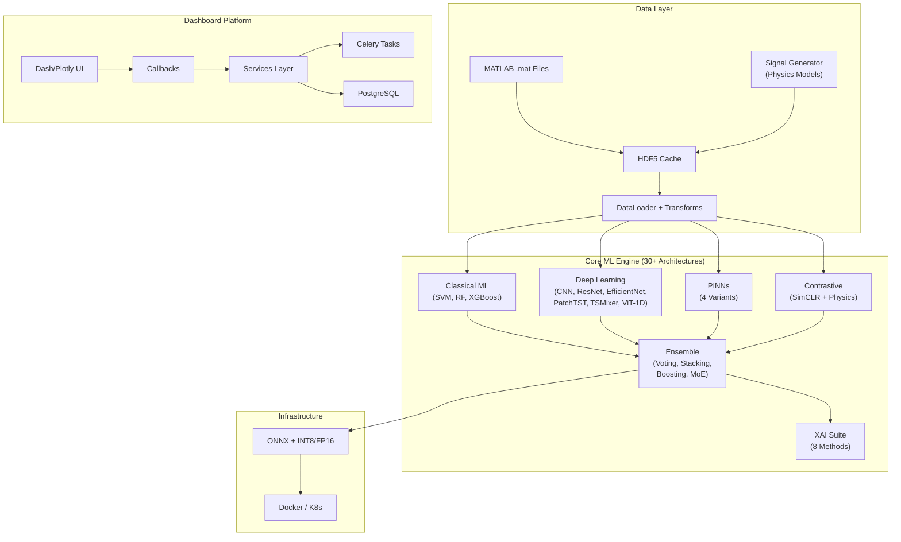
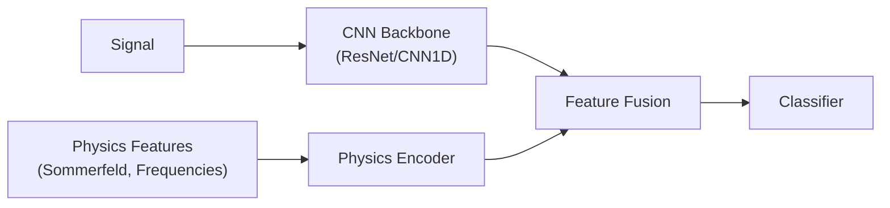
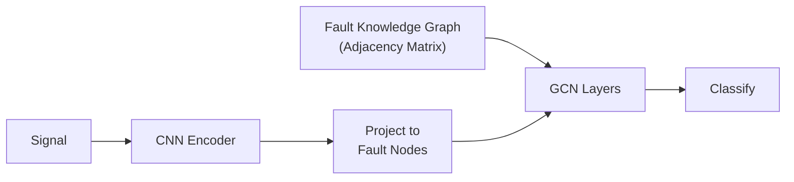
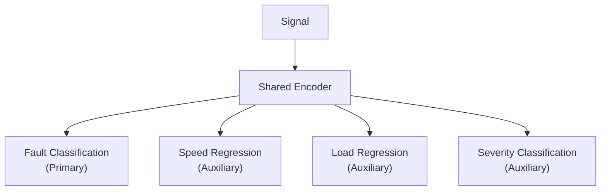

# LSTM-PFD: Comprehensive Project Deep Dive

> **Full analysis of the PFD (Palier Fluide Dynamique) Fault Diagnosis Ecosystem — architecture, research novelty, unique features, and current status.**

---

## 1. What Is This Project?

**LSTM-PFD** is a **research-grade predictive maintenance system** for hydrodynamic journal bearings. It classifies **11 bearing fault types** from vibration signals by combining:

- Classical physics (Sommerfeld number, Reynolds equation, bearing dynamics)
- Deep learning (CNNs, Transformers, PINNs)
- Explainable AI (8 methods with quantitative metrics)
- An enterprise Dash/Flask dashboard for no-code operation

The project targets an **IEEE TII (Transactions on Industrial Informatics)** manuscript and uniquely bridges tribology theory with modern AI.

---

## 2. Architecture Overview



### Dual-Stack Architecture

| Stack            | Role                                  | Key Technologies                                |
| ---------------- | ------------------------------------- | ----------------------------------------------- |
| **MATLAB Core**  | Physics simulation, signal generation | Sommerfeld, Reynolds equation, bearing geometry |
| **Python Stack** | ML/DL, dashboard, deployment          | PyTorch, Dash, Celery, PostgreSQL, Docker       |

---

## 3. Model Zoo (30+ Architectures)

The [model_factory.py](file:///c:/Users/COWLAR/projects/LSTM_PFD/packages/core/models/model_factory.py) registers all architectures via `create_model(name)`:

### CNN Family

| Model                   | File                                                                                                        | Key Innovation                 |
| ----------------------- | ----------------------------------------------------------------------------------------------------------- | ------------------------------ |
| **CNN1D**               | [cnn_1d.py](file:///c:/Users/COWLAR/projects/LSTM_PFD/packages/core/models/cnn/cnn_1d.py)                   | Baseline 1D ConvNet            |
| **AttentionCNN**        | [attention_cnn.py](file:///c:/Users/COWLAR/projects/LSTM_PFD/packages/core/models/cnn/attention_cnn.py)     | Channel + spatial attention    |
| **MultiScaleCNN**       | [multi_scale_cnn.py](file:///c:/Users/COWLAR/projects/LSTM_PFD/packages/core/models/cnn/multi_scale_cnn.py) | Inception-style multi-kernel   |
| **ResNet1D** (18/34/50) | Adapted ResNet                                                                                              | Residual blocks for 1D signals |
| **EfficientNet-B0–B7**  | [efficientnet.py](file:///c:/Users/COWLAR/projects/LSTM_PFD/packages/core/models/efficientnet.py)           | Compound scaling for 1D        |
| **DualStreamCNN**       | Time + frequency branches                                                                                   | Parallel domain processing     |

### Transformer Family

| Model                 | File                                                                                                                            | Key Innovation                                         |
| --------------------- | ------------------------------------------------------------------------------------------------------------------------------- | ------------------------------------------------------ |
| **SignalTransformer** | [signal_transformer.py](file:///c:/Users/COWLAR/projects/LSTM_PFD/packages/core/models/transformer/signal_transformer.py)       | Full self-attention on signal segments                 |
| **PatchTST**          | [patchtst.py](file:///c:/Users/COWLAR/projects/LSTM_PFD/packages/core/models/transformer/patchtst.py)                           | Patch-based time-series transformer (Nie et al., 2023) |
| **TSMixer**           | [tsmixer.py](file:///c:/Users/COWLAR/projects/LSTM_PFD/packages/core/models/transformer/tsmixer.py)                             | MLP-Mixer variant for time series (Chen et al., 2023)  |
| **ViT-1D**            | [vision_transformer_1d.py](file:///c:/Users/COWLAR/projects/LSTM_PFD/packages/core/models/transformer/vision_transformer_1d.py) | Vision Transformer adapted for 1D signals              |

### Ensemble Strategies

| Strategy             | File                                                                                                                   | Method                |
| -------------------- | ---------------------------------------------------------------------------------------------------------------------- | --------------------- |
| **VotingEnsemble**   | [voting_ensemble.py](file:///c:/Users/COWLAR/projects/LSTM_PFD/packages/core/models/ensemble/voting_ensemble.py)       | Hard/soft voting      |
| **StackingEnsemble** | [stacking_ensemble.py](file:///c:/Users/COWLAR/projects/LSTM_PFD/packages/core/models/ensemble/stacking_ensemble.py)   | Meta-learner stacking |
| **BoostingEnsemble** | [boosting_ensemble.py](file:///c:/Users/COWLAR/projects/LSTM_PFD/packages/core/models/ensemble/boosting_ensemble.py)   | Sequential boosting   |
| **MixtureOfExperts** | [mixture_of_experts.py](file:///c:/Users/COWLAR/projects/LSTM_PFD/packages/core/models/ensemble/mixture_of_experts.py) | Gated expert routing  |

---

## 4. Research Contributions (Novel & Publication-Ready)

### 4.1 Physics-Informed Neural Networks (PINNs) — 4 Variants

This is the project's most distinctive research contribution — **4 complementary approaches** to injecting physics knowledge into deep learning:

#### ① HybridPINN — Feature-Level Physics Fusion

[hybrid_pinn.py](file:///c:/Users/COWLAR/projects/LSTM_PFD/packages/core/models/hybrid_pinn.py)



- **3 fusion strategies**: Concatenation, Attention-weighted, Gated
- Accepts raw signals + physics features (bearing frequencies, Sommerfeld number)
- `PhysicsConstraint` module encodes bearing dynamics as differentiable functions
- `compute_total_loss` combines data loss + physics loss with configurable λ

> **What makes it novel**: Unlike standard PINNs that only constrain loss, this model **fuses physics features directly into the representation space** before classification.

#### ② KnowledgeGraphPINN — Graph-Based Fault Relationships

[knowledge_graph_pinn.py](file:///c:/Users/COWLAR/projects/LSTM_PFD/packages/core/models/pinn/knowledge_graph_pinn.py)



- `FaultKnowledgeGraph` encodes domain knowledge: _"ball fault and inner race share frequency harmonics"_
- **Graph Convolutional Networks (GCNs)** propagate information between related fault nodes
- `forward_with_attention` outputs learned fault relationship weights for interpretability
- Explicitly designed to **reduce confusion between physically similar faults**

> **What makes it novel**: First application of knowledge graphs to encode tribology fault relationships in a bearing diagnostic CNN.

#### ③ MultitaskPINN — Auxiliary Task Regularization

[multitask_pinn.py](file:///c:/Users/COWLAR/projects/LSTM_PFD/packages/core/models/pinn/multitask_pinn.py)



- 4 task-specific heads on a shared encoder
- **AdaptiveMultitaskPINN** variant uses **uncertainty weighting** (Kendall et al.): learns task weights σ² during training
- Philosophy: predicting operating conditions forces the encoder to learn physics-aware features

> **What makes it novel**: Operating condition prediction as physics-informed regularization — the network must understand bearing physics to predict speed/load.

#### ④ PhysicsConstrainedCNN — Loss-Based Physics Integration

[physics_constrained_cnn.py](file:///c:/Users/COWLAR/projects/LSTM_PFD/packages/core/models/pinn/physics_constrained_cnn.py)

- Standard CNN, but with a **physics loss function** during training
- `compute_physics_loss`: Compares predicted fault class → expected fault frequencies (from `FaultSignatureDatabase`) → observed FFT peaks
- Penalizes predictions whose characteristic frequencies are absent from the signal's spectrum
- **AdaptivePhysicsConstrainedCNN**: Physics loss weight increases over epochs (curriculum learning)

> **What makes it novel**: No architectural modifications — physics knowledge enters purely through the loss function, making it applicable to any CNN backbone.

---

### 4.2 Contrastive Physics Pretraining (SimCLR + Physics Similarity)

[contrastive_physics.py](file:///c:/Users/COWLAR/projects/LSTM_PFD/scripts/research/contrastive_physics.py)

Standard SimCLR uses augmented views as positive pairs. This project redefines similarity:

```
Positive pair = Two signals with SIMILAR physics parameters
                (eccentricity, clearance, viscosity)
Negative pair = Signals with DIFFERENT physics parameters
```

**Pipeline**: Physics-guided pretraining → Frozen encoder + linear probe → Full fine-tuning

**Key modules**:

- [physics_similarity.py](file:///c:/Users/COWLAR/projects/LSTM_PFD/packages/core/training/contrastive/physics_similarity.py): Computes similarity from physical parameters
- [pretrainer.py](file:///c:/Users/COWLAR/projects/LSTM_PFD/packages/core/training/contrastive/pretrainer.py): SimCLR-style training loop
- [losses.py](file:///c:/Users/COWLAR/projects/LSTM_PFD/packages/core/training/contrastive/losses.py): NTXent loss with physics-aware pair selection

Benchmark compares: supervised baseline vs. contrastive-frozen vs. contrastive-finetuned across multiple seeds.

> **What makes it novel**: Physics-similarity-defined contrastive pairs. No other bearing diagnosis paper uses physics parameters to define self-supervised learning similarity.

---

### 4.3 Explainable AI Suite — 8 Methods + Quantitative Metrics

The `packages/core/explainability/` module implements:

| Method                   | File                                                                                                                                    | Approach                                         |
| ------------------------ | --------------------------------------------------------------------------------------------------------------------------------------- | ------------------------------------------------ |
| **Integrated Gradients** | [integrated_gradients.py](file:///c:/Users/COWLAR/projects/LSTM_PFD/packages/core/explainability/integrated_gradients.py)               | Path integral of gradients (Sundararajan 2017)   |
| **SHAP**                 | [shap_explainer.py](file:///c:/Users/COWLAR/projects/LSTM_PFD/packages/core/explainability/shap_explainer.py)                           | GradientSHAP, DeepSHAP, KernelSHAP               |
| **LIME**                 | explainability module                                                                                                                   | Local surrogate models                           |
| **CAV / TCAV**           | [concept_activation_vectors.py](file:///c:/Users/COWLAR/projects/LSTM_PFD/packages/core/explainability/concept_activation_vectors.py)   | Human-interpretable concept testing (Kim et al.) |
| **Counterfactuals**      | [counterfactual_explanations.py](file:///c:/Users/COWLAR/projects/LSTM_PFD/packages/core/explainability/counterfactual_explanations.py) | Minimal perturbation for class change            |
| **Uncertainty**          | [uncertainty_quantification.py](file:///c:/Users/COWLAR/projects/LSTM_PFD/packages/core/explainability/uncertainty_quantification.py)   | MC Dropout, entropy, mutual information          |
| **Partial Dependence**   | explainability module                                                                                                                   | Feature effect isolation                         |
| **Anchors**              | explainability module                                                                                                                   | Rule-based local explanations                    |

#### XAI Quality Metrics (Quantitative Evaluation)

[xai_metrics.py](file:///c:/Users/COWLAR/projects/LSTM_PFD/scripts/research/xai_metrics.py)

| Metric           | Formula                                          | Purpose                                          |
| ---------------- | ------------------------------------------------ | ------------------------------------------------ |
| **Faithfulness** | Remove top-k% features → measure prediction drop | Do explanations reflect model behavior?          |
| **Stability**    | Noise perturbation → compare explanations        | Are explanations robust?                         |
| **Sparsity**     | Fraction of near-zero attributions               | Are explanations concise?                        |
| **Infidelity**   | Yeh et al., 2019                                 | Does perturbation × attribution ≈ output change? |

Includes expert survey template generation for domain validation.

> **What makes it novel**: Most papers apply 1-2 XAI methods qualitatively. This project applies **8 methods with 4 quantitative metrics** — publishable XAI evaluation methodology.

---

### 4.4 Bearing Physics Module

[bearing_dynamics.py](file:///c:/Users/COWLAR/projects/LSTM_PFD/packages/core/models/physics/bearing_dynamics.py)

Differentiable (torch-compatible) implementations of:

| Calculation              | Formula                                     | Role in PINNs                                    |
| ------------------------ | ------------------------------------------- | ------------------------------------------------ |
| **FTF** (Cage frequency) | f_s/2 × (1 - d_b/d_p × cosβ)                | Input feature to HybridPINN                      |
| **BPFO** (Outer race)    | n/2 × f_s × (1 - d_b/d_p × cosβ)            | Expected frequency in PhysicsConstrainedCNN loss |
| **BPFI** (Inner race)    | n/2 × f_s × (1 + d_b/d_p × cosβ)            | Fault signature verification                     |
| **BSF** (Ball spin)      | d_p/(2×d_b) × f_s × (1 - (d_b/d_p × cosβ)²) | Operating condition predictor                    |
| **Sommerfeld Number**    | S = (μNLD/W)(R/C)²                          | Lubrication regime classifier                    |
| **Reynolds Number**      | Re = ρUC/μ                                  | Flow regime indicator                            |

All support both `numpy` (for preprocessing) and `torch` (for backprop-compatible training).

---

## 5. Research Experiment Infrastructure

### 5.1 Ablation Studies

- [ablation_study.py](file:///c:/Users/COWLAR/projects/LSTM_PFD/scripts/research/ablation_study.py) — **1175 lines**, 53 functions, comprehensive framework
  - Toggles: physics branch, attention, multi-scale, augmentation, resonance/energy/boundary losses
  - Multi-seed evaluation with statistical significance
  - `AblationModel` class with modular component switches
- [pinn_ablation.py](file:///c:/Users/COWLAR/projects/LSTM_PFD/scripts/research/pinn_ablation.py) — Focused PINN λ sweep
  - McNemar's test for pairwise model comparison
  - 3D sensitivity surface for λ_physics × λ_boundary
  - 8 configurations from "CNN only" to "Combined optimal"

### 5.2 OOD (Out-of-Distribution) Testing

[ood_testing.py](file:///c:/Users/COWLAR/projects/LSTM_PFD/scripts/research/ood_testing.py)

Two scenarios testing generalization:

1. **Severity shift**: Train on small faults (0.007"), test on large (0.021")
2. **Type shift**: Train without ball faults, test on ball faults

Measures: accuracy, max softmax probability (confidence calibration), prediction entropy.

### 5.3 Failure Analysis

[failure_analysis.py](file:///c:/Users/COWLAR/projects/LSTM_PFD/scripts/research/failure_analysis.py)

- Analyzes misclassified samples systematically
- Computes SNR and RMS for failed vs. successful predictions
- Generates manuscript-ready LaTeX tables
- Outputs Plotly sunburst charts for confusion pair visualization

### 5.4 Literature Benchmarks

[literature_comparison.py](file:///c:/Users/COWLAR/projects/LSTM_PFD/benchmarks/literature_comparison.py)

Compare against published results on:

- **CWRU Bearing Dataset** (6 published baselines, 2017-2022)
- **PHM Data Challenge** (2009 winners)
- **Sample efficiency curves** (50–1000 samples)

---

## 6. Feature Engineering Pipeline

The [features/](file:///c:/Users/COWLAR/projects/LSTM_PFD/packages/core/features) module (12 extractors):

| Domain               | Module                                                                                                          | Features                                            |
| -------------------- | --------------------------------------------------------------------------------------------------------------- | --------------------------------------------------- |
| **Time Domain**      | [time_domain.py](file:///c:/Users/COWLAR/projects/LSTM_PFD/packages/core/features/time_domain.py)               | RMS, kurtosis, skewness, crest factor, shape factor |
| **Frequency Domain** | [frequency_domain.py](file:///c:/Users/COWLAR/projects/LSTM_PFD/packages/core/features/frequency_domain.py)     | FFT peaks, spectral entropy, centroid, bandwidth    |
| **Wavelet**          | [wavelet_features.py](file:///c:/Users/COWLAR/projects/LSTM_PFD/packages/core/features/wavelet_features.py)     | CWT/DWT coefficients, energy per scale              |
| **Bispectrum**       | [bispectrum.py](file:///c:/Users/COWLAR/projects/LSTM_PFD/packages/core/features/bispectrum.py)                 | Higher-order spectral analysis                      |
| **Envelope**         | [envelope_analysis.py](file:///c:/Users/COWLAR/projects/LSTM_PFD/packages/core/features/envelope_analysis.py)   | Hilbert transform envelope                          |
| **Advanced**         | [advanced_features.py](file:///c:/Users/COWLAR/projects/LSTM_PFD/packages/core/features/advanced_features.py)   | Combined multi-domain features                      |
| **Selection**        | [feature_selector.py](file:///c:/Users/COWLAR/projects/LSTM_PFD/packages/core/features/feature_selector.py)     | Automated feature selection                         |
| **Importance**       | [feature_importance.py](file:///c:/Users/COWLAR/projects/LSTM_PFD/packages/core/features/feature_importance.py) | Model-based importance ranking                      |
| **Validation**       | [feature_validator.py](file:///c:/Users/COWLAR/projects/LSTM_PFD/packages/core/features/feature_validator.py)   | Quality checks and normalization                    |

---

## 7. Enterprise Dashboard

A full Dash/Plotly web application with:

| Dashboard Tab             | Purpose                                                               |
| ------------------------- | --------------------------------------------------------------------- |
| **Data Management**       | Generate/load vibration signals, configure physics parameters         |
| **Model Training**        | Select architecture, configure hyperparameters, launch async training |
| **Experiment Comparison** | Side-by-side metrics, confusion matrices, training curves             |
| **XAI Dashboard**         | Interactive SHAP/LIME/IG/Grad-CAM/Counterfactual visualization        |
| **Deployment**            | ONNX export, quantization (INT8/FP16)                                 |

Backend: **Celery + Redis** for async training tasks, **PostgreSQL** for experiment tracking.

The [xai_dashboard.py](file:///c:/Users/COWLAR/projects/LSTM_PFD/packages/dashboard/layouts/xai_dashboard.py) integrates 6 XAI methods into a point-and-click interface with adjustable parameters and cached explanations.

---

## 8. Current Status & What's Pending

| Component                | Status         | Notes                                      |
| ------------------------ | -------------- | ------------------------------------------ |
| All model architectures  | ✅ Implemented | 30+ registered in factory                  |
| 4 PINN variants          | ✅ Implemented | Code complete, loss functions defined      |
| Contrastive pretraining  | ✅ Implemented | Physics-similarity pairs ready             |
| 8 XAI methods            | ✅ Implemented | Includes quality metrics                   |
| Ablation framework       | ✅ Implemented | 1175-line framework with statistical tests |
| OOD testing              | ✅ Implemented | Severity + type shift scenarios            |
| Dashboard                | ✅ Implemented | Full-stack Dash/Celery/PostgreSQL          |
| **Experimental results** | ⏳ **PENDING** | No benchmark numbers yet                   |
| **CWRU benchmark run**   | ⏳ **PENDING** | Infrastructure ready, needs execution      |
| Documentation            | 🔄 In progress | MkDocs overhaul ongoing                    |

---

## 9. Unique Selling Points for CV/Applications

### For Physics Programs

1. **Tribology modeling**: Sommerfeld number, Reynolds equation, bearing characteristic frequencies — all implemented as differentiable PyTorch functions
2. **Physics-data integration**: 4 distinct methodologies for injecting physics into ML
3. **Lubrication theory**: Real bearing geometry parameters (ball diameter, pitch diameter, contact angle, radial clearance)

### For AI/ML Programs

1. **PINN research**: 4 novel PINN architectures — not just one approach but a **comparative study**
2. **Knowledge Graph + GNN**: Graph Convolutional Networks encoding domain fault relationships
3. **Contrastive learning innovation**: Physics-similarity-based contrastive pairs (novel contribution)
4. **XAI at scale**: 8 methods with 4 quantitative metrics — beyond state-of-the-art in evaluation rigor
5. **30+ model zoo**: CNN, ResNet, EfficientNet, PatchTST, TSMixer, ViT-1D, MoE, etc.
6. **Full MLOps**: Model factory, ensemble creation, ONNX export, quantization, Docker/K8s

### One-Line Summary for CV

> _"Designed and implemented a physics-informed deep learning ecosystem for bearing fault diagnosis: 4 novel PINN architectures, contrastive physics pretraining, 8 XAI methods with quantitative evaluation, 30+ model architectures, and an enterprise dashboard — targeting IEEE TII publication."_
