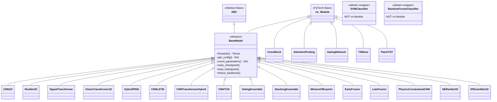

# IDB 1.1: Models Sub-Block Analysis Report

**IDB ID:** 1.1  
**Domain:** Core ML Engine  
**Scope:** `packages/core/models/`  
**Files Analyzed:** 61 Python files across 13 subdirectories + 7 top-level files  
**Analysis Date:** 2026-01-22  
**Analyst:** AI Agent

---

## Table of Contents

1. [Current State Assessment](#1-current-state-assessment)
2. [Critical Issues Identification](#2-critical-issues-identification)
3. ["If I Could Rewrite This" Retrospective](#3-if-i-could-rewrite-this-retrospective)
4. [Technical Debt Inventory](#4-technical-debt-inventory)
5. [Good Practices to Adopt](#5-good-practices-to-adopt)
6. [Recommendations Summary](#6-recommendations-summary)

---

## 1. Current State Assessment

### 1.1 Model Architectures Implemented

The models sub-block contains an impressive variety of neural network architectures organized into logical subdirectories:

| Category                 | Subdirectory       | Models                                                                                                                       | Count |
| ------------------------ | ------------------ | ---------------------------------------------------------------------------------------------------------------------------- | ----- |
| **Base Infrastructure**  | `./` (top-level)   | `BaseModel`, `CNN1D`, `ResNet1D`, `HybridPINN`, `model_factory`, `legacy_ensemble`                                           | 7     |
| **Classical ML**         | `classical/`       | `SVMClassifier`, `RandomForestClassifier`, `GradientBoostingClassifier`, `MLPClassifier`, `StackedEnsemble`, `ModelSelector` | 6     |
| **CNN Variants**         | `cnn/`             | `AttentionCNN1D`, `MultiScaleCNN1D`, `DilatedMultiScaleCNN`, `LightweightAttentionCNN`                                       | 4     |
| **ResNet Variants**      | `resnet/`          | `ResNet1D`, `SEResNet1D`, `WideResNet1D`, residual blocks                                                                    | 5     |
| **EfficientNet**         | `efficientnet/`    | `EfficientNet1D`, `MBConvBlock`, `FusedMBConvBlock`                                                                          | 3     |
| **Transformers**         | `transformer/`     | `SignalTransformer`, `VisionTransformer1D`, `PatchTST`, `TSMixer`                                                            | 5     |
| **Hybrid Architectures** | `hybrid/`          | `CNNLSTM`, `CNNTCN`, `CNNTransformerHybrid`, `MultiScaleCNN`                                                                 | 5     |
| **Physics-Informed**     | `pinn/`            | `HybridPINN`, `PhysicsConstrainedCNN`, `MultitaskPINN`, `KnowledgeGraphPINN`                                                 | 5     |
| **Physics Models**       | `physics/`         | `BearingDynamics`, `FaultSignatureDatabase`, `OperatingConditionsModel`                                                      | 4     |
| **Ensemble Methods**     | `ensemble/`        | `VotingEnsemble`, `StackingEnsemble`, `BoostingEnsemble`, `MixtureOfExperts`                                                 | 6     |
| **Fusion**               | `fusion/`          | `EarlyFusion`, `LateFusion`, `SimpleEarlyFusion`                                                                             | 3     |
| **NAS**                  | `nas/`             | `SearchSpaceConfig`, `ArchitectureSpec`                                                                                      | 2     |
| **Spectrogram**          | `spectrogram_cnn/` | `DualStreamCNN`, `ResNet2DSpectrogram`, `EfficientNet2DSpectrogram`                                                          | 4     |

**Total: ~55+ unique model classes across 61 files**

### 1.2 Inheritance Hierarchy



### 1.3 BaseModel Compliance Analysis

| Status                             | Models                                                                                                                                                                                                                                                                                                                                                                                                                                                         | Notes                     |
| ---------------------------------- | -------------------------------------------------------------------------------------------------------------------------------------------------------------------------------------------------------------------------------------------------------------------------------------------------------------------------------------------------------------------------------------------------------------------------------------------------------------- | ------------------------- |
| ✅ **Properly Inherits BaseModel** | `CNN1D`, `ResNet1D`, `VisionTransformer1D`, `SignalTransformer`, `HybridPINN`, `CNNLSTM`, `CNNTransformerHybrid`, `CNNTCN`, `VotingEnsemble`, `StackingEnsemble`, `MixtureOfExperts`, `ExpertModel`, `EarlyFusion`, `LateFusion`, `SimpleEarlyFusion`, `PhysicsConstrainedCNN`, `MultitaskPINN`, `KnowledgeGraphPINN`, `SEResNet1D`, `EfficientNet1D`, `DualStreamCNN`, `ResNet2DSpectrogram`, `EfficientNet2DSpectrogram`, `BoostingEnsemble`, `WideResNet1D` | ~25 models                |
| ⚠️ **Inherits nn.Module Only**     | `TSMixer`, `PatchTST`, `MultiScaleCNN1D`, `DilatedMultiScaleCNN`, `AttentionCNN1D`, `LightweightAttentionCNN`                                                                                                                                                                                                                                                                                                                                                  | Missing BaseModel pattern |
| ❌ **No PyTorch Inheritance**      | `SVMClassifier`, `RandomForestClassifier`, `GradientBoostingClassifier`, `MLPClassifier`, `SearchSpaceConfig`, `ArchitectureSpec`, `BearingDynamics`, `FaultSignatureDatabase`, `OperatingConditionsModel`                                                                                                                                                                                                                                                     | sklearn/utility wrappers  |

### 1.4 Forward Signature Consistency

Most models follow the standard signature:

```python
def forward(self, x: torch.Tensor) -> torch.Tensor:
```

**Exceptions requiring attention:**
| Model | Signature | Issue |
|-------|-----------|-------|
| `HybridPINN` | `forward(self, signal, metadata=None)` | Additional optional parameter |
| `MixtureOfExperts` | `forward(self, x, return_gates=False)` | Returns tuple optionally |
| `LateFusion` | `forward(self, x)` | Consistent ✅ |

### 1.5 ONNX Exportability Assessment

| Status             | Models                                                         | Barrier                         |
| ------------------ | -------------------------------------------------------------- | ------------------------------- |
| ✅ **Ready**       | `CNN1D`, `ResNet1D`, most pure CNN models                      | Standard PyTorch ops            |
| ⚠️ **Conditional** | `VisionTransformer1D`, `SignalTransformer`                     | Dynamic shapes in attention     |
| ❌ **Blocked**     | `HybridPINN` (dual-input), `MixtureOfExperts` (dynamic gating) | Non-standard forward signatures |
| ❌ **N/A**         | Classical ML models                                            | sklearn, not PyTorch            |

---

## 2. Critical Issues Identification

### P0 - Critical (Blocks Production, Causes Crashes)

| ID   | Issue                                    | Location                                                                 | Impact                                                       |
| ---- | ---------------------------------------- | ------------------------------------------------------------------------ | ------------------------------------------------------------ |
| P0-1 | **Hardcoded sys.path manipulation**      | `fusion/early_fusion.py:28`, `fusion/late_fusion.py:23`, `ensemble/*.py` | Uses `/home/user/LSTM_PFD` - **breaks on any other machine** |
| P0-2 | **Duplicate HybridPINN implementations** | `hybrid_pinn.py` AND `pinn/hybrid_pinn.py`                               | Confusion, potential import conflicts                        |
| P0-3 | **Duplicate ResNet1D implementations**   | `resnet_1d.py` AND `resnet/resnet_1d.py`                                 | Same class defined twice                                     |

### P1 - High (Major Functionality Broken, Significant Tech Debt)

| ID   | Issue                                                   | Location                                            | Impact                                                                           |
| ---- | ------------------------------------------------------- | --------------------------------------------------- | -------------------------------------------------------------------------------- |
| P1-1 | **Hardcoded magic numbers (`102400`, `20480`, `5000`)** | 45+ occurrences across models                       | Should use `SIGNAL_LENGTH`, `SAMPLE_RATE` from constants                         |
| P1-2 | **Classical models don't inherit BaseModel**            | `classical/*.py`                                    | Inconsistent interface, no `get_config()` required                               |
| P1-3 | **TSMixer, PatchTST don't inherit BaseModel**           | `transformer/tsmixer.py`, `transformer/patchtst.py` | Missing standard interface methods                                               |
| P1-4 | **No ONNX export method in BaseModel**                  | `base_model.py`                                     | Missing standardized export capability                                           |
| P1-5 | **Inconsistent import paths**                           | Multiple files                                      | Mix of relative (`.base_model`) and absolute (`packages.core.models.base_model`) |
| P1-6 | **model_factory registry incomplete**                   | `model_factory.py:54-89`                            | Many models not registered (TSMixer, PatchTST, AttentionCNN, etc.)               |

### P2 - Medium (Code Smells, Inefficiencies, Maintainability)

| ID   | Issue                                            | Location                                                                                                        | Impact                             |
| ---- | ------------------------------------------------ | --------------------------------------------------------------------------------------------------------------- | ---------------------------------- |
| P2-1 | **Duplicate ConvBlock implementations**          | `cnn_1d.py:22`, `cnn/conv_blocks.py:23`                                                                         | DRY violation                      |
| P2-2 | **Missing docstrings in helper modules**         | `efficientnet/mbconv_block.py`, some blocks                                                                     | Reduced maintainability            |
| P2-3 | **Test code embedded in module files**           | `if __name__ == '__main__':` in 10+ files                                                                       | Should be in separate test files   |
| P2-4 | **Inconsistent type hints**                      | Return types vary: `dict`, `Dict`, `Dict[str, Any]`                                                             | Style inconsistency                |
| P2-5 | **Legacy ensemble alongside new ensemble**       | `legacy_ensemble.py` vs `ensemble/*.py`                                                                         | Confusing, potential dead code     |
| P2-6 | **NAS search space has no actual NAS algorithm** | `nas/` directory                                                                                                | Incomplete feature                 |
| P2-7 | **Physics models not integrated with training**  | `physics/` directory                                                                                            | Isolated from main pipeline        |
| P2-8 | **Positional encoding duplicated**               | `transformer/vision_transformer_1d.py:30`, `transformer/signal_transformer.py:24`, `transformer/patchtst.py:43` | 3 nearly identical implementations |

---

## 3. "If I Could Rewrite This" Retrospective

### 3.1 Fundamental Architectural Changes

1. **Unified Model Interface**
   - Create separate base classes: `ClassificationModel` (PyTorch), `TraditionalMLModel` (sklearn)
   - Both should implement common interface: `fit()`, `predict()`, `predict_proba()`, `save()`, `load()`, `get_config()`

2. **Remove Duplicates**
   - Single source of truth for each architecture
   - Use subdirectory structure (`cnn/cnn_1d.py`) and deprecate top-level duplicates

3. **Configuration-First Design**
   - All hyperparameters from dataclass/pydantic config objects
   - No hardcoded magic numbers in any file

4. **ONNX by Default**
   - Add `export_onnx()` to `BaseModel`
   - Require all models to pass ONNX exportability tests

### 3.2 Models That Shouldn't Exist (Redundant/Obsolete)

| File                         | Reason                             | Recommendation                                |
| ---------------------------- | ---------------------------------- | --------------------------------------------- |
| `legacy_ensemble.py`         | Superseded by `ensemble/*.py`      | Mark deprecated, remove in next major version |
| `resnet_1d.py` (top-level)   | Duplicate of `resnet/resnet_1d.py` | Remove, update imports                        |
| `hybrid_pinn.py` (top-level) | Duplicate of `pinn/hybrid_pinn.py` | Remove, update imports                        |
| `cnn_1d.py` (top-level)      | Could be alias for `cnn/cnn_1d.py` | Consolidate                                   |

### 3.3 BaseModel Abstraction Evaluation

**Current State: Slightly Under-Engineered**

**Good:**

- Provides useful utilities: `count_parameters()`, `summary()`, `save_checkpoint()`
- Clear abstract interface with `forward()` and `get_config()`
- Supports transfer learning with `freeze_backbone()`

**Missing:**

- No `predict()` method (only `forward()`)
- No `export_onnx()`, `export_torchscript()` methods
- No input/output validation
- No built-in mixed-precision support
- No `from_pretrained()` classmethod

**Recommendation:**

```python
class BaseModel(nn.Module, ABC):
    @abstractmethod
    def forward(self, x: torch.Tensor) -> torch.Tensor: ...

    @abstractmethod
    def get_config(self) -> Dict[str, Any]: ...

    # NEW: Required methods
    def predict(self, x: torch.Tensor) -> torch.Tensor:
        """Alias for forward with eval mode."""
        self.eval()
        with torch.no_grad():
            return self.forward(x)

    def export_onnx(self, path: Path, input_shape: Tuple[int, ...]) -> None: ...

    def export_torchscript(self, path: Path) -> None: ...

    @classmethod
    def from_pretrained(cls, checkpoint_path: Path, **kwargs) -> 'BaseModel': ...
```

### 3.4 model_factory Pattern Evaluation

**Current: Appropriate but Incomplete**

The factory pattern is the right choice for this project because:

- Multiple model architectures with similar interfaces
- Configuration-based model creation needed
- Checkpoint loading requires architecture metadata

**Issues:**

1. Registry only has ~15 of ~55 models
2. No auto-discovery of models
3. No version tracking for model architectures

**Recommendation:** Add decorator-based auto-registration:

```python
@register_model("attention_cnn")
class AttentionCNN1D(BaseModel):
    ...
```

### 3.5 Proposed Directory Restructure

```
models/
├── __init__.py
├── base.py                    # BaseModel, ClassificationMixin
├── factory.py                 # Model registry and creation
├── config.py                  # Shared config dataclasses
│
├── backbones/                 # Feature extraction only
│   ├── cnn/                   # CNN1D, MultiScale, Attention
│   ├── resnet/                # ResNet1D, SEResNet, WideResNet
│   ├── efficientnet/
│   └── transformer/           # ViT1D, SignalTransformer
│
├── heads/                     # Classification heads
│   ├── linear.py
│   ├── mlp.py
│   └── attention_pool.py
│
├── full_models/               # End-to-end trainable models
│   ├── classifiers/           # Standard classifiers
│   ├── hybrid/                # CNN+LSTM, CNN+Transformer
│   ├── pinn/                  # Physics-informed
│   └── ensemble/              # Voting, Stacking, MoE
│
├── traditional_ml/            # Non-PyTorch models (sklearn)
│   ├── base.py                # TraditionalModel interface
│   ├── svm.py
│   ├── random_forest.py
│   └── gradient_boosting.py
│
├── physics/                   # Physics models (data-only)
│   ├── bearing_dynamics.py
│   └── fault_signatures.py
│
└── experimental/              # WIP, not production-ready
    ├── nas/
    └── tsmixer.py
```

### 3.6 External Dependencies to Add/Remove

**Add:**
| Dependency | Reason |
|------------|--------|
| `pydantic` | Config validation and serialization |
| `onnxruntime` | ONNX export verification |
| `torchinfo` | Better model summaries than custom implementation |
| `timm` | Pretrained transformer building blocks |

**Remove/Reduce:**
| Dependency | Reason |
|------------|--------|
| Hardcoded `sys.path` | Use proper package imports |
| Inline test code | Move to `tests/` directory |

### 3.7 Missing Design Patterns

| Pattern              | Where Needed                         | Benefit                                                      |
| -------------------- | ------------------------------------ | ------------------------------------------------------------ |
| **Builder Pattern**  | Complex model configuration          | `CNN1DBuilder().channels(64).layers(6).dropout(0.3).build()` |
| **Strategy Pattern** | Attention mechanisms                 | Swap attention types without model changes                   |
| **Template Method**  | Forward pass structure               | Standardize `preprocess → backbone → head → postprocess`     |
| **Decorator**        | Model registration, input validation | `@validate_input`, `@register_model`                         |
| **Singleton**        | Model registry                       | Prevent multiple registries                                  |

---

## 4. Technical Debt Inventory

### Quick Win (< 1 hour each)

| ID   | Task                                          | File(s)                           | Est.   |
| ---- | --------------------------------------------- | --------------------------------- | ------ |
| QW-1 | Replace hardcoded `/home/user/LSTM_PFD` paths | 8 files in `fusion/`, `ensemble/` | 30 min |
| QW-2 | Add missing type hints to return types        | ~15 methods                       | 30 min |
| QW-3 | Standardize `Dict` vs `dict` type hints       | All files                         | 20 min |
| QW-4 | Remove unused imports                         | Multiple files                    | 15 min |
| QW-5 | Add `__all__` to missing `__init__.py` files  | `hybrid/`, `pinn/`                | 15 min |

### Medium Effort (1-4 hours each)

| ID   | Task                                                    | File(s)                                 | Est.  |
| ---- | ------------------------------------------------------- | --------------------------------------- | ----- |
| ME-1 | Make TSMixer, PatchTST inherit BaseModel                | `transformer/tsmixer.py`, `patchtst.py` | 2 hrs |
| ME-2 | Consolidate duplicate PositionalEncoding                | `transformer/*.py`                      | 1 hr  |
| ME-3 | Move test code to `tests/` directory                    | 10+ files                               | 3 hrs |
| ME-4 | Replace magic numbers with constants                    | 45+ occurrences                         | 2 hrs |
| ME-5 | Add missing models to model_factory registry            | `model_factory.py`                      | 2 hrs |
| ME-6 | Standardize import paths (all relative or all absolute) | All files                               | 2 hrs |
| ME-7 | Create wrapper interface for classical ML models        | `classical/*.py`                        | 3 hrs |
| ME-8 | Document all public model classes                       | All model files                         | 4 hrs |
| ME-9 | Consolidate ConvBlock implementations                   | `cnn_1d.py`, `cnn/conv_blocks.py`       | 1 hr  |

### Large Effort (1+ days each)

| ID   | Task                                                           | Est.     |
| ---- | -------------------------------------------------------------- | -------- |
| LE-1 | Remove duplicate model files (keep subdirectory versions only) | 1 day    |
| LE-2 | Add ONNX export to BaseModel + tests for all models            | 2 days   |
| LE-3 | Implement decorator-based auto-registration for factory        | 1 day    |
| LE-4 | Create comprehensive model configuration system (pydantic)     | 2 days   |
| LE-5 | Refactor to backbone/head separation pattern                   | 3 days   |
| LE-6 | Deprecate and remove `legacy_ensemble.py`                      | 1 day    |
| LE-7 | Complete NAS implementation (actual search algorithm)          | 3-5 days |
| LE-8 | Add `from_pretrained()` support with model hub                 | 2 days   |

---

## 5. Good Practices to Adopt

These patterns from the Models sub-block should be adopted project-wide:

### 5.1 Abstract Base Class Pattern

```python
# From base_model.py - well-designed abstraction
class BaseModel(nn.Module, ABC):
    @abstractmethod
    def forward(self, x: torch.Tensor) -> torch.Tensor: ...

    @abstractmethod
    def get_config(self) -> Dict[str, Any]: ...
```

### 5.2 Factory Function Convention

```python
# From cnn_1d.py - consistent factory function pattern
def create_cnn1d(num_classes: int = NUM_CLASSES, **kwargs) -> CNN1D:
    """Factory function with sensible defaults."""
    return CNN1D(num_classes=num_classes, **kwargs)
```

### 5.3 Preset Configurations

```python
# From cnn_transformer.py - good practice for common configurations
def cnn_transformer_small(num_classes: int = NUM_CLASSES, **kwargs):
    """Small CNN-Transformer hybrid (fast, ~10M params)."""
    return create_cnn_transformer_hybrid(
        num_classes=num_classes,
        d_model=256,
        num_heads=4,
        num_layers=2,
        **kwargs
    )
```

### 5.4 Weight Initialization Convention

```python
# From cnn_1d.py - proper initialization pattern
def _initialize_weights(self):
    """Initialize weights using He initialization for ReLU networks."""
    for m in self.modules():
        if isinstance(m, nn.Conv1d):
            nn.init.kaiming_normal_(m.weight, mode='fan_out', nonlinearity='relu')
```

### 5.5 Module Docstrings

```python
# From base_model.py - excellent module documentation
"""
Abstract base model class for all neural network architectures.

Purpose:
    Provides common interface and utilities for all models:
    - Standard forward pass interface
    - Model summary and parameter counting
    - Save/load functionality
    - Device management
"""
```

### 5.6 Comprehensive Type Hints

```python
# From model_factory.py - proper typing
def create_model(
    model_name: str,
    num_classes: int = NUM_CLASSES,
    **kwargs
) -> BaseModel:
```

---

## 6. Recommendations Summary

### Immediate Actions (This Sprint)

1. 🔴 **P0-1:** Remove all hardcoded `sys.path` manipulations
2. 🔴 **P0-2/P0-3:** Choose canonical location for duplicated models

### Short-Term (Next 2 Sprints)

1. 🟡 **P1-1:** Replace all magic numbers with constants
2. 🟡 **P1-3:** Make TSMixer/PatchTST inherit BaseModel
3. 🟡 **P1-6:** Complete model_factory registry

### Medium-Term (Next Quarter)

1. 🟢 **LE-2:** Add ONNX export capability
2. 🟢 **LE-4:** Implement configuration system
3. 🟢 **ME-7:** Create classical ML wrapper interface

### Long-Term (Roadmap)

1. 📋 **LE-5:** Refactor to backbone/head pattern
2. 📋 **LE-7:** Complete NAS implementation
3. 📋 **LE-8:** Model hub with pretrained weights

---

## Appendix A: File Inventory

| File                                   | Lines | Purpose                 | BaseModel?    |
| -------------------------------------- | ----- | ----------------------- | ------------- |
| `base_model.py`                        | 369   | Abstract base class     | N/A (is base) |
| `model_factory.py`                     | 416   | Model creation/registry | N/A           |
| `cnn_1d.py`                            | 232   | Basic 1D CNN            | ✅            |
| `resnet_1d.py`                         | 339   | ResNet-18/34            | ✅            |
| `hybrid_pinn.py`                       | 406   | Physics-informed hybrid | ✅            |
| `legacy_ensemble.py`                   | 386   | Legacy ensemble methods | ✅            |
| `transformer/vision_transformer_1d.py` | 489   | ViT for 1D              | ✅            |
| `transformer/signal_transformer.py`    | ~420  | Standard transformer    | ✅            |
| `transformer/patchtst.py`              | ~330  | PatchTST                | ❌            |
| `transformer/tsmixer.py`               | ~330  | TSMixer                 | ❌            |
| `classical/svm_classifier.py`          | 190   | SVM wrapper             | ❌ (sklearn)  |
| `classical/random_forest.py`           | 200   | RF wrapper              | ❌ (sklearn)  |
| ...                                    | ...   | ...                     | ...           |

---

_Report generated by IDB 1.1 Analysis Agent_
