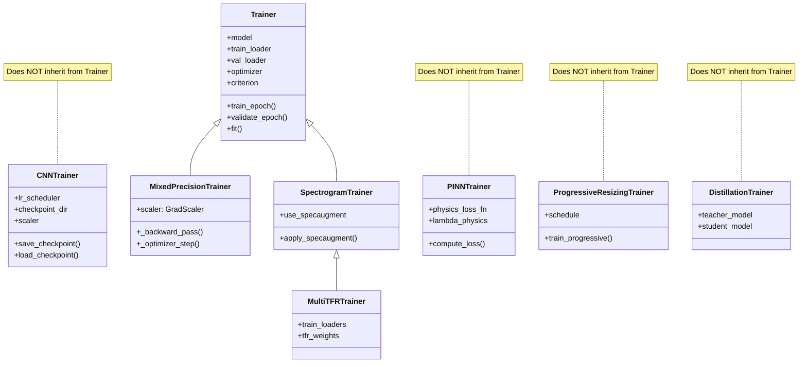
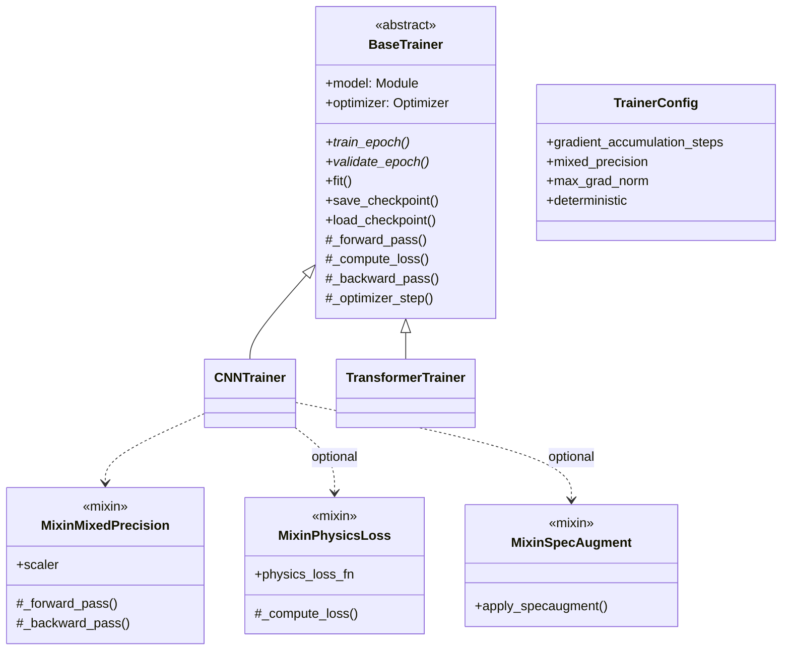

# IDB 1.2 Training Sub-Block Analysis Report

**IDB ID:** 1.2  
**Domain:** Core ML Engine  
**Primary Directory:** `packages/core/training/`  
**Analysis Date:** 2026-01-22  
**Analyst:** AI Training Sub-Block Agent

---

## Executive Summary

The Training Sub-Block contains **23 Python files** implementing a comprehensive deep learning training infrastructure. The implementation includes multiple specialized trainers, two distinct callback systems, extensive loss functions, optimizer/scheduler configurations, and advanced training techniques (mixed precision, progressive resizing, knowledge distillation).

**Overall Assessment:** The training infrastructure is feature-rich but suffers from significant architectural fragmentation, code duplication, and inconsistent interfaces between components.

---

## Table of Contents

1. [Task 1: Current State Assessment](#task-1-current-state-assessment)
2. [Task 2: Critical Issues Identification](#task-2-critical-issues-identification)
3. [Task 3: Retrospective - If I Could Rewrite This](#task-3-retrospective---if-i-could-rewrite-this)
4. [Task 4: Integration Risk Assessment](#task-4-integration-risk-assessment)
5. [Recommendations Summary](#recommendations-summary)

---

## Task 1: Current State Assessment

### 1.1 Trainer Classes and Inheritance Hierarchy



| Trainer                                                                                                                | Inherits From        | Location                    | Purpose                                                             |
| ---------------------------------------------------------------------------------------------------------------------- | -------------------- | --------------------------- | ------------------------------------------------------------------- |
| [Trainer](file:///c:/Users/COWLAR/projects/LSTM_PFD/packages/core/training/trainer.py)                                 | `object`             | `trainer.py`                | Base trainer with gradient accumulation, mixed precision, callbacks |
| [MixedPrecisionTrainer](file:///c:/Users/COWLAR/projects/LSTM_PFD/packages/core/training/mixed_precision.py)           | `Trainer`            | `mixed_precision.py`        | FP16 training with GradScaler                                       |
| [SpectrogramTrainer](file:///c:/Users/COWLAR/projects/LSTM_PFD/packages/core/training/spectrogram_trainer.py)          | `Trainer`            | `spectrogram_trainer.py`    | SpecAugment for spectrograms                                        |
| [MultiTFRTrainer](file:///c:/Users/COWLAR/projects/LSTM_PFD/packages/core/training/spectrogram_trainer.py#L280-L399)   | `SpectrogramTrainer` | `spectrogram_trainer.py`    | Multi-TFR ensemble training                                         |
| [CNNTrainer](file:///c:/Users/COWLAR/projects/LSTM_PFD/packages/core/training/cnn_trainer.py)                          | `object`             | `cnn_trainer.py`            | **Standalone** CNN training with own mixed precision                |
| [PINNTrainer](file:///c:/Users/COWLAR/projects/LSTM_PFD/packages/core/training/pinn_trainer.py)                        | `object`             | `pinn_trainer.py`           | **Standalone** physics-informed training                            |
| [ProgressiveResizingTrainer](file:///c:/Users/COWLAR/projects/LSTM_PFD/packages/core/training/progressive_resizing.py) | `object`             | `progressive_resizing.py`   | **Standalone** progressive signal lengths                           |
| [DistillationTrainer](file:///c:/Users/COWLAR/projects/LSTM_PFD/packages/core/training/knowledge_distillation.py)      | `object`             | `knowledge_distillation.py` | **Standalone** knowledge distillation                               |

> [!WARNING]
> **Critical Architectural Issue:** Only 3 out of 8 trainer classes inherit from the base `Trainer` class. The remaining 5 are standalone implementations with duplicated training loop logic.

---

### 1.2 Callback System Architecture

**Two Separate Callback Implementations Exist:**

#### Implementation 1: [callbacks.py](file:///c:/Users/COWLAR/projects/LSTM_PFD/packages/core/training/callbacks.py)

- Base `Callback` class with: `on_train_begin`, `on_train_end`, `on_epoch_begin`, `on_epoch_end`, `__call__`
- Classes: `EarlyStopping`, `ModelCheckpoint`, `LearningRateScheduler`, `TensorBoardLogger`, `MLflowLogger`

#### Implementation 2: [cnn_callbacks.py](file:///c:/Users/COWLAR/projects/LSTM_PFD/packages/core/training/cnn_callbacks.py)

- Base `Callback` class with: `on_train_begin`, `on_train_end`, `on_epoch_begin`, `on_epoch_end`, `on_batch_begin`, `on_batch_end`
- Classes: `LearningRateMonitor`, `GradientMonitor`, `ModelCheckpointCallback`, `TimingCallback`, `MetricLogger`, `EarlyStoppingCallback`, `CallbackList`

| Feature                  | callbacks.py | cnn_callbacks.py |
| ------------------------ | ------------ | ---------------- |
| Batch-level hooks        | ❌           | ✅               |
| `CallbackList` container | ❌           | ✅               |
| EarlyStopping            | ✅           | ✅ (duplicate)   |
| ModelCheckpoint          | ✅           | ✅ (duplicate)   |
| TensorBoard              | ✅           | ❌               |
| MLflow                   | ✅           | ❌               |
| Gradient monitoring      | ❌           | ✅               |
| Timing profiling         | ❌           | ✅               |

> [!CAUTION]
> **Callback System Fragmentation:** Two independent callback systems with overlapping functionality. This violates DRY and creates maintenance burden.

---

### 1.3 Loss Functions Inventory

| Loss Function                | File                                                                                                                              | Use Case                        |
| ---------------------------- | --------------------------------------------------------------------------------------------------------------------------------- | ------------------------------- |
| `FocalLoss`                  | [losses.py](file:///c:/Users/COWLAR/projects/LSTM_PFD/packages/core/training/losses.py#L17-L63)                                   | Class imbalance handling        |
| `FocalLoss`                  | [cnn_losses.py](file:///c:/Users/COWLAR/projects/LSTM_PFD/packages/core/training/cnn_losses.py#L86-L159)                          | **Duplicate implementation**    |
| `LabelSmoothingCrossEntropy` | [losses.py](file:///c:/Users/COWLAR/projects/LSTM_PFD/packages/core/training/losses.py#L66-L105)                                  | Regularization                  |
| `LabelSmoothingCrossEntropy` | [cnn_losses.py](file:///c:/Users/COWLAR/projects/LSTM_PFD/packages/core/training/cnn_losses.py#L21-L83)                           | **Duplicate implementation**    |
| `PhysicsInformedLoss`        | [losses.py](file:///c:/Users/COWLAR/projects/LSTM_PFD/packages/core/training/losses.py#L108-L150)                                 | Combined data + physics loss    |
| `SupConLoss`                 | [cnn_losses.py](file:///c:/Users/COWLAR/projects/LSTM_PFD/packages/core/training/cnn_losses.py#L162-L235)                         | Supervised contrastive learning |
| `FrequencyConsistencyLoss`   | [physics_loss_functions.py](file:///c:/Users/COWLAR/projects/LSTM_PFD/packages/core/training/physics_loss_functions.py#L30-L143)  | PINN frequency constraint       |
| `SommerfeldConsistencyLoss`  | [physics_loss_functions.py](file:///c:/Users/COWLAR/projects/LSTM_PFD/packages/core/training/physics_loss_functions.py#L146-L221) | PINN severity consistency       |
| `TemporalSmoothnessLoss`     | [physics_loss_functions.py](file:///c:/Users/COWLAR/projects/LSTM_PFD/packages/core/training/physics_loss_functions.py#L224-L274) | PINN temporal smoothness        |
| `PhysicalConstraintLoss`     | [physics_loss_functions.py](file:///c:/Users/COWLAR/projects/LSTM_PFD/packages/core/training/physics_loss_functions.py#L277-L357) | Combined physics constraints    |
| `DistillationLoss`           | [knowledge_distillation.py](file:///c:/Users/COWLAR/projects/LSTM_PFD/packages/core/training/knowledge_distillation.py#L31-L117)  | Knowledge distillation          |

> [!WARNING]
> **Code Duplication:** `FocalLoss` and `LabelSmoothingCrossEntropy` are implemented twice in separate files with slight differences.

---

### 1.4 Optimizer and Scheduler Options

#### Optimizers

| Optimizer                 | File                                                                                                  | Factory Function                                       |
| ------------------------- | ----------------------------------------------------------------------------------------------------- | ------------------------------------------------------ |
| Adam, AdamW, SGD, RMSprop | [optimizers.py](file:///c:/Users/COWLAR/projects/LSTM_PFD/packages/core/training/optimizers.py)       | `create_optimizer()` ⚠️ **DEPRECATED**                 |
| AdamW, SGD, RMSprop       | [cnn_optimizer.py](file:///c:/Users/COWLAR/projects/LSTM_PFD/packages/core/training/cnn_optimizer.py) | `create_optimizer()`, `create_adamw_optimizer()`, etc. |

> [!NOTE]
> The `optimizers.py` implementation is marked DEPRECATED and delegates to `cnn_optimizer.py`, but has a different parameter order, which is a breaking change.

#### Schedulers

| Scheduler             | File                                                                                                                             | Notes                       |
| --------------------- | -------------------------------------------------------------------------------------------------------------------------------- | --------------------------- |
| Cosine Annealing      | [cnn_schedulers.py](file:///c:/Users/COWLAR/projects/LSTM_PFD/packages/core/training/cnn_schedulers.py#L35-L72)                  | Standard cosine decay       |
| Cosine Warm Restarts  | [cnn_schedulers.py](file:///c:/Users/COWLAR/projects/LSTM_PFD/packages/core/training/cnn_schedulers.py#L75-L115)                 | SGDR-style restarts         |
| OneCycle              | [cnn_schedulers.py](file:///c:/Users/COWLAR/projects/LSTM_PFD/packages/core/training/cnn_schedulers.py#L118-L170)                | Super-convergence           |
| Step Decay            | [cnn_schedulers.py](file:///c:/Users/COWLAR/projects/LSTM_PFD/packages/core/training/cnn_schedulers.py#L173-L206)                | Multi-step LR decay         |
| Exponential Decay     | [cnn_schedulers.py](file:///c:/Users/COWLAR/projects/LSTM_PFD/packages/core/training/cnn_schedulers.py#L209-L239)                | Exponential decay           |
| ReduceLROnPlateau     | [cnn_schedulers.py](file:///c:/Users/COWLAR/projects/LSTM_PFD/packages/core/training/cnn_schedulers.py#L242-L285)                | Adaptive reduction          |
| WarmupScheduler       | [cnn_schedulers.py](file:///c:/Users/COWLAR/projects/LSTM_PFD/packages/core/training/cnn_schedulers.py#L288-L338)                | Linear warmup wrapper       |
| PolynomialLRScheduler | [cnn_schedulers.py](file:///c:/Users/COWLAR/projects/LSTM_PFD/packages/core/training/cnn_schedulers.py#L341-L385)                | Polynomial decay            |
| Warmup Cosine         | [transformer_schedulers.py](file:///c:/Users/COWLAR/projects/LSTM_PFD/packages/core/training/transformer_schedulers.py#L19-L58)  | Transformer-specific        |
| Warmup Linear         | [transformer_schedulers.py](file:///c:/Users/COWLAR/projects/LSTM_PFD/packages/core/training/transformer_schedulers.py#L61-L92)  | Linear decay after warmup   |
| Noam                  | [transformer_schedulers.py](file:///c:/Users/COWLAR/projects/LSTM_PFD/packages/core/training/transformer_schedulers.py#L95-L140) | "Attention Is All You Need" |

---

### 1.5 Advanced Training Techniques Implementation Status

| Technique                        | File                                                                                                                                | Implementation Status                        |
| -------------------------------- | ----------------------------------------------------------------------------------------------------------------------------------- | -------------------------------------------- |
| Mixed Precision (FP16)           | [mixed_precision.py](file:///c:/Users/COWLAR/projects/LSTM_PFD/packages/core/training/mixed_precision.py)                           | ✅ Implemented (also in CNNTrainer, Trainer) |
| Progressive Resizing             | [progressive_resizing.py](file:///c:/Users/COWLAR/projects/LSTM_PFD/packages/core/training/progressive_resizing.py)                 | ✅ Implemented                               |
| Knowledge Distillation           | [knowledge_distillation.py](file:///c:/Users/COWLAR/projects/LSTM_PFD/packages/core/training/knowledge_distillation.py)             | ✅ Implemented                               |
| CutMix                           | [advanced_augmentation.py](file:///c:/Users/COWLAR/projects/LSTM_PFD/packages/core/training/advanced_augmentation.py#L25-L78)       | ✅ Implemented                               |
| Mixup                            | [advanced_augmentation.py](file:///c:/Users/COWLAR/projects/LSTM_PFD/packages/core/training/advanced_augmentation.py#L324-L373)     | ✅ Implemented                               |
| Adversarial Augmentation         | [advanced_augmentation.py](file:///c:/Users/COWLAR/projects/LSTM_PFD/packages/core/training/advanced_augmentation.py#L119-L168)     | ✅ Implemented                               |
| AutoAugment                      | [advanced_augmentation.py](file:///c:/Users/COWLAR/projects/LSTM_PFD/packages/core/training/advanced_augmentation.py#L259-L321)     | ✅ Implemented                               |
| Patch Dropout                    | [transformer_augmentation.py](file:///c:/Users/COWLAR/projects/LSTM_PFD/packages/core/training/transformer_augmentation.py#L19-L54) | ✅ Implemented                               |
| SpecAugment                      | [spectrogram_trainer.py](file:///c:/Users/COWLAR/projects/LSTM_PFD/packages/core/training/spectrogram_trainer.py#L95-L127)          | ✅ Implemented                               |
| Bayesian Optimization            | [bayesian_optimizer.py](file:///c:/Users/COWLAR/projects/LSTM_PFD/packages/core/training/bayesian_optimizer.py)                     | ✅ Implemented (Optuna)                      |
| Grid Search                      | [grid_search.py](file:///c:/Users/COWLAR/projects/LSTM_PFD/packages/core/training/grid_search.py)                                   | ✅ Implemented (sklearn)                     |
| Random Search                    | [random_search.py](file:///c:/Users/COWLAR/projects/LSTM_PFD/packages/core/training/random_search.py)                               | ✅ Implemented (sklearn)                     |
| Gradient Accumulation            | [trainer.py](file:///c:/Users/COWLAR/projects/LSTM_PFD/packages/core/training/trainer.py#L144-L166)                                 | ✅ Implemented                               |
| Distributed Training             | -                                                                                                                                   | ⚠️ Config exists, **not implemented**        |
| EMA (Exponential Moving Average) | -                                                                                                                                   | ⚠️ Config exists, **not implemented**        |

---

## Task 2: Critical Issues Identification

### P0 - Critical (Must Fix Immediately)

| ID   | Issue                               | Location                                                                                    | Impact                                                                           |
| ---- | ----------------------------------- | ------------------------------------------------------------------------------------------- | -------------------------------------------------------------------------------- |
| P0-1 | **Trainer hierarchy fragmentation** | Multiple files                                                                              | 5/8 trainers don't inherit from base `Trainer`, causing massive code duplication |
| P0-2 | **Duplicate callback systems**      | `callbacks.py`, `cnn_callbacks.py`                                                          | Maintenance nightmare, inconsistent callback interfaces                          |
| P0-3 | **Duplicate loss functions**        | `losses.py`, `cnn_losses.py`                                                                | `FocalLoss` and `LabelSmoothingCrossEntropy` defined twice                       |
| P0-4 | **Empty `__init__.py`**             | [**init**.py](file:///c:/Users/COWLAR/projects/LSTM_PFD/packages/core/training/__init__.py) | No public API exports, unclear interface                                         |

### P1 - High Priority

| ID   | Issue                                                 | Location                                                                                                        | Impact                                                                             |
| ---- | ----------------------------------------------------- | --------------------------------------------------------------------------------------------------------------- | ---------------------------------------------------------------------------------- |
| P1-1 | **Mixed precision implemented 3 times**               | `trainer.py`, `cnn_trainer.py`, `mixed_precision.py`                                                            | Inconsistent behavior, maintenance burden                                          |
| P1-2 | **Deprecated optimizer API**                          | [optimizers.py:30-84](file:///c:/Users/COWLAR/projects/LSTM_PFD/packages/core/training/optimizers.py#L30-L84)   | Parameter order differs from replacement, potential breaking changes               |
| P1-3 | **No reproducibility enforcement**                    | All trainers                                                                                                    | Seed handling exists in config but trainers don't enforce determinism              |
| P1-4 | **Distributed training config but no implementation** | `training_config.py` vs trainers                                                                                | `distributed`, `world_size`, `rank` configs exist but no DDP code                  |
| P1-5 | **Checkpoint format inconsistency**                   | Various trainers                                                                                                | Each trainer saves slightly different checkpoint structures                        |
| P1-6 | **Early stopping not integrated with trainers**       | All standalone trainers                                                                                         | `CNNTrainer`, `PINNTrainer`, etc. don't use the callback early stopping            |
| P1-7 | **LR scheduler step() called incorrectly**            | [cnn_trainer.py:275](file:///c:/Users/COWLAR/projects/LSTM_PFD/packages/core/training/cnn_trainer.py#L274-L275) | `scheduler.step()` called unconditionally, ReduceLROnPlateau needs metric argument |

### P2 - Medium Priority

| ID   | Issue                                               | Location                                                                                                              | Impact                                                             |
| ---- | --------------------------------------------------- | --------------------------------------------------------------------------------------------------------------------- | ------------------------------------------------------------------ |
| P2-1 | **Unused constants import**                         | Most files                                                                                                            | `SIGNAL_LENGTH` imported but often unused                          |
| P2-2 | **Missing type hints**                              | Several functions                                                                                                     | Inconsistent type annotations                                      |
| P2-3 | **Test code in production files**                   | `cnn_trainer.py`, `cnn_callbacks.py`, etc.                                                                            | `if __name__ == "__main__": test_*()` pattern                      |
| P2-4 | **Hyperparameter optimizers only for classical ML** | `bayesian_optimizer.py`, `grid_search.py`                                                                             | Factory functions hardcoded for SVM, RF, MLP—not for deep learning |
| P2-5 | **PINNTrainer has `train()` not `fit()`**           | [pinn_trainer.py:435-485](file:///c:/Users/COWLAR/projects/LSTM_PFD/packages/core/training/pinn_trainer.py#L435-L485) | Inconsistent API vs other trainers                                 |
| P2-6 | **No gradient checkpointing**                       | All trainers                                                                                                          | Memory optimization for large models not available                 |

---

### Detailed Issue Analysis

#### P0-1: Trainer Hierarchy Fragmentation

**Problem:** The base `Trainer` class in `trainer.py` is rarely used. Most specialized trainers (`CNNTrainer`, `PINNTrainer`, `ProgressiveResizingTrainer`, `DistillationTrainer`) implement their own training loops from scratch.

**Evidence:**

```python
# trainer.py - Base implementation exists
class Trainer:
    def train_epoch(self): ...
    def validate_epoch(self): ...
    def fit(self, num_epochs): ...

# cnn_trainer.py - Completely separate implementation
class CNNTrainer:  # Does NOT inherit from Trainer
    def train_epoch(self): ...  # Reimplemented from scratch
    def validate_epoch(self): ...  # Reimplemented from scratch
    def fit(self, num_epochs, save_best, verbose): ...  # Different signature
```

**Impact:**

- Bug fixes must be applied 5+ times
- Feature additions (like gradient checkpointing) require 5+ implementations
- Callback integration is inconsistent

---

#### P1-7: LR Scheduler Step Called Incorrectly

**Problem:** In `cnn_trainer.py:275`, the scheduler step is called without passing the validation metric, which breaks `ReduceLROnPlateau`.

```python
# Current code (problematic)
if self.lr_scheduler is not None:
    self.lr_scheduler.step()  # ReduceLROnPlateau needs: scheduler.step(val_loss)
```

**Fix Required:**

```python
if self.lr_scheduler is not None:
    if isinstance(self.lr_scheduler, torch.optim.lr_scheduler.ReduceLROnPlateau):
        self.lr_scheduler.step(val_metrics.get('loss', train_metrics['loss']))
    else:
        self.lr_scheduler.step()
```

---

## Task 3: Retrospective - If I Could Rewrite This

### 3.1 Is the Trainer Hierarchy Correct?

**Current State:** Too many specialized trainers with no shared base.

**Recommended Architecture:**



**Key Changes:**

1. **Single BaseTrainer** with template method pattern
2. **Mixins** for optional features (mixed precision, physics loss, augmentation)
3. **Configuration objects** instead of constructor parameters
4. **Plugin architecture** for callbacks and augmentations

---

### 3.2 Should There Be One Unified Trainer?

**Recommendation:** Yes, with a plugin architecture.

```python
# Proposed unified trainer
class UnifiedTrainer:
    def __init__(
        self,
        model: nn.Module,
        config: TrainingConfig,
        plugins: List[TrainerPlugin] = None,
        callbacks: List[Callback] = None
    ):
        self.plugins = PluginManager(plugins or [
            MixedPrecisionPlugin(enabled=config.mixed_precision),
            GradientClippingPlugin(max_norm=config.max_grad_norm),
            GradientAccumulationPlugin(steps=config.accumulation_steps),
        ])
```

**Benefits:**

- Single codebase for all training scenarios
- Plugins can be composed dynamically
- Easier testing and maintenance

---

### 3.3 Is the Callback System Well-Designed?

**Current Issues:**

1. Two separate implementations
2. `callbacks.py` lacks batch-level hooks
3. `cnn_callbacks.py` lacks TensorBoard/MLflow integration
4. Trainers don't consistently integrate callbacks

**Recommended Design:**

```python
class Callback(ABC):
    """Unified callback interface."""

    # Training lifecycle
    def on_train_begin(self, trainer: 'Trainer') -> None: ...
    def on_train_end(self, trainer: 'Trainer') -> None: ...

    # Epoch lifecycle
    def on_epoch_begin(self, trainer: 'Trainer', epoch: int) -> None: ...
    def on_epoch_end(self, trainer: 'Trainer', epoch: int, logs: Dict) -> None: ...

    # Batch lifecycle
    def on_batch_begin(self, trainer: 'Trainer', batch: int) -> None: ...
    def on_batch_end(self, trainer: 'Trainer', batch: int, logs: Dict) -> None: ...

    # Special hooks
    def on_validation_begin(self, trainer: 'Trainer') -> None: ...
    def on_validation_end(self, trainer: 'Trainer', logs: Dict) -> None: ...
    def on_save_checkpoint(self, trainer: 'Trainer', checkpoint: Dict) -> Dict: ...
    def on_load_checkpoint(self, trainer: 'Trainer', checkpoint: Dict) -> None: ...
```

---

### 3.4 How Would You Handle Distributed Training?

**Current State:** Configuration exists but no implementation.

**Recommended Approach:**

```python
class DistributedTrainerPlugin(TrainerPlugin):
    """Plugin for distributed data parallel training."""

    def on_train_begin(self, trainer):
        # Initialize process group
        dist.init_process_group(backend='nccl')

        # Wrap model
        trainer.model = DistributedDataParallel(
            trainer.model,
            device_ids=[trainer.local_rank],
            output_device=trainer.local_rank
        )

        # Wrap sampler
        trainer.train_loader = DataLoader(
            trainer.train_loader.dataset,
            sampler=DistributedSampler(trainer.train_loader.dataset)
        )

    def on_epoch_begin(self, trainer, epoch):
        # Set epoch for sampler
        trainer.train_loader.sampler.set_epoch(epoch)
```

---

### 3.5 Are Loss Functions in the Right Place?

**Current:** Scattered across 3 files with duplicates.

**Recommended Structure:**

```
training/
├── losses/
│   ├── __init__.py          # Exports all losses
│   ├── base.py               # BaseLoss abstract class
│   ├── classification.py     # FocalLoss, LabelSmoothing, CrossEntropy
│   ├── contrastive.py        # SupConLoss
│   ├── physics/
│   │   ├── __init__.py
│   │   ├── frequency.py      # FrequencyConsistencyLoss
│   │   ├── sommerfeld.py     # SommerfeldConsistencyLoss
│   │   ├── temporal.py       # TemporalSmoothnessLoss
│   │   └── combined.py       # PhysicalConstraintLoss
│   └── distillation.py       # DistillationLoss
└── losses.py                  # DEPRECATED - redirect imports
```

---

### 3.6 Is the Checkpoint Format Future-Proof?

**Current Format (CNNTrainer):**

```python
checkpoint = {
    'epoch': self.current_epoch,
    'model_state_dict': self.model.state_dict(),
    'optimizer_state_dict': self.optimizer.state_dict(),
    'best_val_acc': self.best_val_acc,
    'best_val_loss': self.best_val_loss,
    'history': self.history
}
```

**Issues:**

1. No version field for forward compatibility
2. No training config saved
3. Scheduler state optional (may be missing)
4. No scaler state for mixed precision
5. Different trainers save different fields

**Recommended Format:**

```python
checkpoint = {
    'version': '2.0',
    'timestamp': datetime.now().isoformat(),
    'model': {
        'state_dict': model.state_dict(),
        'architecture': model.__class__.__name__,
        'config': model.config if hasattr(model, 'config') else None,
    },
    'training': {
        'epoch': epoch,
        'global_step': global_step,
        'best_metric': best_metric,
        'history': history,
    },
    'optimizer': {
        'state_dict': optimizer.state_dict(),
        'class': optimizer.__class__.__name__,
    },
    'scheduler': {
        'state_dict': scheduler.state_dict() if scheduler else None,
        'class': scheduler.__class__.__name__ if scheduler else None,
    },
    'amp': {
        'scaler_state_dict': scaler.state_dict() if scaler else None,
    },
    'config': training_config.to_dict(),
    'random_state': {
        'torch': torch.get_rng_state(),
        'numpy': np.random.get_state(),
        'python': random.getstate(),
    }
}
```

---

## Task 4: Integration Risk Assessment

### 4.1 Training API Change Risks

| Component                      | Risk Level | Dependent Teams              | Migration Path                    |
| ------------------------------ | ---------- | ---------------------------- | --------------------------------- |
| `Trainer.fit()` signature      | 🟡 Medium  | Evaluation, Dashboard        | Add kwargs for backward compat    |
| `CNNTrainer` checkpoint format | 🔴 High    | Model deployment, Evaluation | Version field + migration script  |
| Callback interface             | 🔴 High    | All training code            | Adapter pattern for old callbacks |
| Optimizer factory signature    | 🟡 Medium  | Experiment scripts           | Deprecation warning in place      |
| Loss function imports          | 🟢 Low     | Training scripts             | Re-export from central `losses/`  |

### 4.2 Dashboard Feature Dependencies

| Dashboard Feature     | Training Dependency                        | Risk if Changed                    |
| --------------------- | ------------------------------------------ | ---------------------------------- |
| Training progress     | `trainer.history`, `trainer.current_epoch` | 🔴 High - Would break live updates |
| Checkpoint loading    | `trainer.load_checkpoint()` format         | 🔴 High - Saved models unusable    |
| LR visualization      | `history['lr']` key                        | 🟡 Medium - Plot would fail        |
| Early stopping status | Callback `should_stop` attribute           | 🟡 Medium - Status indicator fails |
| Gradient stats        | `GradientMonitor.get_statistics()`         | 🟢 Low - Optional feature          |

### 4.3 Hidden Assumptions About Model Interfaces

| Assumption                       | Location             | Risk                                           |
| -------------------------------- | -------------------- | ---------------------------------------------- |
| Model has `forward(x) -> logits` | All trainers         | 🔴 High - PINN models return different outputs |
| Model returns single tensor      | `trainer.py:129-130` | 🔴 High - Multi-output models break            |
| Labels are integers              | All loss functions   | 🟡 Medium - Soft labels not supported          |
| Batch is `(inputs, targets)`     | `trainer.py:122`     | 🟡 Medium - PINN uses 3-tuple                  |
| Model is on single device        | All trainers         | 🟡 Medium - Multi-GPU requires changes         |

### 4.4 Evaluation Team Dependencies

The Evaluation team depends on:

1. **Checkpoint compatibility** - Must load checkpoints saved by any trainer
2. **History format** - Expects specific keys (`train_loss`, `val_loss`, `train_acc`, `val_acc`)
3. **Metrics computation** - `training/metrics.py` is used directly by evaluation

> [!IMPORTANT]
> Any changes to checkpoint format or history keys must be coordinated with the Evaluation team (IDB 1.3).

---

## Recommendations Summary

### Immediate Actions (P0)

1. **Consolidate callback systems** - Merge `callbacks.py` and `cnn_callbacks.py` into single implementation
2. **Remove duplicate loss functions** - Single source of truth in `training/losses/`
3. **Populate `__init__.py`** - Define public API clearly

### Short-Term (P1)

4. **Create BaseTrainer abstract class** - All specialized trainers should inherit
5. **Standardize checkpoint format** - Add version field, save all states consistently
6. **Fix LR scheduler step** - Handle ReduceLROnPlateau correctly
7. **Add reproducibility** - Enforce seed setting in trainer initialization

### Medium-Term (P2)

8. **Plugin architecture** - Mixed precision, gradient clipping as composable plugins
9. **Move test code** - Separate test files from production code
10. **Extend hyperparameter search** - Support deep learning hyperparameters

### Long-Term

11. **Implement distributed training** - Add DDP support as plugin
12. **Add gradient checkpointing** - Memory optimization for large models
13. **Implement EMA** - Exponential moving average for model weights

---

## Good Practices to Adopt

Despite the issues, the Training Sub-Block has several good patterns:

| Practice                             | Location                               | Recommendation                        |
| ------------------------------------ | -------------------------------------- | ------------------------------------- |
| ✅ Comprehensive documentation       | All files                              | Adopt project-wide                    |
| ✅ Type hints on function signatures | Most functions                         | Standardize everywhere                |
| ✅ Factory functions for creation    | `create_optimizer`, `create_scheduler` | Use for all configurable components   |
| ✅ Logging integration               | `CNNTrainer`, callbacks                | Adopt structured logging project-wide |
| ✅ Gradient monitoring               | `GradientMonitor`                      | Add to all trainers by default        |
| ✅ Progress bars                     | `tqdm` usage                           | Standardize progress reporting        |
| ✅ Mixed precision support           | Multiple implementations               | Consolidate and make default          |

---

## File Index

| File                                                                                                                        | Lines | Purpose                         |
| --------------------------------------------------------------------------------------------------------------------------- | ----- | ------------------------------- |
| [trainer.py](file:///c:/Users/COWLAR/projects/LSTM_PFD/packages/core/training/trainer.py)                                   | 284   | Base trainer (rarely used)      |
| [cnn_trainer.py](file:///c:/Users/COWLAR/projects/LSTM_PFD/packages/core/training/cnn_trainer.py)                           | 461   | CNN trainer (standalone)        |
| [pinn_trainer.py](file:///c:/Users/COWLAR/projects/LSTM_PFD/packages/core/training/pinn_trainer.py)                         | 531   | PINN trainer (standalone)       |
| [spectrogram_trainer.py](file:///c:/Users/COWLAR/projects/LSTM_PFD/packages/core/training/spectrogram_trainer.py)           | 419   | Spectrogram + MultiTFR trainers |
| [mixed_precision.py](file:///c:/Users/COWLAR/projects/LSTM_PFD/packages/core/training/mixed_precision.py)                   | 142   | FP16 training                   |
| [progressive_resizing.py](file:///c:/Users/COWLAR/projects/LSTM_PFD/packages/core/training/progressive_resizing.py)         | 345   | Progressive signal resizing     |
| [knowledge_distillation.py](file:///c:/Users/COWLAR/projects/LSTM_PFD/packages/core/training/knowledge_distillation.py)     | 424   | Knowledge distillation          |
| [callbacks.py](file:///c:/Users/COWLAR/projects/LSTM_PFD/packages/core/training/callbacks.py)                               | 272   | Callback system v1              |
| [cnn_callbacks.py](file:///c:/Users/COWLAR/projects/LSTM_PFD/packages/core/training/cnn_callbacks.py)                       | 544   | Callback system v2              |
| [losses.py](file:///c:/Users/COWLAR/projects/LSTM_PFD/packages/core/training/losses.py)                                     | 171   | Loss functions v1               |
| [cnn_losses.py](file:///c:/Users/COWLAR/projects/LSTM_PFD/packages/core/training/cnn_losses.py)                             | 342   | Loss functions v2               |
| [physics_loss_functions.py](file:///c:/Users/COWLAR/projects/LSTM_PFD/packages/core/training/physics_loss_functions.py)     | 560   | Physics-based losses            |
| [optimizers.py](file:///c:/Users/COWLAR/projects/LSTM_PFD/packages/core/training/optimizers.py)                             | 199   | Optimizer factory (deprecated)  |
| [cnn_optimizer.py](file:///c:/Users/COWLAR/projects/LSTM_PFD/packages/core/training/cnn_optimizer.py)                       | 404   | Optimizer factory (current)     |
| [cnn_schedulers.py](file:///c:/Users/COWLAR/projects/LSTM_PFD/packages/core/training/cnn_schedulers.py)                     | 494   | LR schedulers for CNN           |
| [transformer_schedulers.py](file:///c:/Users/COWLAR/projects/LSTM_PFD/packages/core/training/transformer_schedulers.py)     | 301   | LR schedulers for Transformers  |
| [metrics.py](file:///c:/Users/COWLAR/projects/LSTM_PFD/packages/core/training/metrics.py)                                   | 249   | Metrics computation             |
| [advanced_augmentation.py](file:///c:/Users/COWLAR/projects/LSTM_PFD/packages/core/training/advanced_augmentation.py)       | 483   | CutMix, Mixup, Adversarial      |
| [transformer_augmentation.py](file:///c:/Users/COWLAR/projects/LSTM_PFD/packages/core/training/transformer_augmentation.py) | 442   | Patch augmentation              |
| [bayesian_optimizer.py](file:///c:/Users/COWLAR/projects/LSTM_PFD/packages/core/training/bayesian_optimizer.py)             | 247   | Optuna HPO                      |
| [grid_search.py](file:///c:/Users/COWLAR/projects/LSTM_PFD/packages/core/training/grid_search.py)                           | 217   | Grid search HPO                 |
| [random_search.py](file:///c:/Users/COWLAR/projects/LSTM_PFD/packages/core/training/random_search.py)                       | 194   | Random search HPO               |
| [**init**.py](file:///c:/Users/COWLAR/projects/LSTM_PFD/packages/core/training/__init__.py)                                 | 5     | Package init (empty)            |

**Total Lines of Code:** ~6,500 lines

---

_Report generated by IDB 1.2 Training Sub-Block Analyst_
