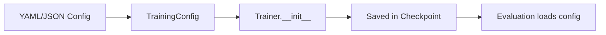

# IDB 1.2 Training Sub-Block — Best Practices Guide

**IDB ID:** 1.2  
**Domain:** Core ML Engine  
**Version:** 1.0  
**Last Updated:** 2026-01-23

---

## Purpose

This document establishes consistent training-related patterns for all teams working with the LSTM_PFD project. Following these conventions ensures interoperability between training, evaluation, and dashboard components.

---

## Table of Contents

1. [Training Loop Patterns](#1-training-loop-patterns)
2. [Callback System Conventions](#2-callback-system-conventions)
3. [Loss Function Patterns](#3-loss-function-patterns)
4. [Checkpoint Conventions](#4-checkpoint-conventions)
5. [Reproducibility Requirements](#5-reproducibility-requirements)
6. [Cross-Team Coordination](#6-cross-team-coordination)

---

## 1. Training Loop Patterns

### 1.1 Standard Training Loop Structure

All trainers should follow this canonical structure:

```python
def fit(self, num_epochs: int) -> Dict[str, List[float]]:
    """Main training loop."""
    for epoch in range(num_epochs):
        self.current_epoch = epoch

        # 1. Training phase
        train_metrics = self.train_epoch()

        # 2. Validation phase
        val_metrics = self.validate_epoch()

        # 3. Scheduler step (see Section 1.4)
        self._step_scheduler(val_metrics)

        # 4. Logging
        self._log_epoch(train_metrics, val_metrics)

        # 5. Callbacks
        self._run_callbacks('on_epoch_end', epoch, {**train_metrics, **val_metrics})

        # 6. Checkpointing
        self._maybe_save_checkpoint(val_metrics)

    return self.history
```

### 1.2 Epoch/Batch Logging Convention

#### Required History Keys

All trainers **MUST** populate these standard keys:

| Key          | Type    | Description                            |
| ------------ | ------- | -------------------------------------- |
| `train_loss` | `float` | Average training loss for epoch        |
| `train_acc`  | `float` | Training accuracy (0-100 scale)        |
| `val_loss`   | `float` | Validation loss (if val_loader exists) |
| `val_acc`    | `float` | Validation accuracy (0-100 scale)      |
| `lr`         | `float` | Learning rate at end of epoch          |

#### Optional Extended Keys

| Key                  | Type    | When to Use                  |
| -------------------- | ------- | ---------------------------- |
| `train_physics_loss` | `float` | PINN training                |
| `val_physics_loss`   | `float` | PINN training                |
| `gradient_norm`      | `float` | When using `GradientMonitor` |

#### Logging Format

```python
# Correct: Use structured logger
from utils.logging import get_logger
logger = get_logger(__name__)

# Epoch summary (always log)
logger.info(f"Epoch {epoch+1}/{num_epochs} - "
            f"Train Loss: {train_loss:.4f}, Train Acc: {train_acc:.2f}%, "
            f"Val Loss: {val_loss:.4f}, Val Acc: {val_acc:.2f}%, "
            f"LR: {current_lr:.6f}")

# Progress bar format
pbar.set_postfix({
    'loss': f"{running_loss / total:.4f}",
    'acc': f"{100. * correct / total:.2f}%"
})
```

### 1.3 Metrics Accumulation Pattern

**Required Pattern:**

```python
def train_epoch(self) -> Dict[str, float]:
    self.model.train()

    # Accumulators (reset per epoch)
    total_loss = 0.0
    correct = 0
    total = 0

    for batch_idx, (inputs, targets) in enumerate(self.train_loader):
        inputs = inputs.to(self.device)
        targets = targets.to(self.device)

        # Forward pass
        outputs = self.model(inputs)
        loss = self.criterion(outputs, targets)

        # Accumulate (sample-weighted)
        total_loss += loss.item() * inputs.size(0)
        _, predicted = outputs.max(1)
        total += targets.size(0)
        correct += predicted.eq(targets).sum().item()

        # Backward + optimize...

    # Return per-sample averages
    return {
        'train_loss': total_loss / total,
        'train_acc': 100. * correct / total
    }
```

> [!IMPORTANT]
> Always weight by batch size (`loss.item() * inputs.size(0)`) to handle variable-sized batches correctly.

### 1.4 Learning Rate Scheduler Step

**Correct Pattern:**

```python
def _step_scheduler(self, val_metrics: Dict[str, float]):
    if self.lr_scheduler is None:
        return

    # ReduceLROnPlateau requires metric argument
    if isinstance(self.lr_scheduler, torch.optim.lr_scheduler.ReduceLROnPlateau):
        metric = val_metrics.get('loss', val_metrics.get('val_loss'))
        self.lr_scheduler.step(metric)
    else:
        self.lr_scheduler.step()
```

> [!CAUTION]
> Never call `scheduler.step()` without the metric for `ReduceLROnPlateau`. This is a common bug that silently breaks learning rate reduction.

### 1.5 Gradient Accumulation

**Pattern:**

```python
gradient_accumulation_steps = 4

for batch_idx, (inputs, targets) in enumerate(dataloader):
    # Scale loss by accumulation steps
    loss = criterion(outputs, targets) / gradient_accumulation_steps
    loss.backward()

    # Only step optimizer every N batches
    if (batch_idx + 1) % gradient_accumulation_steps == 0:
        # Clip gradients BEFORE optimizer step
        if max_grad_norm > 0:
            torch.nn.utils.clip_grad_norm_(model.parameters(), max_grad_norm)

        optimizer.step()
        optimizer.zero_grad()
```

### 1.6 Mixed Precision Training

**Standard Pattern:**

```python
from torch.cuda.amp import autocast, GradScaler

scaler = GradScaler()

for inputs, targets in dataloader:
    with autocast():
        outputs = model(inputs)
        loss = criterion(outputs, targets)

    scaler.scale(loss).backward()

    # Unscale before clipping
    scaler.unscale_(optimizer)
    torch.nn.utils.clip_grad_norm_(model.parameters(), max_grad_norm)

    scaler.step(optimizer)
    scaler.update()
    optimizer.zero_grad()
```

---

## 2. Callback System Conventions

### 2.1 Available Hooks

Use the callback system from [cnn_callbacks.py](file:///c:/Users/COWLAR/projects/LSTM_PFD/packages/core/training/cnn_callbacks.py):

| Hook             | When Called        | Available Args                       |
| ---------------- | ------------------ | ------------------------------------ |
| `on_train_begin` | Before first epoch | `logs: Dict` (empty)                 |
| `on_train_end`   | After last epoch   | `logs: Dict` (final metrics)         |
| `on_epoch_begin` | Before each epoch  | `epoch: int`, `logs: Dict`           |
| `on_epoch_end`   | After each epoch   | `epoch: int`, `logs: Dict` (metrics) |
| `on_batch_begin` | Before each batch  | `batch: int`, `logs: Dict`           |
| `on_batch_end`   | After each batch   | `batch: int`, `logs: Dict`           |

### 2.2 Registering Callbacks

**Pattern:**

```python
from training.cnn_callbacks import (
    CallbackList,
    LearningRateMonitor,
    GradientMonitor,
    EarlyStoppingCallback,
    ModelCheckpointCallback
)

# Create callback list
callbacks = CallbackList([
    LearningRateMonitor(optimizer, verbose=True),
    GradientMonitor(model, log_interval=100, alert_threshold=10.0),
    EarlyStoppingCallback(
        monitor='val_loss',
        patience=10,
        mode='min',
        min_delta=1e-4
    ),
    ModelCheckpointCallback(
        checkpoint_dir=Path('./checkpoints'),
        model=model,
        optimizer=optimizer,
        monitor='val_acc',
        mode='max',
        save_best_only=True
    )
])

# In training loop
callbacks.on_train_begin()
for epoch in range(num_epochs):
    callbacks.on_epoch_begin(epoch)
    # ... training ...
    callbacks.on_epoch_end(epoch, {'train_loss': 0.5, 'val_acc': 92.0})
callbacks.on_train_end()
```

### 2.3 Implementing New Callbacks

**Template:**

```python
from training.cnn_callbacks import Callback

class CustomCallback(Callback):
    """
    Short description of what this callback does.

    Args:
        param1: Description
        param2: Description

    Example:
        >>> callback = CustomCallback(param1=value)
    """

    def __init__(self, param1, param2):
        self.param1 = param1
        self.state = {}  # Internal state

    def on_train_begin(self, logs=None):
        # Initialize state
        self.state['best_value'] = float('inf')

    def on_epoch_end(self, epoch: int, logs=None):
        if logs is None:
            return

        # Access metrics from logs
        current_value = logs.get('val_loss')
        if current_value is not None:
            # Your logic here
            pass

    def get_state(self) -> Dict:
        """Optional: expose internal state for inspection."""
        return self.state
```

### 2.4 Standard Callbacks to Always Include

| Callback                  | Purpose                | When to Use                   |
| ------------------------- | ---------------------- | ----------------------------- |
| `LearningRateMonitor`     | Track LR changes       | Always                        |
| `GradientMonitor`         | Detect gradient issues | Development, debugging        |
| `ModelCheckpointCallback` | Save best model        | Production training           |
| `EarlyStoppingCallback`   | Prevent overfitting    | When validation set available |
| `TimingCallback`          | Profile training time  | Performance optimization      |

---

## 3. Loss Function Patterns

### 3.1 Loss Function Organization

**Canonical Imports:**

```python
# Classification losses (use cnn_losses as primary source)
from training.cnn_losses import (
    LabelSmoothingCrossEntropy,
    FocalLoss,
    SupConLoss,
    create_criterion
)

# Physics losses (for PINN models)
from training.physics_loss_functions import (
    FrequencyConsistencyLoss,
    PhysicalConstraintLoss
)

# Knowledge distillation
from training.knowledge_distillation import DistillationLoss
```

### 3.2 Creating Loss Functions

**Use Factory Functions:**

```python
from training.cnn_losses import create_criterion

# Standard classification
criterion = create_criterion('label_smoothing', smoothing=0.1)

# For imbalanced classes
criterion = create_criterion('focal', gamma=2.0, alpha=class_weights)

# Supervised contrastive (requires embeddings, not logits)
criterion = create_criterion('supcon', temperature=0.1)
```

### 3.3 Adding New Loss Functions

**Template:**

```python
# In training/cnn_losses.py (classification) or training/physics_loss_functions.py (physics)

class NewLoss(nn.Module):
    """
    Short description.

    Reference: Paper citation if applicable

    Args:
        param1: Description
        param2: Description
    """

    def __init__(self, param1: float = 1.0, param2: float = 0.1):
        super().__init__()
        self.param1 = param1
        self.param2 = param2

    def forward(
        self,
        inputs: torch.Tensor,  # [B, num_classes] or model output
        targets: torch.Tensor  # [B] class indices
    ) -> torch.Tensor:
        """
        Compute loss.

        Args:
            inputs: Predicted logits [B, num_classes]
            targets: Ground truth labels [B]

        Returns:
            Scalar loss tensor
        """
        # Implementation
        loss = ...
        return loss
```

### 3.4 Multi-Task Loss Weighting

**Standard Pattern:**

```python
class MultiTaskLoss(nn.Module):
    """Combines multiple loss terms with configurable weights."""

    def __init__(
        self,
        classification_weight: float = 1.0,
        physics_weight: float = 0.1,
        auxiliary_weight: float = 0.05
    ):
        super().__init__()
        self.classification_loss = nn.CrossEntropyLoss()
        self.physics_loss = FrequencyConsistencyLoss()

        # Store weights as buffers (saved in state_dict)
        self.register_buffer('w_cls', torch.tensor(classification_weight))
        self.register_buffer('w_phys', torch.tensor(physics_weight))
        self.register_buffer('w_aux', torch.tensor(auxiliary_weight))

    def forward(self, outputs, targets, signal, metadata=None):
        # Compute individual losses
        loss_cls = self.classification_loss(outputs, targets)
        loss_phys = self.physics_loss(signal, outputs, metadata)

        # Combine with weights
        total_loss = (
            self.w_cls * loss_cls +
            self.w_phys * loss_phys
        )

        # Return breakdown for logging
        return total_loss, {
            'classification_loss': loss_cls.item(),
            'physics_loss': loss_phys.item(),
            'total_loss': total_loss.item()
        }
```

---

## 4. Checkpoint Conventions

### 4.1 Standard Checkpoint Contents

**Minimum Required Fields:**

```python
checkpoint = {
    # Model state
    'model_state_dict': model.state_dict(),

    # Optimizer state (for resume training)
    'optimizer_state_dict': optimizer.state_dict(),

    # Training progress
    'epoch': current_epoch,
    'best_val_acc': best_val_acc,
    'best_val_loss': best_val_loss,

    # History (for plotting)
    'history': {
        'train_loss': [...],
        'val_loss': [...],
        'train_acc': [...],
        'val_acc': [...],
        'lr': [...]
    }
}
```

**Recommended Additional Fields:**

```python
checkpoint.update({
    # Scheduler state
    'scheduler_state_dict': scheduler.state_dict() if scheduler else None,

    # Mixed precision scaler
    'scaler_state_dict': scaler.state_dict() if scaler else None,

    # Reproducibility
    'random_state': {
        'torch': torch.get_rng_state(),
        'torch_cuda': torch.cuda.get_rng_state_all() if torch.cuda.is_available() else None,
        'numpy': np.random.get_state(),
        'python': random.getstate()
    },

    # Metadata
    'config': training_config.to_dict(),
    'model_class': model.__class__.__name__,
    'timestamp': datetime.now().isoformat()
})
```

### 4.2 Filename Conventions

| File                        | Purpose                  | When Saved            |
| --------------------------- | ------------------------ | --------------------- |
| `best_model.pth`            | Best validation accuracy | When val_acc improves |
| `latest_model.pth`          | Most recent checkpoint   | Every epoch           |
| `checkpoint_epoch{NNN}.pth` | Periodic backup          | Every N epochs        |
| `final_model.pth`           | End of training          | Training completion   |

**Naming Pattern:**

```python
def get_checkpoint_filename(prefix: str, epoch: int, metric: float, metric_name: str) -> str:
    """Generate standardized checkpoint filename."""
    return f"{prefix}_epoch{epoch:03d}_{metric_name}{metric:.4f}.pth"

# Example: checkpoint_epoch025_val_acc92.5000.pth
```

### 4.3 Best Checkpoint Selection Logic

**Standard Pattern:**

```python
def _maybe_save_checkpoint(self, val_metrics: Dict[str, float]):
    """Save checkpoint if validation metric improved."""
    if not val_metrics:
        return

    current_value = val_metrics.get(self.monitor_metric)
    if current_value is None:
        return

    is_better = (
        (self.mode == 'max' and current_value > self.best_value) or
        (self.mode == 'min' and current_value < self.best_value)
    )

    if is_better:
        self.best_value = current_value
        self.save_checkpoint('best_model.pth')
        logger.info(f"✓ New best model: {self.monitor_metric}={current_value:.4f}")
```

### 4.4 Loading Checkpoints

**Standard Pattern:**

```python
def load_checkpoint(self, filepath: Path, strict: bool = True):
    """
    Load checkpoint and restore training state.

    Args:
        filepath: Path to checkpoint file
        strict: Require all keys to match (default: True)
    """
    checkpoint = torch.load(filepath, map_location=self.device)

    # Restore model
    self.model.load_state_dict(checkpoint['model_state_dict'], strict=strict)

    # Restore optimizer (requires model on correct device first)
    self.optimizer.load_state_dict(checkpoint['optimizer_state_dict'])

    # Restore training state
    self.current_epoch = checkpoint['epoch']
    self.best_val_acc = checkpoint.get('best_val_acc', 0.0)
    self.best_val_loss = checkpoint.get('best_val_loss', float('inf'))
    self.history = checkpoint.get('history', {})

    # Restore scheduler if present
    if self.lr_scheduler and 'scheduler_state_dict' in checkpoint:
        self.lr_scheduler.load_state_dict(checkpoint['scheduler_state_dict'])

    # Restore scaler if present
    if self.scaler and 'scaler_state_dict' in checkpoint:
        self.scaler.load_state_dict(checkpoint['scaler_state_dict'])

    logger.info(f"Checkpoint loaded: epoch={self.current_epoch}, "
                f"best_val_acc={self.best_val_acc:.2f}%")
```

---

## 5. Reproducibility Requirements

### 5.1 Seed Setting

**Required at Training Start:**

```python
def set_seed(seed: int = 42, deterministic: bool = True):
    """Set all random seeds for reproducibility."""
    import random
    import numpy as np
    import torch

    random.seed(seed)
    np.random.seed(seed)
    torch.manual_seed(seed)

    if torch.cuda.is_available():
        torch.cuda.manual_seed(seed)
        torch.cuda.manual_seed_all(seed)

    if deterministic:
        torch.backends.cudnn.deterministic = True
        torch.backends.cudnn.benchmark = False
        # PyTorch 2.0+
        if hasattr(torch, 'use_deterministic_algorithms'):
            torch.use_deterministic_algorithms(True)
```

> [!WARNING]
> Deterministic mode can significantly slow down training ($\approx$ 10-30%). Use only when exact reproducibility is required.

### 5.2 Deterministic Mode

When `TrainingConfig.deterministic = True`:

| Setting                        | Value   | Impact                    |
| ------------------------------ | ------- | ------------------------- |
| `cudnn.deterministic`          | `True`  | Reproducible convolutions |
| `cudnn.benchmark`              | `False` | Disable auto-tuning       |
| `use_deterministic_algorithms` | `True`  | All ops deterministic     |

### 5.3 What to Log for Reproducibility

**Minimum Logging Requirements:**

```python
# Log at training start
logger.info(f"=== Training Configuration ===")
logger.info(f"Seed: {config.seed}")
logger.info(f"Deterministic: {config.deterministic}")
logger.info(f"PyTorch version: {torch.__version__}")
logger.info(f"CUDA version: {torch.version.cuda}")
logger.info(f"cuDNN version: {torch.backends.cudnn.version()}")
logger.info(f"Device: {device}")
logger.info(f"Model: {model.__class__.__name__}")
logger.info(f"Optimizer: {optimizer.__class__.__name__}")
logger.info(f"Scheduler: {scheduler.__class__.__name__ if scheduler else None}")
logger.info(f"Batch size: {batch_size}")
logger.info(f"Learning rate: {lr}")
logger.info(f"Weight decay: {weight_decay}")
logger.info(f"Mixed precision: {mixed_precision}")
```

### 5.4 DataLoader Reproducibility

```python
# Worker seed generator
def seed_worker(worker_id):
    worker_seed = torch.initial_seed() % 2**32
    np.random.seed(worker_seed)
    random.seed(worker_seed)

# Create reproducible generator
g = torch.Generator()
g.manual_seed(seed)

train_loader = DataLoader(
    dataset,
    batch_size=batch_size,
    shuffle=True,
    num_workers=num_workers,
    worker_init_fn=seed_worker,
    generator=g
)
```

---

## 6. Cross-Team Coordination

### 6.1 Evaluation Team — Loading Trained Models

**Standard Loading Pattern:**

```python
from pathlib import Path
import torch

def load_model_for_evaluation(
    checkpoint_path: Path,
    model_class,
    device: str = 'cuda'
):
    """
    Load a trained model for evaluation.

    Args:
        checkpoint_path: Path to checkpoint file
        model_class: Model class (e.g., CNN1D, ResNet18_1D)
        device: Target device

    Returns:
        model: Loaded model in eval mode
        metadata: Training metadata dict
    """
    checkpoint = torch.load(checkpoint_path, map_location=device)

    # Instantiate model (use config if available)
    if 'model_class' in checkpoint:
        assert checkpoint['model_class'] == model_class.__name__

    model = model_class(num_classes=NUM_CLASSES)
    model.load_state_dict(checkpoint['model_state_dict'])
    model = model.to(device)
    model.eval()

    # Extract metadata
    metadata = {
        'epoch': checkpoint.get('epoch'),
        'best_val_acc': checkpoint.get('best_val_acc'),
        'best_val_loss': checkpoint.get('best_val_loss'),
        'history': checkpoint.get('history', {})
    }

    return model, metadata
```

**Expected Checkpoint Keys:**

| Key                    | Required | Type                     |
| ---------------------- | -------- | ------------------------ |
| `model_state_dict`     | ✅ Yes   | `Dict`                   |
| `epoch`                | ✅ Yes   | `int`                    |
| `best_val_acc`         | ✅ Yes   | `float`                  |
| `best_val_loss`        | ✅ Yes   | `float`                  |
| `history`              | ✅ Yes   | `Dict[str, List[float]]` |
| `optimizer_state_dict` | ⚪ No    | `Dict`                   |
| `scheduler_state_dict` | ⚪ No    | `Dict`                   |

### 6.2 Dashboard — Training Progress

**Required Trainer Attributes:**

```python
# Dashboard expects these to be accessible
trainer.current_epoch      # int: Current epoch number
trainer.history            # Dict: Training history
trainer.best_val_acc       # float: Best validation accuracy
trainer.best_val_loss      # float: Best validation loss
```

**History Format:**

```python
history = {
    'train_loss': [0.8, 0.5, 0.3, ...],  # Per-epoch values
    'val_loss': [0.7, 0.4, 0.35, ...],
    'train_acc': [60.0, 75.0, 85.0, ...],  # 0-100 scale
    'val_acc': [65.0, 80.0, 88.0, ...],
    'lr': [0.001, 0.001, 0.0008, ...]
}
```

**Live Progress Updates:**

If streaming to dashboard, emit these events:

```python
# Event: epoch_complete
{
    'event': 'epoch_complete',
    'epoch': 5,
    'total_epochs': 100,
    'train_loss': 0.34,
    'train_acc': 87.5,
    'val_loss': 0.28,
    'val_acc': 91.2,
    'lr': 0.0008,
    'elapsed_time': 45.3
}
```

### 6.3 Configuration Passing

**Standard Config Flow:**



**Config Dataclass Pattern:**

```python
from dataclasses import dataclass, asdict
from config.training_config import TrainingConfig

# Load from YAML
config = TrainingConfig.from_yaml('config/training_config.yaml')

# Pass to trainer
trainer = CNNTrainer(
    model=model,
    train_loader=train_loader,
    optimizer=create_optimizer(config.optimizer),
    lr_scheduler=create_scheduler(config.scheduler),
    mixed_precision=config.mixed_precision.enabled,
    **asdict(config.callbacks)
)

# Save config in checkpoint
checkpoint['config'] = config.to_dict()
```

### 6.4 Inter-Team API Contracts

| From     | To         | Contract                         |
| -------- | ---------- | -------------------------------- |
| Training | Evaluation | Checkpoint format (Section 4.1)  |
| Training | Dashboard  | History format (Section 6.2)     |
| Config   | Training   | `TrainingConfig` dataclass       |
| Models   | Training   | `model.forward(x) → logits`      |
| Data     | Training   | `(inputs, targets)` batch format |

---

## Quick Reference Card

### Training Checklist

- [ ] Set random seed at start
- [ ] Use structured logger (`get_logger(__name__)`)
- [ ] Register callbacks via `CallbackList`
- [ ] Accumulate metrics weighted by batch size
- [ ] Handle `ReduceLROnPlateau` scheduler correctly
- [ ] Save checkpoint with all required fields
- [ ] Log training config at start

### Common Mistakes to Avoid

| Mistake                                  | Correct Approach               |
| ---------------------------------------- | ------------------------------ |
| `scheduler.step()` without metric        | Check scheduler type first     |
| Metrics not batch-weighted               | `loss.item() * batch_size`     |
| Gradient clip after optimizer step       | Clip before `optimizer.step()` |
| Missing `model.train()` / `model.eval()` | Always set explicitly          |
| Checkpoint missing `history`             | Always include full history    |

---

_Best Practices Guide — IDB 1.2 Training Sub-Block_
