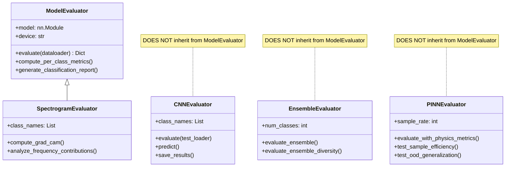

# IDB 1.3 Evaluation Sub-Block Analysis

**Domain:** Core ML Engine  
**Primary Directory:** `packages/core/evaluation/`  
**Files Analyzed:** 16 files  
**Analysis Date:** 2026-01-23

---

## Executive Summary

The Evaluation Sub-Block is a **well-organized and comprehensive** evaluation framework for bearing fault diagnosis models. It includes 5 specialized evaluators, 2 visualization tools, 4 analysis utilities, and 3 comparison frameworks. The codebase demonstrates strong design patterns with good documentation, but suffers from **code duplication across evaluators**, **inconsistent output formats**, and an **empty `__init__.py`** that limits module discoverability.

---

## 1. Current State Assessment

### 1.1 File Inventory

| File                              | Size      | Purpose                        |
| --------------------------------- | --------- | ------------------------------ |
| `evaluator.py`                    | 167 lines | Base `ModelEvaluator` class    |
| `cnn_evaluator.py`                | 463 lines | CNN-specific evaluation        |
| `ensemble_evaluator.py`           | 442 lines | Ensemble metrics + diversity   |
| `pinn_evaluator.py`               | 472 lines | Physics-informed evaluation    |
| `spectrogram_evaluator.py`        | 399 lines | 2D spectrogram analysis        |
| `attention_visualization.py`      | 453 lines | Attention heatmaps & rollout   |
| `physics_interpretability.py`     | 504 lines | Physics feature visualization  |
| `error_analysis.py`               | 485 lines | Misclassification analysis     |
| `architecture_comparison.py`      | 561 lines | FLOPs, params, Pareto frontier |
| `time_vs_frequency_comparison.py` | 488 lines | Time vs frequency domain       |
| `ensemble_voting.py`              | 439 lines | Soft/hard voting, stacking     |
| `benchmark.py`                    | 91 lines  | Classical ML comparison        |
| `roc_analyzer.py`                 | 85 lines  | ROC curves & AUC               |
| `confusion_analyzer.py`           | 99 lines  | Confusion matrix analysis      |
| `robustness_tester.py`            | 113 lines | Noise & dropout testing        |
| `__init__.py`                     | 4 lines   | Empty exports                  |

### 1.2 Metric Types Computed

| Category               | Metrics                                        | Location                           |
| ---------------------- | ---------------------------------------------- | ---------------------------------- |
| **Classification**     | Accuracy, Precision, Recall, F1                | All evaluators                     |
| **Per-Class**          | Per-class accuracy, support, confusion matrix  | `evaluator.py`, `cnn_evaluator.py` |
| **ROC/AUC**            | OVR ROC curves, macro-AUC                      | `roc_analyzer.py`                  |
| **Ensemble Diversity** | Disagreement, Q-statistic, correlation         | `ensemble_evaluator.py`            |
| **Physics-Aware**      | Frequency consistency, prediction plausibility | `pinn_evaluator.py`                |
| **Complexity**         | Parameters, FLOPs, inference time, memory      | `architecture_comparison.py`       |
| **Robustness**         | Noise tolerance, feature dropout tolerance     | `robustness_tester.py`             |

### 1.3 Evaluator Inheritance Hierarchy



> [!WARNING]
> Only `SpectrogramEvaluator` inherits from `ModelEvaluator`. Other evaluators (`CNNEvaluator`, `EnsembleEvaluator`, `PINNEvaluator`) are standalone classes that duplicate base functionality.

### 1.4 Output Format Consistency

| Evaluator              | Returns                            | Serialization           |
| ---------------------- | ---------------------------------- | ----------------------- |
| `ModelEvaluator`       | `Dict` with numpy arrays           | None built-in           |
| `CNNEvaluator`         | `Dict` with numpy arrays           | `save_results()` → JSON |
| `EnsembleEvaluator`    | `Dict` with auto-plots             | Optional save_dir       |
| `PINNEvaluator`        | `Dict` with nested physics_metrics | None built-in           |
| `SpectrogramEvaluator` | `Dict` with numpy arrays           | None built-in           |

> [!IMPORTANT]
> **Inconsistency:** Only `CNNEvaluator` has a `save_results()` method. Others lack standardized serialization.

### 1.5 Visualization Tools Standalone Status

| Tool                          | Standalone? | Dependencies                                    |
| ----------------------------- | ----------- | ----------------------------------------------- |
| `attention_visualization.py`  | ✅ Yes      | `torch`, `matplotlib`, `seaborn`                |
| `physics_interpretability.py` | ⚠️ Partial  | Requires `bearing_dynamics`, `fault_signatures` |

The visualization tools are designed as utility functions (not classes) and can be used independently, though `physics_interpretability` has tight coupling to the physics models.

---

## 2. Critical Issues Identification

### P0: Critical Issues

| ID   | Issue                        | File          | Impact                                                 |
| ---- | ---------------------------- | ------------- | ------------------------------------------------------ |
| P0-1 | **Empty `__init__.py`**      | `__init__.py` | No module exports; imports require full paths          |
| P0-2 | **Inconsistent inheritance** | Multiple      | Code duplication; 3 evaluators don't inherit from base |

### P1: High Priority Issues

| ID   | Issue                                  | File                | Impact                                                   |
| ---- | -------------------------------------- | ------------------- | -------------------------------------------------------- |
| P1-1 | **Duplicated evaluation loops**        | All evaluators      | Same forward pass logic repeated 5x                      |
| P1-2 | **Memory issues with large test sets** | `error_analysis.py` | Stores all signals in `misclassified_examples` list      |
| P1-3 | **No standard output schema**          | Multiple            | Hard to compare results across evaluators                |
| P1-4 | **Hardcoded constants import**         | All files           | `from utils.constants import NUM_CLASSES, SIGNAL_LENGTH` |

### P2: Medium Priority Issues

| ID   | Issue                             | File                         | Impact                                                  |
| ---- | --------------------------------- | ---------------------------- | ------------------------------------------------------- |
| P2-1 | **Incomplete robustness tests**   | `robustness_tester.py`       | Missing temporal drift testing (mentioned in docstring) |
| P2-2 | **No progress callbacks**         | All evaluators               | Can't monitor long evaluations                          |
| P2-3 | **Simplified FLOPs estimation**   | `architecture_comparison.py` | Docstring admits it's "simplified"                      |
| P2-4 | **Missing visualization for ROC** | `roc_analyzer.py`            | Computes curves but no plotting function                |
| P2-5 | **Stale import path**             | `spectrogram_evaluator.py`   | Uses `sys.path.insert()` hack                           |

### Memory Issue Detail (P1-2)

```python
# error_analysis.py:112-119
for sample_idx, (true_class, pred_class) in enumerate(zip(all_labels, all_predictions)):
    if true_class != pred_class:
        misclassified.append({
            'index': sample_idx,
            'signal': all_signals[sample_idx],  # ⚠️ Full signal tensor stored
            'true_class': true_class,
            ...
        })
```

This can consume gigabytes of memory if thousands of samples are misclassified on a large test set.

---

## 3. "If I Could Rewrite This" Retrospective

### 3.1 Is There Too Much Duplication Across Evaluators?

**Yes.** The following code patterns are duplicated across multiple evaluators:

| Pattern                          | Files Duplicating It |
| -------------------------------- | -------------------- |
| Model eval mode setup            | All 5 evaluators     |
| `torch.no_grad()` loop           | All 5 evaluators     |
| Confusion matrix computation     | 4 evaluators         |
| Classification report generation | 3 evaluators         |
| Per-class metrics                | 4 evaluators         |

**Recommendation:** Create a unified `BaseEvaluator` with abstract hooks:

```python
class BaseEvaluator:
    def evaluate(self, dataloader) -> EvaluationResult:
        self.model.eval()
        with torch.no_grad():
            for batch in dataloader:
                self._process_batch(batch)  # Abstract
        return self._compute_metrics()     # Abstract
```

### 3.2 Should Metrics Be Computed Lazily or Eagerly?

**Current:** All metrics computed eagerly in a single `evaluate()` call.

**Problem:** Computing all 15+ metrics is wasteful if only accuracy is needed.

**Recommendation:** Lazy computation with caching:

```python
class EvaluationResult:
    @cached_property
    def confusion_matrix(self):
        return confusion_matrix(self._targets, self._predictions)

    @cached_property
    def per_class_f1(self):
        return precision_recall_fscore_support(...)
```

### 3.3 Is the Results Storage Format Extensible?

**No.** Current issues:

1. **No schema enforcement:** Results are plain dictionaries
2. **No versioning:** Can't track what metrics were available in older runs
3. **No metadata:** Missing model config, dataset info, timestamps

**Recommendation:** Create a structured `EvaluationResult` dataclass:

```python
@dataclass
class EvaluationResult:
    accuracy: float
    confusion_matrix: np.ndarray
    per_class_metrics: Dict[str, PerClassMetrics]
    timestamp: datetime
    model_config: Dict
    dataset_info: Dict

    def to_json(self) -> str: ...
    def to_mlflow(self) -> None: ...
```

---

## 4. Technical Debt Inventory

### High Priority

| Item                      | Effort | Impact                               |
| ------------------------- | ------ | ------------------------------------ |
| Fix inheritance hierarchy | 2 days | Eliminates 500+ lines of duplication |
| Populate `__init__.py`    | 1 hour | Enables clean imports                |
| Standardize output schema | 1 day  | Cross-evaluator compatibility        |

### Medium Priority

| Item                                | Effort  | Impact                       |
| ----------------------------------- | ------- | ---------------------------- |
| Add lazy metric computation         | 2 days  | Performance + flexibility    |
| Fix memory issue in `ErrorAnalyzer` | 2 hours | Enables large-scale analysis |
| Complete `RobustnessTester`         | 1 day   | Missing temporal drift test  |
| Add ROC plotting                    | 2 hours | Complete analysis pipeline   |

### Low Priority

| Item                              | Effort  | Impact                      |
| --------------------------------- | ------- | --------------------------- |
| Use proper FLOP counting library  | 1 hour  | Accurate complexity metrics |
| Remove `sys.path` hacks           | 30 min  | Cleaner imports             |
| Add evaluation progress callbacks | 4 hours | Better UX for long runs     |

---

## 5. Good Practices Observed

### 5.1 Comprehensive Documentation

Every public function includes detailed docstrings with Args/Returns sections.

### 5.2 Sensible Defaults

```python
device: str = 'cuda' if torch.cuda.is_available() else 'cpu'
```

### 5.3 Physics-Aware Evaluation

The `PINNEvaluator` adds domain-specific metrics like frequency consistency and prediction plausibility—a novel contribution for PINN evaluation.

### 5.4 Multi-Dimensional Comparisons

The `architecture_comparison.py` provides Pareto frontier analysis for accuracy vs. complexity trade-offs.

### 5.5 Modular Visualization

Attention and physics visualization are separate, reusable modules.

---

## 6. Recommendations Summary

| Priority | Action                                                    |
| -------- | --------------------------------------------------------- |
| **P0**   | Populate `__init__.py` with standard exports              |
| **P0**   | Refactor evaluators to inherit from common base           |
| **P1**   | Create `EvaluationResult` dataclass for consistent output |
| **P1**   | Fix memory leak in `ErrorAnalyzer` (store indices only)   |
| **P2**   | Add lazy metric computation                               |
| **P2**   | Complete `RobustnessTester` with temporal drift test      |

---

## 7. File-Level Notes

### [evaluator.py](file:///c:/Users/COWLAR/projects/LSTM_PFD/packages/core/evaluation/evaluator.py)

Clean base implementation but underutilized by other evaluators.

### [cnn_evaluator.py](file:///c:/Users/COWLAR/projects/LSTM_PFD/packages/core/evaluation/cnn_evaluator.py)

Most complete evaluator with `save_results()`. Should be the template for others.

### [pinn_evaluator.py](file:///c:/Users/COWLAR/projects/LSTM_PFD/packages/core/evaluation/pinn_evaluator.py)

Novel physics-aware metrics. Excellent domain-specific extension.

### [error_analysis.py](file:///c:/Users/COWLAR/projects/LSTM_PFD/packages/core/evaluation/error_analysis.py)

Comprehensive but has memory issues. The `find_hard_examples()` method is particularly useful.

### [roc_analyzer.py](file:///c:/Users/COWLAR/projects/LSTM_PFD/packages/core/evaluation/roc_analyzer.py)

Incomplete—computes but doesn't plot. Should add `plot_roc_curves()` method.
