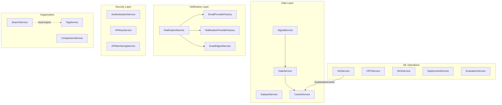

# IDB 2.2: Backend Services Sub-Block Analysis

> **IDB ID:** 2.2  
> **Domain:** Dashboard Platform  
> **Primary Directory:** `packages/dashboard/services/`  
> **Independence Score:** 5/10 (High-coupling central orchestration layer)  
> **Analysis Date:** 2026-01-22

---

## Executive Summary

The Backend Services sub-block forms the **central "brain"** of the LSTM_PFD Dashboard Platform. It contains **24 specialized services** plus a `notification_providers/` subdirectory with 6 additional files implementing a provider factory pattern. This layer orchestrates interactions between the database, ML Engine (core package), and the user-facing UI and Async Task layers.

### Key Findings

| Category                           | Status                                                                                                                        |
| ---------------------------------- | ----------------------------------------------------------------------------------------------------------------------------- |
| **Total Services**                 | 24 service files + 6 notification provider files                                                                              |
| **Largest Services (God-Classes)** | `NotificationService` (713 lines), `HPOService` (634 lines), `SearchService` (554 lines), `AuthenticationService` (545 lines) |
| **Exception Handling**             | 70+ broad `except Exception` blocks detected                                                                                  |
| **Circular Dependencies**          | Mitigated via local imports (e.g., `SearchService` → `TagService`)                                                            |
| **Rate Limiting**                  | Mixed: Redis-backed for email, **in-memory for 2FA (critical issue)**                                                         |
| **Transaction Management**         | Consistent `with get_db_session()` context manager pattern                                                                    |

---

## Task 1: Current State Assessment

### 1.1 Service Inventory

#### Core Business Services

| Service                                                                                                                  | Lines | Primary Responsibility        | Key Features                                               |
| ------------------------------------------------------------------------------------------------------------------------ | ----- | ----------------------------- | ---------------------------------------------------------- |
| [NotificationService](file:///c:/Users/COWLAR/projects/LSTM_PFD/packages/dashboard/services/notification_service.py)     | 713   | Multi-channel event routing   | Email, Slack, Teams, webhooks, toast notifications         |
| [AuthenticationService](file:///c:/Users/COWLAR/projects/LSTM_PFD/packages/dashboard/services/authentication_service.py) | 545   | Security & session management | TOTP 2FA, backup codes, login tracking, session revocation |
| [HPOService](file:///c:/Users/COWLAR/projects/LSTM_PFD/packages/dashboard/services/hpo_service.py)                       | 634   | Hyperparameter optimization   | Campaign lifecycle, search space, result export            |
| [XAIService](file:///c:/Users/COWLAR/projects/LSTM_PFD/packages/dashboard/services/xai_service.py)                       | 483   | Explainability orchestration  | SHAP, LIME, Grad-CAM, Integrated Gradients                 |
| [NASService](file:///c:/Users/COWLAR/projects/LSTM_PFD/packages/dashboard/services/nas_service.py)                       | 329   | Neural Architecture Search    | Architecture sampling, hashing, export                     |

#### Data-Centric Services

| Service                                                                                                    | Lines | Primary Responsibility      | Key Features                                   |
| ---------------------------------------------------------------------------------------------------------- | ----- | --------------------------- | ---------------------------------------------- |
| [DataService](file:///c:/Users/COWLAR/projects/LSTM_PFD/packages/dashboard/services/data_service.py)       | 261   | Signal & dataset extraction | HDF5 loading, stat calculation, caching        |
| [DatasetService](file:///c:/Users/COWLAR/projects/LSTM_PFD/packages/dashboard/services/dataset_service.py) | 501   | Dataset CRUD                | Listing, preview, export, archival             |
| [FeatureService](file:///c:/Users/COWLAR/projects/LSTM_PFD/packages/dashboard/services/feature_service.py) | 467   | Feature engineering         | Extraction, importance, selection, correlation |
| [SignalService](file:///c:/Users/COWLAR/projects/LSTM_PFD/packages/dashboard/services/signal_service.py)   | ~70   | Signal data access          | Thin wrapper over `DataService`                |

#### Experiment & Evaluation Services

| Service                                                                                                          | Lines | Primary Responsibility  | Key Features                                      |
| ---------------------------------------------------------------------------------------------------------------- | ----- | ----------------------- | ------------------------------------------------- |
| [SearchService](file:///c:/Users/COWLAR/projects/LSTM_PFD/packages/dashboard/services/search_service.py)         | 554   | Experiment discovery    | Full-text search, tag filtering, saved searches   |
| [TagService](file:///c:/Users/COWLAR/projects/LSTM_PFD/packages/dashboard/services/tag_service.py)               | 391   | Experiment organization | Slug-based tagging, autocomplete, bulk operations |
| [ComparisonService](file:///c:/Users/COWLAR/projects/LSTM_PFD/packages/dashboard/services/comparison_service.py) | 459   | Statistical comparison  | McNemar's test, Friedman test                     |
| [EvaluationService](file:///c:/Users/COWLAR/projects/LSTM_PFD/packages/dashboard/services/evaluation_service.py) | 299   | Model evaluation        | ROC curves, error analysis, robustness testing    |
| [DeploymentService](file:///c:/Users/COWLAR/projects/LSTM_PFD/packages/dashboard/services/deployment_service.py) | 399   | Model operations        | Quantization, ONNX export, pruning, benchmarking  |

#### Security & API Services

| Service                                                                                                                 | Lines | Primary Responsibility | Key Features                                        |
| ----------------------------------------------------------------------------------------------------------------------- | ----- | ---------------------- | --------------------------------------------------- |
| [APIKeyService](file:///c:/Users/COWLAR/projects/LSTM_PFD/packages/dashboard/services/api_key_service.py)               | 396   | API security           | Prefix-based lookup, bcrypt hashing, usage logging  |
| [APIMonitoringService](file:///c:/Users/COWLAR/projects/LSTM_PFD/packages/dashboard/services/api_monitoring_service.py) | 399   | Request analytics      | Latency percentiles (P50/P95/P99), endpoint metrics |
| [WebhookService](file:///c:/Users/COWLAR/projects/LSTM_PFD/packages/dashboard/services/webhook_service.py)              | 448   | Webhook configuration  | CRUD, testing, delivery logs                        |

#### Infrastructure Services

| Service                                                                                                             | Lines | Primary Responsibility | Key Features                                    |
| ------------------------------------------------------------------------------------------------------------------- | ----- | ---------------------- | ----------------------------------------------- |
| [CacheService](file:///c:/Users/COWLAR/projects/LSTM_PFD/packages/dashboard/services/cache_service.py)              | 105   | Redis interface        | JSON serialization, pattern invalidation, stats |
| [MonitoringService](file:///c:/Users/COWLAR/projects/LSTM_PFD/packages/dashboard/services/monitoring_service.py)    | 251   | System health          | psutil metrics, alerting, background monitoring |
| [TestingService](file:///c:/Users/COWLAR/projects/LSTM_PFD/packages/dashboard/services/testing_service.py)          | 390   | QA automation          | pytest runner, coverage, code quality checks    |
| [EmailDigestService](file:///c:/Users/COWLAR/projects/LSTM_PFD/packages/dashboard/services/email_digest_service.py) | 229   | Notification batching  | Celery-based digest processing                  |
| [EmailProvider](file:///c:/Users/COWLAR/projects/LSTM_PFD/packages/dashboard/services/email_provider.py)            | ~300  | Email abstraction      | SendGrid/SMTP factory with rate limiting        |
| [ExplanationCache](file:///c:/Users/COWLAR/projects/LSTM_PFD/packages/dashboard/services/explanation_cache.py)      | ~300  | XAI caching            | Prevents redundant SHAP/LIME computations       |

#### Notification Providers Subdirectory

| File                                                                                                                                                  | Lines | Role                                                    |
| ----------------------------------------------------------------------------------------------------------------------------------------------------- | ----- | ------------------------------------------------------- |
| [base.py](file:///c:/Users/COWLAR/projects/LSTM_PFD/packages/dashboard/services/notification_providers/base.py)                                       | 103   | Abstract base class, `NotificationMessage` dataclass    |
| [factory.py](file:///c:/Users/COWLAR/projects/LSTM_PFD/packages/dashboard/services/notification_providers/factory.py)                                 | 104   | Provider instantiation, feature flag checking           |
| [slack_notifier.py](file:///c:/Users/COWLAR/projects/LSTM_PFD/packages/dashboard/services/notification_providers/slack_notifier.py)                   | ~320  | Slack Block Kit integration, token-bucket rate limiting |
| [teams_notifier.py](file:///c:/Users/COWLAR/projects/LSTM_PFD/packages/dashboard/services/notification_providers/teams_notifier.py)                   | ~240  | Microsoft Teams MessageCard                             |
| [custom_webhook_notifier.py](file:///c:/Users/COWLAR/projects/LSTM_PFD/packages/dashboard/services/notification_providers/custom_webhook_notifier.py) | ~150  | Generic webhook delivery                                |

---

### 1.2 Service Dependencies



#### Key Dependency Patterns

1. **`DataService` → `CacheService`**: Metadata caching for dataset stats
2. **`SignalService` → `DataService`**: Thin wrapper for signal loading
3. **`NotificationService` → Multiple Providers**: Email, Slack, Teams factories
4. **`SearchService` → `TagService`**: **Lazy local import** to avoid circular dependency

---

### 1.3 Database Session Management

All services follow a **consistent context manager pattern**:

```python
with get_db_session() as session:
    # Service logic
    session.add(obj)
    session.commit()
```

> [!TIP]
> **Good Practice**: This pattern ensures proper resource cleanup and transaction rollback on exceptions.

---

### 1.4 Error Handling Patterns

Analysis reveals **70+ instances** of broad exception catching:

```python
except Exception as e:
    logger.error(f"Error: {e}", exc_info=True)
    return False, None, str(e)
```

> [!WARNING]
> **Issue**: Broad `except Exception` masks specific errors. Consider catching specific exceptions (e.g., `SQLAlchemyError`, `ValidationError`).

---

## Task 2: Critical Issues Identification

### 2.1 P0 (Critical) Issues

#### P0-1: In-Memory 2FA Rate Limiting

**Location:** [authentication_service.py:46-48](file:///c:/Users/COWLAR/projects/LSTM_PFD/packages/dashboard/services/authentication_service.py#L46-L48)

```python
# In-memory storage for rate limiting (use Redis in production)
_2fa_attempts: Dict[int, List[datetime]] = defaultdict(list)
_2fa_lockouts: Dict[int, datetime] = {}
```

> [!CAUTION]
> **Security Risk**: In a multi-process/container deployment, rate limiting state is **not shared** between instances. An attacker can bypass lockouts by hitting different workers.

**Recommendation**: Migrate to Redis-backed rate limiting consistent with `EmailRateLimiter`.

---

#### P0-2: Broad Exception Swallowing

**Affected Services**: All 24 services

**Pattern**:

```python
except Exception as e:
    return False, None, str(e)
```

**Risk**:

- Silently swallows programming errors (e.g., `AttributeError`, `TypeError`)
- Returns generic error messages that provide no actionable debugging info
- May mask database connection issues or constraint violations

**Recommendation**:

1. Catch specific exceptions (`SQLAlchemyError`, `ValidationError`, `ValueError`)
2. Re-raise unexpected exceptions for proper error monitoring
3. Use structured error codes instead of string messages

---

### 2.2 P1 (High Priority) Issues

#### P1-1: God-Class Services

| Service                 | Lines | Issue                                                   |
| ----------------------- | ----- | ------------------------------------------------------- |
| `NotificationService`   | 713   | Handles email, webhooks, digests, toasts, templates     |
| `HPOService`            | 634   | Campaign CRUD + search space + export + visualization   |
| `SearchService`         | 554   | Query parsing + SQL building + ranking + saved searches |
| `AuthenticationService` | 545   | 2FA + backup codes + sessions + login history           |

**Recommendation**: Split into focused subservices:

- `NotificationService` → `EmailService`, `WebhookDispatcher`, `ToastService`
- `HPOService` → `HPOCampaignService`, `HPOExportService`, `HPOVisualizationService`

---

#### P1-2: Duplicate Logic: `DataService` vs `DatasetService`

Both services have:

- `_resolve_file_path()` method (copy-pasted)
- `list_datasets()` methods
- HDF5 loading logic

**Recommendation**: Consolidate into single `DatasetService` with `DataService` as thin API facade.

---

#### P1-3: Missing Input Validation

**Example** ([webhook_service.py](file:///c:/Users/COWLAR/projects/LSTM_PFD/packages/dashboard/services/webhook_service.py)):

```python
def create_webhook(user_id: int, provider_type: str, webhook_url: str, ...):
    # No validation of webhook_url format before database insert
```

**Recommendation**: Add validation layer using `pydantic` or custom validators.

---

### 2.3 P2 (Medium Priority) Issues

#### P2-1: Inconsistent Static Methods vs Instance Methods

| Service                 | Pattern                      |
| ----------------------- | ---------------------------- |
| `AuthenticationService` | All `@staticmethod`          |
| `MonitoringService`     | Instance methods with `self` |
| `CacheService`          | All `@staticmethod`          |
| `HPOService`            | All `@staticmethod`          |

**Recommendation**: Standardize on one pattern for consistency.

---

#### P2-2: Missing Type Hints on Internal Methods

Many private methods lack return type hints:

```python
def _load_confusion_matrix(experiment_id: int):  # Missing -> Optional[List[List[int]]]
```

---

#### P2-3: Logging Redundancy

`APIMonitoringService` and `MonitoringService` have overlapping logging utilities. Consider consolidating into shared logging abstraction.

---

## Task 3: "If I Could Rewrite This" Retrospective

### 3.1 Service Scoping Evaluation

| Current State                                             | Ideal State                                                 |
| --------------------------------------------------------- | ----------------------------------------------------------- |
| `NotificationService` handles 5+ channels                 | Split into `NotificationRouter` + channel-specific handlers |
| `DataService` and `DatasetService` overlap                | Single `DatasetService` + `SignalLoader` utility            |
| Statistics in `EvaluationService` and `ComparisonService` | Shared `StatisticsUtils` module                             |

---

### 3.2 Dependency Injection Assessment

**Current State**: Services use global imports and static methods.

```python
class DataService:
    @staticmethod
    def get_dataset_stats(dataset_id: int):
        # Imports CacheService directly
        from services.cache_service import CacheService
```

**Ideal State**: Constructor injection for testability:

```python
class DataService:
    def __init__(self, cache: CacheService, db_session_factory: Callable):
        self._cache = cache
        self._db = db_session_factory
```

**Trade-off**: Current static approach is simpler but harder to test in isolation.

---

### 3.3 Proper Service Layer Abstraction

**Current**: Mixed patterns - some services return dicts, others return models, others return tuples.

| Service                 | Return Pattern                              |
| ----------------------- | ------------------------------------------- |
| `AuthenticationService` | `Tuple[bool, Optional[str], Optional[str]]` |
| `HPOService`            | `Dict[str, Any]` or `None`                  |
| `TagService`            | `Dict` with `status` and `message`          |

**Recommendation**: Introduce `ServiceResult` dataclass:

```python
@dataclass
class ServiceResult:
    success: bool
    data: Optional[Any] = None
    error: Optional[ServiceError] = None
```

---

### 3.4 Suggested Service Restructuring

```
services/
├── auth/
│   ├── authentication_service.py   # 2FA, login
│   ├── session_service.py          # Session management
│   └── rate_limiter.py             # Redis-backed rate limiting
├── notifications/
│   ├── notification_router.py      # Event routing
│   ├── email_service.py            # Email-specific
│   ├── webhook_service.py          # Webhook delivery
│   └── providers/                   # Provider implementations
├── data/
│   ├── dataset_service.py          # Unified dataset operations
│   ├── signal_loader.py            # HDF5 loading
│   └── cache_service.py            # Redis caching
├── ml_ops/
│   ├── hpo_service.py              # Hyperparameter optimization
│   ├── nas_service.py              # Neural architecture search
│   ├── xai_service.py              # Explainability
│   └── deployment_service.py       # Model export/quantization
└── common/
    ├── base_service.py             # Abstract base with error handling
    └── service_result.py           # Standardized return type
```

---

## Good Practices to Adopt

### ✅ Consistent Database Context Management

All services use `with get_db_session() as session:` — excellent for resource cleanup.

### ✅ Factory Pattern for Providers

`NotificationProviderFactory` and `EmailProviderFactory` provide clean abstraction for adding new channels.

### ✅ Circular Dependency Mitigation

Local imports within methods (e.g., `SearchService._get_suggestions`) prevent import cycles.

### ✅ Comprehensive Docstrings

Most public methods include docstrings with Args, Returns, and Examples.

### ✅ Token-Bucket Rate Limiting

`SlackNotifier` implements proper rate limiting with configurable bucket size.

### ✅ Secure Credential Handling

- TOTP secrets stored securely
- Backup codes hashed with bcrypt
- API keys use prefix-based O(1) lookup + bcrypt for secrets

---

## Technical Debt Inventory

| ID   | Priority | Issue                                        | Location                                    | Effort |
| ---- | -------- | -------------------------------------------- | ------------------------------------------- | ------ |
| TD-1 | P0       | In-memory 2FA rate limiting                  | `authentication_service.py:46-48`           | 2h     |
| TD-2 | P0       | Broad exception catching (70+ instances)     | All services                                | 8h     |
| TD-3 | P1       | God-class NotificationService (713 lines)    | `notification_service.py`                   | 4h     |
| TD-4 | P1       | Duplicate code in DataService/DatasetService | `data_service.py`, `dataset_service.py`     | 2h     |
| TD-5 | P1       | Missing input validation                     | `webhook_service.py`, others                | 4h     |
| TD-6 | P2       | Inconsistent static vs instance methods      | Multiple services                           | 2h     |
| TD-7 | P2       | Missing type hints on internal methods       | Multiple services                           | 2h     |
| TD-8 | P2       | Logging redundancy                           | `APIMonitoringService`, `MonitoringService` | 1h     |

**Total Estimated Effort**: ~25 hours

---

## Recommendations Summary

### Immediate Actions (P0)

1. **Migrate 2FA rate limiting to Redis** — critical security fix
2. **Implement structured exception handling** — catch specific errors, re-raise unexpected ones

### Short-Term (P1)

3. **Split god-class services** — start with `NotificationService`
4. **Consolidate DataService/DatasetService** — eliminate duplication
5. **Add input validation layer** — use pydantic models

### Long-Term (P2)

6. **Standardize service patterns** — introduce `ServiceResult` type
7. **Implement dependency injection** — improve testability
8. **Add comprehensive type hints** — enable static analysis

---

## Appendix: File Size Analysis

```
notification_service.py      28,110 bytes  (713 lines) ⚠️ LARGE
hpo_service.py               22,966 bytes  (634 lines) ⚠️ LARGE
authentication_service.py    19,733 bytes  (545 lines) ⚠️ LARGE
dataset_service.py           18,556 bytes  (501 lines)
search_service.py            17,928 bytes  (554 lines) ⚠️ LARGE
xai_service.py               17,203 bytes  (483 lines)
feature_service.py           17,015 bytes  (467 lines)
comparison_service.py        16,956 bytes  (459 lines)
webhook_service.py           14,547 bytes  (448 lines)
api_monitoring_service.py    13,966 bytes  (399 lines)
api_key_service.py           12,911 bytes  (396 lines)
deployment_service.py        12,890 bytes  (399 lines)
nas_service.py               12,452 bytes  (329 lines)
testing_service.py           11,877 bytes  (390 lines)
tag_service.py               11,023 bytes  (391 lines)
data_service.py              10,531 bytes  (261 lines)
evaluation_service.py        10,068 bytes  (299 lines)
explanation_cache.py          9,709 bytes
email_provider.py             9,319 bytes
email_digest_service.py       8,251 bytes  (229 lines)
monitoring_service.py         8,267 bytes  (251 lines)
cache_service.py              3,272 bytes  (105 lines)
signal_service.py             2,469 bytes  (70 lines)
```

---

_Report generated by IDB Analysis Agent for Block 2.2_
