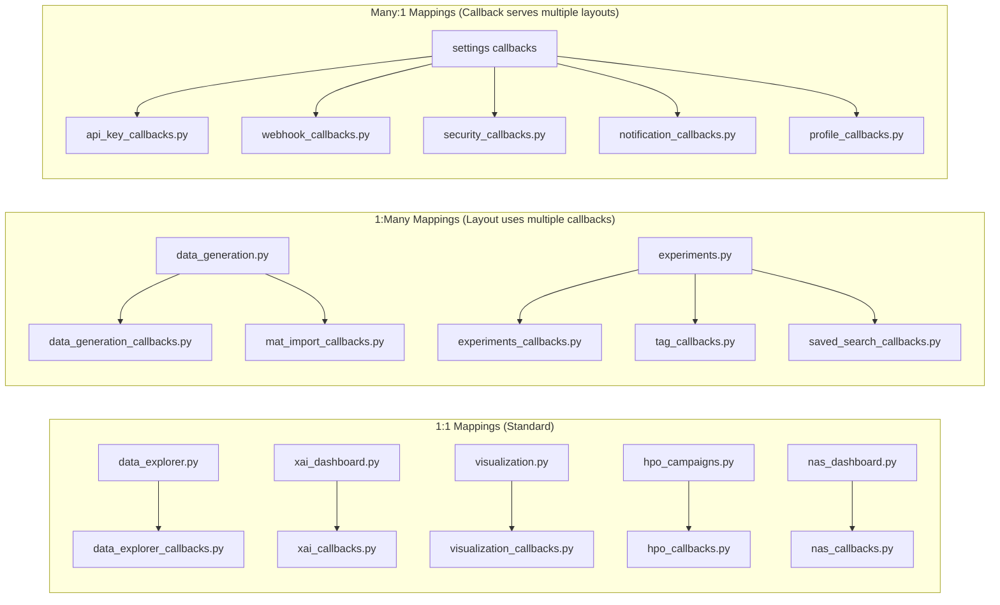
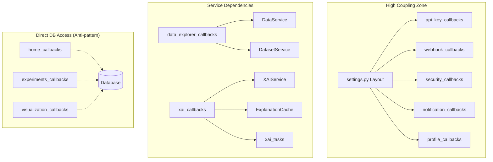

# IDB 2.3: Callbacks Sub-Block Analysis

**IDB ID**: 2.3  
**Domain**: Dashboard Platform  
**Primary Directory**: `packages/dashboard/callbacks/`  
**Independence Score**: 4/10 (HIGHEST COUPLING in the system)  
**Analysis Date**: 2026-01-23

---

## Executive Summary

The callbacks layer is the "glue" binding UI layouts to backend services. This analysis found **28 callback modules** totaling ~11,000 lines of code. While the codebase follows consistent patterns and has good error handling, there are significant issues with **tight coupling**, **missing clientside callbacks**, and **fat callbacks** that embed business logic.

---

## Task 1: Current State Assessment

### 1.1 Callback Inventory

| #   | Callback Module                  | Lines | Primary Layout               | Primary Service(s)                |
| --- | -------------------------------- | ----- | ---------------------------- | --------------------------------- |
| 1   | `data_explorer_callbacks.py`     | 875   | `data_explorer.py`           | `DataService`, `DatasetService`   |
| 2   | `api_key_callbacks.py`           | 777   | `settings.py`                | `APIKeyService`                   |
| 3   | `data_generation_callbacks.py`   | 725   | `data_generation.py`         | `DataService`                     |
| 4   | `xai_callbacks.py`               | 642   | `xai_dashboard.py`           | `XAIService`, `ExplanationCache`  |
| 5   | `webhook_callbacks.py`           | 602   | `settings.py`                | `WebhookService`                  |
| 6   | `hpo_callbacks.py`               | 582   | `hpo_campaigns.py`           | `HPOService`                      |
| 7   | `visualization_callbacks.py`     | 539   | `visualization.py`           | N/A (direct DB)                   |
| 8   | `security_callbacks.py`          | 494   | `settings.py`                | `AuthenticationService`           |
| 9   | `notification_callbacks.py`      | 491   | `settings.py`                | `NotificationService`             |
| 10  | `experiment_wizard_callbacks.py` | 482   | `experiment_wizard.py`       | `DatasetService`                  |
| 11  | `system_health_callbacks.py`     | 436   | `system_health.py`           | `MonitoringService`               |
| 12  | `datasets_callbacks.py`          | 396   | `datasets.py`                | `DatasetService`                  |
| 13  | `mat_import_callbacks.py`        | 389   | `data_generation.py`         | `DataService`                     |
| 14  | `email_digest_callbacks.py`      | 387   | `email_digest_management.py` | `NotificationService`             |
| 15  | `tag_callbacks.py`               | 384   | `experiments.py`             | `TagService`                      |
| 16  | `feature_callbacks.py`           | 374   | `feature_engineering.py`     | N/A (Celery tasks)                |
| 17  | `nas_callbacks.py`               | 371   | `nas_dashboard.py`           | `NASService`                      |
| 18  | `testing_callbacks.py`           | 360   | `testing_dashboard.py`       | N/A (Celery tasks)                |
| 19  | `signal_viewer_callbacks.py`     | 324   | `signal_viewer.py`           | `SignalService`, `DatasetService` |
| 20  | `training_monitor_callbacks.py`  | 319   | `training_monitor.py`        | `ExperimentService`               |
| 21  | `__init__.py` (Router)           | 300   | All layouts                  | N/A                               |
| 22  | `saved_search_callbacks.py`      | 293   | `experiments.py`             | `SearchService`                   |
| 23  | `deployment_callbacks.py`        | 234   | `deployment.py`              | `DeploymentService`               |
| 24  | `evaluation_callbacks.py`        | 219   | `evaluation_dashboard.py`    | N/A (Celery tasks)                |
| 25  | `experiments_callbacks.py`       | 208   | `experiments.py`             | N/A (direct DB)                   |
| 26  | `comparison_callbacks.py`        | 175   | `experiment_comparison.py`   | `ComparisonService`               |
| 27  | `home_callbacks.py`              | 173   | `home.py`                    | N/A (direct DB)                   |
| 28  | `api_monitoring_callbacks.py`    | 145   | `api_monitoring.py`          | `APIMonitoringService`            |
| 29  | `profile_callbacks.py`           | 120   | `settings.py`                | N/A (direct DB)                   |

**Total**: ~11,000 lines across 28 modules + 1 router

### 1.2 Callback-to-Layout Mapping



### 1.3 Input/Output Patterns

| Pattern                                         | Usage                     | Files         |
| ----------------------------------------------- | ------------------------- | ------------- |
| `Input('url', 'pathname')`                      | Page load triggers        | 20+ modules   |
| `Input('*-interval', 'n_intervals')`            | Polling/real-time updates | 8 modules     |
| `Input('*-btn', 'n_clicks')`                    | Button click handlers     | All modules   |
| `State('*-store', 'data')`                      | State management          | 15 modules    |
| `Output('*', 'children', allow_duplicate=True)` | Multiple outputs          | 43+ instances |

### 1.4 Callback Chaining Patterns

**Identified Chains**:

1. **Experiment Wizard Flow** (`experiment_wizard_callbacks.py`):

   ```
   select_model → create_hyperparameter_form → collect_training_config → launch_training
   ```

2. **Data Generation Flow** (`data_generation_callbacks.py`):

   ```
   update_config_summary → start_generation → poll_generation_status → load_recent_generations
   ```

3. **HPO Campaign Flow** (`hpo_callbacks.py`):
   ```
   launch_hpo_campaign → update_campaigns_list → toggle_viz_card → update_parallel_coords
   ```

### 1.5 State Management

State is managed via `dcc.Store` components (40+ instances across layouts):

| Store Category  | Examples                                     | Count |
| --------------- | -------------------------------------------- | ----- |
| Selection state | `selected-dataset-id`, `selected-webhook-id` | 12    |
| Page state      | `wizard-step`, `log-page-number`             | 8     |
| Data cache      | `training-data-store`, `xai-results-store`   | 10    |
| Task tracking   | `active-generation-id`, `test-task-id`       | 8     |
| Configuration   | `wizard-config`, `generation-config-store`   | 5     |

### 1.6 Clientside Callbacks

> [!WARNING]
> **Zero clientside callbacks found** across all 28 modules.

All callbacks execute server-side, including simple UI state toggles that could benefit from clientside execution.

---

## Task 2: Critical Issues Identification

### 2.1 Priority Matrix

| ID   | Issue                                    | Priority | Affected Files         |
| ---- | ---------------------------------------- | -------- | ---------------------- |
| C-01 | No clientside callbacks                  | **P1**   | All modules            |
| C-02 | Fat callbacks with embedded logic        | **P1**   | 8 modules              |
| C-03 | Direct DB access bypassing services      | **P2**   | 5 modules              |
| C-04 | `allow_duplicate` overuse                | **P2**   | 15+ modules            |
| C-05 | Missing error boundaries (user feedback) | **P2**   | 10+ modules            |
| C-06 | Inconsistent exception handling patterns | **P3**   | All modules            |
| C-07 | No callback timeout/cancellation         | **P3**   | Long-running callbacks |
| C-08 | Hardcoded timeouts/intervals             | **P3**   | Polling callbacks      |

### 2.2 Detailed Issue Analysis

#### C-01: Missing Clientside Callbacks (P1)

**Impact**: Unnecessary server round-trips for simple UI operations.

**Examples that should be clientside**:

- `toggle_augmentation_settings` (show/hide div)
- `toggle_advanced_options` (visibility toggle)
- `toggle_distillation_config` (visibility toggle)
- Modal open/close operations

**Estimated Performance Gain**: 50-100ms per interaction

---

#### C-02: Fat Callbacks (P1)

**Problem**: Callbacks embed significant business logic instead of orchestrating services.

**Worst Offenders**:

| File                          | Function                       | Lines | Issue                         |
| ----------------------------- | ------------------------------ | ----- | ----------------------------- |
| `data_explorer_callbacks.py`  | `update_feature_distribution`  | 238   | Chart creation logic embedded |
| `data_explorer_callbacks.py`  | `update_spectral_analysis`     | 192   | Signal processing in callback |
| `home_callbacks.py`           | `update_home_dashboard`        | 147   | Complex DB queries inline     |
| `system_health_callbacks.py`  | `create_metrics_history_chart` | 268   | Chart + DB logic mixed        |
| `api_monitoring_callbacks.py` | `update_api_metrics`           | 126   | All logic in single callback  |

**Example of Fat Callback** (`home_callbacks.py:36-170`):

```python
def update_home_dashboard(pathname):
    # 147 lines of:
    # - Direct SQLAlchemy queries
    # - Data transformation
    # - Chart creation
    # - Error handling
    # Should be: service.get_dashboard_data()
```

---

#### C-03: Direct Database Access (P2)

**Problem**: Some callbacks bypass the service layer entirely.

**Affected Files**:

- `home_callbacks.py` - Direct `Experiment`, `Dataset` queries
- `experiments_callbacks.py` - Direct `Experiment`, `ExperimentTag` queries
- `visualization_callbacks.py` - Direct `Dataset`, `Experiment` queries
- `profile_callbacks.py` - Direct `User` queries
- `email_digest_callbacks.py` - Direct `EmailDigestQueue` queries

**Risk**: Inconsistent business logic, difficult testing, potential security gaps.

---

#### C-04: `allow_duplicate` Overuse (P2)

**Count**: 43+ instances of `allow_duplicate=True`

**Problem**: While sometimes necessary, overuse suggests architectural issues where multiple callbacks fight over the same output.

**Hotspots**:

- `data_generation_callbacks.py`: 12 instances
- `experiment_wizard_callbacks.py`: 4 instances
- `saved_search_callbacks.py`: 5 instances

---

#### C-05: Inconsistent Error Handling (P2)

**Good Pattern** (found in most files):

```python
try:
    # logic
except Exception as e:
    logger.error(f"Error: {e}", exc_info=True)
    return dbc.Alert(f"Error: {str(e)}", color="danger")
```

**Bad Pattern** (found in some files):

```python
except Exception as e:
    raise PreventUpdate  # Silent failure, no user feedback
```

**Files with silent failures**:

- `system_health_callbacks.py` (3 instances)
- `api_monitoring_callbacks.py` (1 instance)
- `hpo_callbacks.py` (2 instances)

---

#### C-06: Callback Chaining Risks (P2)

**Potential Circular Dependency Pattern**:

```
experiments_callbacks.py::load_experiments
    ↓ triggers
tag_callbacks.py::load_tag_options
    ↓ uses same Output
saved_search_callbacks.py::load_saved_searches
```

Multiple callbacks trigger on `Input('url', 'pathname')` for `/experiments` route. While Dash handles this, it creates implicit dependencies.

---

#### C-07: No Long-Running Callback Protection (P3)

**Affected Callbacks**:

- `generate_embedding` (visualization) - Can take 30+ seconds
- `calculate_projection` (data_explorer) - CPU-intensive
- `generate_explanation` (xai) - Can timeout

**Missing**:

- Progress indicators for all long operations
- Cancellation support
- Timeout handling

---

### 2.3 Coupling Analysis



---

## Task 3: "If I Could Rewrite This" Retrospective

### 3.1 Should Callbacks Be Thinner?

> [!IMPORTANT]
> **YES.** Callbacks should be pure orchestration layers.

**Current State**:

```python
# Fat callback (current)
@app.callback(...)
def update_dashboard(pathname):
    with get_db_session() as session:
        # 50 lines of query logic
        # 30 lines of data transformation
        # 40 lines of chart creation
    return complex_layout
```

**Ideal State**:

```python
# Thin callback (proposed)
@app.callback(...)
def update_dashboard(pathname):
    try:
        data = dashboard_service.get_overview()
        return create_dashboard_view(data)
    except ServiceError as e:
        return create_error_view(e)
```

### 3.2 File Organization Assessment

**Current Organization**: By feature/domain ✓

**Strengths**:

- Clear 1:1 mapping for most layouts
- Consistent naming convention (`*_callbacks.py`)
- Registration pattern is uniform

**Weaknesses**:

- `settings.py` callbacks scattered across 5 files
- No shared callback utilities module
- No middleware/decorator patterns

**Proposed Restructuring**:

```
callbacks/
├── __init__.py           # Router (keep)
├── core/                 # Shared utilities
│   ├── decorators.py     # @requires_auth, @with_error_handling
│   ├── clientside.py     # Clientside callback registry
│   └── validators.py     # Input validation
├── data/                 # Data-related callbacks
│   ├── explorer.py
│   ├── generation.py
│   └── datasets.py
├── experiments/          # Experiment lifecycle
│   ├── wizard.py
│   ├── monitor.py
│   └── comparison.py
├── settings/             # Consolidate settings callbacks
│   ├── api_keys.py
│   ├── webhooks.py
│   └── security.py
└── analytics/            # Visualization/XAI
    ├── xai.py
    └── visualization.py
```

### 3.3 Clientside Callback Opportunities

**Immediate Candidates**:

| Callback          | Current Location     | Benefit          |
| ----------------- | -------------------- | ---------------- |
| Toggle visibility | Multiple files       | -100ms latency   |
| Modal open/close  | 10+ modules          | -100ms latency   |
| Tab switching     | 5+ modules           | Smoother UX      |
| Input validation  | Forms                | Instant feedback |
| Clipboard copy    | comparison_callbacks | Native feel      |

**Implementation Template**:

```python
app.clientside_callback(
    """
    function(n_clicks) {
        return !window.dash_clientside.no_update;
    }
    """,
    Output('modal', 'is_open'),
    Input('toggle-btn', 'n_clicks'),
    State('modal', 'is_open')
)
```

### 3.4 Proposed Architectural Improvements

#### 1. Callback Decorator Pattern

```python
from callbacks.core.decorators import authenticated, with_error_boundary

@authenticated
@with_error_boundary
@app.callback(...)
def protected_callback(data):
    return service.do_something(data)
```

#### 2. Service-First Callbacks

```python
# Every callback should:
# 1. Validate input
# 2. Call service method
# 3. Transform response to UI
# 4. Handle errors uniformly
```

#### 3. Callback Registry Pattern

```python
# callbacks/registry.py
CALLBACKS = {
    '/data-explorer': [
        register_data_explorer_callbacks,
        register_filter_callbacks,
    ],
    '/experiments': [
        register_experiments_callbacks,
        register_tag_callbacks,
        register_saved_search_callbacks,
    ]
}

def register_route_callbacks(app, route):
    for register_fn in CALLBACKS.get(route, []):
        register_fn(app)
```

---

## Recommendations Summary

### Immediate Actions (P0/P1)

1. **Add clientside callbacks** for all simple toggle/visibility operations
2. **Extract business logic** from fat callbacks to services
3. **Create callback utilities module** with decorators

### Short-term (P2)

4. **Eliminate direct DB access** in callbacks - route through services
5. **Reduce `allow_duplicate`** by restructuring callback outputs
6. **Add progress indicators** for long-running operations

### Long-term (P3)

7. **Reorganize callback directory** by domain
8. **Implement callback middleware** pattern
9. **Add comprehensive callback testing** infrastructure

---

## Appendix: Metrics Summary

| Metric                     | Value                                    |
| -------------------------- | ---------------------------------------- |
| Total callback modules     | 28                                       |
| Total lines of code        | ~11,000                                  |
| Largest callback file      | `data_explorer_callbacks.py` (875 lines) |
| Smallest callback file     | `profile_callbacks.py` (120 lines)       |
| Average file size          | ~390 lines                               |
| Clientside callbacks       | 0                                        |
| `allow_duplicate` usage    | 43+ instances                            |
| Exception handlers         | 119+ instances                           |
| `PreventUpdate` usage      | 130+ instances                           |
| `dcc.Store` components     | 40+                                      |
| Direct DB access callbacks | 5 modules                                |
