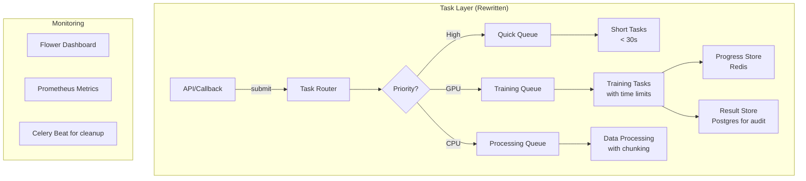
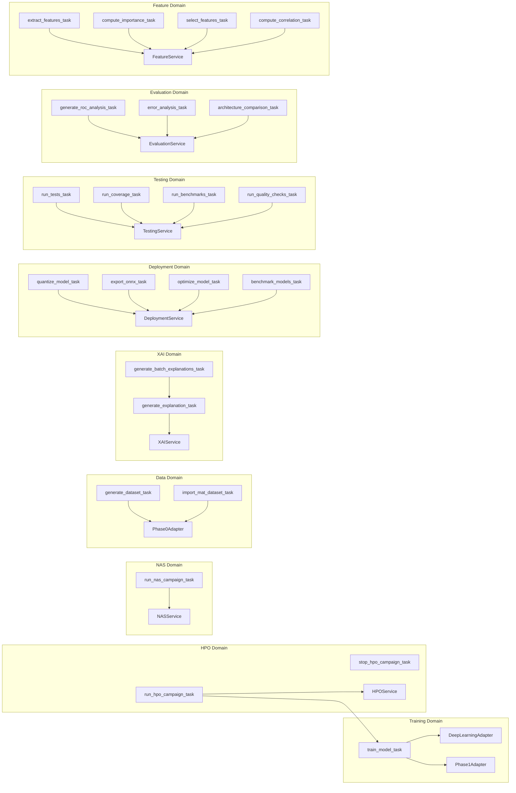

# IDB 2.4 - Async Tasks Sub-Block Analysis

**Analyst**: AI Agent  
**Date**: 2026-01-22  
**Scope**: `packages/dashboard/tasks/` (11 task modules, 23 Celery tasks)  
**Domain**: Dashboard Platform - Background Processing

---

## Executive Summary

The Async Tasks Sub-Block provides background processing capabilities for the dashboard platform using Celery with Redis as the message broker and result backend. The implementation covers training, HPO, NAS, data generation, XAI, deployment, testing, evaluation, and feature engineering operations.

| Metric                  | Value       |
| ----------------------- | ----------- |
| Task Modules            | 11          |
| Total Celery Tasks      | 23          |
| Lines of Code           | ~2,100      |
| Average Task Complexity | Medium-High |

### Key Findings

| Category          | Count | Severity |
| ----------------- | ----- | -------- |
| **P0 - Critical** | 3     | 🔴       |
| **P1 - High**     | 5     | 🟠       |
| **P2 - Medium**   | 6     | 🟡       |
| **P3 - Low**      | 4     | 🟢       |

---

## Task 1: Current State Assessment

### 1.1 Task Module Inventory

| File                       | Tasks | Purpose                                                     | LOC |
| -------------------------- | ----- | ----------------------------------------------------------- | --- |
| `__init__.py`              | -     | Celery app initialization, autodiscovery                    | 41  |
| `training_tasks.py`        | 1     | Model training execution                                    | 186 |
| `hpo_tasks.py`             | 2     | HPO campaign execution & stopping                           | 283 |
| `nas_tasks.py`             | 1     | Neural Architecture Search campaigns                        | 166 |
| `data_generation_tasks.py` | 1     | Synthetic dataset generation                                | 179 |
| `xai_tasks.py`             | 2     | XAI explanation generation (single & batch)                 | 296 |
| `deployment_tasks.py`      | 4     | Model quantization, ONNX export, optimization, benchmarking | 360 |
| `testing_tasks.py`         | 4     | Test execution, coverage, benchmarks, quality checks        | 218 |
| `evaluation_tasks.py`      | 3     | ROC analysis, error analysis, architecture comparison       | 183 |
| `feature_tasks.py`         | 4     | Feature extraction, importance, selection, correlation      | 321 |
| `mat_import_tasks.py`      | 1     | MAT file import                                             | 163 |

### 1.2 Celery App Configuration

```python
# tasks/__init__.py
celery_app = Celery(
    'tasks',
    broker=CELERY_BROKER_URL,      # Redis
    backend=CELERY_RESULT_BACKEND,  # Redis
    include=[...10 task modules...]
)

celery_app.conf.update(
    task_serializer='json',
    accept_content=['json'],
    result_serializer='json',
    timezone='UTC',
    enable_utc=True,
)
```

> [!WARNING]
> **Missing Critical Configuration**
>
> - No `task_track_started=True` for task monitoring
> - No `result_expires` configuration (results never expire)
> - No `task_acks_late=True` for reliability
> - No `worker_prefetch_multiplier` tuning

### 1.3 Task Signatures

All 23 tasks use the `@celery_app.task(bind=True)` pattern (except `stop_hpo_campaign_task`):

| Task                               | Signature                                            | Bind | Returns |
| ---------------------------------- | ---------------------------------------------------- | ---- | ------- |
| `train_model_task`                 | `(self, config: dict)`                               | ✅   | `dict`  |
| `run_hpo_campaign_task`            | `(self, campaign_id: int)`                           | ✅   | `dict`  |
| `stop_hpo_campaign_task`           | `(campaign_id: int)`                                 | ❌   | `bool`  |
| `run_nas_campaign_task`            | `(self, campaign_id: int)`                           | ✅   | `dict`  |
| `generate_dataset_task`            | `(self, config: dict)`                               | ✅   | `dict`  |
| `import_mat_dataset_task`          | `(self, config: dict, mat_file_paths: list)`         | ✅   | `dict`  |
| `generate_explanation_task`        | `(self, config: dict)`                               | ✅   | `dict`  |
| `generate_batch_explanations_task` | `(self, config: dict)`                               | ✅   | `dict`  |
| `quantize_model_task`              | `(self, experiment_id: int, quantization_type: str)` | ✅   | `dict`  |
| `export_onnx_task`                 | `(self, experiment_id: int, ...)`                    | ✅   | `dict`  |
| `optimize_model_task`              | `(self, experiment_id: int, ...)`                    | ✅   | `dict`  |
| `benchmark_models_task`            | `(self, experiment_id: int, ...)`                    | ✅   | `dict`  |
| `run_tests_task`                   | `(self, test_path: str, markers: str)`               | ✅   | `dict`  |
| `run_coverage_task`                | `(self, test_path: str, ...)`                        | ✅   | `dict`  |
| `run_benchmarks_task`              | `(self, model_path: str, ...)`                       | ✅   | `dict`  |
| `run_quality_checks_task`          | `(self, path: str)`                                  | ✅   | `dict`  |
| `generate_roc_analysis_task`       | `(self, experiment_id: int)`                         | ✅   | `dict`  |
| `error_analysis_task`              | `(self, experiment_id: int)`                         | ✅   | `dict`  |
| `architecture_comparison_task`     | `(self, experiment_ids: list)`                       | ✅   | `dict`  |
| `extract_features_task`            | `(self, dataset_id: int, domain: str, ...)`          | ✅   | `dict`  |
| `compute_importance_task`          | `(self, dataset_id: int, domain: str, ...)`          | ✅   | `dict`  |
| `select_features_task`             | `(self, dataset_id: int, ...)`                       | ✅   | `dict`  |
| `compute_correlation_task`         | `(self, dataset_id: int, domain: str)`               | ✅   | `dict`  |

### 1.4 Task Result Patterns

**Consistent Pattern** - All tasks return a dictionary with:

```python
{
    "success": bool,
    "error": str,           # On failure
    "traceback": str,       # On failure (most tasks)
    "task_id": str,         # Some tasks
    # ... task-specific results
}
```

**Result Backend Usage**:

- Results stored in Redis indefinitely (no expiration configured)
- JSON serialization only (no pickle for security)
- `self.update_state()` used for progress tracking

### 1.5 Task State Update Mechanisms

All long-running tasks use `self.update_state()` for progress reporting:

```python
self.update_state(
    state='PROGRESS',
    meta={
        'progress': 0.5,      # 0-1 or 0-100
        'status': 'Processing...',
        # Additional context
    }
)
```

**State Update Consistency**:

| Task                        | Uses update_state | Progress Type    | Status Field |
| --------------------------- | ----------------- | ---------------- | ------------ |
| `train_model_task`          | ✅                | 0-1 (float)      | ✅           |
| `run_hpo_campaign_task`     | ✅                | 0-1 (float)      | ✅           |
| `run_nas_campaign_task`     | ✅                | Dict with ratios | ✅           |
| `generate_dataset_task`     | ✅                | 0-100 (int)      | ✅           |
| `generate_explanation_task` | ✅                | 0-100 (int)      | ✅           |
| `quantize_model_task`       | ✅                | 0-1 (float)      | ✅           |
| `run_tests_task`            | ✅                | 0-1 (float)      | ✅           |
| `extract_features_task`     | ✅                | 0-1 (float)      | ✅           |

> [!IMPORTANT]
> **Progress Value Inconsistency**: Some tasks use 0.0-1.0 floats while others use 0-100 integers.

### 1.6 Error Handling Patterns

**Standard Pattern** (most tasks):

```python
try:
    # Task logic
    return {"success": True, ...}
except Exception as e:
    logger.error(f"Task failed: {e}", exc_info=True)
    return {"success": False, "error": str(e), "traceback": traceback.format_exc()}
```

**Enhanced Pattern** (training/data tasks):

```python
except Exception as e:
    # Update database status
    with get_db_session() as session:
        entity.status = Status.FAILED
        session.commit()
    # Send failure notification
    NotificationService.emit_event(EventType.TRAINING_FAILED, ...)
    # Update Celery state
    self.update_state(state='FAILURE', meta={'error': str(e)})
    raise  # Re-raise for Celery
```

### 1.7 Retry Logic Analysis

> [!CAUTION]
> **NO RETRY LOGIC IMPLEMENTED**
>
> None of the 23 tasks implement Celery retry mechanisms:
>
> - No `autoretry_for` decorator parameter
> - No `retry_backoff` configuration
> - No manual `self.retry()` calls
> - No `max_retries` limits

---

## Task 2: Critical Issues Identification

### P0 - Critical (Must Fix)

#### P0-1: Missing Task Time Limits

**Location**: All task modules  
**Issue**: No `time_limit` or `soft_time_limit` configured for any task

```python
# Current (no limits)
@celery_app.task(bind=True)
def run_hpo_campaign_task(self, campaign_id: int):
    ...

# Required
@celery_app.task(
    bind=True,
    time_limit=7200,       # Hard limit (2 hours)
    soft_time_limit=6900   # Soft limit for graceful shutdown
)
def run_hpo_campaign_task(self, campaign_id: int):
    ...
```

**Risk**: Worker processes can hang indefinitely, consuming resources and preventing other tasks from running.

**Affected Tasks** (High Priority):

- `train_model_task` - Training can hang on GPU operations
- `run_hpo_campaign_task` - Long-running optimization
- `run_nas_campaign_task` - Architecture search loops
- `generate_batch_explanations_task` - Batch processing

---

#### P0-2: No Retry Logic for Transient Failures

**Location**: All task modules  
**Issue**: Tasks fail permanently on any exception, including transient network/database errors

```python
# Add retry for connection errors
@celery_app.task(
    bind=True,
    autoretry_for=(ConnectionError, OperationalError, TimeoutError),
    retry_backoff=True,
    retry_backoff_max=600,
    retry_jitter=True,
    max_retries=3
)
```

**Risk**:

- Database connection pool exhaustion causes permanent failures
- Redis connection issues lose task progress
- Network glitches during model downloads cause failures

---

#### P0-3: Result Backend Memory Leak

**Location**: `tasks/__init__.py`  
**Issue**: No `result_expires` configuration

```python
# Current configuration
celery_app.conf.update(
    task_serializer='json',
    # Missing: result_expires=86400  # 24 hours
)
```

**Risk**:

- Redis memory grows unbounded as task results accumulate
- Old results never garbage collected
- Production systems will eventually OOM

---

### P1 - High Priority

#### P1-1: Silent Exception Swallowing in Nested Try/Except

**Location**: `hpo_tasks.py:255`, `nas_tasks.py:153-157`

```python
# hpo_tasks.py:255
try:
    HPOService.update_campaign_status(campaign_id, ExperimentStatus.FAILED)
except:  # Bare except, ignores all errors
    pass
```

**Impact**: Debugging failures becomes extremely difficult when status updates silently fail.

---

#### P1-2: Hardcoded Magic Numbers

**Location**: Multiple files

| File                  | Line | Value    | Description                         |
| --------------------- | ---- | -------- | ----------------------------------- |
| `deployment_tasks.py` | 59   | `102400` | Signal length (should use constant) |
| `deployment_tasks.py` | 160  | `102400` | Signal length                       |
| `hpo_tasks.py`        | 111  | `50`     | Default epochs                      |
| `nas_tasks.py`        | 87   | `5`      | Sleep cap for demo                  |
| `xai_tasks.py`        | 75   | `100`    | SHAP background samples             |

```python
# Current
calibration_data = torch.randn(10, 1, 102400)

# Should be
from utils.constants import SIGNAL_LENGTH
calibration_data = torch.randn(10, 1, SIGNAL_LENGTH)
```

---

#### P1-3: Inconsistent Notification Event Types

**Location**: `data_generation_tasks.py`, `mat_import_tasks.py`, `xai_tasks.py`

```python
# Reusing training events for unrelated operations
NotificationService.emit_event(
    event_type=EventType.TRAINING_COMPLETE,  # Wrong! This is data generation
    ...
)
```

**Impact**: Users receive confusing notifications. Should have:

- `EventType.GENERATION_COMPLETE`
- `EventType.IMPORT_COMPLETE`
- `EventType.XAI_COMPLETE`

---

#### P1-4: Missing Task Monitoring Configuration

**Location**: `tasks/__init__.py`

```python
# Missing configuration
celery_app.conf.update(
    task_track_started=True,        # Enable STARTED state
    task_send_sent_event=True,      # For Flower monitoring
    worker_send_task_events=True,   # For task events
)
```

**Impact**: Unable to monitor task queue health, identify stuck tasks, or debug production issues.

---

#### P1-5: Database Session Leaks in Exception Paths

**Location**: Multiple files

```python
# data_generation_tasks.py:73-77
try:
    with get_db_session() as session:
        generation = session.query(...).first()
        if generation:
            generation.progress = progress
            session.commit()
except Exception as e:
    logger.error(f"Failed to update progress: {e}")
    # Session may not be properly closed on certain exceptions
```

**Risk**: Connection pool exhaustion under high load.

---

### P2 - Medium Priority

#### P2-1: Simulated Training in NAS Tasks

**Location**: `nas_tasks.py:80-94`

```python
# Simulate training (In production, actually train the model)
# For MVP, we'll generate synthetic results
import random
import time

# Simulate training time
training_time = random.uniform(10, 30)
time.sleep(min(training_time, 5))  # Cap at 5s for demo

# Simulate results
validation_accuracy = random.uniform(0.70, 0.85)
```

**Impact**: NAS results are not real, making the feature non-functional for production use.

---

#### P2-2: Missing Input Validation

**Location**: All task entry points

```python
# Current - no validation
def train_model_task(self, config: dict):
    experiment_id = config.get("experiment_id")  # Could be None

# Should validate
def train_model_task(self, config: dict):
    if not isinstance(config, dict):
        raise ValueError("Config must be a dictionary")
    experiment_id = config.get("experiment_id")
    if not experiment_id:
        raise ValueError("experiment_id is required")
```

---

#### P2-3: Synchronous Batch Processing

**Location**: `xai_tasks.py:267`

```python
# Current - synchronous loop
for i, signal_id in enumerate(signal_ids):
    result = generate_explanation_task(individual_config)  # Direct call
    results.append(result)
```

**Impact**: No parallelism within batch, doesn't use Celery's group/chain capabilities.

**Should be**:

```python
from celery import group
tasks = group(generate_explanation_task.s(cfg) for cfg in configs)
results = tasks.apply_async()
```

---

#### P2-4: Missing Idempotency Checks

**Location**: Most task entry points

**Risk**: Re-running failed tasks may create duplicate database records or corrupt state.

Example in `training_tasks.py`:

```python
# No check if training already completed
experiment = session.query(Experiment).filter_by(id=experiment_id).first()
experiment.status = ExperimentStatus.RUNNING  # Overwrites any status
```

---

#### P2-5: Hardcoded URLs

**Location**: Multiple notification calls

```python
# hpo_tasks.py, training_tasks.py, xai_tasks.py
'dashboard_url': 'http://localhost:8050'
'results_url': f"http://localhost:8050/experiments/{experiment_id}/results"
```

**Impact**: Notifications show wrong URLs in production/staging environments.

---

#### P2-6: Missing Task Queues

**Location**: `tasks/__init__.py`

**Issue**: All tasks use the default queue. Should separate by priority and resource usage:

```python
# Recommended queue structure
task_queues = {
    'high_priority': Queue('high_priority'),     # Quick tasks
    'training': Queue('training'),               # GPU tasks
    'data_processing': Queue('data_processing'), # CPU-intensive
    'notifications': Queue('notifications'),     # Non-blocking
}

@celery_app.task(bind=True, queue='training')
def train_model_task(self, config: dict):
    ...
```

---

### P3 - Low Priority

#### P3-1: Missing Type Hints in Some Functions

**Location**: Progress callbacks, nested functions

```python
# Current
def progress_callback(epoch, metrics):
    ...

# Should be
def progress_callback(epoch: int, metrics: dict) -> None:
    ...
```

---

#### P3-2: Inconsistent Logging Levels

**Location**: Various

```python
# Some use info for routine events
logger.info(f"Trial {trial.number} completed")

# Some use debug (inconsistent)
logger.debug(f"Processing signal {signal_id}")
```

---

#### P3-3: Missing Docstring Parameters for Nested Functions

**Location**: `hpo_tasks.py:71`, `training_tasks.py:56`

```python
def objective(trial):
    """Optuna objective function."""  # Missing Args/Returns
    ...
```

---

#### P3-4: Unnecessary Import Inside Functions

**Location**: `hpo_tasks.py:56-59`, `hpo_tasks.py:103`

```python
# Inside function
import optuna
from integrations.deep_learning_adapter import DeepLearningAdapter
```

**Impact**: Slight performance overhead on repeated calls. Should be at module level with ImportError handling.

---

## Task 3: "If I Could Rewrite This" Retrospective

### 3.1 Task Granularity Assessment

**Current State**:

- Tasks are at the right abstraction level for major operations (training, HPO, NAS)
- Batch tasks attempt to handle multiple operations but do so synchronously
- Missing: Smaller atomic tasks for database updates, notifications

**Recommendation**: **Split HPO Campaign Task**

The `run_hpo_campaign_task` is 250+ lines with nested functions. Should be:

```python
# New structure
@celery_app.task(bind=True)
def run_hpo_campaign_task(self, campaign_id: int):
    """Orchestrate HPO trials using Celery chords."""
    trials = group(run_hpo_trial_task.s(campaign_id, i) for i in range(num_trials))
    callback = finalize_hpo_campaign_task.s(campaign_id)
    chord(trials)(callback)

@celery_app.task
def run_hpo_trial_task(campaign_id: int, trial_number: int):
    """Execute single HPO trial."""
    ...

@celery_app.task
def finalize_hpo_campaign_task(trial_results, campaign_id: int):
    """Aggregate trial results and update campaign."""
    ...
```

### 3.2 Tasks That Should Be Merged

| Current Tasks                                       | Proposed Merged Task                        |
| --------------------------------------------------- | ------------------------------------------- |
| `extract_features_task` + `compute_importance_task` | `analyze_features_task` with mode parameter |
| `run_tests_task` + `run_coverage_task`              | `run_test_suite_task` with coverage flag    |

### 3.3 Result Backend Choice

**Current**: Redis for both broker and backend

**Assessment**: ✅ Good choice for this workload

**Considerations**:

- Redis is fast for short-lived results
- However, for training tasks with large result payloads, consider:
  - `result_extended=True` for storing large results externally
  - Database backend for critical results (audit trail)

### 3.4 Ideal Architecture Rewrite



### 3.5 Recommended Base Task Class

```python
# tasks/base.py
from celery import Task
from database.connection import get_db_session

class BaseTask(Task):
    """Base task with standard error handling and monitoring."""

    abstract = True
    autoretry_for = (ConnectionError, TimeoutError)
    retry_backoff = True
    retry_backoff_max = 600
    max_retries = 3
    acks_late = True
    reject_on_worker_lost = True

    def on_failure(self, exc, task_id, args, kwargs, einfo):
        """Log failure and update database."""
        logger.error(f"Task {task_id} failed: {exc}", exc_info=einfo)
        # Update any related database records

    def on_success(self, retval, task_id, args, kwargs):
        """Log success metrics."""
        logger.info(f"Task {task_id} completed successfully")

@celery_app.task(base=BaseTask, bind=True, time_limit=7200)
def train_model_task(self, config: dict):
    ...
```

---

## Good Practices Identified

### ✅ Practices to Adopt Across Teams

| Practice                     | Location               | Description                                  |
| ---------------------------- | ---------------------- | -------------------------------------------- |
| **Bound Tasks**              | All modules            | `bind=True` allows access to task instance   |
| **Progress Tracking**        | All long-running tasks | `self.update_state()` for real-time progress |
| **Structured Returns**       | All tasks              | Consistent `{"success": bool, ...}` pattern  |
| **Database Status Updates**  | Training, Data Gen     | Update entity status on start/complete/fail  |
| **Notification Integration** | Training, XAI          | Emit events for user notifications           |
| **Logging**                  | All modules            | Structured logging with task IDs             |
| **Context Managers**         | Database access        | `with get_db_session() as session:`          |
| **JSON Serialization**       | Celery config          | Secure serialization (no pickle)             |
| **Eager Mode**               | `__init__.py`          | `CELERY_ALWAYS_EAGER` for testing            |

---

## Remediation Roadmap

### Phase 1: Critical Fixes (Week 1)

| Item                                        | Priority | Effort | Owner   |
| ------------------------------------------- | -------- | ------ | ------- |
| Add `result_expires` configuration          | P0       | 1h     | DevOps  |
| Add time limits to all tasks                | P0       | 4h     | Backend |
| Implement retry logic for connection errors | P0       | 4h     | Backend |
| Fix bare except clauses                     | P1       | 1h     | Backend |

### Phase 2: Reliability Improvements (Week 2)

| Item                                   | Priority | Effort | Owner   |
| -------------------------------------- | -------- | ------ | ------- |
| Add `task_track_started` configuration | P1       | 1h     | DevOps  |
| Create proper notification event types | P1       | 4h     | Backend |
| Replace hardcoded signal length        | P1       | 2h     | Backend |
| Add input validation                   | P2       | 4h     | Backend |

### Phase 3: Architecture Improvements (Week 3-4)

| Item                               | Priority | Effort | Owner   |
| ---------------------------------- | -------- | ------ | ------- |
| Create BaseTask class              | P2       | 4h     | Backend |
| Implement task queues              | P2       | 8h     | DevOps  |
| Refactor batch tasks to use groups | P2       | 8h     | Backend |
| Replace simulated NAS training     | P2       | 16h    | ML Team |

---

## Appendix: Task Dependency Graph



---

## Conclusion

The Async Tasks Sub-Block provides a solid foundation for background processing but requires immediate attention to **reliability** and **operational safety**. The top priorities are:

1. **P0**: Add result expiration to prevent Redis memory exhaustion
2. **P0**: Add time limits to prevent runaway tasks
3. **P0**: Implement retry logic for transient failures
4. **P1**: Improve monitoring with task tracking

The codebase follows good patterns (bound tasks, progress tracking, structured returns) that should be standardized via a `BaseTask` class. The simulated NAS training is a significant feature gap that needs real implementation.
