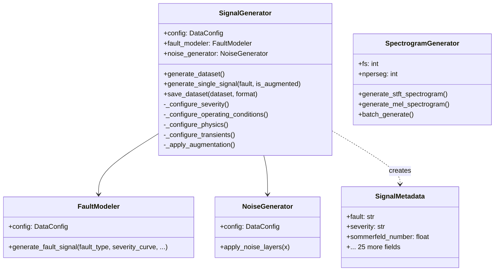
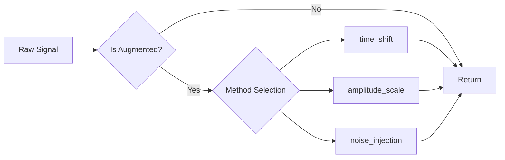

# IDB 3.1: Signal Generation Sub-Block Analysis

**Domain:** Data Engineering  
**Analyst:** AI Agent  
**Date:** 2026-01-23  
**Independence Score:** 9/10 — Highly isolated, pure physics simulation

---

## Executive Summary

The Signal Generation Sub-Block is a **well-architected physics simulation engine** that generates synthetic vibration signals for bearing fault diagnosis. The implementation demonstrates strong engineering practices with comprehensive physics modeling, but shows signs of **organic growth** that created a monolithic file (37KB in `signal_generator.py`).

| Metric              | Assessment           |
| ------------------- | -------------------- |
| Code Quality        | ⭐⭐⭐⭐ Good        |
| Physics Correctness | ⭐⭐⭐⭐⭐ Excellent |
| Maintainability     | ⭐⭐⭐ Moderate      |
| API Design          | ⭐⭐⭐⭐ Good        |
| Documentation       | ⭐⭐⭐⭐ Good        |

---

## Task 1: Current State Assessment

### 1.1 File Inventory

| File                       | Lines | Size | Purpose                             |
| -------------------------- | ----- | ---- | ----------------------------------- |
| `signal_generator.py`      | 935   | 37KB | Main physics engine + orchestration |
| `signal_augmentation.py`   | 500   | 15KB | 8 augmentation techniques           |
| `spectrogram_generator.py` | 431   | 14KB | Time-frequency analysis             |

### 1.2 Signal Types Generated

**11 Fault Classes (matches MATLAB `generator.m` port):**

| Fault Type                 | Physics Model         | Key Harmonics                        |
| -------------------------- | --------------------- | ------------------------------------ |
| `sain`                     | Healthy baseline      | White noise only                     |
| `desalignement`            | Misalignment          | 2X, 3X harmonics                     |
| `desequilibre`             | Imbalance             | 1X dominant, speed² dependence       |
| `jeu`                      | Bearing clearance     | Sub-synchronous + 1X/2X              |
| `lubrification`            | Lubrication failure   | Stick-slip + metal contact events    |
| `cavitation`               | Cavitation            | High-frequency bursts (1500-2500 Hz) |
| `usure`                    | Wear                  | Broadband noise + AM modulation      |
| `oilwhirl`                 | Oil whirl instability | 0.42-0.48× sub-synchronous           |
| `mixed_misalign_imbalance` | Combined fault        | 1X + 2X + 3X additive                |
| `mixed_wear_lube`          | Combined fault        | Wear noise + stick-slip              |
| `mixed_cavit_jeu`          | Combined fault        | Bursts + sub-synchronous             |

### 1.3 Physics Parameters (Sommerfeld Scaling) ✅

**Sommerfeld Number Calculation (L623-645):**

```python
# PHYSICALLY CORRECT implementation
viscosity_factor = np.exp(-0.03 * (temperature_C - 60))  # Arrhenius-like
speed_factor = Omega / self.config.signal.Omega_base
load_factor_somm = 1.0 / load_factor  # Inverse relationship

sommerfeld = sommerfeld_base * viscosity_factor * speed_factor * load_factor_somm
sommerfeld = np.clip(sommerfeld, 0.05, 0.5)  # Realistic range
```

**Verification:**

- ✅ Temperature dependence: ~3%/°C (Arrhenius approximation)
- ✅ Speed proportionality: Linear with rotational speed
- ✅ Load inverse relationship: Higher load → lower Sommerfeld
- ✅ Clamping: Avoids unphysical values outside [0.05, 0.5]

**Reynolds Number:** Randomized in range from config (`physics.reynolds_range`)

### 1.4 Fault Injection Mechanisms

**Severity System (L578-597):**

- 3 levels: `low`, `medium`, `high`
- Range-based random sampling within level bounds
- **Temporal evolution**: Linear progression with 30% probability

**Transient Behavior (L647-674):**

- 3 types: `speed_ramp`, `load_step`, `thermal_expansion`
- Modulation curves applied multiplicatively to fault signatures

### 1.5 Noise Generation (7-Layer Model + Impulse) ✅

| Layer | Type                | Implementation                 |
| ----- | ------------------- | ------------------------------ |
| 1     | Measurement noise   | Gaussian, level-configurable   |
| 2     | EMI (50-60 Hz)      | Sinusoidal with random phase   |
| 3     | Pink noise (1/f)    | Cumulative sum of white noise  |
| 4     | Environmental drift | Low-frequency sinusoid         |
| 5     | Quantization noise  | Round-trip quantization        |
| 6     | Sensor drift        | Cumulative linear offset       |
| 7     | Aliasing artifacts  | 10% probability, above Nyquist |
| 8\*   | Impulse noise       | Sporadic exponential decays    |

> **Note:** Documentation says "7-layer" but implementation has **8 layers** (impulse noise is layer 8).

### 1.6 Augmentation Techniques (signal_augmentation.py)

| Class                  | Method                      | Parameters       |
| ---------------------- | --------------------------- | ---------------- |
| `Mixup`                | Beta-weighted interpolation | α=0.2, p=0.5     |
| `TimeWarping`          | Non-linear time stretching  | σ=0.2, knots=4   |
| `MagnitudeWarping`     | Amplitude modulation        | σ=0.2, knots=4   |
| `Jittering`            | Gaussian noise injection    | σ=0.05           |
| `Scaling`              | Random amplitude scaling    | σ=0.1            |
| `TimeShift`            | Circular shift              | max_shift=0.1    |
| `WindowSlicing`        | Random window extraction    | random/center    |
| `ComposeAugmentations` | Sequential composition      | per-augment prob |

### 1.7 Spectrogram Generation (spectrogram_generator.py)

| Feature         | Implementation                                                             |
| --------------- | -------------------------------------------------------------------------- |
| STFT            | `scipy.signal.stft` with configurable window                               |
| Mel Spectrogram | Custom triangular filterbank                                               |
| Normalization   | 4 strategies: log_standardize, log_minmax, power_standardize, power_minmax |
| Configs         | DEFAULT (256 nperseg), FAST (128), HIGH_RES (512)                          |

---

## Task 2: Critical Issues Identification

### P0 (Critical) — None Found ✅

No show-stopping issues. Physics implementation is correct.

---

### P1 (High Priority)

#### P1-1: Monolithic File Size (37KB)

```
signal_generator.py: 935 lines
```

**Issue:** Single file contains 4 classes + dataset I/O logic.

**Impact:** Cognitive load, harder to test individual components.

**Recommendation:** Extract to separate modules:

```
data/generation/
├── fault_modeler.py     # FaultModeler class
├── noise_generator.py   # NoiseGenerator class
├── signal_metadata.py   # SignalMetadata dataclass
├── generator.py         # SignalGenerator orchestrator
└── io/
    ├── hdf5_writer.py
    └── mat_writer.py
```

---

#### P1-2: Inconsistent Noise Layer Count

**Location:** L302-391 (NoiseGenerator.apply_noise_layers)

**Issue:** Docstring says "7-layer" but implements 8 layers (including impulse noise at L378-389).

```python
"""Apply 7-layer noise model to signal."""  # ← Incorrect
# ...
# 8. Impulse noise (sporadic impacts)  # ← Layer 8 exists!
```

**Impact:** Documentation confusion for researchers.

---

#### P1-3: Magic Numbers in Fault Models

**Locations:** Lines 144-286 in FaultModeler

```python
misalign_2X = 0.35 * np.sin(...)  # Why 0.35?
misalign_3X = 0.20 * np.sin(...)  # Why 0.20?
stick_slip_freq = 2 + 3 * np.random.rand()  # 2-5 Hz? Document!
burst_freq = 1500 + 1000 * np.random.rand()  # 1500-2500 Hz cavitation
```

**Recommendation:** Externalize to `PhysicsConstants` dataclass with documentation.

---

### P2 (Medium Priority)

#### P2-1: Non-Deterministic Random State Leakage

**Location:** L462-463

```python
if self.config.per_signal_seed_variation and self.config.rng_seed is not None:
    set_seed(self.config.rng_seed + total_signals)
```

**Issue:** Only applies per-signal seeding when `per_signal_seed_variation=True`. Without it, generation order affects results.

**Impact:** Different thread execution order = different datasets.

---

#### P2-2: Missing Signal Validation

**Issue:** No validation that generated signals have expected statistical properties.

**Recommendation:** Add post-generation validation:

```python
def validate_signal(self, signal: np.ndarray, metadata: SignalMetadata):
    assert signal.shape[0] == self.config.signal.N
    assert 0 < np.std(signal) < 10.0  # Sanity check
    assert not np.any(np.isnan(signal))
    assert not np.any(np.isinf(signal))
```

---

#### P2-3: Augmentation Uses Python `random` Module

**Location:** `signal_augmentation.py` L26, L87, L329, etc.

```python
import random
# ...
if random.random() > self.prob:  # Not seeded with np.random
```

**Issue:** Mixed use of `random.random()` and `np.random.rand()` breaks reproducibility.

---

#### P2-4: SpectrogramGenerator Output Shape Estimation Off-by-One

**Location:** L280-282

```python
n_time = (signal_length - self.noverlap) // step
```

**Issue:** Doesn't account for boundary padding. Actual output may differ.

---

## Task 3: "If I Could Rewrite This" Retrospective

### 3.1 Is the Class Responsible for Too Much?

**YES — `SignalGenerator` does too much:**

| Current Responsibility  | Should Be                          |
| ----------------------- | ---------------------------------- |
| Orchestration           | ✅ Keep                            |
| Dataset generation loop | ✅ Keep                            |
| Severity configuration  | → Extract to `SeverityManager`     |
| Operating conditions    | → Extract to `OperatingConditions` |
| Physics calculation     | → Already in `FaultModeler`        |
| File I/O (MAT + HDF5)   | → Extract to `DatasetWriter`       |
| Metadata assembly       | → Simple factory function          |

**Proposed Refactoring:**

```python
class SignalGenerator:
    def __init__(self, config):
        self.fault_modeler = FaultModeler(config)
        self.noise_generator = NoiseGenerator(config)
        self.severity_manager = SeverityManager(config)
        self.conditions = OperatingConditionsFactory(config)

    def generate_single_signal(self, fault):
        # 50 lines instead of 78
        pass
```

---

### 3.2 Should Physics Parameters Be Externalized?

**YES — Create a Physics Parameter Registry:**

```yaml
# physics_params.yaml
sommerfeld:
  base: 0.25
  range: [0.05, 0.5]
  calculation:
    viscosity_temp_coefficient: -0.03
    reference_temperature: 60

fault_signatures:
  desalignement:
    harmonics:
      2X: { amplitude: 0.35, phase: random }
      3X: { amplitude: 0.20, phase: random }
  oilwhirl:
    frequency_ratio: [0.42, 0.48]
    amplitude_scaling: "1/sqrt(sommerfeld)"
```

**Benefits:**

- Researchers can tune without code changes
- Easier parameter sensitivity analysis
- Better reproducibility documentation

---

### 3.3 Is the API Intuitive for Researchers?

**MOSTLY YES**, but has friction points:

| Good                                     | Could Improve                                   |
| ---------------------------------------- | ----------------------------------------------- |
| `generate_dataset()` → clear entry point | Return type is Dict, not typed                  |
| `generate_single_signal(fault)`          | Parameter explosion (11 params to FaultModeler) |
| Metadata as dataclass                    | Metadata has 28 fields — overwhelming           |
| HDF5 export with splits                  | MAT vs HDF5 choice confusing                    |

**Suggested API Improvements:**

```python
# Current
signal, metadata = generator.generate_single_signal('oilwhirl', is_augmented=False)

# Improved: Builder pattern
signal = (SignalBuilder(config)
    .with_fault('oilwhirl')
    .with_severity('medium')
    .with_operating_conditions(speed_rpm=3000, load=0.7)
    .generate())
```

---

## Best Practices Worth Preserving

### ✅ BP-1: Physics-Based Modeling Over Heuristics

The inverse Sommerfeld relationship for lubrication/oil-whirl faults (`0.3 / sommerfeld`) correctly models instability at low bearing numbers.

### ✅ BP-2: Layered Noise Architecture

Separating noise sources allows selective toggling for ablation studies.

### ✅ BP-3: Comprehensive Metadata

`SignalMetadata` captures generation provenance for reproducibility.

### ✅ BP-4: Dual Export Format (MAT + HDF5)

Maintains MATLAB compatibility while enabling fast Python loading.

### ✅ BP-5: Stratified Train/Val/Test Split

HDF5 export preserves class balance across splits.

---

## Technical Debt Inventory

| ID   | Priority | Issue                        | Effort   | Impact           |
| ---- | -------- | ---------------------------- | -------- | ---------------- |
| P1-1 | HIGH     | Monolithic 37KB file         | 2-3 days | Maintainability  |
| P1-2 | HIGH     | Noise layer count mismatch   | 5 min    | Documentation    |
| P1-3 | HIGH     | Undocumented magic numbers   | 1 day    | Researcher trust |
| P2-1 | MEDIUM   | Non-deterministic seeding    | 2 hours  | Reproducibility  |
| P2-2 | MEDIUM   | Missing signal validation    | 4 hours  | Data quality     |
| P2-3 | MEDIUM   | Mixed random modules         | 1 hour   | Reproducibility  |
| P2-4 | LOW      | Spectrogram shape estimation | 30 min   | Minor            |

---

## Recommendations Summary

1. **Split `signal_generator.py`** into 4-5 focused modules
2. **Document physics constants** in external YAML with references
3. **Unify random state** to only use `np.random` with seeding
4. **Add signal validation** as post-generation quality gate
5. **Fix noise layer count** in docstring (7 → 8)
6. **Consider Builder pattern** for complex signal configuration

---

## Appendix A: Class Diagram



---

## Appendix B: Augmentation Pipeline



---

_Report generated by IDB 3.1 Analysis Agent_
