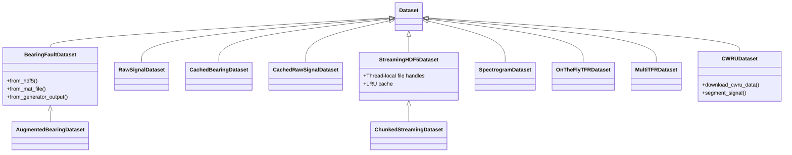
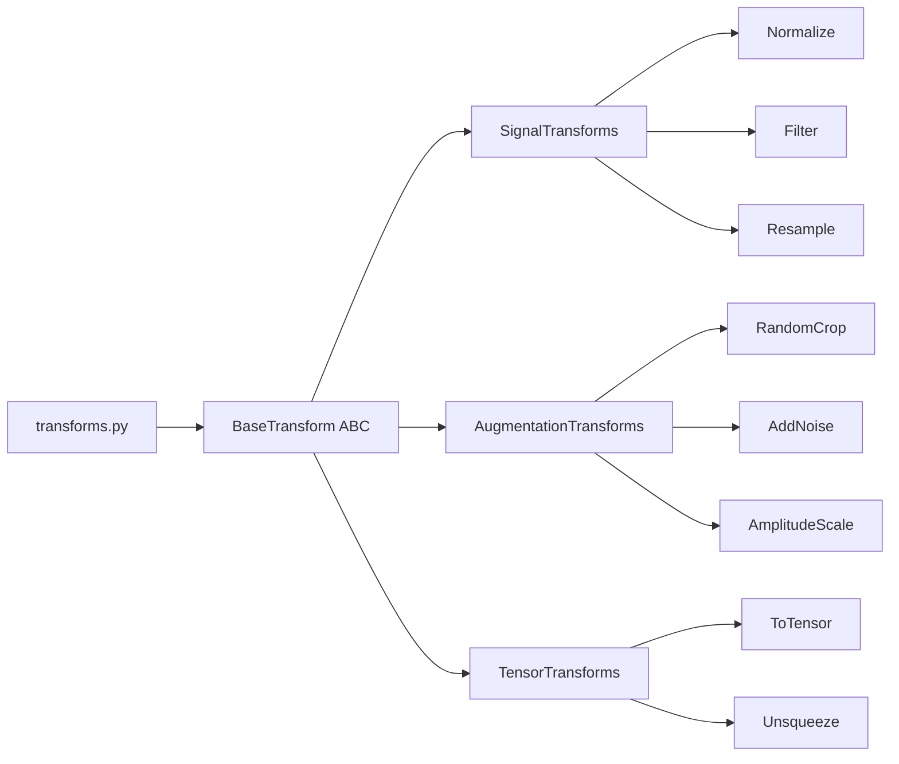

# IDB 3.2: Data Loading Sub-Block Analysis

**Analysis Date:** 2026-01-23  
**Analyst:** AI Agent (Data Engineering Domain)  
**Status:** Complete

---

## Executive Summary

The Data Loading sub-block comprises **14 primary files** in the `data/` directory with **12+ dataset classes** and **15+ transform classes**. While the implementation demonstrates good separation of concerns and provides multiple loading strategies for different memory scenarios, there are significant architectural issues including **duplicate class definitions**, **potential memory leaks in HDF5 file handling**, and **lack of a unified dataset interface**.

---

## Task 1: Current State Assessment

### 1.1 Dataset Class Hierarchy



### 1.2 Dataset Classes by File

| File                                                                                                  | Classes                                                                  | Memory Strategy           | File Formats |
| ----------------------------------------------------------------------------------------------------- | ------------------------------------------------------------------------ | ------------------------- | ------------ |
| [dataset.py](file:///c:/Users/COWLAR/projects/LSTM_PFD/data/dataset.py)                               | `BearingFaultDataset`, `AugmentedBearingDataset`, `CachedBearingDataset` | In-memory, Disk-cached    | HDF5, MAT    |
| [cnn_dataset.py](file:///c:/Users/COWLAR/projects/LSTM_PFD/data/cnn_dataset.py)                       | `RawSignalDataset`, `CachedRawSignalDataset`                             | In-memory, On-the-fly     | HDF5         |
| [streaming_hdf5_dataset.py](file:///c:/Users/COWLAR/projects/LSTM_PFD/data/streaming_hdf5_dataset.py) | `StreamingHDF5Dataset`, `ChunkedStreamingDataset`                        | Streaming, Chunked        | HDF5         |
| [cwru_dataset.py](file:///c:/Users/COWLAR/projects/LSTM_PFD/data/cwru_dataset.py)                     | `CWRUDataset`                                                            | In-memory                 | MAT          |
| [tfr_dataset.py](file:///c:/Users/COWLAR/projects/LSTM_PFD/data/tfr_dataset.py)                       | `SpectrogramDataset`, `OnTheFlyTFRDataset`, `MultiTFRDataset`            | Memory-mapped, On-the-fly | NPZ, HDF5    |

### 1.3 Supported File Formats

| Format    | Extension | Read Support       | Write Support | Used By                              |
| --------- | --------- | ------------------ | ------------- | ------------------------------------ |
| HDF5      | `.h5`     | ✅                 | ✅            | All streaming datasets               |
| MATLAB    | `.mat`    | ✅                 | ❌            | `BearingFaultDataset`, `CWRUDataset` |
| NumPy NPZ | `.npz`    | ✅ (memory-mapped) | ❌            | `SpectrogramDataset`                 |
| Pickle    | `.pkl`    | ✅                 | ✅            | `CachedBearingDataset`               |

### 1.4 Streaming Implementation Analysis

**StreamingHDF5Dataset** ([streaming_hdf5_dataset.py:40-152](file:///c:/Users/COWLAR/projects/LSTM_PFD/data/streaming_hdf5_dataset.py#L40-L152)):

- ✅ Thread-local file handles (`threading.local`)
- ✅ SWMR mode for concurrent reads
- ✅ Optional LRU cache
- ⚠️ Cache not thread-safe across workers

**ChunkedStreamingDataset** ([streaming_hdf5_dataset.py:155-207](file:///c:/Users/COWLAR/projects/LSTM_PFD/data/streaming_hdf5_dataset.py#L155-L207)):

- ✅ Chunked prefetching (256 samples default)
- ⚠️ Chunk data stored per-instance, not per-worker

### 1.5 Transform Pipelines

#### transforms.py ([transforms.py](file:///c:/Users/COWLAR/projects/LSTM_PFD/data/transforms.py))

| Transform        | Purpose              | Parameters                 |
| ---------------- | -------------------- | -------------------------- |
| `Compose`        | Pipeline composition | List of transforms         |
| `Normalize`      | zscore/minmax/robust | method, eps                |
| `Resample`       | Resampling           | original_fs, target_fs     |
| `BandpassFilter` | Bandpass filtering   | lowcut, highcut, fs, order |
| `LowpassFilter`  | Lowpass filtering    | cutoff, fs, order          |
| `HighpassFilter` | Highpass filtering   | cutoff, fs, order          |
| `ToTensor`       | NumPy → Tensor       | dtype                      |
| `Unsqueeze`      | Add channel dim      | dim                        |
| `Detrend`        | Remove trend         | type                       |
| `Clip`           | Clip values          | min_val, max_val           |
| `AddNoise`       | Add Gaussian noise   | snr_db                     |
| `WindowSlice`    | Extract window       | start, length, random      |

#### cnn_transforms.py ([cnn_transforms.py](file:///c:/Users/COWLAR/projects/LSTM_PFD/data/cnn_transforms.py))

| Transform              | Purpose               | Parameters              |
| ---------------------- | --------------------- | ----------------------- |
| `ToTensor1D`           | NumPy → Tensor [1, T] | -                       |
| `Normalize1D`          | Z-score normalization | eps                     |
| `RandomCrop1D`         | Random cropping       | crop_size, padding_mode |
| `RandomAmplitudeScale` | Scale augmentation    | scale_range, p          |
| `AddGaussianNoise`     | Noise augmentation    | noise_level, p          |
| `Compose`              | **DUPLICATE**         | transforms              |

---

## Task 2: Critical Issues Identification

### P0: Critical (Potential Crashes/Data Corruption)

#### P0-1: HDF5 File Handle Leak in OnTheFlyTFRDataset

**File:** [tfr_dataset.py:148-158](file:///c:/Users/COWLAR/projects/LSTM_PFD/data/tfr_dataset.py#L148-L158)

```python
# PROBLEM: File opened in __init__, only closed in __del__
self.h5_file = h5py.File(signals_cache, 'r')
# ...
if cache_in_memory:
    self.signals = self.signals[:]
    self.h5_file.close()  # Only closed if cache_in_memory=True
```

> [!CAUTION]
> If `cache_in_memory=False`, the file handle is only closed when the object is garbage collected, which is unreliable. With DataLoader workers, this can exhaust file descriptors.

**Fix:** Use context manager pattern or explicit resource management.

---

#### P0-2: Bare except Clauses Swallowing Errors

**Files:** Multiple locations

```python
# streaming_hdf5_dataset.py:139-140
except:
    pass

# tfr_dataset.py:206-207, 283-286
except:
    pass
```

> [!WARNING]
> Bare `except` clauses swallow all exceptions including `KeyboardInterrupt`, making debugging impossible.

---

#### P0-3: Thread-Safety Issues in LRU Cache

**File:** [streaming_hdf5_dataset.py:104-121](file:///c:/Users/COWLAR/projects/LSTM_PFD/data/streaming_hdf5_dataset.py#L104-L121)

```python
# Cache operations not thread-safe
if idx in self._cache:
    signal = self._cache[idx]
else:
    # Race condition: multiple workers may update same cache
    self._cache[idx] = signal
    self._cache_order.append(idx)
```

---

### P1: High Priority (Performance/Correctness)

#### P1-1: Duplicate `Compose` Class Definitions

**Files:** [transforms.py:27-52](file:///c:/Users/COWLAR/projects/LSTM_PFD/data/transforms.py#L27-L52), [cnn_transforms.py:241-274](file:///c:/Users/COWLAR/projects/LSTM_PFD/data/cnn_transforms.py#L241-L274)

Two identical `Compose` classes exist. The `cnn_transforms.py` version adds `__repr__` but is otherwise identical.

**Impact:** Code duplication, inconsistent behavior if modified independently.

---

#### P1-2: CachedRawSignalDataset Opens HDF5 Per-Sample

**File:** [cnn_dataset.py:247-249](file:///c:/Users/COWLAR/projects/LSTM_PFD/data/cnn_dataset.py#L247-L249)

```python
def __getitem__(self, idx: int):
    with h5py.File(self.cache_path, 'r') as f:  # Opens file each call!
        signal = f[self.split]['signals'][idx]
```

> [!IMPORTANT]
> Opening HDF5 file on every `__getitem__` call is extremely slow. Should use worker-local handles like `StreamingHDF5Dataset`.

---

#### P1-3: Inconsistent Label Handling Across Datasets

**Issue:** Different datasets handle labels differently:

- `BearingFaultDataset`: Expects string labels, converts to indices
- `RawSignalDataset`: Same approach
- `CachedRawSignalDataset`: Handles both string and int, inconsistent
- `StreamingHDF5Dataset`: Assumes labels are already int

---

#### P1-4: Magic Numbers in Segmentation

**File:** [cwru_dataset.py:248](file:///c:/Users/COWLAR/projects/LSTM_PFD/data/cwru_dataset.py#L248)

```python
segment_length: int = 2048,  # Hardcoded default
overlap: float = 0.5,        # Hardcoded default
```

Should use constants from `utils.constants`.

---

### P2: Medium Priority (Code Quality)

#### P2-1: Incomplete Type Annotations

- Many functions return `Tuple[torch.Tensor, int]` but labels are sometimes `np.integer`
- `Optional[List[Dict]]` patterns without validation

#### P2-2: Inconsistent Transform Type Handling

`transforms.py:Normalize` only accepts NumPy arrays, but `cnn_transforms.py:Normalize1D` accepts both NumPy and Tensor.

#### P2-3: Test Functions Embedded in Production Code

All dataset files contain `test_*()` functions at module level:

- [cnn_dataset.py:346-406](file:///c:/Users/COWLAR/projects/LSTM_PFD/data/cnn_dataset.py#L346-L406)
- [streaming_hdf5_dataset.py:271-374](file:///c:/Users/COWLAR/projects/LSTM_PFD/data/streaming_hdf5_dataset.py#L271-L374)
- [cwru_dataset.py:470-539](file:///c:/Users/COWLAR/projects/LSTM_PFD/data/cwru_dataset.py#L470-L539)

#### P2-4: Missing Data Validation in Dataset Classes

- No NaN/Inf checks on loaded signals
- No shape validation beyond basic assertions
- No label range validation

---

## Task 3: "If I Could Rewrite This" Retrospective

### 3.1 Is the Dataset Hierarchy Correct?

**Current State:** No common base class or interface—just `torch.utils.data.Dataset`.

**Recommended Approach:**

```python
class BaseSignalDataset(Dataset, ABC):
    """Unified interface for all signal datasets."""

    @abstractmethod
    def get_signal_shape(self) -> Tuple[int, ...]: ...

    @abstractmethod
    def get_num_classes(self) -> int: ...

    @abstractmethod
    def get_class_names(self) -> List[str]: ...

    @property
    @abstractmethod
    def is_streaming(self) -> bool: ...
```

### 3.2 Should There Be a Unified Dataset Interface?

**Yes.** Current problems:

1. No standard way to get class names across datasets
2. No standard metadata format
3. No standard way to know if dataset is streaming or in-memory

**Proposed Unified Interface:**
| Method | Description |
|--------|-------------|
| `from_hdf5(path, split)` | Factory method for HDF5 |
| `from_mat(path)` | Factory method for MAT |
| `get_metadata()` | Returns standard dict |
| `get_class_distribution()` | Returns class counts |
| `to_streaming()` | Convert to streaming mode |

### 3.3 Are Transforms Composable?

**Partially.** Issues:

1. **Duplicate `Compose`**: Should be single source in `transforms.py`
2. **Mixed input types**: Some transforms expect NumPy only, others handle both
3. **No `__repr__`** on most transforms (debugging difficult)

**Recommended Refactoring:**



---

## Summary: Technical Debt Inventory

| ID   | Priority | Category          | Issue                         | Files                                |
| ---- | -------- | ----------------- | ----------------------------- | ------------------------------------ |
| P0-1 | Critical | Memory Leak       | HDF5 file handle leak         | `tfr_dataset.py`                     |
| P0-2 | Critical | Error Handling    | Bare except clauses           | Multiple                             |
| P0-3 | Critical | Thread Safety     | LRU cache not thread-safe     | `streaming_hdf5_dataset.py`          |
| P1-1 | High     | Code Duplication  | Duplicate `Compose` class     | `transforms.py`, `cnn_transforms.py` |
| P1-2 | High     | Performance       | HDF5 opened per-sample        | `cnn_dataset.py`                     |
| P1-3 | High     | Consistency       | Inconsistent label handling   | Multiple                             |
| P1-4 | High     | Magic Numbers     | Hardcoded segmentation params | `cwru_dataset.py`                    |
| P2-1 | Medium   | Type Safety       | Incomplete type annotations   | All                                  |
| P2-2 | Medium   | Consistency       | Inconsistent transform types  | `transforms.py`, `cnn_transforms.py` |
| P2-3 | Medium   | Code Organization | Tests in production code      | All dataset files                    |
| P2-4 | Medium   | Validation        | Missing data validation       | All dataset files                    |

---

## Recommendations

### Immediate Actions (Sprint 1)

1. **Fix P0-1**: Add resource management to `OnTheFlyTFRDataset` and `MultiTFRDataset`
2. **Fix P0-2**: Replace all bare `except:` with specific exception types
3. **Fix P0-3**: Use `threading.Lock` or disable cache with `num_workers > 0`

### Short-term (Sprint 2)

1. **Fix P1-1**: Delete `Compose` from `cnn_transforms.py`, import from `transforms.py`
2. **Fix P1-2**: Refactor `CachedRawSignalDataset` to use worker-local handles
3. **Create unified interface**: `BaseSignalDataset` ABC

### Long-term (Sprint 3+)

1. Move all test functions to `tests/test_datasets.py`
2. Add comprehensive data validation with `data_validator.py` integration
3. Standardize all transforms to accept both NumPy and Tensor

---

## Good Practices to Adopt

| Practice                          | Location                                | Why It's Good                    |
| --------------------------------- | --------------------------------------- | -------------------------------- |
| Thread-local HDF5 handles         | `StreamingHDF5Dataset._get_file_handle` | Prevents multi-worker conflicts  |
| SWMR mode for HDF5                | `streaming_hdf5_dataset.py:93`          | Enables concurrent reads         |
| Factory methods (from_hdf5, etc.) | `BearingFaultDataset`                   | Clean separation of construction |
| Detailed docstrings               | `dataset.py:197-267`                    | HDF5 structure fully documented  |
| Chunked prefetching               | `ChunkedStreamingDataset`               | Better I/O performance           |
| Configurable transforms           | `get_train_transforms(augment=True)`    | Easy to toggle augmentation      |

---

_End of IDB 3.2 Data Loading Analysis_
