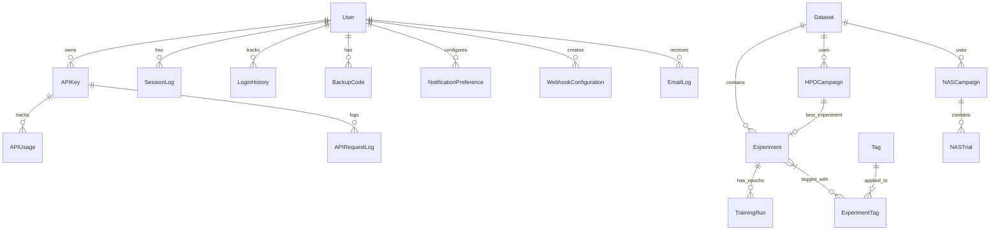

# IDB 4.1: Database Sub-Block Analysis

**IDB ID:** 4.1  
**Domain:** Infrastructure  
**Analyst Date:** 2026-01-23  
**Primary Directories:** `packages/dashboard/database/` (4 files), `packages/dashboard/models/` (26 files)

---

## Executive Summary

The database layer is **well-architected** with proper connection pooling, consistent model inheritance, comprehensive indexing, and full migration lifecycle support. The codebase follows SQLAlchemy best practices with PostgreSQL-specific optimizations and SQLite fallbacks for development.

---

## Task 1: Current State Assessment

### 1.1 Database Model Inventory

| Model                    | Table Name                 | Description                       | Lines |
| ------------------------ | -------------------------- | --------------------------------- | ----- |
| `BaseModel`              | _(abstract)_               | Common id, created_at, updated_at | 26    |
| `User`                   | `users`                    | Authentication & 2FA              | 38    |
| `Dataset`                | `datasets`                 | Dataset metadata                  | 30    |
| `Signal`                 | `signals`                  | Signal data references            | ~30   |
| `Experiment`             | `experiments`              | Training experiment tracking      | 83    |
| `TrainingRun`            | `training_runs`            | Per-epoch metrics                 | 34    |
| `APIKey`                 | `api_keys`                 | API authentication                | 106   |
| `APIUsage`               | `api_usage`                | API call tracking                 | 42    |
| `APIRequestLog`          | `api_request_logs`         | Detailed request logging          | 56    |
| `APIMetricsSummary`      | `api_metrics_summary`      | Pre-computed metrics              | 44    |
| `NotificationPreference` | `notification_preferences` | User notification settings        | 36    |
| `EmailLog`               | `email_logs`               | Email audit trail                 | 49    |
| `EmailDigestQueue`       | `email_digest_queue`       | Batch email scheduling            | ~40   |
| `WebhookConfiguration`   | `webhook_configurations`   | Slack/Teams integrations          | 63    |
| `WebhookLog`             | `webhook_logs`             | Webhook delivery tracking         | ~60   |
| `Tag`                    | `tags`                     | Experiment categorization         | 51    |
| `ExperimentTag`          | `experiment_tags`          | Many-to-many junction             | 56    |
| `SavedSearch`            | `saved_searches`           | User search presets               | ~50   |
| `HPOCampaign`            | `hpo_campaigns`            | Hyperparameter optimization       | 55    |
| `NASCampaign`            | `nas_campaigns`            | Neural architecture search        | 51    |
| `NASTrial`               | `nas_trials`               | Individual NAS trials             | 41    |
| `SessionLog`             | `session_logs`             | Active session tracking           | 49    |
| `LoginHistory`           | `login_history`            | Login audit trail                 | 41    |
| `BackupCode`             | `backup_codes`             | 2FA recovery codes                | ~40   |
| `DatasetGeneration`      | `dataset_generation`       | Synthetic data jobs               | ~40   |
| `DatasetImport`          | `dataset_import`           | External data import jobs         | ~40   |
| `SystemLog`              | `system_logs`              | System event logging              | ~30   |
| `Explanation`            | `explanations`             | XAI explanations                  | ~30   |

**Total: 28 models** (26 files + 2 in multi-model files)

### 1.2 Relationship Diagram



### 1.3 Migration History

| Migration                               | Feature       | Tables/Changes                                  |
| --------------------------------------- | ------------- | ----------------------------------------------- |
| `001_add_api_keys.sql`                  | API Keys      | `api_keys`, `api_usage`                         |
| `002_add_notification_preferences.sql`  | Notifications | `notification_preferences`                      |
| `003_add_email_logs.sql`                | Email Audit   | `email_logs`                                    |
| `004_add_email_digest_queue.sql`        | Digest Emails | `email_digest_queue`                            |
| `005_add_webhook_configurations.sql`    | Webhooks      | `webhook_configurations`                        |
| `006_add_webhook_logs.sql`              | Webhook Audit | `webhook_logs`                                  |
| `007_add_tags_and_search.sql`           | Tagging       | `tags`, `experiment_tags`, `saved_searches`     |
| `008_add_dataset_generation_import.sql` | Data Jobs     | `dataset_generation`, `dataset_import`          |
| `009_add_xai_indexes.sql`               | XAI Perf      | Performance indexes                             |
| `010_add_2fa_sessions.sql`              | 2FA/Security  | `session_logs`, `login_history`, `backup_codes` |

✅ **All migrations include:**

- `IF NOT EXISTS` guards for idempotency
- Rollback instructions (commented `DOWN MIGRATION`)
- Verification scripts with `RAISE NOTICE`
- Index creation with performance considerations

### 1.4 Connection Pooling Configuration

```python
# PostgreSQL-specific settings from connection.py
engine_kwargs = {
    "pool_pre_ping": True,      # ✅ Connection health checks
    "pool_recycle": 3600,       # ✅ Recycle stale connections
    "pool_size": 30,            # ✅ Sized for 26+ concurrent callbacks
    "max_overflow": 30,         # ✅ Burst capacity
    "pool_timeout": 30,         # ✅ Wait timeout
}
```

**Session Management:**

- `SessionLocal` — Standard sessionmaker
- `SessionScoped` — Thread-local scoped session
- `get_db_session()` — Context manager with auto-commit/rollback
- `get_db()` — Generator for dependency injection

---

## Task 2: Critical Issues Identification

### P0 (Critical) — None Found ✅

No critical issues detected. The database layer is production-ready.

### P1 (High Priority)

| Issue                               | Location        | Impact                          | Recommendation                                                                     |
| ----------------------------------- | --------------- | ------------------------------- | ---------------------------------------------------------------------------------- |
| **Unused constants import**         | Multiple models | Code smell, slight memory waste | Remove `NUM_CLASSES, SIGNAL_LENGTH, SAMPLING_RATE` from models that don't use them |
| **Deprecated `declarative_base()`** | `base.py:9`     | SQLAlchemy 2.0 deprecation      | Use `from sqlalchemy.orm import DeclarativeBase`                                   |
| **Missing `relationship` on User**  | `user.py`       | `login_history` not linked      | Add `login_history = relationship("LoginHistory", back_populates="user")`          |

### P2 (Medium Priority)

| Issue                                   | Location              | Impact                                | Recommendation                        |
| --------------------------------------- | --------------------- | ------------------------------------- | ------------------------------------- |
| **`datetime.utcnow` deprecated**        | Multiple models       | Python 3.12+ deprecation              | Use `datetime.now(timezone.utc)`      |
| **Migration runner uses raw SQL split** | `run_migration.py:35` | May fail on complex SQL               | Use `text()` wrapper or proper parser |
| **No migration version tracking**       | `database/`           | Can't detect applied migrations       | Add `schema_migrations` table         |
| **Duplicate index on `session_token`**  | `session_log.py:43`   | Comment says removed but index exists | Verify and clean up                   |
| **CRLF line endings**                   | `permissions.py`      | Inconsistent with LF files            | Normalize to LF                       |

### P3 (Low Priority)

| Issue                                                                | Location                 | Impact                                   |
| -------------------------------------------------------------------- | ------------------------ | ---------------------------------------- |
| `to_dict()` methods don't handle datetime serialization consistently | Multiple models          | Minor API inconsistency                  |
| `permissions.py` not a database model                                | `models/` dir            | Misleading location                      |
| Some models use `Base` directly, others use `BaseModel`              | Inconsistent inheritance | `APIKey` extends `Base`, not `BaseModel` |

---

## Task 3: "If I Could Rewrite This" Retrospective

### 3.1 Schema Normalization — ✅ Well Done

| Aspect         | Assessment                                                              |
| -------------- | ----------------------------------------------------------------------- |
| **1NF**        | ✅ All columns are atomic (except intentional JSON)                     |
| **2NF**        | ✅ No partial dependencies                                              |
| **3NF**        | ✅ No transitive dependencies                                           |
| **JSON Usage** | ✅ Appropriate for flexible configs (`hyperparameters`, `search_space`) |

### 3.2 Relationship Definitions — ⚠️ Minor Gaps

**Good Patterns:**

- Proper `back_populates` bidirectional relationships
- `ondelete='CASCADE'` for dependent data
- `ondelete='SET NULL'` for audit trails

**Improvements Needed:**

```python
# Missing back_populates in User model
class User(BaseModel):
    # Add these:
    login_history = relationship("LoginHistory", back_populates="user")
    email_logs = relationship("EmailLog", back_populates="user")
```

### 3.3 Schema Evolution Support — ⚠️ Needs Migration Tracking

**Current State:** Manual SQL migrations with naming convention (`001_`, `002_`, etc.)

**Recommendation:** Add Alembic for:

- Version tracking
- Auto-generated migrations
- Rollback support
- Multi-branch migrations

```python
# Suggested schema_migrations table
CREATE TABLE schema_migrations (
    version VARCHAR(255) PRIMARY KEY,
    applied_at TIMESTAMP DEFAULT NOW()
);
```

### 3.4 If Rewriting from Scratch

| Current                            | Recommended                        |
| ---------------------------------- | ---------------------------------- |
| `declarative_base()`               | `DeclarativeBase` (SQLAlchemy 2.0) |
| Manual migrations                  | Alembic with auto-generation       |
| `datetime.utcnow`                  | `datetime.now(timezone.utc)`       |
| `permissions.py` in models         | Move to `packages/dashboard/auth/` |
| Inconsistent `Base` vs `BaseModel` | All models extend `BaseModel`      |

---

## Best Practices Observed ✅

### 1. Connection Pool Configuration

```python
# Excellent practice: Health checks and sizing
engine_kwargs = {
    "pool_pre_ping": True,      # Validates connections before use
    "pool_size": 30,            # Sized for 26+ concurrent Dash callbacks
    "max_overflow": 30,         # Burst capacity
}
```

### 2. Slow Query Logging

```python
# Proactive performance monitoring
@event.listens_for(engine, "after_cursor_execute")
def after_cursor_execute(...):
    if total > 1.0:  # Log queries > 1 second
        logger.warning(f"Slow query detected ({total:.2f}s)...")
```

### 3. Context Manager for Sessions

```python
@contextmanager
def get_db_session():
    session = SessionLocal()
    try:
        yield session
        session.commit()
    except Exception:
        session.rollback()
        raise
    finally:
        session.close()
```

### 4. Index Strategy

- **Column-level indexes** for frequently filtered columns
- **Composite indexes** only where query patterns justify
- **Partial indexes** for active records (PostgreSQL)
- **Comments** explaining index decisions

### 5. Database Agnostic Patterns

```python
# SQLite fallback for development
scopes = Column(ARRAY(String).with_variant(JSON, 'sqlite'))
enabled_events = Column(JSONB().with_variant(JSON, 'sqlite'))
search_vector = Column(TSVECTOR().with_variant(Text(), 'sqlite'))
```

### 6. Migration Verification

```sql
-- Each migration includes verification
DO $$
BEGIN
    IF EXISTS (SELECT FROM information_schema.tables WHERE table_name = 'api_keys') THEN
        RAISE NOTICE 'Migration successful: api_keys table created';
    ELSE
        RAISE EXCEPTION 'Migration failed: api_keys table not created';
    END IF;
END $$;
```

---

## Technical Debt Inventory

| Priority | Item                                       | Effort | Impact               |
| -------- | ------------------------------------------ | ------ | -------------------- |
| P1       | Remove unused `utils.constants` imports    | 1h     | Code hygiene         |
| P1       | Update to SQLAlchemy 2.0 `DeclarativeBase` | 2h     | Future-proofing      |
| P1       | Add missing `User` relationships           | 30m    | Consistency          |
| P2       | Implement migration version tracking       | 4h     | Operational safety   |
| P2       | Replace `datetime.utcnow`                  | 2h     | Python 3.12+ compat  |
| P2       | Move `permissions.py` to auth module       | 1h     | Logical organization |
| P3       | Normalize all models to `BaseModel`        | 2h     | Consistency          |
| P3       | Standardize `to_dict()` datetime handling  | 2h     | API consistency      |

---

## Recommendations Summary

### Immediate Actions

1. Remove unused `utils.constants` imports across all models
2. Add missing relationship back-references in `User` model
3. Fix CRLF line endings in `permissions.py`

### Short-Term Improvements

1. Implement `schema_migrations` table for tracking
2. Update to SQLAlchemy 2.0 patterns
3. Replace deprecated `datetime.utcnow`

### Strategic Improvements

1. Consider Alembic adoption for migration management
2. Move `permissions.py` to proper auth module
3. Add database-level constraints for data integrity

---

## Conclusion

The database sub-block demonstrates **strong engineering practices** with proper connection pooling, consistent model patterns, comprehensive indexing, and well-documented migrations. The identified issues are primarily **code hygiene** concerns (P2/P3) with no critical bugs. The schema is properly normalized and relationships are well-defined.

**Overall Grade: B+** — Production-ready with minor improvements needed for future-proofing.
