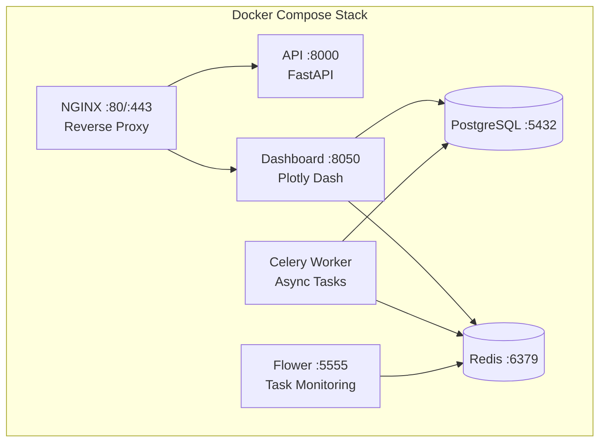
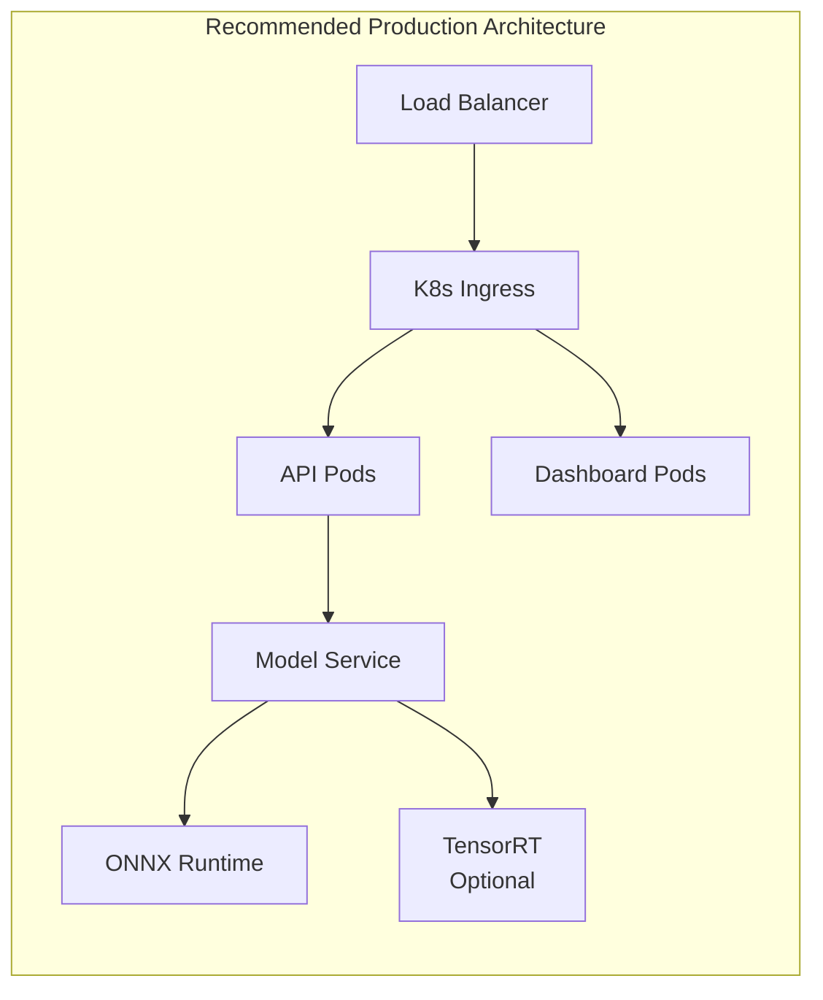

# IDB 4.2 Deployment Sub-Block Analysis

**Domain:** Infrastructure  
**Analyst:** AI Agent  
**Date:** 2026-01-23

---

## Executive Summary

The Deployment Sub-Block provides a **production-ready** deployment infrastructure with multi-stage Docker builds, Kubernetes orchestration, Helm charts, and comprehensive model optimization pipelines (ONNX export, quantization). The implementation demonstrates **enterprise-grade practices** including non-root containers, health checks, HPA autoscaling, and SLO-based alerting.

| Metric                 | Value                                 |
| ---------------------- | ------------------------------------- |
| Total Files Analyzed   | 18                                    |
| Total LOC (Python)     | ~2,000                                |
| Container Images       | 2 (API + Dashboard)                   |
| Kubernetes Resources   | 4 (Deployment, Service, Ingress, HPA) |
| Prometheus Alert Rules | 12                                    |

---

## Task 1: Current State Assessment

### 1.1 Container Architecture



#### Root Dockerfile (`Dockerfile`)

- **Multi-stage build** (3 stages: base → dependencies → application)
- **Non-root user** security (Phase 4.2 DOC-2 compliant)
- **Health check** with curl to `/health`
- Uses `python:3.10-slim` base image

#### Dashboard Dockerfile (`packages/dashboard/Dockerfile`)

- **Single-stage build** (simpler, for development)
- **Missing:** Non-root user, health check, multi-stage optimization

### 1.2 Docker Compose Configuration

| File                                    | Services | Features                                                 |
| --------------------------------------- | -------- | -------------------------------------------------------- |
| `docker-compose.yml`                    | 7        | API, NGINX, Dashboard, Celery, Flower, PostgreSQL, Redis |
| `packages/dashboard/docker-compose.yml` | 5        | Dash, Celery, Flower, PostgreSQL, Redis                  |

**Key Observations:**

- Health checks configured for Postgres/Redis with `condition: service_healthy`
- Volume mounts for checkpoints, logs, models (read-only where appropriate)
- Network isolation via `lstm_pfd_network`

### 1.3 ONNX Export Coverage

| Feature                  | Status | Notes                                     |
| ------------------------ | ------ | ----------------------------------------- |
| PyTorch → ONNX Export    | ✅     | `export_to_onnx()` with dynamic axes      |
| ONNX Validation          | ✅     | `validate_onnx_export()` compares outputs |
| ONNX Optimization        | ✅     | Basic/Extended/All passes                 |
| ONNX Runtime Inference   | ✅     | `ONNXInferenceSession` class              |
| Benchmarking             | ✅     | `benchmark_onnx_inference()`              |
| Combined Export+Quantize | ✅     | `convert_and_quantize_onnx()`             |

**ONNX Export Pipeline:**

```python
# Typical workflow
export_to_onnx(model, dummy_input, 'model.onnx')
validate_onnx_export('model.onnx', model, test_input)
optimize_onnx_model('model.onnx', 'model_opt.onnx', 'extended')
```

### 1.4 Quantization Support

| Technique                         | Status | Implementation                                         |
| --------------------------------- | ------ | ------------------------------------------------------ |
| Dynamic Quantization (INT8)       | ✅     | `quantize_model_dynamic()`                             |
| Static Quantization               | ✅     | `quantize_model_static()` with calibration             |
| FP16 Conversion                   | ✅     | `quantize_to_fp16()`                                   |
| QAT (Quantization-Aware Training) | ✅     | `prepare_qat_model()` + `quantize_qat_model()`         |
| Benchmarking                      | ✅     | `compare_model_sizes()`, `benchmark_quantized_model()` |

### 1.5 Deployment Scripts & Orchestration

| Component             | Path                                       | Purpose                           |
| --------------------- | ------------------------------------------ | --------------------------------- |
| Kubernetes Deployment | `deploy/kubernetes/deployment.yaml`        | API with 3 replicas, HPA, Ingress |
| Helm Chart            | `deploy/helm/lstm-pfd/`                    | Parameterized deployment          |
| Prometheus Alerts     | `deploy/monitoring/prometheus-alerts.yml`  | 12 alert rules                    |
| Grafana Dashboard     | `deploy/monitoring/grafana-dashboard.json` | Visualization                     |

**Helm Values Structure:**

- `values.yaml` - Default configuration
- `values-staging.yaml` - Staging overrides
- `values-prod.yaml` - Production overrides

---

## Task 2: Critical Issues Identification

### P0 - Critical (Production Blockers)

| ID   | Issue                                   | Location                        | Impact                                                                 |
| ---- | --------------------------------------- | ------------------------------- | ---------------------------------------------------------------------- |
| P0-1 | **Hardcoded secrets in docker-compose** | `docker-compose.yml:68,114,143` | `POSTGRES_PASSWORD=lstm_password`, `SECRET_KEY=development_secret_key` |
| P0-2 | **CORS allows all origins**             | `api/config.py:50`              | `cors_origins: list = ["*"]` is a security risk                        |
| P0-3 | **PostgreSQL password in Helm values**  | `values.yaml:89`                | `postgresPassword: "changeme"`                                         |

### P1 - High Priority

| ID   | Issue                                                   | Location                                | Impact                                             |
| ---- | ------------------------------------------------------- | --------------------------------------- | -------------------------------------------------- |
| P1-1 | **Dashboard Dockerfile lacks security**                 | `packages/dashboard/Dockerfile`         | No non-root user, no health check                  |
| P1-2 | **Static quantization warning**                         | `onnx_export.py:475`                    | "Static quantization not yet implemented for ONNX" |
| P1-3 | **Missing resource limits in dashboard docker-compose** | `packages/dashboard/docker-compose.yml` | No CPU/memory limits defined                       |
| P1-4 | **Deprecated `@app.on_event`**                          | `api/main.py:87,124`                    | FastAPI deprecated lifecycle decorators            |
| P1-5 | **Missing GPU resource requests in K8s**                | `deploy/kubernetes/deployment.yaml`     | No `nvidia.com/gpu` resource requests              |

### P2 - Medium Priority

| ID   | Issue                                | Location                  | Impact                                                    |
| ---- | ------------------------------------ | ------------------------- | --------------------------------------------------------- |
| P2-1 | **Redis auth disabled**              | `values.yaml:81`          | `auth.enabled: false`                                     |
| P2-2 | **No network policies in K8s**       | `deploy/kubernetes/`      | Missing pod-to-pod network restrictions                   |
| P2-3 | **Benchmark function skips PyTorch** | `inference.py:474-479`    | `benchmark_inference()` warns but doesn't benchmark torch |
| P2-4 | **Example domain in configs**        | `deployment.yaml:100,103` | `api.lstm-pfd.example.com` placeholder                    |
| P2-5 | **No rate limiting in API**          | `api/main.py`             | No request throttling middleware                          |

---

## "Rewrite" Retrospective

### What's Done Well ✅

1. **Multi-stage Dockerfile** - Excellent separation of build and runtime
2. **Non-root container execution** - Security best practice followed
3. **Comprehensive health checks** - Both Dockerfile HEALTHCHECK and K8s probes
4. **HPA autoscaling** - CPU and memory based scaling configured
5. **Prometheus SLO alerts** - 99.5% availability SLO defined
6. **Quantization pipeline completeness** - Dynamic/Static/FP16/QAT all covered
7. **Inference engine abstraction** - Clean `BaseInferenceEngine` ABC pattern

### What Would Be Changed 🔄

| Current                      | Proposed Improvement                    |
| ---------------------------- | --------------------------------------- |
| Hardcoded secrets            | Use K8s Secrets/Vault/SOPS              |
| Dashboard single-stage build | Multi-stage with distroless base        |
| No API rate limiting         | Add SlowAPI or similar middleware       |
| CORS wildcard                | Environment-specific CORS configuration |
| In-compose volumes           | PVC for production, tmpfs for secrets   |

### Architecture Recommendations



---

## Best Practices Inventory

### Practices to Adopt Project-Wide

1. **Multi-stage Docker builds** with explicit stage naming
2. **Non-root user execution** in containers
3. **Health checks** at both container and orchestration levels
4. **Pydantic settings** for configuration management
5. **ABC pattern** for pluggable backends (inference engines)
6. **Dataclass configs** for clean parameter passing
7. **Comprehensive logging** with configurable levels

### Code Patterns Worth Reusing

```python
# 1. Inference engine pattern (from inference.py)
class BaseInferenceEngine(ABC):
    @abstractmethod
    def predict(self, input_data: np.ndarray) -> np.ndarray:
        pass

# 2. Config pattern (from config.py)
class Settings(BaseSettings):
    model_path: str = "checkpoints/best_model.pth"
    class Config:
        env_file = ".env"

# 3. Quantization with benchmarking
stats = compare_model_sizes(original_model, quantized_model)
```

---

## File Inventory

| File                                               | LOC | Purpose                          |
| -------------------------------------------------- | --- | -------------------------------- |
| `Dockerfile`                                       | 64  | Multi-stage API container        |
| `docker-compose.yml`                               | 197 | Full-stack orchestration         |
| `packages/dashboard/Dockerfile`                    | 26  | Dashboard container              |
| `packages/dashboard/docker-compose.yml`            | 84  | Dashboard stack                  |
| `packages/deployment/api/main.py`                  | 379 | FastAPI inference server         |
| `packages/deployment/api/config.py`                | 63  | API configuration                |
| `packages/deployment/api/schemas.py`               | 173 | Pydantic request/response models |
| `packages/deployment/optimization/onnx_export.py`  | 483 | ONNX export utilities            |
| `packages/deployment/optimization/quantization.py` | 468 | Model quantization               |
| `packages/deployment/optimization/inference.py`    | 525 | Optimized inference engines      |
| `deploy/kubernetes/deployment.yaml`                | 139 | K8s manifests                    |
| `deploy/helm/lstm-pfd/values.yaml`                 | 140 | Helm default values              |
| `deploy/monitoring/prometheus-alerts.yml`          | 173 | Alert rules                      |

---

## Summary & Prioritized Remediation

| Priority | Count | Effort Estimate |
| -------- | ----- | --------------- |
| P0       | 3     | 2-4 hours       |
| P1       | 5     | 1-2 days        |
| P2       | 5     | 1-2 days        |

**Immediate Actions:**

1. Move secrets to K8s Secrets or external secret management
2. Configure environment-specific CORS origins
3. Add non-root user to dashboard Dockerfile

**Short-term (Sprint):** 4. Add rate limiting middleware 5. Implement GPU resource requests for K8s 6. Add network policies to K8s deployment

---

_Report generated by IDB 4.2 Deployment Sub-Block Analyst_
