# IDB 4.4: Configuration Sub-Block Analysis

**Analysis Date:** 2026-01-23  
**Analyst:** AI Configuration Analyst  
**Independence Score:** 10/10 (Pure data, no logic dependencies)

---

## Executive Summary

The configuration sub-block consists of **6 files** in the `config/` directory, implementing a **dataclass-based configuration system** with JSON schema validation and YAML serialization. The architecture is well-structured with clear inheritance patterns, but has several gaps including **zero environment variable support**, **incomplete schema validation**, and some **insecure defaults**.

| Metric                       | Value                |
| ---------------------------- | -------------------- |
| Total Files                  | 6 (+1 `__init__.py`) |
| Total Lines                  | ~1,589               |
| Config Classes               | 20                   |
| Schema Coverage              | ~40% of fields       |
| Environment Variable Support | ❌ None              |

---

## 1. Current State Assessment

### 1.1 Configuration Architecture

```mermaid
classDiagram
    BaseConfig <|-- SignalConfig
    BaseConfig <|-- FaultConfig
    BaseConfig <|-- SeverityConfig
    BaseConfig <|-- NoiseConfig
    BaseConfig <|-- OperatingConfig
    BaseConfig <|-- PhysicsConfig
    BaseConfig <|-- TransientConfig
    BaseConfig <|-- AugmentationConfig
    BaseConfig <|-- DataConfig
    DataConfig *-- SignalConfig
    DataConfig *-- FaultConfig
    DataConfig *-- SeverityConfig
    DataConfig *-- NoiseConfig
    DataConfig *-- OperatingConfig
    DataConfig *-- PhysicsConfig
    DataConfig *-- TransientConfig
    DataConfig *-- AugmentationConfig

    BaseConfig <|-- CNN1DConfig
    BaseConfig <|-- ResNet1DConfig
    BaseConfig <|-- TransformerConfig
    BaseConfig <|-- LSTMConfig
    BaseConfig <|-- HybridPINNConfig
    BaseConfig <|-- EnsembleConfig
    BaseConfig <|-- ModelConfig
    ModelConfig *-- CNN1DConfig
    ModelConfig *-- ResNet1DConfig
    ModelConfig *-- TransformerConfig
    ModelConfig *-- LSTMConfig
    ModelConfig *-- HybridPINNConfig
    ModelConfig *-- EnsembleConfig

    BaseConfig <|-- OptimizerConfig
    BaseConfig <|-- SchedulerConfig
    BaseConfig <|-- CallbackConfig
    BaseConfig <|-- MixedPrecisionConfig
    BaseConfig <|-- RegularizationConfig
    BaseConfig <|-- TrainingConfig
    TrainingConfig *-- OptimizerConfig
    TrainingConfig *-- SchedulerConfig
    TrainingConfig *-- CallbackConfig
    TrainingConfig *-- MixedPrecisionConfig
    TrainingConfig *-- RegularizationConfig

    BaseConfig <|-- MLflowConfig
    BaseConfig <|-- LoggingConfig
    BaseConfig <|-- ExperimentConfig
    ExperimentConfig *-- MLflowConfig
    ExperimentConfig *-- LoggingConfig

    class BaseConfig {
        <<abstract>>
        +get_schema()* Dict
        +validate() bool
        +from_yaml() T
        +to_yaml() None
        +to_dict() Dict
        +merge_configs() T
    }
```



### 1.2 File Inventory

| File                                                                                          | Lines | Config Classes                  | Constants Import                      |
| --------------------------------------------------------------------------------------------- | ----- | ------------------------------- | ------------------------------------- |
| [base_config.py](file:///c:/Users/COWLAR/projects/LSTM_PFD/config/base_config.py)             | 193   | `BaseConfig`, `ConfigValidator` | ❌                                    |
| [data_config.py](file:///c:/Users/COWLAR/projects/LSTM_PFD/config/data_config.py)             | 365   | 9 classes                       | ✅ `SAMPLING_RATE`, `SIGNAL_DURATION` |
| [model_config.py](file:///c:/Users/COWLAR/projects/LSTM_PFD/config/model_config.py)           | 387   | 7 classes                       | ✅ `NUM_CLASSES`, `SIGNAL_LENGTH`     |
| [training_config.py](file:///c:/Users/COWLAR/projects/LSTM_PFD/config/training_config.py)     | 364   | 6 classes                       | ❌                                    |
| [experiment_config.py](file:///c:/Users/COWLAR/projects/LSTM_PFD/config/experiment_config.py) | 208   | 3 classes                       | ❌                                    |
| [**init**.py](file:///c:/Users/COWLAR/projects/LSTM_PFD/config/__init__.py)                   | 72    | - (exports only)                | -                                     |

### 1.3 Configuration Schemas Documentation

#### BaseConfig ([base_config.py:27-168](file:///c:/Users/COWLAR/projects/LSTM_PFD/config/base_config.py#L27-L168))

Abstract base providing:

- `get_schema()` — Abstract method for JSON schema definition
- `validate()` — Uses `jsonschema.validate()` against schema
- `from_yaml()` / `to_yaml()` — YAML serialization with validation
- `merge_configs()` — Override-based config merging

#### Data Configuration Classes

| Class                | Key Fields                                    | Schema Validated Fields                 |
| -------------------- | --------------------------------------------- | --------------------------------------- |
| `SignalConfig`       | `fs=20480`, `T=5.0`, `Omega_base=60.0`        | ✅ All 3 fields                         |
| `FaultConfig`        | `include_single/mixed/healthy`, fault dicts   | ⚠️ Only booleans                        |
| `SeverityConfig`     | `levels`, `ranges`, `temporal_evolution`      | ⚠️ Only `enabled`, `temporal_evolution` |
| `NoiseConfig`        | 7 noise booleans, `levels` dict, `aliasing`   | ⚠️ Missing `levels` dict validation     |
| `OperatingConfig`    | `speed_variation`, `load_range`, `temp_range` | ⚠️ Only `speed_variation`               |
| `PhysicsConfig`      | `sommerfeld_base`, `reynolds_range`           | ⚠️ Only 3 of 5 fields                   |
| `TransientConfig`    | `probability`, `types` list                   | ⚠️ Only `enabled`, `probability`        |
| `AugmentationConfig` | `ratio`, `methods`, augmentation ranges       | ⚠️ Missing range validation             |
| `DataConfig`         | Master config with all sub-configs            | ⚠️ Only top-level fields                |

#### Model Configuration Classes

| Class               | Key Fields                                            | Architecture                   |
| ------------------- | ----------------------------------------------------- | ------------------------------ |
| `CNN1DConfig`       | `conv_channels`, `kernel_sizes`, `fc_hidden_dims`     | Conv1D → BN → ReLU → Pool → FC |
| `ResNet1DConfig`    | `blocks`, `channels`, `use_bottleneck`                | ResBlock with skip connections |
| `TransformerConfig` | `d_model=256`, `nhead=8`, `num_layers=6`              | Encoder with patch embedding   |
| `LSTMConfig`        | `hidden_size=256`, `num_layers=3`, `bidirectional`    | Bi-LSTM → FC                   |
| `HybridPINNConfig`  | `backbone`, `physics_features`, `physics_loss_weight` | Data-driven + Physics branch   |
| `EnsembleConfig`    | `model_configs`, `ensemble_method`                    | Voting/Stacking/Weighted       |
| `ModelConfig`       | `model_type` selector + all sub-configs               | Factory pattern                |

#### Training Configuration Classes

| Class                  | Key Fields                                                         |
| ---------------------- | ------------------------------------------------------------------ |
| `OptimizerConfig`      | `name='adamw'`, `lr=0.001`, `weight_decay=0.01`, gradient clipping |
| `SchedulerConfig`      | `name='cosine'`, `T_max=100`, warmup support                       |
| `CallbackConfig`       | Early stopping, checkpointing, TensorBoard, CSV logging            |
| `MixedPrecisionConfig` | `enabled=False`, `dtype='float16'`, dynamic loss scaling           |
| `RegularizationConfig` | Label smoothing, Mixup, CutMix, EMA                                |
| `TrainingConfig`       | Master config aggregating all training settings                    |

### 1.4 Validation Logic Assessment

**Current Implementation ([base_config.py:60-74](file:///c:/Users/COWLAR/projects/LSTM_PFD/config/base_config.py#L60-L74)):**

```python
def validate(self) -> bool:
    try:
        validate(instance=asdict(self), schema=self.get_schema())
        return True
    except ValidationError as e:
        raise ValueError(f"Configuration validation failed: {e.message}") from e
```

**ConfigValidator Utility ([base_config.py:170-193](file:///c:/Users/COWLAR/projects/LSTM_PFD/config/base_config.py#L170-L193)):**

```python
class ConfigValidator:
    @staticmethod
    def validate_positive(value: float, name: str) -> None
    @staticmethod
    def validate_range(value: float, min_val: float, max_val: float, name: str) -> None
    @staticmethod
    def validate_probability(value: float, name: str) -> None
```

> [!WARNING]
> `ConfigValidator` utility methods are **never used** anywhere in the codebase!

### 1.5 Environment Variable Handling

❌ **No environment variable support exists.**

- Zero `os.environ` or `os.getenv` calls in config module
- No `.env` file loading
- All configuration is hardcoded defaults or YAML-loaded

### 1.6 Configuration Inheritance Map

```
BaseConfig (Abstract)
├── Data Domain
│   ├── SignalConfig
│   ├── FaultConfig
│   ├── SeverityConfig
│   ├── NoiseConfig
│   ├── OperatingConfig
│   ├── PhysicsConfig
│   ├── TransientConfig
│   ├── AugmentationConfig
│   └── DataConfig (aggregates above)
├── Model Domain
│   ├── CNN1DConfig
│   ├── ResNet1DConfig
│   ├── TransformerConfig
│   ├── LSTMConfig
│   ├── HybridPINNConfig
│   ├── EnsembleConfig
│   └── ModelConfig (aggregates above)
├── Training Domain
│   ├── OptimizerConfig
│   ├── SchedulerConfig
│   ├── CallbackConfig
│   ├── MixedPrecisionConfig
│   ├── RegularizationConfig
│   └── TrainingConfig (aggregates above)
└── Experiment Domain
    ├── MLflowConfig
    ├── LoggingConfig
    └── ExperimentConfig (aggregates above)
```

---

## 2. Critical Issues Identification

### P0: Blocking/Security Issues

| ID   | Issue                                     | Location                                                                                             | Impact                                                               |
| ---- | ----------------------------------------- | ---------------------------------------------------------------------------------------------------- | -------------------------------------------------------------------- |
| P0-1 | **No environment variable support**       | All config files                                                                                     | Secrets (MLflow URIs, API keys) must be hardcoded or passed via YAML |
| P0-2 | **MLflow tracking URI defaults to local** | [experiment_config.py:32](file:///c:/Users/COWLAR/projects/LSTM_PFD/config/experiment_config.py#L32) | `tracking_uri='./mlruns'` — No production-ready default              |

### P1: High Priority Issues

| ID   | Issue                              | Location                                                                                            | Impact                                                         |
| ---- | ---------------------------------- | --------------------------------------------------------------------------------------------------- | -------------------------------------------------------------- |
| P1-1 | **Incomplete schema validation**   | All `get_schema()` methods                                                                          | ~60% of fields have no schema validation                       |
| P1-2 | **ConfigValidator never used**     | [base_config.py:170-193](file:///c:/Users/COWLAR/projects/LSTM_PFD/config/base_config.py#L170-L193) | Dead code; validation helpers exist but are unused             |
| P1-3 | **No cross-field validation**      | All config classes                                                                                  | E.g., `conv_channels` and `kernel_sizes` must have same length |
| P1-4 | **Hardcoded paths in defaults**    | Multiple files                                                                                      | `checkpoint_dir='checkpoints'`, `tensorboard_dir='runs'`       |
| P1-5 | **Deprecated method left in code** | [data_config.py:315-353](file:///c:/Users/COWLAR/projects/LSTM_PFD/config/data_config.py#L315-L353) | `from_matlab_struct()` raises `NotImplementedError`            |

### P2: Medium Priority Issues

| ID   | Issue                                   | Location                                                                                                    | Impact                                           |
| ---- | --------------------------------------- | ----------------------------------------------------------------------------------------------------------- | ------------------------------------------------ |
| P2-1 | **Mixed precision disabled by default** | [training_config.py:202](file:///c:/Users/COWLAR/projects/LSTM_PFD/config/training_config.py#L202)          | `enabled=False` — Performance left on table      |
| P2-2 | **Inconsistent multi-GPU defaults**     | [training_config.py:315-316](file:///c:/Users/COWLAR/projects/LSTM_PFD/config/training_config.py#L315-L316) | `multi_gpu=False`, `gpu_ids=None`                |
| P2-3 | **Undocumented schema enum values**     | Various                                                                                                     | Schema enums lack descriptions                   |
| P2-4 | **No type hints for complex fields**    | Dict/List fields                                                                                            | Runtime type errors possible                     |
| P2-5 | **Tuple type in dataclass**             | [training_config.py:45](file:///c:/Users/COWLAR/projects/LSTM_PFD/config/training_config.py#L45)            | `betas: tuple` — Should be `Tuple[float, float]` |

---

## 3. Detailed Issue Analysis

### Issue P0-1: No Environment Variable Support

**Current State:**

```python
# experiment_config.py
tracking_uri: str = './mlruns'  # Hardcoded!
```

**Recommended Fix:**

```python
import os

@dataclass
class MLflowConfig(BaseConfig):
    tracking_uri: str = field(
        default_factory=lambda: os.getenv('MLFLOW_TRACKING_URI', './mlruns')
    )
```

### Issue P1-1: Incomplete Schema Validation

**Example: FaultConfig schema only validates 3 of 6 fields:**

```python
# Current (incomplete)
def get_schema(self) -> Dict[str, Any]:
    return {
        "type": "object",
        "properties": {
            "include_single": {"type": "boolean"},
            "include_mixed": {"type": "boolean"},
            "include_healthy": {"type": "boolean"},
            # Missing: single_faults, mixed_faults dicts!
        }
    }
```

**Schema Completeness Audit:**

| Config Class    | Total Fields | Validated Fields | Coverage |
| --------------- | ------------ | ---------------- | -------- |
| SignalConfig    | 3            | 3                | ✅ 100%  |
| FaultConfig     | 4            | 3                | ⚠️ 75%   |
| SeverityConfig  | 4            | 2                | ⚠️ 50%   |
| NoiseConfig     | 9            | 8                | ⚠️ 89%   |
| OperatingConfig | 3            | 1                | ❌ 33%   |
| PhysicsConfig   | 5            | 3                | ⚠️ 60%   |
| CNN1DConfig     | 9            | 4                | ❌ 44%   |
| TrainingConfig  | 18           | 6                | ❌ 33%   |

### Issue P1-2: Dead ConfigValidator Code

```python
# base_config.py:177-193 - NEVER CALLED
class ConfigValidator:
    @staticmethod
    def validate_positive(value: float, name: str) -> None: ...
    @staticmethod
    def validate_range(value: float, ...) -> None: ...
    @staticmethod
    def validate_probability(value: float, name: str) -> None: ...
```

**Usage Search:** Zero references anywhere in codebase.

---

## 4. Schema Documentation

### Complete Schema Reference

#### SignalConfig

```json
{
  "type": "object",
  "properties": {
    "fs": { "type": "integer", "minimum": 1000, "maximum": 100000 },
    "T": { "type": "number", "minimum": 0.1, "maximum": 60.0 },
    "Omega_base": { "type": "number", "minimum": 1.0, "maximum": 1000.0 }
  },
  "required": ["fs", "T", "Omega_base"]
}
```

#### OptimizerConfig

```json
{
  "type": "object",
  "properties": {
    "name": { "type": "string", "enum": ["adam", "adamw", "sgd", "rmsprop"] },
    "lr": { "type": "number", "minimum": 0.0 },
    "weight_decay": { "type": "number", "minimum": 0.0 },
    "momentum": { "type": "number", "minimum": 0.0, "maximum": 1.0 }
  }
}
```

#### SchedulerConfig

```json
{
  "type": "object",
  "properties": {
    "name": {
      "type": "string",
      "enum": ["step", "cosine", "plateau", "onecycle", "none"]
    },
    "step_size": { "type": "integer", "minimum": 1 },
    "gamma": { "type": "number", "minimum": 0.0, "maximum": 1.0 }
  }
}
```

---

## 5. Best Practices Identified ✅

| Practice                     | Location                          | Notes                                 |
| ---------------------------- | --------------------------------- | ------------------------------------- |
| **Dataclass-based configs**  | All files                         | Type hints, immutability-friendly     |
| **Abstract base class**      | `BaseConfig`                      | Enforces consistent interface         |
| **JSON Schema validation**   | `get_schema()` pattern            | Standard validation approach          |
| **YAML serialization**       | `from_yaml()` / `to_yaml()`       | Human-readable config files           |
| **Constants centralization** | `utils/constants.py`              | 629 lines of well-organized constants |
| **Factory pattern**          | `ModelConfig.get_active_config()` | Clean model selection                 |
| **Config merging**           | `BaseConfig.merge_configs()`      | Override-based composition            |
| **Comprehensive docstrings** | All classes                       | Clear examples and usage              |
| **py.typed marker**          | `config/py.typed`                 | PEP 561 typed package                 |

---

## 6. Recommendations

### High Priority

1. **Add environment variable support:**

   ```python
   from os import getenv
   tracking_uri: str = field(default_factory=lambda: getenv('MLFLOW_URI', './mlruns'))
   ```

2. **Complete schema validation for all fields**

3. **Use ConfigValidator or remove dead code**

4. **Add cross-field validation:**
   ```python
   def __post_init__(self):
       if len(self.conv_channels) != len(self.kernel_sizes):
           raise ValueError("conv_channels and kernel_sizes must have same length")
   ```

### Medium Priority

5. **Enable mixed precision by default for modern GPUs**
6. **Add config profiles (dev/staging/prod)**
7. **Document all schema enum values**
8. **Add validation for nested config objects**

### Low Priority

9. **Remove deprecated `from_matlab_struct()` method**
10. **Add proper `Tuple[float, float]` type hints throughout**

---

## 7. Dependency Analysis

### Imports FROM config module (downstream consumers):

- `packages/core/models/` — Uses `ModelConfig`, individual model configs
- `packages/core/training/` — Uses `TrainingConfig`, `OptimizerConfig`
- `packages/dashboard/` — Uses `ExperimentConfig`
- `tests/` — Imports various configs for testing

### Imports INTO config module (upstream dependencies):

```python
# base_config.py
from jsonschema import validate, ValidationError  # External
import yaml  # External

# data_config.py, model_config.py
from utils.constants import SAMPLING_RATE, SIGNAL_DURATION, NUM_CLASSES, SIGNAL_LENGTH
```

> [!IMPORTANT]
> Config module has minimal external dependencies (only `yaml` and `jsonschema`), maintaining its 10/10 independence score.

---

## Appendix: File Links

- [base_config.py](file:///c:/Users/COWLAR/projects/LSTM_PFD/config/base_config.py)
- [data_config.py](file:///c:/Users/COWLAR/projects/LSTM_PFD/config/data_config.py)
- [model_config.py](file:///c:/Users/COWLAR/projects/LSTM_PFD/config/model_config.py)
- [training_config.py](file:///c:/Users/COWLAR/projects/LSTM_PFD/config/training_config.py)
- [experiment_config.py](file:///c:/Users/COWLAR/projects/LSTM_PFD/config/experiment_config.py)
- [utils/constants.py](file:///c:/Users/COWLAR/projects/LSTM_PFD/utils/constants.py)
