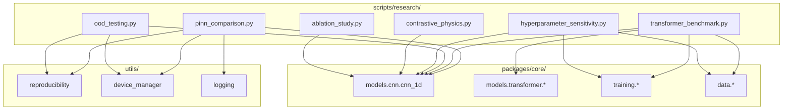

# IDB 5.1: Research Scripts Sub-Block Analysis

**Date:** 2026-01-23  
**Scope:** `scripts/research/` (9 scripts, 5,034 lines total)  
**Status:** Comprehensive Analysis Complete

---

## Executive Summary

The Research Scripts sub-block contains 9 well-structured Python scripts supporting systematic experimentation for the LSTM-PFD project. Scripts demonstrate **strong reproducibility patterns** and **comprehensive CLI interfaces**, but suffer from **code duplication** and **lack of unified orchestration**.

| Metric                    | Value                             |
| ------------------------- | --------------------------------- |
| Total Scripts             | 9                                 |
| Total Lines               | ~5,034                            |
| Largest Script            | `ablation_study.py` (1,175 lines) |
| Scripts with CLI          | 9/9 (100%)                        |
| Scripts with Seed Control | 9/9 (100%)                        |
| Output Formats            | JSON, CSV, PNG, HTML              |

---

## Task 1: Current State Assessment

### 1.1 Script Inventory & Purposes

| Script                                                                                                                    | Lines | Purpose                                          | CLI Maturity    |
| ------------------------------------------------------------------------------------------------------------------------- | ----- | ------------------------------------------------ | --------------- |
| [ablation_study.py](file:///c:/Users/COWLAR/projects/LSTM_PFD/scripts/research/ablation_study.py)                         | 1,175 | Systematic component ablation experiments        | ⭐⭐⭐ Full     |
| [contrastive_physics.py](file:///c:/Users/COWLAR/projects/LSTM_PFD/scripts/research/contrastive_physics.py)               | 1,068 | SimCLR-style physics-aware pretraining           | ⭐⭐⭐ Full     |
| [failure_analysis.py](file:///c:/Users/COWLAR/projects/LSTM_PFD/scripts/research/failure_analysis.py)                     | 353   | Misclassification analysis for manuscripts       | ⭐⭐ Moderate   |
| [hyperparameter_sensitivity.py](file:///c:/Users/COWLAR/projects/LSTM_PFD/scripts/research/hyperparameter_sensitivity.py) | 437   | Physics loss weight grid search                  | ⭐⭐⭐ Full     |
| [ood_testing.py](file:///c:/Users/COWLAR/projects/LSTM_PFD/scripts/research/ood_testing.py)                               | 491   | Out-of-distribution robustness evaluation        | ⭐⭐⭐ Full     |
| [pinn_ablation.py](file:///c:/Users/COWLAR/projects/LSTM_PFD/scripts/research/pinn_ablation.py)                           | 368   | PINN component ablation (simpler variant)        | ⭐⭐ Moderate   |
| [pinn_comparison.py](file:///c:/Users/COWLAR/projects/LSTM_PFD/scripts/research/pinn_comparison.py)                       | 427   | Raissi/Karniadakis vs Our PINN comparison        | ⭐⭐⭐ Full     |
| [transformer_benchmark.py](file:///c:/Users/COWLAR/projects/LSTM_PFD/scripts/research/transformer_benchmark.py)           | 413   | CNN vs Transformer baseline comparison           | ⭐⭐⭐ Full     |
| [xai_metrics.py](file:///c:/Users/COWLAR/projects/LSTM_PFD/scripts/research/xai_metrics.py)                               | 302   | XAI quality evaluation (faithfulness, stability) | ⭐ Library Only |

### 1.2 CLI Interface Patterns

**Standard Arguments Across Scripts:**

```bash
--data         # HDF5 dataset path (required in most)
--epochs       # Training epochs (default: 20-50)
--batch-size   # Batch size (default: 32)
--output(-dir) # Output directory/file
--quick        # Reduced search space / fewer epochs
--seed(s)      # Random seed(s) for reproducibility
--device       # CPU/CUDA selection
```

> [!TIP]
> **Exemplary CLI:** `ablation_study.py` provides the most complete CLI with component selection (`--component physics`), configurable seeds, and custom YAML config support.

### 1.3 Reproducibility Mechanisms

| Script                        | Seed Function                                | Deterministic CUDA       | Multiple Seeds |
| ----------------------------- | -------------------------------------------- | ------------------------ | -------------- |
| ablation_study.py             | `_set_seed()`                                | ✅ `cudnn.deterministic` | ✅ 5 seeds     |
| contrastive_physics.py        | `torch.manual_seed()` + `np.random.seed()`   | ❌                       | ✅ 3 seeds     |
| hyperparameter_sensitivity.py | `from utils.reproducibility import set_seed` | ✅ (via utils)           | ❌ Single      |
| ood_testing.py                | `from utils.reproducibility import set_seed` | ✅ (via utils)           | ❌ Single      |
| pinn_ablation.py              | `set_seeds()` local                          | ✅                       | ❌ Single      |
| pinn_comparison.py            | `from utils.reproducibility import set_seed` | ✅ (via utils)           | ❌ Single      |
| transformer_benchmark.py      | `from utils.reproducibility import set_seed` | ✅ (via utils)           | ❌ Single      |
| failure_analysis.py           | `np.random.seed()`                           | N/A (no training)        | N/A            |
| xai_metrics.py                | None explicit                                | N/A                      | N/A            |

> [!IMPORTANT]
> **Best Practice:** Use `from utils.reproducibility import set_seed` (5 scripts already do this) rather than local implementations.

### 1.4 Output Formats

| Script                        | CSV | JSON | PNG | HTML | LaTeX      |
| ----------------------------- | --- | ---- | --- | ---- | ---------- |
| ablation_study.py             | ✅  | ✅   | ✅  | ❌   | ❌         |
| contrastive_physics.py        | ❌  | ✅   | ✅  | ❌   | ❌         |
| hyperparameter_sensitivity.py | ✅  | ❌   | ✅  | ❌   | ❌         |
| pinn_ablation.py              | ✅  | ✅   | ✅  | ✅   | ❌         |
| pinn_comparison.py            | ❌  | ✅   | ❌  | ❌   | ❌         |
| transformer_benchmark.py      | ❌  | ✅   | ❌  | ❌   | ❌         |
| failure_analysis.py           | ❌  | ❌   | ✅  | ❌   | ✅ (table) |
| ood_testing.py                | ❌  | ✅   | ❌  | ❌   | ❌         |
| xai_metrics.py                | ❌  | ❌   | ❌  | ❌   | ❌         |

### 1.5 Core Package Dependencies



---

## Task 2: Critical Issues Identification

### P0 (Critical)

| ID   | Issue                                       | Location                   | Impact                                                |
| ---- | ------------------------------------------- | -------------------------- | ----------------------------------------------------- |
| P0-1 | **OOD Testing requires actual data**        | `ood_testing.py:446-486`   | Demo mode works, but real data path has no validation |
| P0-2 | **PINN model import fallback hides errors** | `pinn_ablation.py:109-113` | Falls back to ResNet18 silently if HybridPINN missing |

### P1 (High Priority)

| ID   | Issue                                         | Location                                | Impact                                 |
| ---- | --------------------------------------------- | --------------------------------------- | -------------------------------------- |
| P1-1 | **Code Duplication: Training loops**          | All scripts                             | ~200 lines duplicated across 6 scripts |
| P1-2 | **Code Duplication: Data loading**            | Multiple scripts                        | Each script re-implements HDF5 loading |
| P1-3 | **Inconsistent seed handling**                | `pinn_ablation.py`, `ablation_study.py` | Local `set_seeds()` vs shared utility  |
| P1-4 | **Hardcoded output directories**              | `OUTPUT_DIR = Path('results/...')`      | No consistent root configuration       |
| P1-5 | **Missing statistical tests in some scripts** | `transformer_benchmark.py`              | No significance testing between models |

### P2 (Medium Priority)

| ID   | Issue                         | Location                               | Impact                                          |
| ---- | ----------------------------- | -------------------------------------- | ----------------------------------------------- |
| P2-1 | **Bare `except:` clause**     | `ood_testing.py:247-248`               | Swallows exceptions during accuracy calculation |
| P2-2 | **xai_metrics.py has no CLI** | `xai_metrics.py`                       | Only usable as library import                   |
| P2-3 | **Incomplete type hints**     | Various                                | Some functions lack return type annotations     |
| P2-4 | **Large files**               | `ablation_study.py` (1175 lines)       | Should be split into modules                    |
| P2-5 | **Inconsistent logging**      | Some use `logger.info`, others `print` | Output not uniform                              |

---

## Task 3: "If I Could Rewrite This" Retrospective

### 3.1 Should Scripts Be More Modular?

> [!CAUTION]
> **YES** - There is significant opportunity for refactoring.

**Current State:**

- Each script contains its own training loop, data loading, and evaluation code
- `ablation_study.py` alone is 1,175 lines with embedded model definition

**Proposed Refactoring:**

```
scripts/research/
├── _common/
│   ├── experiment.py      # Base ExperimentRunner class
│   ├── data_loading.py    # Unified HDF5 loading
│   ├── evaluation.py      # Shared metrics computation
│   └── visualization.py   # Common plotting utilities
├── ablation_study.py      # Calls _common.experiment
├── contrastive_physics.py # Calls _common.experiment
└── ...
```

### 3.2 Should There Be a Unified Experiment Runner?

> [!IMPORTANT]
> **STRONGLY RECOMMENDED**

**Benefits:**

1. Single source for training loop logic → fewer bugs
2. Consistent checkpointing and logging
3. Unified MLflow/W&B integration point
4. Easier to add new experiments

**Proposed `ExperimentRunner` Interface:**

```python
class ExperimentRunner:
    def __init__(self, config: ExperimentConfig): ...
    def load_data(self, path: str) -> DataLoaders: ...
    def train(self, model, dataloaders) -> History: ...
    def evaluate(self, model, dataloaders) -> Metrics: ...
    def run_with_seeds(self, seeds: List[int]) -> AggregatedResults: ...
    def save_results(self, results, output_dir): ...
```

### 3.3 Are Outputs Publication-Ready?

| Aspect                | Current State                           | Publication-Ready?   |
| --------------------- | --------------------------------------- | -------------------- |
| **CSV Results**       | ✅ Present in most scripts              | ✅ Ready             |
| **JSON Results**      | ✅ Well-structured                      | ✅ Ready             |
| **PNG Figures**       | ⚠️ Basic matplotlib/seaborn             | 🔶 Needs styling     |
| **LaTeX Tables**      | ✅ Only in `failure_analysis.py`        | 🔶 Missing elsewhere |
| **Statistical Tests** | ✅ McNemar's test in `pinn_ablation.py` | 🔶 Not all scripts   |
| **Error Bars**        | ✅ In some visualizations               | ✅ Ready             |
| **Multi-seed Runs**   | ⚠️ Only 2/9 scripts default to >1 seed  | ❌ Not consistent    |

**Missing for Publication:**

- Paired t-tests or Wilcoxon signed-rank for model comparisons
- Confidence intervals in all benchmark tables
- Consistent figure styling (font sizes, color schemes)
- Auto-generated LaTeX tables from all scripts

---

## Recommendations Summary

### Immediate Actions (P0/P1)

1. **Fix bare `except` clause** in `ood_testing.py:247`
2. **Consolidate seed handling** to use `utils.reproducibility.set_seed` everywhere
3. **Add explicit error** when HybridPINN import fails instead of silent fallback

### Short-term Improvements

1. **Extract common `ExperimentRunner` base class**
2. **Create shared data loading module** to eliminate duplication
3. **Add CLI to `xai_metrics.py`**
4. **Standardize output directories** via environment variable or config

### Long-term Refactoring

1. **Split `ablation_study.py`** into:
   - `ablation_configs.py` (configuration dataclasses)
   - `ablation_models.py` (AblationModel, MultiScaleBlock, SE)
   - `ablation_runner.py` (training and evaluation logic)
   - `ablation_cli.py` (CLI entry point)

2. **Add experiment tracking integration** (MLflow or Weights & Biases)

3. **Create publication utilities module** with:
   - Auto-LaTeX table generation
   - Consistent figure styling
   - Statistical significance testing

---

## Best Practices Identified

The following patterns from this sub-block should be adopted project-wide:

1. **CLI Design** (`ablation_study.py`):
   - Comprehensive `argparse` with epilog examples
   - `--quick` flag for development testing
   - RawDescriptionHelpFormatter for readable help

2. **Multi-seed Experiments** (`ablation_study.py`, `contrastive_physics.py`):
   - Running experiments across multiple seeds
   - Computing mean ± std for metrics
   - Statistical significance testing

3. **Dataclass Configurations** (`ablation_study.py`):
   - `@dataclass` for `AblationConfig` and `AblationResult`
   - Type hints throughout
   - `.to_dict()` methods for serialization

4. **Graceful Optional Dependencies**:
   - `HAS_TORCH`, `HAS_SKLEARN`, `HAS_PLOTTING` pattern
   - Clear warnings when features are unavailable

5. **Timestamped Outputs**:
   - `datetime.now().strftime("%Y%m%d_%H%M%S")` in filenames
   - Prevents accidental overwriting

---

_Analysis generated by IDB 5.1 Research Scripts Agent_
