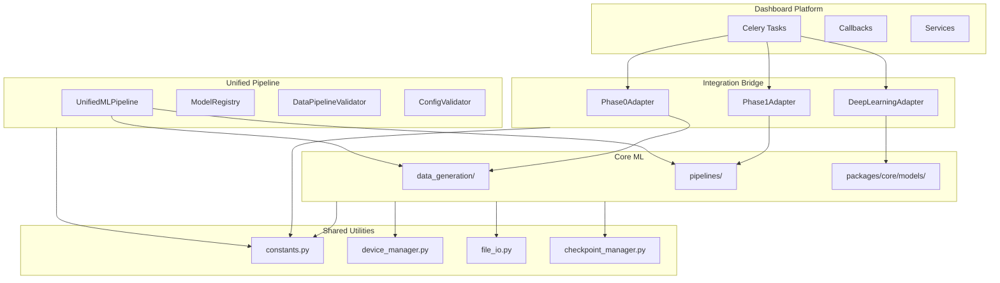

# IDB 6.0: Integration Layer Analysis Report

**Analyst:** AI Agent (Cross-Cutting Concerns Domain)  
**Date:** 2026-01-23  
**Scope:** `integration/`, `packages/dashboard/integrations/`, `utils/`

---

## Executive Summary

The Integration Layer serves as the **critical bridge** between Core ML (Phases 0-9) and the Dashboard Platform. Analysis reveals a well-structured utility layer with comprehensive coverage, but significant **incomplete implementations** in the unified pipeline and **tight coupling** through `sys.path` manipulation patterns.

| Metric                      | Value                   |
| --------------------------- | ----------------------- |
| Total Files Analyzed        | 20                      |
| Lines of Code (Estimated)   | ~4,500                  |
| Integration Test Coverage   | 2 test files (410+ LOC) |
| Critical Issues (P0)        | 2                       |
| High Priority Issues (P1)   | 4                       |
| Medium Priority Issues (P2) | 5                       |

---

## 1. Current State Assessment

### 1.1 Directory Structure

```
integration/                         # 5 files, ~1,400 LOC
├── __init__.py                      # Clean re-exports
├── unified_pipeline.py              # Phase orchestration (263 LOC)
├── model_registry.py                # SQLite-backed registry (284 LOC)
├── data_pipeline_validator.py       # Data flow validation (210 LOC)
└── configuration_validator.py       # Config validation (298 LOC)

packages/dashboard/integrations/     # 4 files, ~1,100 LOC
├── __init__.py
├── phase0_adapter.py                # Data generation bridge (329 LOC)
├── phase1_adapter.py                # Classical ML bridge (137 LOC)
└── deep_learning_adapter.py         # DL training adapter (345 LOC)

utils/                               # 11 files, ~2,000 LOC
├── __init__.py                      # 127 LOC, exports ~50 utilities
├── constants.py                     # 629 LOC, all magic numbers
├── checkpoint_manager.py            # 434 LOC
├── device_manager.py                # 419 LOC
├── early_stopping.py                # 375 LOC
├── file_io.py                       # 520 LOC
├── timer.py                         # 350+ LOC
├── reproducibility.py               # 140 LOC
├── visualization_utils.py           # 350+ LOC
├── logger.py                        # 50+ LOC
└── logging.py                       # 150+ LOC
```

### 1.2 Integration Points Map



### 1.3 Data Flow Analysis

| Source               | Target                 | Interface                        | Format                          |
| -------------------- | ---------------------- | -------------------------------- | ------------------------------- |
| Phase 0 (Signal Gen) | HDF5 Cache             | `signals_cache.h5`               | HDF5 with train/val/test splits |
| HDF5 Cache           | Phase 1 (Classical ML) | `Phase1Adapter.train()`          | NumPy arrays via h5py           |
| HDF5 Cache           | Deep Learning          | `DeepLearningAdapter.train()`    | PyTorch Tensors                 |
| Dashboard            | Core ML                | Adapters                         | Config dicts + callbacks        |
| Training             | Model Registry         | `ModelRegistry.register_model()` | SQLite + JSON metadata          |

### 1.4 Utility Coverage Analysis

| Category              | Functions                                | Coverage         |
| --------------------- | ---------------------------------------- | ---------------- |
| **Constants**         | 50+ constants, 5 utility functions       | ✅ Comprehensive |
| **Device Management** | 15+ functions, 1 context manager         | ✅ Comprehensive |
| **File I/O**          | 15+ functions (pickle, JSON, YAML, text) | ✅ Comprehensive |
| **Checkpointing**     | Full class with top-k tracking           | ✅ Comprehensive |
| **Early Stopping**    | 2 classes (base + warmup variant)        | ✅ Comprehensive |
| **Reproducibility**   | 4 functions (seed, deterministic, state) | ✅ Comprehensive |
| **Visualization**     | 8+ plotting utilities                    | ✅ Comprehensive |
| **Timing**            | Timer, Profiler, decorators              | ✅ Comprehensive |

---

## 2. Critical Issues Identification

### 2.1 P0 (Critical) — Must Fix

#### P0-1: Unified Pipeline Has 7 Placeholder Phases

```python
# unified_pipeline.py lines 172-230
def _run_phase_2_4(self) -> Dict[str, Any]:
    """Train deep learning models (CNN, ResNet, Transformer)."""
    try:
        # Placeholder for deep learning training
        logger.info("Deep learning training would run here")
        return {'status': 'placeholder', 'message': '...'}
```

**Impact:** Pipeline cannot execute full end-to-end workflow. Phases 2-9 all return placeholder dicts.  
**Recommendation:** Either implement phase orchestration or remove/document as roadmap item.

---

#### P0-2: `sys.path.insert()` Anti-Pattern Across Adapters

```python
# packages/dashboard/integrations/deep_learning_adapter.py line 15
sys.path.insert(0, str(Path(__file__).resolve().parent.parent.parent))

# integration/unified_pipeline.py lines 19-21
sys.path.insert(0, str(Path(__file__).parent.parent))
from utils.constants import SAMPLING_RATE

# packages/dashboard/integrations/phase0_adapter.py line 9
sys.path.insert(0, str(Path(__file__).resolve().parent.parent.parent))
```

**Impact:**

- Fragile import resolution
- Pollutes `sys.path` globally
- Makes debugging import errors difficult
- Namespace conflicts (noted in phase0_adapter docstring)

**Recommendation:** Use proper Python packaging with `pyproject.toml` entry points or relative imports with proper `__init__.py` chains.

---

### 2.2 P1 (High Priority) — Should Fix Soon

#### P1-1: Hardcoded Fallbacks in Constants Import

```python
# integration/unified_pipeline.py lines 18-24
try:
    import sys
    sys.path.insert(0, str(Path(__file__).parent.parent))
    from utils.constants import SAMPLING_RATE
except ImportError:
    SAMPLING_RATE = 20480  # Hardcoded fallback
```

**Impact:** Silent fallback could mask import issues and cause subtle bugs.

---

#### P1-2: Model Registry Uses SQLite Without Connection Pooling

```python
# model_registry.py - Creates new connection per operation
def __init__(self, db_path: str = 'models/model_registry.db'):
    self.db_path = Path(db_path)
    self.db_path.parent.mkdir(parents=True, exist_ok=True)
    self._init_database()
```

**Impact:** Potential performance issues under concurrent dashboard usage.

---

#### P1-3: Deep Learning Adapter Duplicates Early Stopping Logic

```python
# deep_learning_adapter.py lines 72-139
early_stopping_patience = config.get("early_stopping_patience", 15)
best_val_loss = float('inf')
patience_counter = 0
# ... manual early stopping implementation
```

**Impact:** Doesn't use existing `utils/early_stopping.py` which has more features (warmup, state_dict).

---

#### P1-4: Duplicate Logging Modules

```
utils/logger.py     # 50+ LOC - setup_logger()
utils/logging.py    # 150+ LOC - get_logger(), setup_logging()
```

**Impact:** Confusion about which to use; both are imported by different modules.

---

### 2.3 P2 (Medium Priority) — Technical Debt

| ID   | Issue                                                                | Location                           | Impact                                                      |
| ---- | -------------------------------------------------------------------- | ---------------------------------- | ----------------------------------------------------------- |
| P2-1 | No type hints on adapter return types                                | All adapters                       | Reduced IDE support                                         |
| P2-2 | Magic number `num_workers=2` in data loading                         | deep_learning_adapter.py:229       | Should use `utils.device_manager.get_optimal_num_workers()` |
| P2-3 | `validate_cross_phase_compatibility()` is a stub                     | unified_pipeline.py:232-246        | Returns True without actual validation                      |
| P2-4 | No integration test for model_registry.py                            | tests/integration/                 | SQLite operations untested in CI                            |
| P2-5 | Benchmark function `benchmark_data_loading_speed()` has placeholders | data_pipeline_validator.py:169-209 | MAT file benchmark always returns None                      |

---

## 3. "If I Could Rewrite This" Retrospective

### 3.1 Are Integration Points Minimal and Well-Defined?

**Current State:** ⚠️ Partially

- Adapter pattern is good for Dashboard → Core ML bridge
- But unified_pipeline.py tries to do too much (orchestrate 10 phases)

**Recommended Architecture:**

```
integration/
├── adapters/           # Thin adapters only
│   ├── base_adapter.py
│   ├── phase0_adapter.py
│   ├── phase1_adapter.py
│   └── deep_learning_adapter.py
├── registry/           # Model tracking
│   └── model_registry.py
├── validators/         # Validation logic
│   ├── data_validator.py
│   └── config_validator.py
└── orchestration/      # Pipeline orchestration
    └── pipeline_runner.py
```

### 3.2 Should Some Utilities Be Split by Domain?

**Current State:** ❌ All utilities in single `utils/` directory

**Recommendation:** Keep as-is for now, but consider:

```
utils/
├── core/               # Device, checkpoints, reproducibility
├── io/                 # File I/O, serialization
├── viz/                # Visualization utilities
└── training/           # Early stopping, timing
```

**Rationale:** Current flat structure works for ~11 files, but would benefit from grouping if more utilities are added.

### 3.3 Is the Bridge Layer Properly Abstracted?

**Current State:** ⚠️ Needs Improvement

**Issues:**

1. Adapters directly import core modules without interface contracts
2. No abstract base class defining adapter interface
3. Progress callbacks are ad-hoc (no shared protocol)

**Recommended Abstraction:**

```python
# integration/adapters/base_adapter.py
from abc import ABC, abstractmethod
from typing import Dict, Any, Callable, Optional

ProgressCallback = Callable[[int, Dict[str, Any]], None]

class BaseAdapter(ABC):
    """Abstract base for all phase adapters."""

    @abstractmethod
    def train(
        self,
        config: Dict[str, Any],
        progress_callback: Optional[ProgressCallback] = None
    ) -> Dict[str, Any]:
        """Train model with given configuration."""
        pass

    @abstractmethod
    def validate_config(self, config: Dict[str, Any]) -> bool:
        """Validate configuration before training."""
        pass
```

---

## 4. Integration Test Gap Analysis

### 4.1 Current Test Coverage

| Test File               | Coverage Area                              | LOC  |
| ----------------------- | ------------------------------------------ | ---- |
| `test_comprehensive.py` | Training loops, checkpoints, streaming, CV | 410  |
| `test_pipelines.py`     | Pipeline integration                       | ~200 |

### 4.2 Missing Test Coverage

| Gap                                            | Risk   | Priority |
| ---------------------------------------------- | ------ | -------- |
| Model Registry CRUD operations                 | High   | P1       |
| Configuration Validator edge cases             | Medium | P2       |
| Data Pipeline Validator with actual phase data | Medium | P2       |
| Dashboard Adapter error handling               | High   | P1       |
| Cross-phase data format compatibility          | High   | P1       |

---

## 5. Best Practices Observed ✅

### 5.1 Constants Centralization

- All magic numbers in `utils/constants.py` (629 LOC)
- Proper documentation and organization by category
- Utility functions for fault type lookups

### 5.2 Clean `__init__.py` Exports

```python
# utils/__init__.py exports ~50 utilities cleanly
__all__ = [
    'SIGNAL_LENGTH', 'SAMPLING_RATE', ...
    'set_seed', 'make_deterministic', ...
    'get_device', 'clear_gpu_memory', ...
]
```

### 5.3 Comprehensive Device Management

- `DeviceManager` context manager
- GPU memory tracking and cleanup
- Optimal worker calculation

### 5.4 Robust Checkpoint System

- Top-k checkpoint retention
- Best model tracking
- State dict save/load for resume

### 5.5 Reproducibility Utilities

- Cross-library seed setting (Python, NumPy, PyTorch)
- State capture and restoration
- Deterministic mode toggle

---

## 6. Technical Debt Inventory

| Priority    | Count  | Est. Effort     |
| ----------- | ------ | --------------- |
| P0 Critical | 2      | 8-16 hours      |
| P1 High     | 4      | 6-12 hours      |
| P2 Medium   | 5      | 4-8 hours       |
| **Total**   | **11** | **18-36 hours** |

### Prioritized Action Items

1. **[P0]** Remove or implement unified_pipeline placeholder phases
2. **[P0]** Replace `sys.path.insert()` with proper packaging
3. **[P1]** Use existing `EarlyStopping` class in `DeepLearningAdapter`
4. **[P1]** Consolidate `logger.py` and `logging.py` into single module
5. **[P1]** Add connection pooling to `ModelRegistry` for dashboard usage
6. **[P1]** Add integration tests for `ModelRegistry` and adapters
7. **[P2]** Add type hints to all adapter methods
8. **[P2]** Use `get_optimal_num_workers()` in data loading
9. **[P2]** Implement or remove stub validators
10. **[P2]** Complete benchmark functions
11. **[P2]** Add missing integration tests

---

## 7. Cross-Domain Coupling Warning

> [!CAUTION]
> **HIGH COUPLING RISK:** The Integration Layer directly imports from:
>
> - `data_generation.signal_generator`
> - `config.data_config`
> - `pipelines.classical_ml_pipeline`
> - `packages.core.models`
> - `features.feature_extractor`
>
> Changes to any of these modules may break the integration layer. Consider implementing interface contracts.

---

## 8. Recommendations Summary

| Action                                 | Priority | Effort | Impact                                  |
| -------------------------------------- | -------- | ------ | --------------------------------------- |
| Fix `sys.path` manipulation            | P0       | 4h     | High — Improves maintainability         |
| Decide on unified_pipeline fate        | P0       | 2h     | High — Removes dead code or enables E2E |
| Use existing utilities (EarlyStopping) | P1       | 1h     | Medium — Reduces duplication            |
| Add adapter base class                 | P1       | 2h     | Medium — Improves extensibility         |
| Add integration tests                  | P1       | 4h     | High — Catches regressions              |
| Consolidate logging modules            | P1       | 1h     | Low — Reduces confusion                 |

---

_Report generated by IDB 6.0 Integration Layer Analyst_
