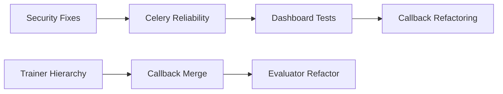
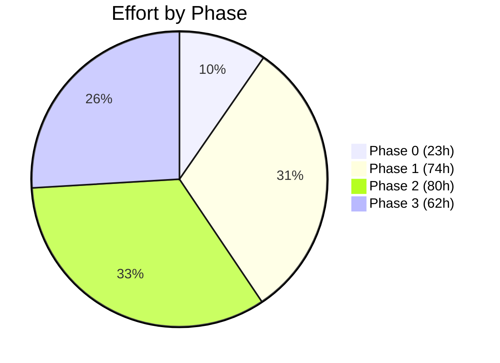

# Action Plan and Roadmap — Codebase Remediation

**Created:** 2026-01-24  
**Source:** Critical Issues Matrix, Architectural Recommendations, 5 Domain Reports  
**Total Effort Estimate:** ~218h (27 person-days) for all issues

---

## 🎯 Remediation Goals

1. **Eliminate all P0 issues** — 30 critical blockers preventing production deployment
2. **Reduce Dashboard coupling** — Improve from 5.5/10 to 7.5/10 independence
3. **Unify code conventions** — Establish single source of truth for patterns
4. **Achieve 85%+ test coverage** — Currently ~60% with critical gaps
5. **Complete documentation** — API docs and interface contracts

---

## 📅 Phased Remediation Plan

### Phase 0: Immediate Fixes (Week 1-2)

**Goal:** Address security vulnerabilities and production stability blockers

| Day | Issue # | Task                                    | Domain    | Priority | Effort | Owner     | Status |
| --- | ------- | --------------------------------------- | --------- | -------- | ------ | --------- | ------ |
| 1   | #23     | Move secrets to environment variables   | Infra     | P0       | 2h     | DevOps    | ⬜     |
| 1   | #24     | Configure environment-specific CORS     | Infra     | P0       | 1h     | Backend   | ⬜     |
| 1   | #25     | Remove PostgreSQL password from Helm    | Infra     | P0       | 1h     | DevOps    | ⬜     |
| 1   | #13     | Migrate 2FA rate limiting to Redis      | Dashboard | P0       | 2h     | Backend   | ⬜     |
| 2   | #15     | Add `result_expires=86400` to Celery    | Dashboard | P0       | 1h     | Backend   | ⬜     |
| 2   | #16     | Add `time_limit` to all 23 Celery tasks | Dashboard | P0       | 4h     | Backend   | ⬜     |
| 2   | #17     | Implement retry logic for Celery tasks  | Dashboard | P0       | 4h     | Backend   | ⬜     |
| 3   | #18     | Fix HDF5 file handle leak               | Data      | P0       | 2h     | Data Team | ⬜     |
| 3   | #19     | Replace bare `except:` clauses          | Data      | P0       | 1h     | Data Team | ⬜     |
| 3   | #20     | Add thread-safety to LRU cache          | Data      | P0       | 4h     | Data Team | ⬜     |
| 3   | #22     | Replace Redis `KEYS` with `SCAN`        | Data      | P0       | 1h     | Data Team | ⬜     |

**Phase 0 Total:** ~23h (~3 person-days)

> [!CAUTION]
> **Security issues (#13, #23-25) must be completed before ANY production deployment.** These represent data breach and compliance risks.

---

### Phase 1: Foundation Stabilization (Week 3-6)

**Goal:** Fix P1 issues, reduce technical debt, establish test coverage

#### Week 3-4: Core ML Architecture

| Issue # | Task                                | Domain  | Priority | Effort | Owner   | Status |
| ------- | ----------------------------------- | ------- | -------- | ------ | ------- | ------ |
| #4      | Unify Trainer hierarchy with mixins | Core ML | P0       | 2d     | ML Team | ⬜     |
| #5      | Merge duplicate callback systems    | Core ML | P0       | 1d     | ML Team | ⬜     |
| #6      | Consolidate loss functions          | Core ML | P0       | 4h     | ML Team | ⬜     |
| #7, #8  | Populate `__init__.py` files        | Core ML | P0       | 1h     | ML Team | ⬜     |
| #9      | Refactor evaluator inheritance      | Core ML | P0       | 2d     | ML Team | ⬜     |

**Subtotal:** ~48h

#### Week 5-6: Dashboard Stabilization

| Issue # | Task                                   | Domain    | Priority | Effort | Owner     | Status |
| ------- | -------------------------------------- | --------- | -------- | ------ | --------- | ------ |
| #26     | Create Dashboard callback test suite   | Infra     | P0       | 4-6h   | Dashboard | ⬜     |
| #27     | Create Celery async task tests         | Infra     | P0       | 4h     | Dashboard | ⬜     |
| #48     | Split `settings.py` into modules       | Dashboard | P1       | 4h     | Dashboard | ⬜     |
| #51     | Refactor `NotificationService`         | Dashboard | P1       | 4h     | Dashboard | ⬜     |
| #54     | Convert toggle callbacks to clientside | Dashboard | P1       | 8h     | Dashboard | ⬜     |

**Subtotal:** ~26h

**Phase 1 Total:** ~74h (~9 person-days)

---

### Phase 2: Architecture Evolution (Month 2-3)

**Goal:** Address structural issues, improve integration health

#### Sprint 1: Code Quality

| Issue # | Task                                  | Domain   | Priority | Effort | Owner       | Status |
| ------- | ------------------------------------- | -------- | -------- | ------ | ----------- | ------ |
| #1      | Remove hardcoded `sys.path` in models | Core ML  | P0       | 2h     | ML Team     | ⬜     |
| #30     | Fix `sys.path.insert` in adapters     | Research | P0       | 4h     | Integration | ⬜     |
| #2, #3  | Remove duplicate model files          | Core ML  | P0       | 8h     | ML Team     | ⬜     |
| #11     | Fix KernelSHAP weighting              | Core ML  | P0       | 4h     | XAI Team    | ⬜     |
| #10     | Implement explanation cache           | Core ML  | P0       | 1d     | XAI Team    | ⬜     |

**Subtotal:** ~26h

#### Sprint 2: Data Engineering

| Issue # | Task                            | Domain | Priority | Effort | Owner     | Status |
| ------- | ------------------------------- | ------ | -------- | ------ | --------- | ------ |
| #59     | Split `signal_generator.py`     | Data   | P1       | 2-3d   | Data Team | ⬜     |
| #21     | Create storage layer unit tests | Data   | P0       | 2d     | Data Team | ⬜     |
| #66     | Add cache versioning            | Data   | P1       | 4h     | Data Team | ⬜     |

**Subtotal:** ~40h

#### Sprint 3: Research & Integration

| Issue # | Task                                   | Domain      | Priority | Effort | Owner       | Status |
| ------- | -------------------------------------- | ----------- | -------- | ------ | ----------- | ------ |
| #29     | Standardize DPI to 300                 | Research    | P0       | 2h     | Research    | ⬜     |
| -       | Create `visualization/style_config.py` | Research    | P0       | 4h     | Research    | ⬜     |
| #74     | Consolidate training loop duplication  | Research    | P1       | 4h     | Research    | ⬜     |
| -       | Create abstract adapter interface      | Integration | P1       | 4h     | Integration | ⬜     |

**Subtotal:** ~14h

**Phase 2 Total:** ~80h (~10 person-days)

---

### Phase 3: Excellence & Polish (Month 4)

**Goal:** Achieve production-ready state with comprehensive documentation

#### Documentation Sprint

| Task                                  | Domain | Effort | Owner      | Status |
| ------------------------------------- | ------ | ------ | ---------- | ------ |
| Create MASTER_STYLE_GUIDE.md          | All    | 4h     | Tech Lead  | ⬜     |
| Create INTERFACE_CONTRACTS_CATALOG.md | All    | 6h     | Architects | ⬜     |
| Update API documentation              | All    | 8h     | All Teams  | ⬜     |
| Create onboarding guide               | All    | 4h     | Tech Lead  | ⬜     |

**Subtotal:** ~22h

#### Coverage Sprint

| Task                    | Domain      | Target | Effort | Owner       | Status |
| ----------------------- | ----------- | ------ | ------ | ----------- | ------ |
| Core ML test coverage   | Core ML     | 85%    | 16h    | ML Team     | ⬜     |
| Dashboard test coverage | Dashboard   | 70%    | 16h    | Dashboard   | ⬜     |
| Integration tests       | Integration | 80%    | 8h     | Integration | ⬜     |

**Subtotal:** ~40h

**Phase 3 Total:** ~62h (~8 person-days)

---

## 🔄 Dependency-Ordered Task List

Tasks ordered by dependencies to enable parallel work:

### Critical Path (Sequential)

### Parallel Workstreams

| Stream        | Week 1-2                  | Week 3-4          | Week 5-6              | Month 2                | Month 3-4 |
| ------------- | ------------------------- | ----------------- | --------------------- | ---------------------- | --------- |
| **Security**  | Secrets, CORS, Rate Limit | -                 | -                     | -                      | -         |
| **ML Core**   | -                         | Trainer hierarchy | Callback merge        | Evaluators             | Polish    |
| **Dashboard** | Celery config             | -                 | Tests, Split settings | Refactor               | Coverage  |
| **Data**      | Handle leaks              | -                 | -                     | Split generator, Tests | -         |
| **Research**  | -                         | -                 | DPI fix, Style config | Adapter ABC            | Docs      |

---

## 👥 Team Allocation

### ML Core Team (Domain 1)

**Lead:** TBD  
**Scope:** Models, Training, Evaluation, Features, XAI

| Phase     | Tasks                                            | Est. Effort |
| --------- | ------------------------------------------------ | ----------- |
| Phase 1   | Trainer hierarchy, callbacks, losses, evaluators | 48h         |
| Phase 2   | Duplicate removal, XAI fixes, explanation cache  | 26h         |
| Phase 3   | Test coverage 85%+                               | 16h         |
| **Total** |                                                  | **90h**     |

### Dashboard Team (Domain 2)

**Lead:** TBD  
**Scope:** UI, Services, Callbacks, Async Tasks

| Phase     | Tasks                                      | Est. Effort |
| --------- | ------------------------------------------ | ----------- |
| Phase 0   | 2FA, Celery config                         | 11h         |
| Phase 1   | Tests, settings split, NotificationService | 26h         |
| Phase 2   | Clientside callbacks                       | 8h          |
| Phase 3   | Coverage 70%+                              | 16h         |
| **Total** |                                            | **61h**     |

### Data Team (Domain 3)

**Lead:** TBD  
**Scope:** Signal Generation, Data Loading, Storage

| Phase     | Tasks                                      | Est. Effort |
| --------- | ------------------------------------------ | ----------- |
| Phase 0   | Handle leaks, thread safety, Redis KEYS    | 8h          |
| Phase 2   | Generator split, storage tests, versioning | 40h         |
| **Total** |                                            | **48h**     |

### DevOps/Infrastructure Team (Domain 4)

**Lead:** TBD  
**Scope:** Database, Deployment, Testing, Configuration

| Phase     | Tasks                            | Est. Effort |
| --------- | -------------------------------- | ----------- |
| Phase 0   | Secrets management, Helm cleanup | 4h          |
| Phase 1   | Callback/Task test fixtures      | 10h         |
| Phase 2   | ONNX fixes, K8s hardening        | 8h          |
| **Total** |                                  | **22h**     |

### Research/Integration Team (Domains 5-6)

**Lead:** TBD  
**Scope:** Research Scripts, Visualization, Integration Layer

| Phase     | Tasks                                    | Est. Effort |
| --------- | ---------------------------------------- | ----------- |
| Phase 1   | -                                        | -           |
| Phase 2   | DPI, style config, adapter ABC, sys.path | 14h         |
| Phase 3   | Documentation, onboarding                | 8h          |
| **Total** |                                          | **22h**     |

---

## 📊 Progress Tracking

### Metrics to Monitor

| Metric                 | Baseline | Phase 0 | Phase 1 | Phase 2 | Phase 3 |
| ---------------------- | -------- | ------- | ------- | ------- | ------- |
| P0 Issues              | 30       | 18      | 6       | 0       | 0       |
| P1 Issues              | 33       | 33      | 20      | 8       | 0       |
| P2 Issues              | 28       | 28      | 28      | 18      | 8       |
| Test Coverage          | 60%      | 60%     | 70%     | 80%     | 85%     |
| Dashboard Independence | 5.5/10   | 5.5     | 6.5     | 7.0     | 7.5     |

### Weekly Check-ins

**Every Monday:**

- [ ] Review closed/remaining P0 issues
- [ ] Update progress tracking metrics
- [ ] Identify blockers and dependencies
- [ ] Adjust team allocation as needed

**Every Sprint End:**

- [ ] Demo completed fixes
- [ ] Run full test suite
- [ ] Measure coverage delta
- [ ] Update roadmap estimates

---

## 🎓 Knowledge Transfer Plan

### Onboarding New Developers

**Day 1:**

1. Read `EXECUTIVE_DASHBOARD.md` (this document's companion)
2. Review domain architecture in `ARCHITECTURAL_RECOMMENDATIONS.md`
3. Run test suite and review coverage report

**Day 2-3:**

1. Read domain-specific consolidated report for assigned area
2. Study `MASTER_STYLE_GUIDE.md` (when created)
3. Review `INTERFACE_CONTRACTS_CATALOG.md` for APIs (when created)

**Week 1:**

1. Complete one quick-win task from assigned domain
2. Pair with existing team member on medium task
3. Submit first PR following style guide

### Domain Handoff Checklist

- [ ] Architecture documentation updated
- [ ] All P0 issues resolved or documented
- [ ] Test coverage meets target (per domain)
- [ ] Interface contracts documented
- [ ] Runbook for common operations

---

## 📖 Living Document Status

This plan should be updated:

| Phase        | Update Frequency | Responsible         |
| ------------ | ---------------- | ------------------- |
| Phase 0-1    | Weekly           | Tech Lead           |
| Phase 2-3    | Bi-weekly        | Tech Lead           |
| Post-Phase 3 | Monthly          | Engineering Manager |

### Change Log

| Date       | Change                                | Author            |
| ---------- | ------------------------------------- | ----------------- |
| 2026-01-24 | Initial creation from IDB compilation | Synthesizer Agent |

---

## Appendix A: Issue Reference

### P0 Issues by Domain

| Domain         | Issue IDs                                    | Count |
| -------------- | -------------------------------------------- | ----- |
| Core ML        | #1, #2, #3, #4, #5, #6, #7, #8, #9, #10, #11 | 11    |
| Dashboard      | #12, #13, #14, #15, #16, #17                 | 6     |
| Data           | #18, #19, #20, #21, #22                      | 5     |
| Infrastructure | #23, #24, #25, #26, #27, #28                 | 6     |
| Research       | #29, #30                                     | 2     |

### Effort Distribution

---

## Appendix B: Risk Register

| Risk                                           | Probability             | Impact   | Mitigation                             |
| ---------------------------------------------- | ----------------------- | -------- | -------------------------------------- |
| Security issues discovered in production       | High if Phase 0 delayed | Critical | Complete Phase 0 before any deployment |
| Trainer refactor introduces regressions        | Medium                  | High     | Comprehensive regression testing       |
| Team capacity constraints                      | Medium                  | Medium   | Prioritize P0 issues, defer P2         |
| Dependency conflicts during packaging refactor | Medium                  | Medium   | Staged rollout, feature flags          |
| Test flakiness in CI/CD                        | High                    | Low      | Increase timeouts, add retries         |

---

_Action Plan and Roadmap generated by Phase 3 Synthesizer — 2026-01-24_
