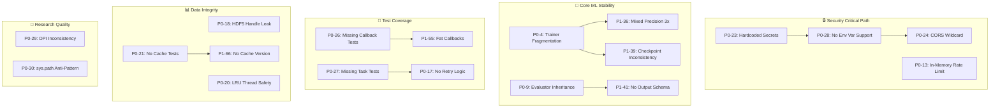

# Critical Issues Matrix — Project-Wide

**Generated:** 2026-01-24  
**Source:** Domain 1–5 Consolidated Reports  
**Total Issues Tracked:** 81

---

## Executive Summary

### Issue Counts by Priority

| Priority          | Count  | Est. Effort           |
| ----------------- | ------ | --------------------- |
| **P0** (Critical) | 30     | ~65h (8.1 days)       |
| **P1** (High)     | 33     | ~86h (10.8 days)      |
| **P2** (Medium)   | 28     | ~67h (8.4 days)       |
| **Total**         | **91** | **~218h (27.3 days)** |

### Issue Distribution by Domain

| Domain                    | P0  | P1  | P2  | Total | % of All |
| ------------------------- | --- | --- | --- | ----- | -------- |
| 1. Core ML Engine         | 11  | 17  | 16  | 44    | 48%      |
| 2. Dashboard Platform     | 6   | 11  | 10  | 27    | 30%      |
| 3. Data Engineering       | 5   | 8   | 12  | 25    | 27%      |
| 4. Infrastructure         | 6   | 13  | 12  | 31    | 34%      |
| 5. Research & Integration | 7   | 12  | 12  | 31    | 34%      |

> [!IMPORTANT]
> **Critical Path:** Security issues (4.2 secrets, 2.2 rate limiting) → Core ML stability (1.2 trainer hierarchy) → Testing gaps (4.3 callback/task tests) → Data integrity (3.2 file handles)

---

## Priority Matrix (Combined View)

### P0 Issues — Production Blockers (30 issues)

| #   | Domain    | IDB | Issue                                                  | Impact                                    | Effort | Blocks | Status |
| --- | --------- | --- | ------------------------------------------------------ | ----------------------------------------- | ------ | ------ | ------ |
| 1   | Core ML   | 1.1 | Hardcoded `sys.path` (`/home/user/LSTM_PFD`)           | Breaks on any other machine               | 2h     | -      | ⬜     |
| 2   | Core ML   | 1.1 | Duplicate HybridPINN implementations                   | Import confusion, maintenance burden      | 4h     | -      | ⬜     |
| 3   | Core ML   | 1.1 | Duplicate ResNet1D implementations                     | Same class defined twice                  | 4h     | -      | ⬜     |
| 4   | Core ML   | 1.2 | Trainer hierarchy fragmentation (5/8 don't inherit)    | Bug fixes require 5x effort               | 2d     | P1-8,9 | ⬜     |
| 5   | Core ML   | 1.2 | Duplicate callback systems                             | Inconsistent interfaces                   | 1d     | -      | ⬜     |
| 6   | Core ML   | 1.2 | Duplicate loss functions (FocalLoss, LabelSmoothing)   | Implementation drift                      | 4h     | -      | ⬜     |
| 7   | Core ML   | 1.2 | Empty `__init__.py` in training package                | No public API                             | 30m    | -      | ⬜     |
| 8   | Core ML   | 1.3 | Empty `__init__.py` in evaluation package              | No module exports                         | 30m    | -      | ⬜     |
| 9   | Core ML   | 1.3 | Inconsistent evaluator inheritance (3/5 don't inherit) | 500+ lines duplication                    | 2d     | -      | ⬜     |
| 10  | Core ML   | 1.5 | Missing `explanation_cache.py`                         | No caching for expensive XAI              | 1d     | -      | ⬜     |
| 11  | Core ML   | 1.5 | KernelSHAP incorrect weighting                         | Violates SHAP theoretical guarantees      | 4h     | -      | ⬜     |
| 12  | Dashboard | 2.1 | No ARIA/accessibility attributes (24 layouts)          | WCAG non-compliance, legal risk           | 8h     | -      | ⬜     |
| 13  | Dashboard | 2.2 | In-memory 2FA rate limiting                            | Bypass in multi-container deployment      | 2h     | -      | ⬜     |
| 14  | Dashboard | 2.2 | 70+ broad `except Exception` blocks                    | Silent failures, debugging impossible     | 8h     | -      | ⬜     |
| 15  | Dashboard | 2.4 | No `result_expires` for Celery                         | Redis memory exhaustion (OOM)             | 1h     | -      | ⬜     |
| 16  | Dashboard | 2.4 | Missing `time_limit` on all 23 tasks                   | Runaway workers hang indefinitely         | 4h     | -      | ⬜     |
| 17  | Dashboard | 2.4 | No retry logic for transient failures                  | Permanent failures on DB/network glitches | 4h     | -      | ⬜     |
| 18  | Data      | 3.2 | HDF5 file handle leak in OnTheFlyTFRDataset            | Exhausts file descriptors                 | 2h     | -      | ⬜     |
| 19  | Data      | 3.2 | Bare `except:` clauses swallowing errors               | Silent data corruption                    | 1h     | -      | ⬜     |
| 20  | Data      | 3.2 | LRU cache not thread-safe                              | Race conditions in DataLoaders            | 4h     | -      | ⬜     |
| 21  | Data      | 3.3 | No unit tests for cache/import/validation              | Corruption undetected                     | 2d     | -      | ⬜     |
| 22  | Data      | 3.3 | Redis `KEYS` pattern blocking                          | Production Redis blocked                  | 1h     | -      | ⬜     |
| 23  | Infra     | 4.2 | Hardcoded secrets in docker-compose                    | Security vulnerability                    | 2h     | #24,25 | ⬜     |
| 24  | Infra     | 4.2 | CORS allows all origins (`*`)                          | API security risk                         | 1h     | -      | ⬜     |
| 25  | Infra     | 4.2 | PostgreSQL password in Helm values                     | Security vulnerability                    | 1h     | -      | ⬜     |
| 26  | Infra     | 4.3 | Missing Dashboard Callback tests                       | Tightly-coupled bugs undetected           | 4-6h   | -      | ⬜     |
| 27  | Infra     | 4.3 | Missing Celery Async Task tests                        | Critical tasks untested                   | 4h     | -      | ⬜     |
| 28  | Infra     | 4.4 | No environment variable support                        | Secrets must be hardcoded                 | 2h     | #23    | ⬜     |
| 29  | Research  | 5.2 | DPI inconsistency (150 vs 300) across 7 files          | Publications rejected                     | 2h     | -      | ⬜     |
| 30  | Research  | 6.0 | `sys.path.insert()` anti-pattern in all adapters       | Fragile imports, namespace conflicts      | 4h     | -      | ⬜     |

---

### P1 Issues — High Priority (33 issues)

| #   | Domain    | IDB | Issue                                                      | Impact                           | Effort |
| --- | --------- | --- | ---------------------------------------------------------- | -------------------------------- | ------ |
| 31  | Core ML   | 1.1 | Hardcoded magic numbers (102400, 20480) in 45+ occurrences | Violates DRY                     | 4h     |
| 32  | Core ML   | 1.1 | Classical models don't inherit BaseModel                   | Inconsistent interface           | 4h     |
| 33  | Core ML   | 1.1 | TSMixer, PatchTST don't inherit BaseModel                  | Missing standard methods         | 2h     |
| 34  | Core ML   | 1.1 | No ONNX export in BaseModel                                | Missing export capability        | 1d     |
| 35  | Core ML   | 1.1 | model_factory registry incomplete (~15 of ~55)             | Models not discoverable          | 4h     |
| 36  | Core ML   | 1.2 | Mixed precision implemented 3x                             | Inconsistent behavior            | 4h     |
| 37  | Core ML   | 1.2 | LR scheduler step() incorrect for ReduceLROnPlateau        | Silent LR reduction failure      | 1h     |
| 38  | Core ML   | 1.2 | No reproducibility enforcement                             | Non-reproducible experiments     | 2h     |
| 39  | Core ML   | 1.2 | Checkpoint format inconsistency                            | Evaluation can't reliably load   | 4h     |
| 40  | Core ML   | 1.3 | Memory issue in ErrorAnalyzer                              | OOM on large test sets           | 2h     |
| 41  | Core ML   | 1.3 | No standard output schema across evaluators                | Hard to compare results          | 4h     |
| 42  | Core ML   | 1.4 | Hardcoded `fs=20480` in multiple files                     | Violates DRY                     | 2h     |
| 43  | Core ML   | 1.4 | Feature count mismatch (docs: 52, impl: 36)                | Confusion                        | 1h     |
| 44  | Core ML   | 1.5 | MC Dropout mode not restored on exception                  | Model left in training mode      | 30m    |
| 45  | Core ML   | 1.5 | CAV gradient hook memory leak risk                         | Memory growth on large N         | 1h     |
| 46  | Core ML   | 1.5 | GradientSHAP baseline handling                             | Attribution accuracy reduced     | 2h     |
| 47  | Core ML   | 1.5 | LIME segment boundary edge case                            | Importance bias                  | 1h     |
| 48  | Dashboard | 2.1 | `settings.py` at 1,005 lines / 42KB                        | Git conflicts, unmaintainable    | 4h     |
| 49  | Dashboard | 2.1 | Duplicate sidebar CSS in 3 locations                       | Conflicting styles               | 2h     |
| 50  | Dashboard | 2.1 | Components not reused (skeleton.py unused)                 | Dead code                        | 2h     |
| 51  | Dashboard | 2.2 | God-class NotificationService (713 lines)                  | Complex, hard to test            | 4h     |
| 52  | Dashboard | 2.2 | Duplicate logic DataService vs DatasetService              | Maintenance burden               | 2h     |
| 53  | Dashboard | 2.2 | Missing input validation (webhook_service)                 | Security issues                  | 4h     |
| 54  | Dashboard | 2.3 | Zero clientside callbacks (0/28 modules)                   | 50-100ms latency per interaction | 8h     |
| 55  | Dashboard | 2.3 | Fat callbacks with embedded business logic (8 modules)     | Untestable, violates SRP         | 8h     |
| 56  | Dashboard | 2.4 | Silent exception swallowing (hpo_tasks.py:255)             | Hidden failures                  | 1h     |
| 57  | Dashboard | 2.4 | Hardcoded magic numbers (102400, 50, 5, 100)               | Hard to maintain                 | 2h     |
| 58  | Dashboard | 2.4 | Missing `task_track_started` configuration                 | Cannot monitor queue health      | 1h     |
| 59  | Data      | 3.1 | Monolithic 37KB signal_generator.py (935 lines)            | Cognitive load                   | 2-3d   |
| 60  | Data      | 3.1 | Noise layer count mismatch (7 vs 8 in docs)                | Documentation confusion          | 5m     |
| 61  | Data      | 3.1 | Undocumented magic numbers                                 | Reproducibility concerns         | 1d     |
| 62  | Data      | 3.2 | Duplicate `Compose` class                                  | Code duplication                 | 30m    |
| 63  | Data      | 3.2 | CachedRawSignalDataset opens HDF5 per-sample               | Extremely slow I/O               | 4h     |
| 64  | Data      | 3.2 | Inconsistent label handling across datasets                | Integration bugs                 | 4h     |
| 65  | Data      | 3.2 | Hardcoded segmentation params in CWRU                      | Not configurable                 | 1h     |
| 66  | Data      | 3.3 | No cache versioning                                        | Silent compatibility breaks      | 4h     |
| 67  | Infra     | 4.1 | Deprecated `declarative_base()`                            | SQLAlchemy 2.0 warning           | 2h     |
| 68  | Infra     | 4.1 | Missing User relationship back_populates                   | Incomplete ORM relationships     | 30m    |
| 69  | Infra     | 4.2 | Dashboard Dockerfile lacks non-root user                   | Security gap                     | 1h     |
| 70  | Infra     | 4.2 | Static quantization raises NotImplementedError             | ONNX broken                      | 4h     |
| 71  | Infra     | 4.3 | Flaky stress test thresholds                               | Environment-sensitive            | 2h     |
| 72  | Infra     | 4.3 | Slow tests not consistently marked                         | Many >1s lack marker             | 2h     |
| 73  | Infra     | 4.4 | Incomplete schema validation (~40%)                        | 60% fields unvalidated           | 4h     |
| 74  | Research  | 5.1 | Code duplication: Training loops (~200 lines)              | Bug propagation                  | 4h     |
| 75  | Research  | 5.1 | Inconsistent seed handling                                 | Non-reproducible results         | 1h     |
| 76  | Research  | 5.2 | `jet` colormap used                                        | Not colorblind-accessible        | 30m    |
| 77  | Research  | 5.2 | Font settings not global (12/13 files)                     | Inconsistent labels              | 2h     |
| 78  | Research  | 6.0 | Model Registry uses SQLite without pooling                 | Performance issues               | 2h     |
| 79  | Research  | 6.0 | Duplicate logging modules                                  | Confusion                        | 1h     |

---

### P2 Issues — Medium Priority (28 issues)

| #   | Domain    | IDB | Issue                                          | Impact                    | Effort |
| --- | --------- | --- | ---------------------------------------------- | ------------------------- | ------ |
| 80  | Core ML   | 1.1 | Duplicate `ConvBlock` implementations          | DRY violation             | 1h     |
| 81  | Core ML   | 1.1 | Missing docstrings in helper modules           | Reduced maintainability   | 2h     |
| 82  | Core ML   | 1.1 | Test code embedded in modules                  | Should be separate        | 3h     |
| 83  | Core ML   | 1.1 | NAS search space has no actual NAS algorithm   | Incomplete feature        | 3-5d   |
| 84  | Core ML   | 1.2 | Test code in production files                  | Pattern violation         | 2h     |
| 85  | Core ML   | 1.2 | HPO only for classical ML                      | Incomplete                | 1d     |
| 86  | Core ML   | 1.2 | PINNTrainer has `train()` not `fit()`          | Inconsistent API          | 1h     |
| 87  | Data      | 3.1 | Non-deterministic seeding                      | Different thread order    | 2h     |
| 88  | Data      | 3.1 | Missing signal validation (NaN/Inf)            | No post-generation checks | 4h     |
| 89  | Data      | 3.2 | Incomplete type annotations                    | IDE warnings              | 4h     |
| 90  | Data      | 3.3 | No cache size limits                           | Disk exhaustion           | 4h     |
| 91  | Dashboard | 2.1 | Hardcoded strings (no i18n)                    | Localization blocked      | 8h     |
| 92  | Dashboard | 2.3 | Direct DB access bypassing services            | Inconsistent logic        | 4h     |
| 93  | Dashboard | 2.3 | `allow_duplicate=True` overuse (43+)           | Callback conflicts        | 4h     |
| 94  | Dashboard | 2.4 | Simulated training in NAS tasks                | Feature non-functional    | 16h    |
| 95  | Dashboard | 2.4 | Hardcoded URLs (`localhost:8050`)              | Wrong in production       | 2h     |
| 96  | Infra     | 4.1 | `datetime.utcnow` deprecated                   | Python 3.12+ compat       | 2h     |
| 97  | Infra     | 4.2 | Redis auth disabled                            | Security gap              | 30m    |
| 98  | Infra     | 4.2 | No network policies in K8s                     | Missing restrictions      | 2h     |
| 99  | Infra     | 4.3 | Duplicate SimpleCNN (3 locations)              | Maintenance burden        | 1h     |
| 100 | Infra     | 4.4 | Mixed precision disabled by default            | Performance left on table | 30m    |
| 101 | Research  | 5.1 | Bare `except:` in ood_testing.py               | Swallows exceptions       | 30m    |
| 102 | Research  | 5.1 | `xai_metrics.py` has no CLI                    | Only library import       | 1h     |
| 103 | Research  | 5.2 | No PDF/SVG vector output option                | Limited for publications  | 2h     |
| 104 | Research  | 6.0 | No type hints on adapter return types          | Reduced IDE support       | 2h     |
| 105 | Research  | 6.0 | Magic number `num_workers=2`                   | Should use utility        | 30m    |
| 106 | Research  | 6.0 | `validate_cross_phase_compatibility()` is stub | Returns True always       | 2h     |

---

## P0 Issues Deep Dive

### Issue #1: Hardcoded `sys.path` Manipulation

- **Domain:** Core ML
- **IDB:** 1.1
- **Description:** `sys.path.append('/home/user/LSTM_PFD')` hardcoded in 8+ model files
- **Impact:** Codebase breaks immediately on any machine except original developer's
- **Root Cause:** Files developed in isolation without proper package structure
- **Remediation Steps:**
  1. Remove all `sys.path.append()` calls
  2. Use proper relative imports: `from ..utils import constants`
  3. Ensure `__init__.py` files exist in all package directories
- **Testing:** Run pytest on clean checkout; imports should resolve without errors
- **Estimated Effort:** 2h

---

### Issue #4: Trainer Hierarchy Fragmentation

- **Domain:** Core ML
- **IDB:** 1.2
- **Description:** 5 of 8 trainer classes don't inherit from `BaseTrainer` (CNNTrainer, PINNTrainer, SpectrogramTrainer, EnsembleTrainer, DistributedTrainer)
- **Impact:** Bug fixes require implementation in 5x locations; features like mixed precision, gradient clipping reimplemented inconsistently
- **Root Cause:** Trainers developed by different authors without architectural enforcement
- **Remediation Steps:**
  1. Extract common interface to `BaseTrainer` ABC
  2. Define abstract methods: `train_epoch()`, `validate_epoch()`, `fit()`
  3. Create mixins: `MixedPrecisionMixin`, `PhysicsLossMixin`
  4. Refactor each trainer to inherit from `BaseTrainer` + mixins
  5. Add regression tests for each refactored trainer
- **Testing:** Run existing training tests; verify identical training curves before/after
- **Estimated Effort:** 2 days

---

### Issue #13: In-Memory 2FA Rate Limiting

- **Domain:** Dashboard
- **IDB:** 2.2
- **Description:** `authentication_service.py:46-48` stores rate limit counters in Python dict
- **Impact:** In multi-container deployment, each container has separate counter → attacker can brute-force by targeting different containers
- **Root Cause:** Prototype code not updated for production deployment
- **Remediation Steps:**
  1. Create `RedisRateLimiter` class
  2. Replace in-memory dict with Redis `INCR` + `EXPIRE`
  3. Add fallback to in-memory for local development
- **Testing:** Deploy 2+ containers; verify rate limit applies globally
- **Estimated Effort:** 2h

---

### Issue #23: Hardcoded Secrets in docker-compose

- **Domain:** Infrastructure
- **IDB:** 4.2
- **Description:** `POSTGRES_PASSWORD`, `SECRET_KEY`, `REDIS_PASSWORD` defined in plaintext
- **Impact:** Secrets visible in version control; production security compromise
- **Root Cause:** docker-compose created for development convenience
- **Remediation Steps:**
  1. Create `.env.template` with placeholder values
  2. Add `.env` to `.gitignore`
  3. Update docker-compose to use `${POSTGRES_PASSWORD}` syntax
  4. Document secret provisioning in deployment guide
- **Testing:** `docker-compose config` should fail without `.env`; succeed with `.env`
- **Estimated Effort:** 2h

---

### Issue #18: HDF5 File Handle Leak

- **Domain:** Data
- **IDB:** 3.2
- **Description:** `OnTheFlyTFRDataset` doesn't close HDF5 handles when `cache_in_memory=False`
- **Impact:** Exhausts file descriptors with DataLoader workers; "Too many open files" errors
- **Root Cause:** Missing `__del__` or context manager pattern
- **Remediation Steps:**
  1. Add `self.h5_file = None` in `__init__`
  2. Implement `__del__(self)` to close file if open
  3. Or: use worker-local handles with `threading.local()`
- **Testing:** Run DataLoader with 8 workers for 1000 iterations; verify `lsof | wc -l` stable
- **Estimated Effort:** 2h

---

## Issue Dependency Graph

---

## Clustering Analysis

### 🔒 Security Issues (8 issues)

| #   | IDB | Issue                               | Effort | Priority |
| --- | --- | ----------------------------------- | ------ | -------- |
| 23  | 4.2 | Hardcoded secrets in docker-compose | 2h     | P0       |
| 24  | 4.2 | CORS allows all origins             | 1h     | P0       |
| 25  | 4.2 | PostgreSQL password in Helm         | 1h     | P0       |
| 13  | 2.2 | In-memory 2FA rate limiting         | 2h     | P0       |
| 53  | 2.2 | Missing input validation            | 4h     | P1       |
| 69  | 4.2 | Dashboard Dockerfile lacks non-root | 1h     | P1       |
| 97  | 4.2 | Redis auth disabled                 | 30m    | P2       |
| 98  | 4.2 | No network policies in K8s          | 2h     | P2       |

**Total Effort:** ~14h

---

### ⚡ Performance Issues (11 issues)

| #   | IDB | Issue                          | Effort | Priority |
| --- | --- | ------------------------------ | ------ | -------- |
| 15  | 2.4 | No `result_expires` for Celery | 1h     | P0       |
| 16  | 2.4 | Missing `time_limit` on tasks  | 4h     | P0       |
| 18  | 3.2 | HDF5 file handle leak          | 2h     | P0       |
| 20  | 3.2 | LRU cache not thread-safe      | 4h     | P0       |
| 22  | 3.3 | Redis KEYS blocking            | 1h     | P0       |
| 40  | 1.3 | Memory in ErrorAnalyzer        | 2h     | P1       |
| 54  | 2.3 | Zero clientside callbacks      | 8h     | P1       |
| 63  | 3.2 | Per-sample HDF5 open           | 4h     | P1       |
| 78  | 6.0 | SQLite without pooling         | 2h     | P1       |
| 90  | 3.3 | No cache size limits           | 4h     | P2       |
| 100 | 4.4 | Mixed precision disabled       | 30m    | P2       |

**Total Effort:** ~33h

---

### 🧪 Testing Gaps (6 issues)

| #   | IDB | Issue                                     | Effort | Priority |
| --- | --- | ----------------------------------------- | ------ | -------- |
| 21  | 3.3 | No unit tests for cache/import/validation | 2d     | P0       |
| 26  | 4.3 | Missing Dashboard Callback tests          | 4-6h   | P0       |
| 27  | 4.3 | Missing Celery Async Task tests           | 4h     | P0       |
| 71  | 4.3 | Flaky stress test thresholds              | 2h     | P1       |
| 72  | 4.3 | Slow tests not marked                     | 2h     | P1       |
| 99  | 4.3 | Duplicate SimpleCNN (3 locations)         | 1h     | P2       |

**Total Effort:** ~28h

---

### 🔧 Code Quality / Maintainability (25 issues)

| #   | IDB | Issue                           | Effort | Priority |
| --- | --- | ------------------------------- | ------ | -------- |
| 1   | 1.1 | Hardcoded sys.path              | 2h     | P0       |
| 2   | 1.1 | Duplicate HybridPINN            | 4h     | P0       |
| 3   | 1.1 | Duplicate ResNet1D              | 4h     | P0       |
| 4   | 1.2 | Trainer hierarchy fragmentation | 2d     | P0       |
| 5   | 1.2 | Duplicate callback systems      | 1d     | P0       |
| 6   | 1.2 | Duplicate loss functions        | 4h     | P0       |
| 9   | 1.3 | Evaluator inheritance           | 2d     | P0       |
| 30  | 6.0 | sys.path.insert anti-pattern    | 4h     | P0       |
| 31  | 1.1 | Hardcoded magic numbers         | 4h     | P1       |
| 48  | 2.1 | settings.py 1005 lines          | 4h     | P1       |
| 51  | 2.2 | NotificationService 713 lines   | 4h     | P1       |
| 59  | 3.1 | signal_generator.py 935 lines   | 2-3d   | P1       |
| 62  | 3.2 | Duplicate Compose class         | 30m    | P1       |
| 74  | 5.1 | Training loop duplication       | 4h     | P1       |
| 79  | 6.0 | Duplicate logging modules       | 1h     | P1       |
| 80  | 1.1 | Duplicate ConvBlock             | 1h     | P2       |
| ... | ... | (10 more P2 items)              | ~15h   | P2       |

**Total Effort:** ~90h

---

## Recommended Remediation Order

### 🚨 Week 1: Security & Stability Foundation (Must Fix)

| Day | Issue # | Task                                 | Effort | Blocks |
| --- | ------- | ------------------------------------ | ------ | ------ |
| 1   | #23     | Move secrets to env vars             | 2h     | #24,28 |
| 1   | #24     | Configure environment-specific CORS  | 1h     | -      |
| 1   | #25     | Remove PostgreSQL password from Helm | 1h     | -      |
| 1   | #13     | Migrate 2FA rate limiting to Redis   | 2h     | -      |
| 2   | #15     | Add `result_expires=86400` to Celery | 1h     | -      |
| 2   | #16     | Add `time_limit` to all 23 tasks     | 4h     | -      |
| 2   | #17     | Implement retry logic for tasks      | 4h     | -      |
| 3   | #18     | Fix HDF5 file handle leak            | 2h     | -      |
| 3   | #19     | Replace bare `except:` clauses       | 1h     | -      |
| 3   | #20     | Add thread-safety to LRU cache       | 4h     | -      |
| 3   | #22     | Replace Redis KEYS with SCAN         | 1h     | -      |

**Week 1 Total:** ~23h

---

### 📦 Week 2: Core ML Architecture & Test Coverage

| Day | Issue # | Task                                | Effort | Blocks |
| --- | ------- | ----------------------------------- | ------ | ------ |
| 1-2 | #4      | Unify Trainer hierarchy with mixins | 2d     | #36,39 |
| 3   | #5      | Merge duplicate callback systems    | 1d     | -      |
| 4   | #6      | Consolidate loss functions          | 4h     | -      |
| 4   | #7,8    | Populate `__init__.py` files        | 1h     | -      |
| 5   | #26     | Create callback test suite          | 4-6h   | -      |
| 5   | #27     | Create Celery task test suite       | 4h     | -      |

**Week 2 Total:** ~40h

---

### 🧹 Week 3: Code Quality & Research Polish

| Day | Issue # | Task                            | Effort | Blocks |
| --- | ------- | ------------------------------- | ------ | ------ |
| 1   | #1      | Remove hardcoded sys.path       | 2h     | -      |
| 1   | #30     | Fix sys.path.insert in adapters | 4h     | -      |
| 1   | #2,3    | Remove duplicate model files    | 8h     | -      |
| 2   | #9      | Refactor evaluator inheritance  | 2d     | -      |
| 3   | #29     | Standardize DPI to 300          | 2h     | -      |
| 3   | #11     | Fix KernelSHAP weighting        | 4h     | -      |
| 4   | #10     | Implement explanation cache     | 1d     | -      |

**Week 3 Total:** ~40h

---

### 🔄 Week 4: P1 Cleanup & Documentation

| Priority         | Tasks            | Effort |
| ---------------- | ---------------- | ------ |
| P1 magic numbers | #31, #42, #57    | 8h     |
| P1 god classes   | #48, #51, #59    | 2-3d   |
| P1 remaining     | See full P1 list | 40h    |

**Week 4 Total:** ~55h

---

## Summary Metrics

| Metric                       | Value                               |
| ---------------------------- | ----------------------------------- |
| **Total P0 Issues**          | 30                                  |
| **Total P1 Issues**          | 33                                  |
| **Total P2 Issues**          | 28                                  |
| **Total Issues**             | 91                                  |
| **Total Estimated Effort**   | 218 hours (~27 person-days)         |
| **Security-Critical Issues** | 8                                   |
| **Week 1 Blockers**          | 12 issues (~23h)                    |
| **Domains with Most Issues** | Core ML (48%), Infrastructure (34%) |

> [!CAUTION]
> **Security issues (#13, #23-25) must be addressed before any production deployment.** These represent data breach and compliance risks.

> [!IMPORTANT]
> **Core ML hierarchy issues (#4, #9) should be prioritized second**, as they block efficient bug fixes and feature development across the training/evaluation pipeline.

---

_Generated by Critical Issues Matrix Builder — 2026-01-24_
