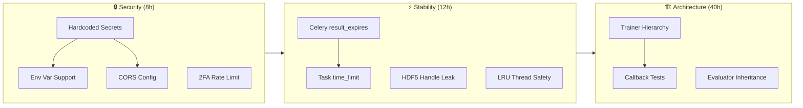
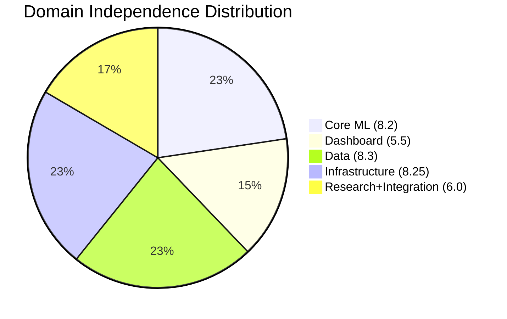

# Executive Dashboard — LSTM_PFD Codebase Health Report

**Report Date:** 2026-01-24  
**Source:** 5 Domain Consolidated Reports + 2 Phase 2 Synthesis Documents  
**Total Codebase:** ~100+ source files across 6 domains

---

## 📈 Project Health Scorecard

| Metric                  | Score  | Status | Notes                                           |
| ----------------------- | ------ | ------ | ----------------------------------------------- |
| Overall Code Quality    | 6.5/10 | 🟡     | Strong patterns offset by extensive duplication |
| Test Coverage           | ~60%   | 🟡     | Core ML good, Dashboard callbacks/tasks at 0%   |
| Documentation Quality   | 7.0/10 | 🟢     | Scientific docs excellent, API docs incomplete  |
| Architectural Integrity | 6.0/10 | 🟡     | Good abstractions exist but inconsistently used |
| Technical Debt Level    | High   | 🔴     | 91 issues, ~218h remediation effort             |

---

## 🎯 Key Findings

### Top 3 Strengths

1. **Highly Modular ML Core (8.2/10 independence)**
   - `BaseModel` abstract class with consistent interface across 55+ architectures
   - Factory pattern with registry enables clean model creation
   - Comprehensive preset configurations (`*_small`, `*_base`, `*_large`)

2. **Comprehensive XAI Implementation (7 methods)**
   - Integrated Gradients, GradientSHAP, DeepSHAP, KernelSHAP, LIME, MC Dropout, CAVs/TCAV
   - Scientific references in all docstrings
   - Convergence validation for reliable attributions

3. **Robust Data Engineering (8.3/10 independence)**
   - Physics-based signal generation with 11 fault classes
   - Thread-safe HDF5 handles for multi-worker DataLoaders
   - Config-hash cache invalidation ensures reproducibility

### Top 3 Concerns

1. **Dashboard Callbacks Have Critical Coupling (4/10 independence)**
   - 28 callback modules with embedded business logic
   - Zero unit tests for callbacks and Celery tasks
   - Direct DB access bypasses service layer in 5 modules

2. **Security Vulnerabilities in Deployment**
   - Hardcoded secrets in `docker-compose.yml` (`POSTGRES_PASSWORD`, `SECRET_KEY`)
   - CORS allows all origins (`*`)
   - In-memory 2FA rate limiting bypassed in multi-container deployment

3. **Extensive Code Duplication**
   - 5/8 trainers don't inherit from `BaseTrainer` (~1,500 lines duplicated)
   - 3/5 evaluators don't inherit from `BaseEvaluator` (~500 lines duplicated)
   - `settings.py` at 1,005 lines (10x recommended limit)

---

## 📊 Domain Health Matrix

| Domain                  | Files | Independence | P0  | P1  | P2  | Total Issues | Tech Debt   | Grade  |
| ----------------------- | ----- | ------------ | --- | --- | --- | ------------ | ----------- | ------ |
| 1. Core ML Engine       | 120   | 8.2/10       | 11  | 17  | 16  | 44           | Medium      | **B+** |
| 2. Dashboard            | 103   | 5.5/10 ⚠️    | 6   | 11  | 10  | 27           | High        | **C+** |
| 3. Data Engineering     | 30    | 8.3/10       | 5   | 8   | 12  | 25           | Low         | **B+** |
| 4. Infrastructure       | 53    | 8.25/10      | 6   | 13  | 12  | 31           | Medium      | **B**  |
| 5. Research+Integration | 43    | 6.0/10       | 7   | 12  | 12  | 31           | Medium-High | **C+** |

> [!IMPORTANT]
> **Dashboard Platform (Domain 2)** has the lowest independence score (5.5/10) and highest technical debt. This is the primary risk area for the project.

---

## 🚨 Critical Issues Summary

| Metric                    | Count           | Status |
| ------------------------- | --------------- | ------ |
| **Total P0 Issues**       | 30              | 🔴     |
| **Total P1 Issues**       | 33              | 🟡     |
| **Total P2 Issues**       | 28              | 🟢     |
| **Total Issues**          | 91              | -      |
| **Estimated Remediation** | ~27 person-days | -      |

### P0 Critical Path (Must Fix Before Production)

---

## 🏗️ Architectural Assessment

### Current State

The LSTM_PFD system demonstrates solid foundational patterns (factory registration, abstract base classes, dataclass configurations) that are **inconsistently applied**. The Core ML Engine and Data Engineering domains follow best practices, while the Dashboard Platform has accumulated significant coupling and technical debt. The Integration Layer (6.0) has 7 of 10 pipeline phases as placeholders.

### If Starting Fresh

Key architectural changes that would be made:

1. **Clean Architecture with Clear Boundaries** — Domain logic independent of frameworks
2. **Event-Driven Dashboard ↔ Core ML Communication** — Message queue instead of direct calls
3. **Repository Pattern for Data Access** — Abstract storage behind interfaces
4. **Protocol Classes for Interfaces** — Type-safe contracts between domains
5. **Dependency Injection** — No hardcoded dependencies in constructors

### Recommended Evolution Path

| Phase | Focus                | Timeline  | Key Deliverables                            |
| ----- | -------------------- | --------- | ------------------------------------------- |
| 0     | Security + Stability | Week 1-2  | Secrets management, Celery reliability      |
| 1     | Core Architecture    | Week 3-6  | Unified trainer hierarchy, test coverage    |
| 2     | Dashboard Decoupling | Month 2-3 | Callback refactoring, service layer cleanup |
| 3     | Excellence           | Month 4   | Full documentation, 85%+ coverage           |

---

## 📚 Best Practices Status

### Strengths

| Pattern                               | Adoption     | Domains                           |
| ------------------------------------- | ------------ | --------------------------------- |
| Factory Pattern with Registry         | ✅ Excellent | Core ML, Dashboard                |
| Context Managers for Resources        | ✅ Excellent | All                               |
| Dataclass Configurations              | ✅ Good      | Core ML, Infrastructure, Research |
| Scientific Documentation              | ✅ Excellent | Core ML, XAI                      |
| Division Guards (Numerical Stability) | ✅ Good      | Features, Data                    |

### Gaps

| Gap                                  | Impact | Domains Affected     |
| ------------------------------------ | ------ | -------------------- |
| Inconsistent inheritance hierarchies | High   | Training, Evaluation |
| `sys.path` manipulation anti-pattern | Medium | Models, Adapters     |
| Broad exception swallowing           | High   | Services, Tasks      |
| Missing `__init__.py` exports        | Low    | Training, Evaluation |
| Hardcoded magic numbers              | Medium | All                  |

### Consistency Score: **6.5/10** across domains

---

## 🔗 Integration Health

| Metric                  | Value               | Status |
| ----------------------- | ------------------- | ------ |
| Total Domain Interfaces | 25+                 | -      |
| High-Risk Interfaces    | 8                   | 🟡     |
| Stable Interfaces       | 12                  | 🟢     |
| Placeholder Interfaces  | 7 (Pipeline phases) | 🔴     |

### Coupling Hotspots

1. **Dashboard Callbacks ↔ Services** (4/10 independence)
   - 5 callback modules directly access database
   - Fat callbacks with embedded business logic

2. **Integration Adapters ↔ Core ML** (uses `sys.path.insert()`)
   - Fragile imports, namespace pollution
   - Missing abstract adapter interface

3. **Celery Tasks ↔ Core ML**
   - No retry logic for transient failures
   - Missing time limits on all 23 tasks

---

## 💡 Strategic Recommendations

### 1. Immediate Actions (This Sprint)

> **Security-Critical — Must complete before any production deployment**

| Priority | Task                                  | Effort | Owner     |
| -------- | ------------------------------------- | ------ | --------- |
| P0       | Move secrets to environment variables | 2h     | DevOps    |
| P0       | Configure environment-specific CORS   | 1h     | Backend   |
| P0       | Migrate 2FA rate limiting to Redis    | 2h     | Backend   |
| P0       | Add `result_expires` to Celery config | 1h     | Backend   |
| P0       | Add `time_limit` to all Celery tasks  | 4h     | Backend   |
| P0       | Fix HDF5 file handle leak             | 2h     | Data Team |

**Sprint Effort:** ~12h

### 2. Short-Term (Next Quarter)

> **Architectural Stabilization**

| Priority | Task                                | Effort | Owner     |
| -------- | ----------------------------------- | ------ | --------- |
| P0/P1    | Unify Trainer hierarchy with mixins | 2-3d   | ML Team   |
| P0       | Create Callback test suite          | 4-6h   | Dashboard |
| P0       | Create Celery task test suite       | 4h     | Dashboard |
| P1       | Split `settings.py` into modules    | 4h     | Dashboard |
| P1       | Merge callback systems              | 1d     | ML Team   |
| P1       | Implement explanation cache         | 1d     | XAI Team  |

**Quarter Effort:** ~60h (~7.5 person-days)

### 3. Long-Term (Next Year)

> **Excellence and Polish**

| Priority  | Task                                      | Effort | Owner       |
| --------- | ----------------------------------------- | ------ | ----------- |
| Strategic | Create unified `ExperimentRunner`         | 5d     | Research    |
| Strategic | Replace `sys.path` with proper packaging  | 3d     | Platform    |
| Strategic | Implement or remove pipeline placeholders | 3-5d   | Integration |
| Strategic | Achieve 85%+ test coverage                | 10d    | All Teams   |
| Strategic | Complete API documentation                | 5d     | All Teams   |

**Year Effort:** ~200h (~25 person-days)

---

## 📋 Next Steps

### Week 1: Security Foundation

- [ ] Create `.env.template` for secrets management
- [ ] Update `docker-compose.yml` to use environment variables
- [ ] Configure CORS with environment-specific origins
- [ ] Deploy Redis-backed 2FA rate limiter

### Week 2: Celery Reliability

- [ ] Add `result_expires=86400` to Celery config
- [ ] Add `time_limit` to all 23 tasks
- [ ] Implement retry logic for transient failures
- [ ] Enable `task_track_started` for monitoring

### Week 3-4: Core ML Stability

- [ ] Begin Trainer hierarchy unification
- [ ] Create initial callback test suite
- [ ] Fix HDF5 file handle leak

### Monthly: Progress Review

- [ ] Track P0/P1/P2 issue counts
- [ ] Monitor test coverage trends
- [ ] Review integration health metrics

---

## Appendix: Domain Independence Scores

---

_Executive Dashboard generated by Phase 3 Synthesizer — 2026-01-24_
