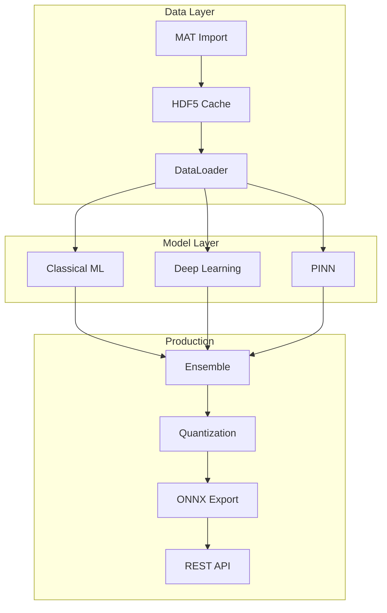

# LSTM PFD Documentation

Welcome to the **LSTM PFD** documentation - a comprehensive, production-ready bearing fault diagnosis system implementing cutting-edge machine learning and deep learning techniques.

<div class="grid cards" markdown>

- :material-rocket-launch:{ .lg .middle } **Getting Started**

  ***

  Install LSTM PFD, configure your environment, and run your first experiment in minutes.

  [:octicons-arrow-right-24: Quick Start](getting-started/quickstart.md)

- :material-chart-box:{ .lg .middle } **Dashboard**

  ***

  Enterprise-grade web interface for ML operations - no coding required.

  [:octicons-arrow-right-24: Dashboard Guide](user-guide/dashboard/overview.md)

- :material-api:{ .lg .middle } **API Reference**

  ***

  Complete API documentation for programmatic access to all features.

  [:octicons-arrow-right-24: API Docs](api/index.md)

- :material-flask:{ .lg .middle } **Research**

  ***

  Physics-informed deep learning, XAI methods, and research-grade documentation.

  [:octicons-arrow-right-24: Research](research/index.md)

</div>

## Key Features

| Feature              | Description                                    |
| -------------------- | ---------------------------------------------- |
| **11 Fault Types**   | Comprehensive classification of bearing faults |
| **98-99% Accuracy**  | State-of-the-art ensemble models               |
| **PINN Integration** | Physics-informed neural networks               |
| **Explainable AI**   | SHAP, LIME, Integrated Gradients               |
| **Production Ready** | <50ms latency, Docker, Kubernetes              |

## Project Architecture



## Quick Links

- [Installation Guide](getting-started/installation.md)
- [Phase-by-Phase Tutorial](user-guide/phases/overview.md)
- [Dashboard Quick Start](user-guide/dashboard/overview.md)
- [API Reference](api/index.md)
- [Contributing Guidelines](contributing/index.md)

## Citation

If you use this project in your research, please cite:

```bibtex
@software{lstm_pfd_2025,
  author = {Ahmad, Syed Abbas},
  title = {LSTM PFD: Advanced Bearing Fault Diagnosis System},
  year = {2025},
  url = {https://github.com/abbas-ahmad-cowlar/LSTM_PFD}
}
```
