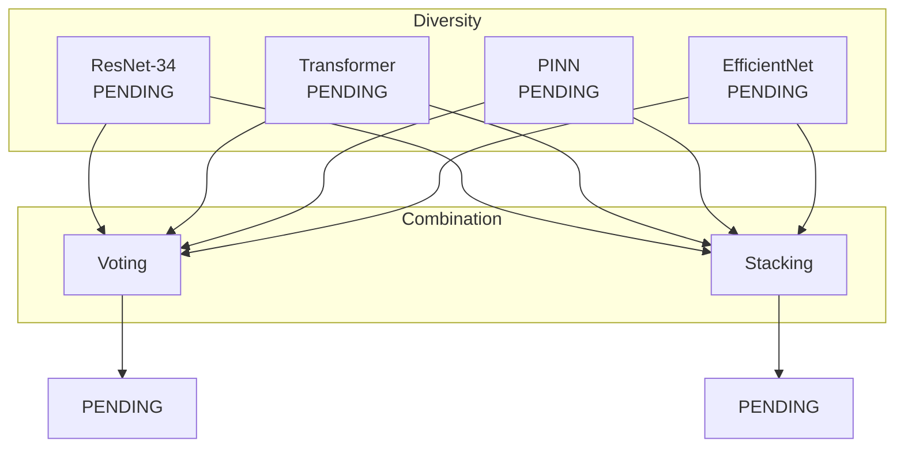

# Ensemble Strategies

This document describes the ensemble learning approaches that achieve [PENDING — run experiment to fill] accuracy.

## Overview

Ensemble methods combine multiple models to improve prediction accuracy and robustness.



---

## Methods

### 1. Voting Ensemble

Simple but effective combination:

**Hard Voting:**
\[
\hat{y} = \arg\max*c \sum*{i=1}^{M} \mathbf{1}[h_i(x) = c]
\]

**Soft Voting (Weighted):**
\[
\hat{y} = \arg\max*c \sum*{i=1}^{M} w_i \cdot P_i(y = c | x)
\]

```python
from packages.core.models.ensemble import VotingEnsemble

ensemble = VotingEnsemble(
    models=[resnet, transformer, pinn, efficientnet],
    voting='soft',
    weights=[0.2, 0.25, 0.3, 0.25]
)
```

### 2. Stacked Generalization

Use a meta-learner on base model predictions:

\[
\hat{y} = g\left( h_1(x), h_2(x), \ldots, h_M(x) \right)
\]

```python
from packages.core.models.ensemble import StackedEnsemble

ensemble = StackedEnsemble(
    base_models=[resnet, transformer, pinn],
    meta_learner='xgboost'
)
```

### 3. Mixture of Experts (MoE)

Gating network selects experts per input:

\[
\hat{y} = \sum\_{i=1}^{M} g_i(x) \cdot h_i(x)
\]

Where $g_i(x)$ is the gating weight for expert $i$.

---

## Results

| Strategy               | Accuracy                           | Latency                            | Model Size                         |
| ---------------------- | ---------------------------------- | ---------------------------------- | ---------------------------------- |
| Single Best (PINN)     | [PENDING — run experiment to fill] | [PENDING — run experiment to fill] | [PENDING — run experiment to fill] |
| Hard Voting            | [PENDING — run experiment to fill] | [PENDING — run experiment to fill] | [PENDING — run experiment to fill] |
| Soft Voting            | [PENDING — run experiment to fill] | [PENDING — run experiment to fill] | [PENDING — run experiment to fill] |
| **Stacking (XGBoost)** | [PENDING — run experiment to fill] | [PENDING — run experiment to fill] | [PENDING — run experiment to fill] |
| MoE                    | [PENDING — run experiment to fill] | [PENDING — run experiment to fill] | [PENDING — run experiment to fill] |

---

## Diversity Analysis

Ensemble performance depends on model diversity:

| Model Pair            | Correlation                        | Error Overlap                      |
| --------------------- | ---------------------------------- | ---------------------------------- |
| ResNet vs Transformer | [PENDING — run experiment to fill] | [PENDING — run experiment to fill] |
| ResNet vs PINN        | [PENDING — run experiment to fill] | [PENDING — run experiment to fill] |
| Transformer vs PINN   | [PENDING — run experiment to fill] | [PENDING — run experiment to fill] |

!!! tip "Best Practice"
Combine models with **low error correlation** for maximum ensemble benefit.

---

## See Also

- [PINN Theory](pinn-theory.md)
- [API: Ensemble Models](../api/core/models.md)
