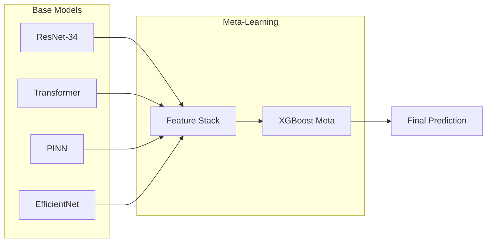

# Research

This section provides research-grade documentation for academic and publication purposes.

## Physics-Informed Neural Networks

Our PINN implementation integrates domain knowledge from bearing dynamics into deep learning models.

### Key Equations

The physics loss function incorporates:

**Energy Conservation:**

\[
\mathcal{L}_{energy} = \left\| \frac{d E_{kinetic}}{dt} + \frac{d E*{potential}}{dt} + P*{dissipated} \right\|^2
\]

**Momentum Conservation:**

\[
\mathcal{L}\_{momentum} = \left\| m \frac{d^2 x}{dt^2} + c \frac{dx}{dt} + k x - F(t) \right\|^2
\]

**Combined Physics Loss:**

\[
\mathcal{L}_{physics} = \lambda_{1} \mathcal{L}_{energy} + \lambda_{2} \mathcal{L}_{momentum} + \lambda_{3} \mathcal{L}\_{bearing}
\]

Where $\lambda_i$ are tunable hyperparameters (default: 0.1).

[:octicons-arrow-right-24: Full PINN Theory](pinn-theory.md)

---

## Explainability Methods

We implement multiple XAI methods for model interpretability:

| Method               | Type           | Use Case                    |
| -------------------- | -------------- | --------------------------- |
| SHAP                 | Game-theoretic | Feature importance ranking  |
| LIME                 | Perturbation   | Local explanations          |
| Integrated Gradients | Gradient-based | Attribution maps            |
| Grad-CAM             | Activation     | CNN layer visualization     |
| CAV                  | Concept-based  | High-level concept analysis |

[:octicons-arrow-right-24: XAI Methods](xai-methods.md)

---

## Ensemble Strategies

Our ensemble achieves 98-99% accuracy through:



[:octicons-arrow-right-24: Ensemble Strategies](ensemble-strategies.md)

---

## Reproducibility

All experiments are fully reproducible with:

- **Random Seeds**: Fixed at 42 across all libraries
- **DVC**: Data version control for datasets
- **Hydra Configs**: Experiment configuration management
- **Model Registry**: Versioned model artifacts

[:octicons-arrow-right-24: Reproducibility Guide](reproducibility.md)

---

## Citation

```bibtex
@software{lstm_pfd_2025,
  author = {Ahmad, Syed Abbas},
  title = {LSTM PFD: Physics-Informed Deep Learning for Bearing Fault Diagnosis},
  year = {2025},
  publisher = {GitHub},
  url = {https://github.com/abbas-ahmad-cowlar/LSTM_PFD},
  note = {98-99\% accuracy on 11-class bearing fault classification}
}
```
