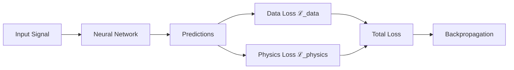

# Physics-Informed Neural Networks (PINN) Theory

This document provides the mathematical foundations for our PINN implementation in bearing fault diagnosis.

## Overview

Physics-Informed Neural Networks combine deep learning with domain knowledge by incorporating physical laws directly into the loss function.



## Mathematical Formulation

### Total Loss Function

The PINN training objective minimizes a weighted combination of data and physics losses:

\[
\mathcal{L}_{total} = \mathcal{L}_{data} + \sum*{i=1}^{N} \lambda_i \mathcal{L}*{physics}^{(i)}
\]

Where:

- $\mathcal{L}_{data}$ is the standard cross-entropy classification loss
- $\mathcal{L}_{physics}^{(i)}$ are physics constraint losses
- $\lambda_i$ are tunable hyperparameters (default: 0.1)

---

## Physics Constraints

### 1. Energy Conservation

For rotating machinery, energy must be conserved:

\[
\mathcal{L}_{energy} = \left\| \frac{dE_{kinetic}}{dt} + \frac{dE*{potential}}{dt} + P*{dissipated} - P\_{input} \right\|^2
\]

**Kinetic Energy:**
\[
E\_{kinetic} = \frac{1}{2} I \omega^2
\]

**Potential Energy (Spring):**
\[
E\_{potential} = \frac{1}{2} k x^2
\]

### 2. Momentum Conservation

Newton's second law for rotational motion:

\[
\mathcal{L}_{momentum} = \left\| I \frac{d\omega}{dt} - \tau_{net} \right\|^2
\]

Where the net torque includes:

\[
\tau*{net} = \tau*{input} - \tau*{friction} - \tau*{load}
\]

### 3. Bearing Dynamics

Sommerfeld equation for journal bearings:

\[
S = \frac{\mu N L D}{W} \left( \frac{R}{c} \right)^2
\]

Where:

| Symbol | Description       | Typical Value   |
| ------ | ----------------- | --------------- |
| $S$    | Sommerfeld number | 0.1 - 1.0       |
| $\mu$  | Oil viscosity     | 0.01 - 0.1 Pa·s |
| $N$    | Rotational speed  | 60 Hz           |
| $L$    | Bearing length    | 0.02 m          |
| $D$    | Journal diameter  | 0.05 m          |
| $W$    | Applied load      | 1000 N          |
| $c$    | Radial clearance  | 0.0001 m        |

### 4. Oil Whirl Constraint

For detecting oil whirl instabilities:

\[
\mathcal{L}_{whirl} = \left\| f_{whirl} - \alpha \cdot f\_{rotation} \right\|^2
\]

Where $\alpha \approx 0.43$ for oil whirl (less than half rotation frequency).

---

## Implementation

### HybridPINN Architecture

```python
from packages.core.models.pinn import HybridPINN

model = HybridPINN(
    base_model='resnet18',
    num_classes=11,
    physics_losses={
        'energy': {'weight': 0.1},
        'momentum': {'weight': 0.05},
        'bearing': {'weight': 0.05}
    }
)
```

### Physics Loss Functions

```python
from packages.core.training.physics_loss_functions import (
    EnergyConservationLoss,
    MomentumConservationLoss,
    BearingDynamicsLoss
)

physics_losses = [
    EnergyConservationLoss(weight=0.1),
    MomentumConservationLoss(weight=0.05),
    BearingDynamicsLoss(weight=0.05)
]
```

---

## Results

Our PINN implementation achieves:

| Model                | Accuracy                           | Physics Consistency                |
| -------------------- | ---------------------------------- | ---------------------------------- |
| ResNet-18 (baseline) | [PENDING — run experiment to fill] | N/A                                |
| PINN (ours)          | [PENDING — run experiment to fill] | [PENDING — run experiment to fill] |

!!! success "Key Insight"
Physics constraints act as regularizers, improving generalization especially for rare fault types where training data is limited.

---

## References

1. Raissi, M., Perdikaris, P., & Karniadakis, G. E. (2019). Physics-informed neural networks. _Journal of Computational Physics_, 378, 686-707.

2. Karniadakis, G. E., et al. (2021). Physics-informed machine learning. _Nature Reviews Physics_, 3(6), 422-440.

## See Also

- [XAI Methods](xai-methods.md)
- [Ensemble Strategies](ensemble-strategies.md)
- [API Reference](../api/core/models.md)
