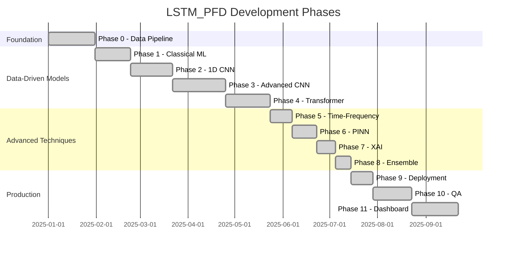
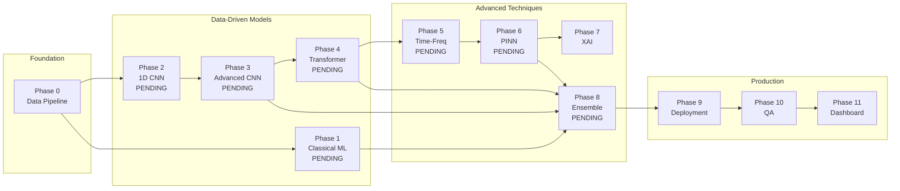
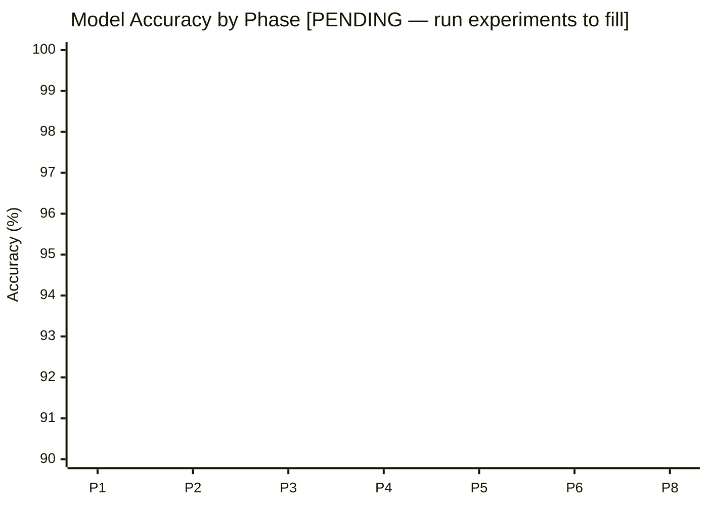
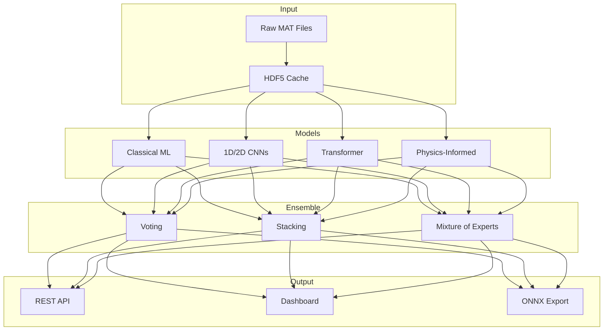

# Project Timeline & Phase Progression

This document provides visual timelines for the LSTM_PFD project development phases.

## Development Timeline

## Phase Dependencies

## Accuracy Progression

## Architecture Integration

## Key Milestones

| Phase | Duration | Key Deliverable                          | Accuracy                           |
| ----- | -------- | ---------------------------------------- | ---------------------------------- |
| 0     | 30 days  | Data pipeline with HDF5 caching          | N/A                                |
| 1     | 23 days  | Feature engineering (36→15 features)     | [PENDING — run experiment to fill] |
| 2-3   | 61 days  | CNN architectures (ResNet, EfficientNet) | [PENDING — run experiment to fill] |
| 4     | 29 days  | Transformer with attention               | [PENDING — run experiment to fill] |
| 5     | 14 days  | Time-frequency analysis (STFT/CWT/WVD)   | [PENDING — run experiment to fill] |
| 6     | 16 days  | Physics-informed constraints             | [PENDING — run experiment to fill] |
| 7     | 12 days  | SHAP, LIME, Integrated Gradients         | N/A                                |
| 8     | 10 days  | Ensemble methods                         | [PENDING — run experiment to fill] |
| 9-10  | 39 days  | Quantization, ONNX, CI/CD                | N/A                                |
| 11    | 30 days  | Enterprise web dashboard                 | N/A                                |

**Total Development Time**: ~264 days (9 months)

---

## See Also

- [PINN Theory](pinn-theory.md)
- [XAI Methods](xai-methods.md)
- [Ensemble Strategies](ensemble-strategies.md)
