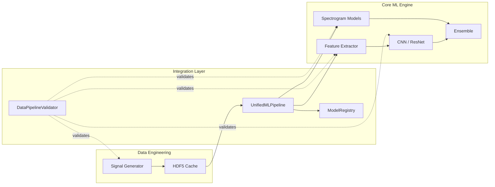

# Integration Guide

> How to use the integration layer, add new integration points, and handle cross-domain data flows.

## Cross-Domain Data Flow

The integration layer bridges several distinct domains:



## Using the Unified Pipeline

### Selective Phase Execution

Each phase is gated by a boolean config flag. Set `False` to skip:

```python
config = {
    'run_phase_0': True,   # Data Generation
    'run_phase_1': True,   # Classical ML
    'run_phase_2_4': True, # Deep Learning (CNN, ResNet, Transformer)
    'run_phase_5': False,  # Time-Frequency Analysis
    'run_phase_6': False,  # PINN
    'run_phase_7': False,  # XAI
    'run_phase_8': True,   # Ensemble
    'run_phase_9': True,   # Deployment

    'phase_0': { ... },    # Phase-specific sub-configs
    'phase_1': { ... },
    'data_path': 'data/processed/signals_cache.h5',
    ...
}
```

### Phase Chaining

Results from earlier phases flow into later phases automatically. For example, if Phase 0 runs, the generated dataset is passed directly to Phase 1 (no disk round-trip needed):

```python
# Internal flow in run_full_pipeline():
self.results['data'] = self._run_phase_0()     # Generates dataset object
self.results['classical'] = self._run_phase_1() # Uses self.results['data']['dataset']
```

If Phase 0 is skipped, Phase 1 falls back to loading from the HDF5 cache configured in `data_path`.

## Configuration Validation

Always validate config before running the pipeline:

```python
from integration import validate_config

# Raises ValueError with specific message if invalid
validate_config(config)
```

**Checks performed:**

| Check             | Function                        | Details                                                               |
| ----------------- | ------------------------------- | --------------------------------------------------------------------- |
| Required sections | `_validate_required_sections()` | Requires `data`, `classical`, `deep_learning`, `deployment`           |
| Value ranges      | `_validate_value_ranges()`      | `train_ratio` ∈ [0.5, 0.9], `lr` ∈ [1e-6, 1.0], `epochs` ∈ [1, 10000] |
| File paths        | `_validate_file_paths()`        | Warns (does not error) if data dirs / cache files don't exist         |
| Hyperparameters   | `_validate_hyperparameters()`   | Warns if batch sizes differ > 2× across phases                        |

### Generating a Starter Config

```python
from integration.configuration_validator import generate_config_template

generate_config_template('configs/my_config.yaml')
# Creates a complete YAML template with sensible defaults
```

### Getting Optimization Suggestions

```python
from integration.configuration_validator import suggest_config_optimizations

suggestions = suggest_config_optimizations(config)
for s in suggestions:
    print(f"  - {s}")
# e.g., "Consider increasing batch_size from 16 to 32-64..."
```

## Data Pipeline Validation

Validates that raw signals can flow through each downstream phase:

```python
from integration import validate_data_compatibility
from integration.data_pipeline_validator import test_data_transformations, benchmark_data_loading_speed

# Test all data flows
validate_data_compatibility()
# Tests:
#   Phase 0 → Phase 1 (feature extraction, expects shape (36,))
#   Phase 0 → Phase 2 (CNN input, [1, 1, signal_length])
#   Phase 0 → Phase 5 (STFT spectrogram, 2D)

# Test normalization reversibility
test_data_transformations()

# Benchmark data loading
times = benchmark_data_loading_speed()
```

## Model Registry

### Registering a Model

```python
from integration import ModelRegistry

registry = ModelRegistry('models/registry.db')

model_id = registry.register_model(
    model_name='ResNet34_1D',
    phase='Phase 3',
    accuracy=0.967,
    model_path='checkpoints/resnet34.pth',
    # Optional kwargs:
    precision=0.965,
    recall=0.970,
    f1_score=0.967,
    hyperparameters={'lr': 0.001, 'epochs': 100},
    onnx_path='exports/resnet34.onnx',
    size_mb=45.2,
    inference_latency_ms=12.3,
    num_parameters=2_500_000,
    dataset_name='signals_v2',
    notes='Trained with augmentation'
)
```

### Querying Models

```python
best = registry.get_best_model(metric='accuracy')
print(f"Best: {best['model_name']} — {best['accuracy']:.2%}")

comparison = registry.compare_models(
    ['ResNet34_1D', 'CNN_1D', 'Transformer'],
    metrics=['accuracy', 'inference_latency_ms', 'size_mb']
)
print(comparison)

all_models = registry.list_all_models()  # pd.DataFrame sorted by accuracy DESC
```

### Generating Reports

```python
registry.export_registry_report('results/model_comparison.html')
# Generates a styled HTML table of all registered models
```

### Database Schema

The registry stores each model as a row in a SQLite `models` table:

| Column                 | Type       | Description                            |
| ---------------------- | ---------- | -------------------------------------- |
| `model_id`             | INTEGER PK | Auto-incrementing ID                   |
| `model_name`           | TEXT       | Model identifier (e.g., `ResNet34_1D`) |
| `phase`                | TEXT       | Phase name (e.g., `Phase 3`)           |
| `accuracy`             | REAL       | Test accuracy (0-1)                    |
| `precision`            | REAL       | Precision score                        |
| `recall`               | REAL       | Recall score                           |
| `f1_score`             | REAL       | F1 score                               |
| `training_date`        | TEXT       | ISO timestamp                          |
| `hyperparameters`      | TEXT       | JSON-encoded hyperparameters           |
| `model_path`           | TEXT       | Path to `.pth` file                    |
| `onnx_path`            | TEXT       | Path to `.onnx` file                   |
| `size_mb`              | REAL       | Model size                             |
| `inference_latency_ms` | REAL       | Inference latency                      |
| `num_parameters`       | INTEGER    | Parameter count                        |
| `dataset_name`         | TEXT       | Training dataset name                  |
| `notes`                | TEXT       | Free-form notes                        |

## Dashboard Adapters

The adapters in `packages/dashboard/integrations/` wrap Core ML logic for the Dash dashboard, providing a stable API that isolates the dashboard from internal pipeline changes.

### Phase0Adapter

```python
from packages.dashboard.integrations.phase0_adapter import Phase0Adapter

# Generate dataset
result = Phase0Adapter.generate_dataset(
    config={'num_signals': 100, 'fault_types': [...]},
    progress_callback=lambda current, total, fault: print(f"{current}/{total}")
)
# result = {'success': bool, 'output_path': str, 'total_signals': int, ...}

# Load existing cache
data = Phase0Adapter.load_existing_cache('data/processed/signals_cache.h5')

# Import MAT files
result = Phase0Adapter.import_mat_files(
    config={'name': 'my_dataset', 'output_dir': 'data/imported'},
    mat_file_paths=['/path/to/file1.mat', '/path/to/file2.mat']
)
```

### Phase1Adapter

```python
from packages.dashboard.integrations.phase1_adapter import Phase1Adapter

result = Phase1Adapter.train(
    config={
        'model_type': 'rf',  # 'rf', 'svm', or 'gbm'
        'cache_path': 'data/processed/signals_cache.h5',
        'random_state': 42,
    },
    progress_callback=lambda epoch, metrics: print(metrics)
)
# result = {'success': bool, 'test_accuracy': float, 'test_f1': float, ...}

defaults = Phase1Adapter.get_model_params('rf')
# {'n_estimators': 100, 'max_depth': 20, ...}
```

### DeepLearningAdapter

```python
from packages.dashboard.integrations.deep_learning_adapter import DeepLearningAdapter

result = DeepLearningAdapter.train(
    config={
        'model_type': 'cnn1d',
        'dataset_path': 'data/processed/signals_cache.h5',
        'hyperparameters': {'lr': 0.001, 'epochs': 50, 'batch_size': 32},
    },
    progress_callback=lambda epoch, metrics: print(f"Epoch {epoch}: {metrics}")
)
```

## Error Handling Across Boundaries

Each phase in `UnifiedMLPipeline` is wrapped in a `try/except` block. On failure, the phase logs the error and returns `{'error': str(e)}`, allowing subsequent phases to still attempt execution:

```python
# Internal pattern (every _run_phase_N follows this):
def _run_phase_0(self):
    try:
        ...
        return {'dataset': dataset, 'paths': paths, ...}
    except Exception as e:
        logger.error(f"✗ Phase 0 failed: {e}")
        return {'error': str(e)}
```

Dashboard adapters follow the same pattern, returning `{'success': False, 'error': str(e)}` on failure.

## Adding a New Integration Point

1. **Create the adapter** in `packages/dashboard/integrations/` (or add a phase method to `UnifiedMLPipeline`).
2. **Follow the adapter pattern:** static methods, `config` dict + optional `progress_callback`.
3. **Validate data compatibility** by adding a test to `data_pipeline_validator.py` that checks the new phase's input format.
4. **Register outputs** in `ModelRegistry` if the new phase produces a trained model.
5. **Update `__init__.py`** exports if adding to `integration/`.

## Related Documentation

- [Integration README](README.md) — Component catalog and architecture overview
- [Utils README](../utils/README.md) — Shared utilities used across the integration layer
- [Configuration Guide](../config/CONFIGURATION_GUIDE.md) — Full configuration reference (IDB 4.4)
