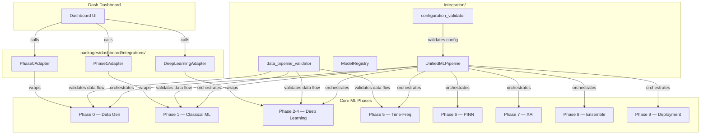

# Integration Layer

> Unified pipeline orchestration, model registry, and cross-phase validation for the LSTM_PFD bearing fault diagnosis system.

## Overview

The Integration Layer provides a single entry point for running the entire LSTM_PFD machine learning pipeline — from synthetic data generation (Phase 0) through deployment artifact preparation (Phase 9). It also includes a central model registry backed by SQLite and validators that ensure configuration correctness and data compatibility across all phases.

A separate set of **dashboard adapters** in `packages/dashboard/integrations/` bridges the Core ML pipeline with the Dash web application, allowing users to trigger data generation, classical ML training, and deep learning training through the dashboard UI.

## Architecture



## Quick Start

```python
from integration import UnifiedMLPipeline, ModelRegistry, validate_config

# 1. Load & validate configuration
from utils.file_io import load_yaml
config = load_yaml('configs/default_config.yaml')
validate_config(config)

# 2. Run the full pipeline
pipeline = UnifiedMLPipeline(config)
results = pipeline.run_full_pipeline()

# 3. Register best model
registry = ModelRegistry('models/registry.db')
registry.register_model(
    model_name='ResNet34_1D',
    phase='Phase 3',
    accuracy=results['deep_learning'].get('test_accuracy', 0),
    model_path='checkpoints/resnet34.pth'
)
```

## Key Components

| Component | File | Purpose |
|-----------|------|---------|
| `UnifiedMLPipeline` | `unified_pipeline.py` | Orchestrates Phase 0 → Phase 9 sequentially, gated by config flags |
| `ModelRegistry` | `model_registry.py` | SQLite-backed registry for model metadata, comparison, and reporting |
| `validate_data_compatibility` | `data_pipeline_validator.py` | Validates signal → feature / CNN / spectrogram data flows |
| `validate_config` | `configuration_validator.py` | Validates config sections, value ranges, file paths, hyperparameters |
| `suggest_config_optimizations` | `configuration_validator.py` | Suggests batch size, scheduler, and augmentation improvements |
| `generate_config_template` | `configuration_validator.py` | Writes a starter YAML config to disk |
| `test_data_transformations` | `data_pipeline_validator.py` | Tests reversibility of normalization transforms |
| `benchmark_data_loading_speed` | `data_pipeline_validator.py` | Benchmarks HDF5 vs MAT loading speed |

### Dashboard Adapters (`packages/dashboard/integrations/`)

| Adapter | File | Wraps | Key Methods |
|---------|------|-------|-------------|
| `Phase0Adapter` | `phase0_adapter.py` | Phase 0 data generation & MAT import | `generate_dataset()`, `load_existing_cache()`, `import_mat_files()` |
| `Phase1Adapter` | `phase1_adapter.py` | Phase 1 classical ML training | `train()`, `get_model_params()` |
| `DeepLearningAdapter` | `deep_learning_adapter.py` | Phase 2-8 deep learning training | `train()` |

## API Summary

See [INTEGRATION_GUIDE.md](INTEGRATION_GUIDE.md) for detailed usage patterns and cross-domain data flow.

### `UnifiedMLPipeline`

```python
pipeline = UnifiedMLPipeline(config: Dict[str, Any])
results = pipeline.run_full_pipeline() -> Dict[str, Any]
pipeline.validate_cross_phase_compatibility() -> bool
pipeline.resolve_dependency_conflicts() -> bool
```

Config flags that gate each phase: `run_phase_0` (default `True`), `run_phase_1` (`True`), `run_phase_2_4` (`True`), `run_phase_5` (`False`), `run_phase_6` (`False`), `run_phase_7` (`False`), `run_phase_8` (`True`), `run_phase_9` (`True`).

### `ModelRegistry`

```python
registry = ModelRegistry(db_path: str = 'models/model_registry.db')
model_id = registry.register_model(model_name, phase, accuracy, model_path, **kwargs) -> int
best = registry.get_best_model(metric='accuracy') -> Dict
df = registry.compare_models(model_names, metrics=None) -> pd.DataFrame
df = registry.list_all_models() -> pd.DataFrame
registry.export_registry_report(output_path) -> None
```

### Validators

```python
from integration import validate_data_compatibility, validate_config

validate_data_compatibility() -> bool   # Tests Phase 0 → Phase 1/2/5 data flows
validate_config(config) -> bool         # Validates config dict
```

## Implementation Status

| Component | Status |
|-----------|--------|
| Phase 0 orchestration | ✅ Implemented |
| Phase 1 orchestration | ✅ Implemented |
| Phase 2-4 orchestration | ⚠️ Placeholder — logs message, returns stub |
| Phase 5 orchestration | ⚠️ Placeholder |
| Phase 6 orchestration | ⚠️ Placeholder |
| Phase 7 orchestration | ⚠️ Placeholder |
| Phase 8 orchestration | ⚠️ Placeholder |
| Phase 9 orchestration | ⚠️ Placeholder |
| Model Registry | ✅ Implemented (SQLite) |
| Data Pipeline Validator | ✅ Implemented |
| Configuration Validator | ✅ Implemented |
| Dashboard Phase0Adapter | ✅ Implemented |
| Dashboard Phase1Adapter | ✅ Implemented |
| Dashboard DeepLearningAdapter | ✅ Implemented |

## Dependencies

- **Requires:** `utils.constants` (SAMPLING_RATE, SIGNAL_LENGTH), `torch`, `numpy`, `scipy`, `pandas`, `sqlite3`, `yaml`, `json`, `h5py`
- **Provides:** `UnifiedMLPipeline`, `ModelRegistry`, `validate_data_compatibility`, `validate_config` (exported via `__init__.py`)

## Performance

> ⚠️ **Results pending.** Performance metrics below will be populated after experiments are run on the current codebase.

| Metric | Value |
|--------|-------|
| Full pipeline runtime | `[PENDING]` |
| Data validation runtime | `[PENDING]` |
| Registry query latency | `[PENDING]` |

## Related Documentation

- [Integration Guide](INTEGRATION_GUIDE.md) — Cross-domain patterns, error handling, adding new integration points
- [Utils README](../utils/README.md) — Shared utilities consumed by the integration layer
- [Configuration Guide](../config/CONFIGURATION_GUIDE.md) — IDB 4.4
