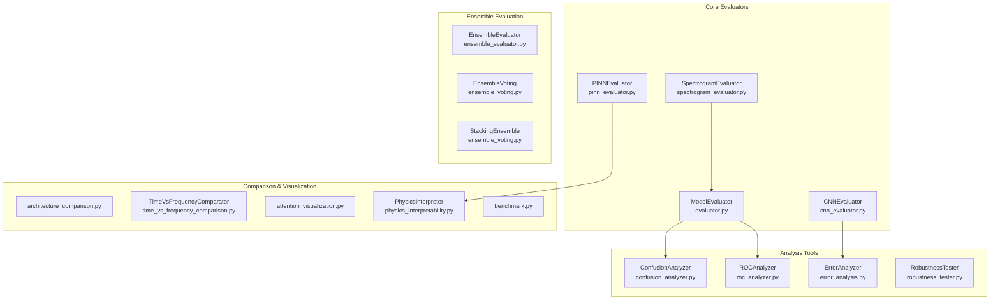

# Evaluation Sub-Block

> Comprehensive model evaluation, metrics computation, error analysis, and architecture comparison for bearing fault diagnosis.

## Overview

The Evaluation sub-block provides a complete toolkit for assessing the performance of trained fault diagnosis models. It covers standard classification metrics, physics-aware evaluation for PINN models, ensemble diversity analysis, robustness testing, and systematic architecture comparison.

This module is designed to be used **after training** (see [IDB 1.2 — Training](../training/)) on models defined in [IDB 1.1 — Models](../models/). It produces evaluation results, visualizations, and comparison reports that inform model selection and deployment decisions.

## Architecture



## Quick Start

### Basic Model Evaluation

```python
from packages.core.evaluation.evaluator import ModelEvaluator

evaluator = ModelEvaluator(model, device='cuda')
results = evaluator.evaluate(test_loader, class_names=['Normal', 'Inner Race', 'Outer Race'])

print(f"Accuracy: {results['accuracy']:.2f}%")
print(evaluator.generate_classification_report(
    results['predictions'], results['targets'], class_names
))
```

### CNN-Specific Evaluation

```python
from packages.core.evaluation.cnn_evaluator import CNNEvaluator

evaluator = CNNEvaluator(model, device='cuda', class_names=['Normal', 'Ball', 'Inner', 'Outer'])
metrics = evaluator.evaluate(test_loader)
report = evaluator.get_classification_report(test_loader)
cm = evaluator.get_confusion_matrix(test_loader, normalize='true')
```

### Confusion Analysis

```python
from packages.core.evaluation.confusion_analyzer import ConfusionAnalyzer

analyzer = ConfusionAnalyzer(confusion_matrix, class_names)
top_confused = analyzer.find_most_confused_pairs(top_k=5)
error_df = analyzer.analyze_per_class_errors()
```

## Key Components

| Component                | Class/Module                | File                              | Description                                                                        |
| ------------------------ | --------------------------- | --------------------------------- | ---------------------------------------------------------------------------------- |
| Base Evaluator           | `ModelEvaluator`            | `evaluator.py`                    | Core evaluation: accuracy, per-class metrics, classification reports               |
| CNN Evaluator            | `CNNEvaluator`              | `cnn_evaluator.py`                | Extended CNN evaluation with predictions, result saving, per-class accuracy        |
| PINN Evaluator           | `PINNEvaluator`             | `pinn_evaluator.py`               | Physics-aware metrics: frequency consistency, prediction plausibility, OOD testing |
| Spectrogram Evaluator    | `SpectrogramEvaluator`      | `spectrogram_evaluator.py`        | Spectrogram visualization, Grad-CAM heatmaps, frequency contribution analysis      |
| Confusion Analyzer       | `ConfusionAnalyzer`         | `confusion_analyzer.py`           | Most confused pairs, error concentration, per-class error breakdown                |
| ROC Analyzer             | `ROCAnalyzer`               | `roc_analyzer.py`                 | One-vs-rest ROC curves, per-class AUC, macro-averaged AUC                          |
| Error Analyzer           | `ErrorAnalyzer`             | `error_analysis.py`               | Misclassification analysis, confidence distribution, hard example mining           |
| Robustness Tester        | `RobustnessTester`          | `robustness_tester.py`            | Sensor noise robustness, missing feature robustness                                |
| Ensemble Evaluator       | `EnsembleEvaluator`         | `ensemble_evaluator.py`           | Ensemble performance, diversity metrics, ensemble vs. individual comparison        |
| Ensemble Voting          | `EnsembleVoting`            | `ensemble_voting.py`              | Soft voting, hard voting for model combination                                     |
| Stacking Ensemble        | `StackingEnsemble`          | `ensemble_voting.py`              | Two-level stacking with meta-learner                                               |
| Architecture Comparison  | Functions                   | `architecture_comparison.py`      | Parameter counts, FLOPs, inference time, memory, Pareto frontier                   |
| Time vs Frequency        | `TimeVsFrequencyComparator` | `time_vs_frequency_comparison.py` | Compare time-domain and frequency-domain model approaches                          |
| Attention Visualization  | Functions                   | `attention_visualization.py`      | Attention heatmaps, rollout, entropy analysis for transformer models               |
| Physics Interpretability | `PhysicsInterpreter`        | `physics_interpretability.py`     | Learned vs. expected frequencies, knowledge graph visualization                    |
| Benchmarking             | Functions                   | `benchmark.py`                    | Compare DL models against classical ML baselines                                   |

## API Summary

Full API reference for all classes and functions is available in [API.md](./API.md).

Metric definitions, formulas, and interpretation guidance are available in [METRICS_GUIDE.md](./METRICS_GUIDE.md).

## Dependencies

- **Requires:**
  - `torch`, `torch.nn` — Model inference
  - `sklearn.metrics` — Classification metrics (precision, recall, F1, ROC, AUC)
  - `numpy`, `pandas` — Data manipulation
  - `matplotlib`, `seaborn` — Plotting and visualization
  - `tqdm` — Progress bars
  - `utils.constants` — `NUM_CLASSES`, `SIGNAL_LENGTH`
  - `utils.logging` — Logger (used by `CNNEvaluator`)
  - `packages.core.models.physics.bearing_dynamics` — `BearingDynamics` (used by `PINNEvaluator`, `PhysicsInterpreter`)
  - `packages.core.models.physics.fault_signatures` — `FaultSignatureDatabase` (used by `PINNEvaluator`, `PhysicsInterpreter`)
  - `training.physics_loss_functions` — `FrequencyConsistencyLoss` (used by `PINNEvaluator`)

- **Provides:**
  - Evaluation result dictionaries (accuracy, per-class metrics, confusion matrices)
  - Classification reports (string and dict formats)
  - ROC curves and AUC scores
  - Comparison DataFrames for architecture and ensemble analysis
  - Matplotlib figures for visualizations

## Testing

Several modules include self-test blocks via `if __name__ == "__main__":` guards:

```bash
python -m packages.core.evaluation.cnn_evaluator
python -m packages.core.evaluation.pinn_evaluator
python -m packages.core.evaluation.spectrogram_evaluator
```

These create dummy data and validate the evaluator pipelines.

## Performance

> ⚠️ **Results pending.** Performance metrics below will be populated
> after experiments are run on the current codebase.

| Metric         | Value       |
| -------------- | ----------- |
| Accuracy       | `[PENDING]` |
| F1 Score       | `[PENDING]` |
| Precision      | `[PENDING]` |
| Recall         | `[PENDING]` |
| Inference Time | `[PENDING]` |

## Related Documentation

- [IDB 1.1 — Models](../models/README.md) — Model architectures that this module evaluates
- [IDB 1.2 — Training](../training/README.md) — Training pipelines that produce models for evaluation
- [IDB 1.4 — Features](../features/README.md) — Feature extraction used upstream
- [IDB 1.5 — Explainability](../explainability/README.md) — XAI methods (complementary to `PhysicsInterpreter` and `attention_visualization`)
