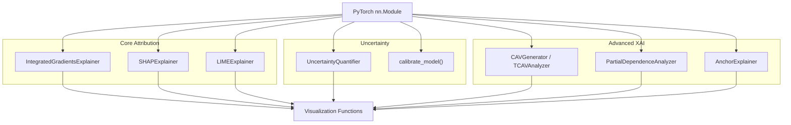

# Explainability (XAI) — Core ML Engine

> Model-agnostic and gradient-based explainability methods for bearing fault diagnosis.

## Overview

The `packages/core/explainability/` package provides seven XAI methods that explain predictions from time-series bearing fault diagnosis models. All explainers follow a common pattern: instantiate with a PyTorch `nn.Module`, then call `.explain()` on an input signal to produce human-interpretable explanations.

The package spans three categories:

| Category           | Methods                                  | Key Use-Case                                            |
| ------------------ | ---------------------------------------- | ------------------------------------------------------- |
| **Attribution**    | Integrated Gradients, SHAP, LIME         | Which signal regions drive the prediction?              |
| **Uncertainty**    | MC Dropout, Calibration                  | How confident is the model?                             |
| **Concept / Rule** | CAVs (TCAV), Anchors, Partial Dependence | What high-level concepts or rules explain the decision? |

## Architecture



## Quick Start

```python
from packages.core.explainability import (
    IntegratedGradientsExplainer,
    SHAPExplainer,
    LIMEExplainer,
    UncertaintyQuantifier,
    plot_attribution_map,
    plot_shap_waterfall,
    plot_lime_explanation,
)

# --- Integrated Gradients ---
ig = IntegratedGradientsExplainer(model, device='cpu')
attributions = ig.explain(signal, target_class=3, steps=50)
plot_attribution_map(signal, attributions, predicted_class=3)

# --- SHAP ---
shap_exp = SHAPExplainer(model, background_data=bg_data, device='cpu')
shap_vals = shap_exp.explain(signal, method='gradient', n_samples=100)

# --- LIME ---
lime_exp = LIMEExplainer(model, device='cpu', num_segments=20)
weights, boundaries = lime_exp.explain(signal, num_samples=1000)
plot_lime_explanation(signal, weights, boundaries, predicted_class=3)

# --- Uncertainty ---
uq = UncertaintyQuantifier(model, device='cpu')
mean_pred, uncertainty, all_preds = uq.predict_with_uncertainty(signal, n_samples=50)
```

## Key Components

| Component                       | Description                                                     | File                            |
| ------------------------------- | --------------------------------------------------------------- | ------------------------------- |
| `IntegratedGradientsExplainer`  | Gradient-path attribution (Sundararajan et al., 2017)           | `integrated_gradients.py`       |
| `SHAPExplainer`                 | Shapley-value explanations (GradientSHAP, DeepSHAP, KernelSHAP) | `shap_explainer.py`             |
| `LIMEExplainer`                 | Segment-perturbation local linear model (Ribeiro et al., 2016)  | `lime_explainer.py`             |
| `UncertaintyQuantifier`         | MC Dropout uncertainty + entropy + mutual information           | `uncertainty_quantification.py` |
| `CAVGenerator` / `TCAVAnalyzer` | Concept Activation Vectors and TCAV testing                     | `concept_activation_vectors.py` |
| `PartialDependenceAnalyzer`     | 1D/2D PDP, ICE plots, H-statistic interaction detection         | `partial_dependence.py`         |
| `AnchorExplainer`               | Rule-based "IF-THEN" anchor explanations (Ribeiro et al., 2018) | `anchors.py`                    |

## Method Selection Guide

| Scenario                           | Recommended Method    | Why                                          |
| ---------------------------------- | --------------------- | -------------------------------------------- |
| Quick per-sample attribution       | Integrated Gradients  | Fast, axiomatic guarantees                   |
| Theory-grounded feature importance | SHAP (GradientSHAP)   | Shapley axioms, works without `shap` library |
| Model-agnostic / black-box         | LIME or KernelSHAP    | No gradient access required                  |
| Confidence / safety-critical       | UncertaintyQuantifier | Reject uncertain predictions                 |
| Domain-concept validation          | CAV + TCAV            | "Does model use _this_ concept?"             |
| Feature effect analysis            | Partial Dependence    | Marginal effect of each feature              |
| Human-readable rules               | Anchors               | "IF mean_amplitude > 1.5 THEN fault X"       |

## Dependencies

- **Requires:**
  - `torch`, `numpy`, `matplotlib`, `scikit-learn` (Ridge, LinearSVC, calibration)
  - `scipy.stats` (for Anchors and PDP)
  - `shap` library (optional — only for `_deep_shap` backend; native PyTorch fallback exists)
  - `packages.utils.constants.NUM_CLASSES`

- **Provides:**
  - 7 explainer classes, 3 data-classes (`Predicate`, `Anchor`, `ConceptActivationVector`)
  - 14 visualization helper functions (waterfall, summary, heatmap, bar chart, ICE, PDP 2D, etc.)

## Configuration

All explainers accept `device: str` (default `'cuda'`). Key configurable parameters:

| Explainer                      | Parameter             | Default      | Description                                |
| ------------------------------ | --------------------- | ------------ | ------------------------------------------ |
| `IntegratedGradientsExplainer` | `steps`               | 50           | Integration steps (higher = more accurate) |
| `SHAPExplainer`                | `method`              | `'gradient'` | `'gradient'`, `'deep'`, `'kernel'`         |
| `LIMEExplainer`                | `num_segments`        | 20           | Signal partitions                          |
| `LIMEExplainer`                | `kernel_width`        | 0.25         | Locality bandwidth                         |
| `UncertaintyQuantifier`        | `n_samples`           | 50           | MC Dropout forward passes                  |
| `AnchorExplainer`              | `precision_threshold` | 0.95         | Minimum rule precision                     |
| `AnchorExplainer`              | `beam_size`           | 5            | Beam search width                          |

## Performance

> ⚠️ **Results pending.** Performance metrics below will be populated
> after experiments are run on the current codebase.

| Metric                        | Value       |
| ----------------------------- | ----------- |
| IG convergence delta          | `[PENDING]` |
| SHAP faithfulness             | `[PENDING]` |
| LIME fidelity (R²)            | `[PENDING]` |
| UQ calibration ECE            | `[PENDING]` |
| TCAV statistical significance | `[PENDING]` |

## Testing

Each module includes a `__main__` validation block. Run individually:

```bash
cd packages/core
python -m explainability.integrated_gradients
python -m explainability.shap_explainer
python -m explainability.lime_explainer
python -m explainability.uncertainty_quantification
```

## Related Documentation

- [XAI Guide — per-method deep-dive](XAI_GUIDE.md)
- [API Reference](API.md)
- [XAI Analysis (IDB Report)](../../docs/idb_reports/IDB_1_5_XAI_ANALYSIS.md)
- [XAI Best Practices (IDB Report)](../../docs/idb_reports/IDB_1_5_XAI_BEST_PRACTICES.md)
