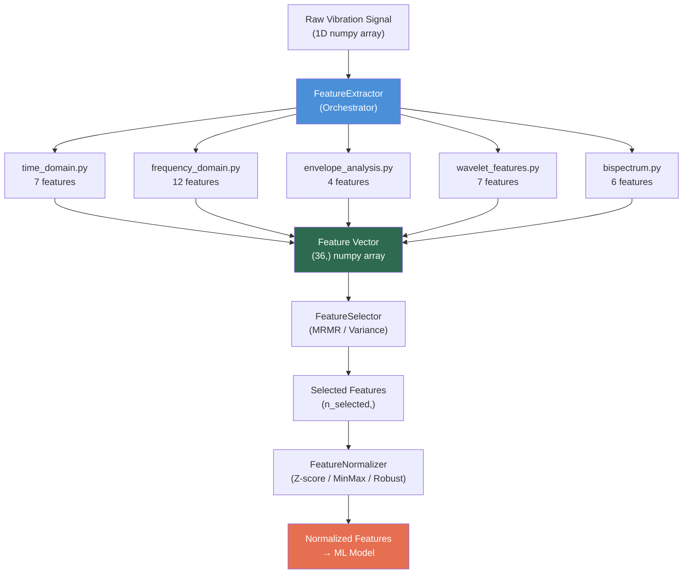
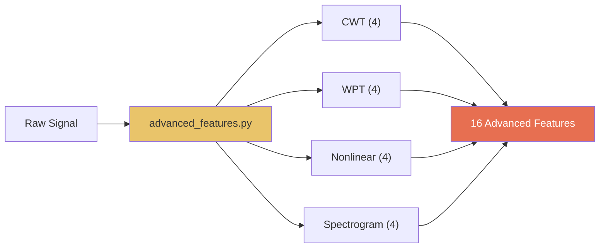

# Features — Feature Engineering Module

> Extract, select, normalize, and validate vibration signal features for bearing fault diagnosis.

## Overview

The Features module is the feature engineering backbone of the classical ML pipeline. It transforms raw vibration time-series signals into a structured feature vector that downstream models (e.g., Random Forest, SVM) consume for fault classification.

The module extracts **36 base features** across five signal analysis domains (time-domain, frequency-domain, envelope analysis, wavelet transforms, and bispectrum/higher-order statistics). An additional **16 advanced features** are available for computationally intensive experiments (CWT, WPT, nonlinear dynamics, spectrogram). After extraction, features can be selected (MRMR or variance threshold), normalized (z-score, min-max, or robust), and validated for data quality.

## Architecture



### Optional Advanced Features



> ⚠️ Advanced features are **~10× slower** to compute. Use only when needed.

## Quick Start

```python
import numpy as np
from packages.core.features import FeatureExtractor, FeatureSelector, FeatureNormalizer

# 1. Extract features
extractor = FeatureExtractor(fs=20480)
signal = np.random.randn(102400)  # Example vibration signal

# Single signal → 36-element vector
features = extractor.extract_features(signal)
assert features.shape == (36,)

# Batch extraction
signals = np.random.randn(100, 102400)
feature_matrix = extractor.extract_batch(signals)
assert feature_matrix.shape == (100, 36)

# 2. Select best features (MRMR)
selector = FeatureSelector(method='mrmr', n_features=15)
selector.fit(X_train, y_train, feature_names=extractor.get_feature_names())
X_selected = selector.transform(X_train)

# 3. Normalize
normalizer = FeatureNormalizer(method='standard')
normalizer.fit(X_selected)
X_normalized = normalizer.transform(X_selected)
```

## Key Components

| Component                           | Description                                               | File                       |
| ----------------------------------- | --------------------------------------------------------- | -------------------------- |
| `FeatureExtractor`                  | Main orchestrator — extracts all 36 base features         | `feature_extractor.py`     |
| `FeatureSelector`                   | MRMR and variance-threshold feature selection             | `feature_selector.py`      |
| `VarianceThresholdSelector`         | Simple variance-based feature filter                      | `feature_selector.py`      |
| `FeatureNormalizer`                 | Z-score / min-max normalization (sklearn-compatible)      | `feature_normalization.py` |
| `RobustNormalizer`                  | Median/IQR robust normalization                           | `feature_normalization.py` |
| `extract_time_domain_features`      | 7 statistical features (RMS, kurtosis, etc.)              | `time_domain.py`           |
| `extract_frequency_domain_features` | 12 spectral features (FFT-based)                          | `frequency_domain.py`      |
| `extract_envelope_features`         | 4 Hilbert envelope features                               | `envelope_analysis.py`     |
| `extract_wavelet_features`          | 7 DWT + cepstral features                                 | `wavelet_features.py`      |
| `extract_bispectrum_features`       | 6 higher-order spectral features                          | `bispectrum.py`            |
| `extract_advanced_features`         | 16 optional advanced features (CWT, WPT, nonlinear, STFT) | `advanced_features.py`     |
| Feature importance analysis         | RF Gini + permutation importance with plots               | `feature_importance.py`    |
| Feature validation utilities        | NaN/Inf checks, distribution validation, NaN replacement  | `feature_validator.py`     |

## API Summary

See [API.md](API.md) for full API reference. See [FEATURE_CATALOG.md](FEATURE_CATALOG.md) for the definitive list of all 52 features with formulas and source locations.

## Dependencies

- **Requires:**
  - `numpy`, `scipy` — signal processing and statistics
  - `pywt` — wavelet transforms (DWT, CWT, WPT)
  - `scikit-learn` — `mutual_info_classif`, `StandardScaler`, `MinMaxScaler`, `permutation_importance`
  - `matplotlib`, `seaborn` — importance visualization
  - `utils.constants` — `SAMPLING_RATE` (20480 Hz), `SIGNAL_LENGTH`
- **Provides:**
  - `FeatureExtractor` — main extraction class
  - `FeatureSelector` — feature selection
  - `FeatureNormalizer` — normalization

## Configuration

| Parameter                 | Default      | Description                                                |
| ------------------------- | ------------ | ---------------------------------------------------------- |
| `fs` (sampling frequency) | `20480` Hz   | Sampling rate of vibration signals                         |
| `n_features` (selector)   | `15`         | Number of features to select via MRMR                      |
| `method` (normalizer)     | `'standard'` | Normalization method: `'standard'`, `'zscore'`, `'minmax'` |
| `wavelet`                 | `'db4'`      | Wavelet type for DWT/WPT decomposition                     |
| `level` (DWT)             | `5`          | Wavelet decomposition depth                                |

## Performance

> ⚠️ **Results pending.** Performance metrics below will be populated
> after experiments are run on the current codebase.

| Metric                                  | Value       |
| --------------------------------------- | ----------- |
| Feature extraction time (single signal) | `[PENDING]` |
| Feature extraction time (batch of 100)  | `[PENDING]` |
| Advanced feature extraction time        | `[PENDING]` |
| MRMR selection time                     | `[PENDING]` |

## Testing

```bash
# Unit tests
pytest tests/unit/test_features.py -v

# Integration tests
pytest tests/test_feature_engineering.py -v
```

## Related Documentation

- [IDB 1.4 Features Analysis](../../docs/idb_reports/IDB_1_4_FEATURES_ANALYSIS.md)
- [IDB 1.4 Features Best Practices](../../docs/idb_reports/IDB_1_4_FEATURES_BEST_PRACTICES.md)
- [Models README](../models/README.md) — downstream consumers of feature vectors
- [Training README](../training/README.md) — training pipeline using features
