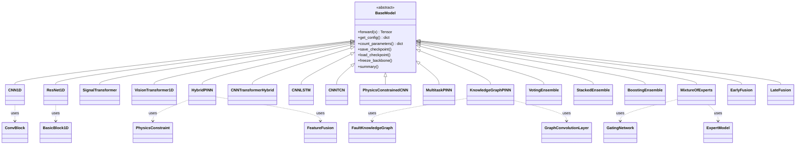

# Models — Core ML Engine

> Neural network architectures for bearing fault diagnosis from raw vibration signals.

## Overview

This module provides a comprehensive library of deep learning models for classifying bearing fault conditions from 1D vibration signals. All models inherit from a common `BaseModel` abstract class and are accessible through a unified `model_factory` interface.

The module supports the full spectrum of approaches for signal classification:

- **Pure CNN** architectures for local feature extraction
- **Transformer** architectures for long-range temporal dependencies
- **Hybrid** models combining CNN backbones with temporal sequence models (LSTM, TCN, Transformer)
- **Physics-Informed Neural Networks (PINN)** incorporating bearing dynamics as constraints
- **Ensemble** methods for combining multiple models
- **Multi-Modal Fusion** for combining features from different sources
- **Classical ML** wrappers for sklearn-based baselines

**Input:** `[B, 1, T]` where `T` is the signal length (default: 102,400 samples)
**Output:** `[B, 11]` logits for 11 fault classes

## Architecture



## Model Catalog

### Deep Learning Models

| Model Class           | Type         | File                                   | Factory Key            | Description                          |
| --------------------- | ------------ | -------------------------------------- | ---------------------- | ------------------------------------ |
| `CNN1D`               | CNN          | `cnn_1d.py`                            | `cnn1d`                | 6-layer 1D CNN with adaptive pooling |
| `AttentionCNN`        | CNN          | `cnn/attention_cnn.py`                 | —                      | CNN with self-attention mechanism    |
| `MultiScaleCNN`       | CNN          | `cnn/multi_scale_cnn.py`               | —                      | Multi-scale feature extraction CNN   |
| `ResNet1D`            | ResNet       | `resnet_1d.py`                         | `resnet18`, `resnet34` | ResNet-18/34 adapted for 1D signals  |
| `SEResNet1D`          | ResNet       | `resnet/se_resnet.py`                  | `se_resnet18`          | Squeeze-and-Excitation ResNet        |
| `WideResNet1D`        | ResNet       | `resnet/wide_resnet.py`                | —                      | Wide ResNet variant                  |
| `EfficientNet1D`      | EfficientNet | `efficientnet/efficientnet_1d.py`      | `efficientnet`         | EfficientNet adapted for 1D signals  |
| `SignalTransformer`   | Transformer  | `transformer/signal_transformer.py`    | `transformer`          | Patch-based transformer encoder      |
| `VisionTransformer1D` | Transformer  | `transformer/vision_transformer_1d.py` | `vit_1d`               | ViT with [CLS] token for 1D signals  |
| `PatchTST`            | Transformer  | `transformer/patchtst.py`              | —                      | Patch Time-Series Transformer        |
| `TSMixer`             | Transformer  | `transformer/tsmixer.py`               | —                      | Time-Series Mixer                    |

### Hybrid Models

| Model Class            | Type              | File                        | Factory Key       | Description                          |
| ---------------------- | ----------------- | --------------------------- | ----------------- | ------------------------------------ |
| `CNNTransformerHybrid` | CNN + Transformer | `hybrid/cnn_transformer.py` | `cnn_transformer` | CNN backbone → Transformer reasoning |
| `CNNLSTM`              | CNN + LSTM        | `hybrid/cnn_lstm.py`        | —                 | CNN features → Bidirectional LSTM    |
| `CNNTCN`               | CNN + TCN         | `hybrid/cnn_tcn.py`         | —                 | CNN features → Temporal Convolution  |
| `MultiscaleCNN`        | Multi-scale       | `hybrid/multiscale_cnn.py`  | —                 | Multi-scale hybrid CNN               |

### Physics-Informed Models

| Model Class                     | Type                | File                                     | Description                       |
| ------------------------------- | ------------------- | ---------------------------------------- | --------------------------------- |
| `HybridPINN`                    | Dual-Branch PINN    | `hybrid_pinn.py` / `pinn/hybrid_pinn.py` | Data + physics feature fusion     |
| `PhysicsConstrainedCNN`         | Constrained CNN     | `pinn/physics_constrained_cnn.py`        | CNN with physics-based loss       |
| `AdaptivePhysicsConstrainedCNN` | Adaptive PINN       | `pinn/physics_constrained_cnn.py`        | Adaptive physics loss weighting   |
| `MultitaskPINN`                 | Multi-task PINN     | `pinn/multitask_pinn.py`                 | Fault + speed + load + severity   |
| `AdaptiveMultitaskPINN`         | Adaptive Multi-task | `pinn/multitask_pinn.py`                 | Learnable task weights            |
| `KnowledgeGraphPINN`            | Graph PINN          | `pinn/knowledge_graph_pinn.py`           | GCN over fault relationship graph |

> See [`pinn/README.md`](pinn/README.md) for detailed PINN documentation.

### Ensemble Models

| Model Class                | Type     | File                             | Description                          |
| -------------------------- | -------- | -------------------------------- | ------------------------------------ |
| `VotingEnsemble` (legacy)  | Voting   | `legacy_ensemble.py`             | Hard/soft voting                     |
| `StackedEnsemble` (legacy) | Stacking | `legacy_ensemble.py`             | Meta-learner stacking                |
| `EnsembleModel` (legacy)   | Generic  | `legacy_ensemble.py`             | Switchable strategy wrapper          |
| `VotingEnsemble` (v2)      | Voting   | `ensemble/voting_ensemble.py`    | Optimizable weights via grid search  |
| `StackingEnsemble` (v2)    | Stacking | `ensemble/stacking_ensemble.py`  | Meta-feature generation              |
| `BoostingEnsemble`         | Boosting | `ensemble/boosting_ensemble.py`  | AdaBoost for neural networks         |
| `MixtureOfExperts`         | MoE      | `ensemble/mixture_of_experts.py` | Gating network + specialized experts |

> See [`ensemble/README.md`](ensemble/README.md) for detailed ensemble documentation.

### Multi-Modal Fusion

| Model Class         | File                     | Description                                               |
| ------------------- | ------------------------ | --------------------------------------------------------- |
| `EarlyFusion`       | `fusion/early_fusion.py` | Feature concatenation before classification               |
| `SimpleEarlyFusion` | `fusion/early_fusion.py` | Simplified early fusion                                   |
| `LateFusion`        | `fusion/late_fusion.py`  | Decision-level fusion (weighted avg, max, product, Borda) |

### Spectrogram Models (2D)

| Model Class                 | File                                            | Description                   |
| --------------------------- | ----------------------------------------------- | ----------------------------- |
| `DualStreamCNN`             | `spectrogram_cnn/dual_stream_cnn.py`            | Dual-stream 1D + 2D CNN       |
| `ResNet2DSpectrogram`       | `spectrogram_cnn/resnet2d_spectrogram.py`       | ResNet for spectrogram input  |
| `EfficientNet2DSpectrogram` | `spectrogram_cnn/efficientnet2d_spectrogram.py` | EfficientNet for spectrograms |

### Classical ML Wrappers

| Model Class                  | File                             | Description                       |
| ---------------------------- | -------------------------------- | --------------------------------- |
| `SVMClassifier`              | `classical/svm_classifier.py`    | SVM with RBF kernel               |
| `RandomForestClassifier`     | `classical/random_forest.py`     | Random Forest ensemble            |
| `NeuralNetworkClassifier`    | `classical/neural_network.py`    | Sklearn MLP wrapper               |
| `GradientBoostingClassifier` | `classical/gradient_boosting.py` | Gradient Boosting                 |
| `StackedEnsemble`            | `classical/stacked_ensemble.py`  | Sklearn stacked ensemble          |
| `ModelSelector`              | `classical/model_selector.py`    | Auto-selects best classical model |

### Physics Layer (Support Modules)

| Module                | File                              | Description                      |
| --------------------- | --------------------------------- | -------------------------------- |
| `BearingDynamics`     | `physics/bearing_dynamics.py`     | Bearing dynamics equations       |
| `FaultSignatures`     | `physics/fault_signatures.py`     | Fault characteristic frequencies |
| `OperatingConditions` | `physics/operating_conditions.py` | Operating condition models       |

### NAS (Neural Architecture Search)

| Module        | File                  | Description                          |
| ------------- | --------------------- | ------------------------------------ |
| `SearchSpace` | `nas/search_space.py` | Architecture search space definition |

## Quick Start

```python
from packages.core.models import create_model, create_model_from_config

# Create a model by name
model = create_model('cnn1d', num_classes=11)

# Or from a config dictionary
config = {
    'model_name': 'resnet18',
    'num_classes': 11,
    'dropout': 0.3
}
model = create_model_from_config(config)

# Forward pass
import torch
x = torch.randn(4, 1, 102400)  # [batch, channels, signal_length]
logits = model(x)               # [4, 11]

# Model summary
print(model.summary(input_shape=(1, 102400)))
print(f"Parameters: {model.get_num_params():,}")
```

## Factory Usage

The `model_factory.py` provides a centralized interface for model creation:

```python
from packages.core.models.model_factory import (
    create_model,           # Create model by name
    create_model_from_config,  # Create from config dict
    load_pretrained,        # Load from checkpoint
    save_checkpoint,        # Save model checkpoint
    create_ensemble,        # Create ensemble of models
    list_available_models,  # List registered model names
    register_model,         # Register custom model
    get_model_info,         # Get model metadata
)

# List all available models
print(list_available_models())
# ['cnn1d', 'cnn_1d', 'resnet18', 'resnet18_1d', 'resnet34',
#  'se_resnet18', 'efficientnet', 'transformer', 'vit_1d',
#  'cnn_transformer', 'pinn', 'hybrid_pinn', 'physics_informed', ...]

# Register a custom model
register_model('my_model', my_model_factory_fn)
```

### Available Factory Keys

| Key                                         | Model                               |
| ------------------------------------------- | ----------------------------------- |
| `cnn1d` / `cnn_1d`                          | `CNN1D`                             |
| `resnet18` / `resnet18_1d`                  | `ResNet1D` (18 layers)              |
| `resnet34`                                  | `ResNet1D` (34 layers)              |
| `se_resnet18`                               | `SEResNet1D`                        |
| `efficientnet`                              | `EfficientNet1D`                    |
| `transformer`                               | `SignalTransformer`                 |
| `vit_1d`                                    | `VisionTransformer1D`               |
| `cnn_transformer`                           | `CNNTransformerHybrid`              |
| `cnn_transformer_small`                     | CNNTransformerHybrid (small preset) |
| `cnn_transformer_base`                      | CNNTransformerHybrid (base preset)  |
| `cnn_transformer_large`                     | CNNTransformerHybrid (large preset) |
| `pinn` / `hybrid_pinn` / `physics_informed` | `HybridPINN`                        |

## Adding New Models

To add a new model architecture:

1. **Inherit from `BaseModel`** and implement the required abstract methods:

```python
from packages.core.models.base_model import BaseModel

class MyModel(BaseModel):
    def __init__(self, num_classes=11, **kwargs):
        super().__init__()
        # Define layers...

    def forward(self, x: torch.Tensor) -> torch.Tensor:
        """Must accept [B, C, T] and return [B, num_classes]."""
        # ...
        return logits

    def get_config(self) -> dict:
        """Return model hyperparameters."""
        return {'model_type': 'MyModel', ...}
```

2. **Create a factory function:**

```python
def create_my_model(num_classes=11, **kwargs):
    return MyModel(num_classes=num_classes, **kwargs)
```

3. **Register in `model_factory.py`:**

```python
from packages.core.models.model_factory import register_model
register_model('my_model', create_my_model)
```

4. **Export in `__init__.py`** by adding imports and updating `__all__`.

## Dependencies

- **Requires:**
  - `torch`, `torch.nn` — PyTorch framework
  - `utils.constants` — `NUM_CLASSES` (11), `SIGNAL_LENGTH` (102400)
  - `utils.logging` — Logging utilities
  - `numpy`, `sklearn` — For classical models and ensemble optimization

- **Provides:**
  - `BaseModel` abstract class for all models
  - `create_model()` factory for model instantiation
  - `save_checkpoint()` / `load_pretrained()` for persistence
  - `create_ensemble()` for ensemble creation

## Performance

> ⚠️ **Results pending.** Performance metrics below will be populated
> after experiments are run on the current codebase.

| Model                | Accuracy    | F1 Score    | Inference Time |
| -------------------- | ----------- | ----------- | -------------- |
| CNN1D                | `[PENDING]` | `[PENDING]` | `[PENDING]`    |
| ResNet1D             | `[PENDING]` | `[PENDING]` | `[PENDING]`    |
| SignalTransformer    | `[PENDING]` | `[PENDING]` | `[PENDING]`    |
| VisionTransformer1D  | `[PENDING]` | `[PENDING]` | `[PENDING]`    |
| CNNTransformerHybrid | `[PENDING]` | `[PENDING]` | `[PENDING]`    |
| HybridPINN           | `[PENDING]` | `[PENDING]` | `[PENDING]`    |

## Testing

```bash
# Run model tests
python -m pytest tests/ -k "models"

# Test individual model
python packages/core/models/cnn_1d.py
python packages/core/models/hybrid/cnn_transformer.py
```

## Related Documentation

- [API Reference](API.md) — Full API documentation for all model classes
- [PINN Sub-Block](pinn/README.md) — Physics-Informed Neural Networks
- [Ensemble Sub-Block](ensemble/README.md) — Ensemble methods
- Training Pipeline — `packages/core/training/` (IDB 1.2)
- Evaluation — `packages/core/evaluation/` (IDB 1.3)
