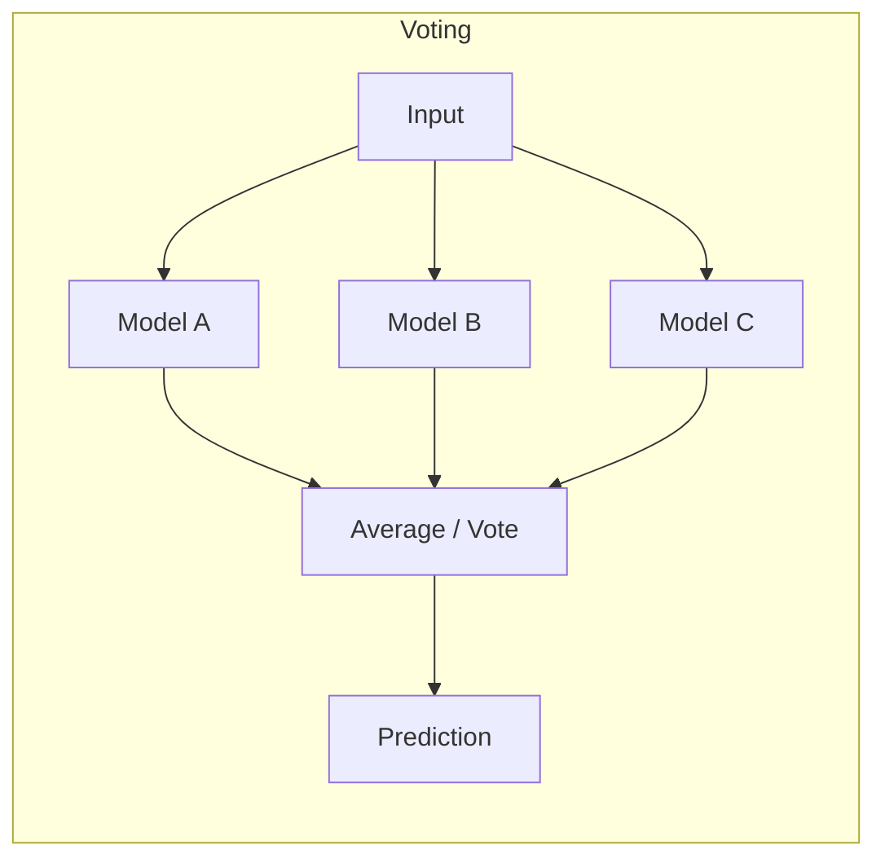
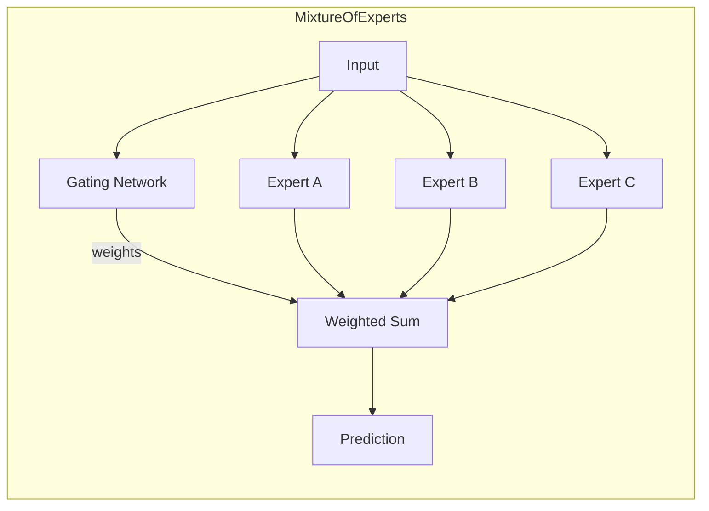

# Ensemble Methods

> Multiple model combination strategies for improved accuracy and robustness in bearing fault diagnosis.

## Overview

This sub-module provides four distinct ensemble strategies for combining multiple trained models. Each strategy provides a different trade-off between complexity, training requirements, and expected performance gains.

| Strategy               | Key Idea                                 | Training Required        | Best For                                       |
| ---------------------- | ---------------------------------------- | ------------------------ | ---------------------------------------------- |
| **Voting**             | Average/vote over predictions            | Weights only             | Quick baseline improvement                     |
| **Stacking**           | Meta-learner on base predictions         | Meta-learner training    | When base models have complementary strengths  |
| **Boosting**           | Sequential focus on hard samples         | Full sequential training | When specific fault types are hard to classify |
| **Mixture of Experts** | Gating network selects expert per sample | Gating network training  | Specialized fault type handling                |

## Architecture





## Key Components

| Component                | Description                                | File                    |
| ------------------------ | ------------------------------------------ | ----------------------- |
| `VotingEnsemble`         | Soft/hard/weighted voting                  | `voting_ensemble.py`    |
| `StackingEnsemble`       | Meta-learner over base predictions         | `stacking_ensemble.py`  |
| `BoostingEnsemble`       | AdaBoost wrapper for PyTorch               | `boosting_ensemble.py`  |
| `AdaptiveBoosting`       | Full AdaBoost training pipeline            | `boosting_ensemble.py`  |
| `MixtureOfExperts`       | Gating network + experts                   | `mixture_of_experts.py` |
| `GatingNetwork`          | 1D CNN outputting expert selection weights | `mixture_of_experts.py` |
| `ExpertModel`            | Wrapper adding specialization metadata     | `mixture_of_experts.py` |
| `DiversityBasedSelector` | Selects diverse model subsets              | `model_selector.py`     |
| `evaluate()`             | Accuracy evaluation helper                 | `__init__.py`           |

## Quick Start

### Voting Ensemble

```python
from packages.core.models.ensemble import VotingEnsemble, optimize_ensemble_weights

# Create ensemble from trained models
ensemble = VotingEnsemble(
    models=[model_a, model_b, model_c],
    voting_type='soft'
)

# Optimize weights on validation set
weights = optimize_ensemble_weights(
    models=[model_a, model_b, model_c],
    val_loader=val_loader,
    search_resolution=10
)
ensemble = VotingEnsemble(models=[model_a, model_b, model_c], weights=weights.tolist())
```

### Mixture of Experts

```python
from packages.core.models.ensemble import MixtureOfExperts, create_specialized_experts

# Create with auto-specialized experts
experts = create_specialized_experts(
    base_model_fn=lambda: create_model('cnn1d'),
    specializations=[[0,1,2,3], [4,5,6], [7,8,9,10]],  # Fault class groups
    train_loader=train_loader
)

moe = MixtureOfExperts(experts=experts, num_classes=11)
```

### Boosting

```python
from packages.core.models.ensemble import train_boosting

boosting = train_boosting(
    base_model_class=lambda: create_model('cnn1d'),
    train_loader=train_loader,
    n_estimators=5,
    num_epochs_per_model=20
)
```

## Standalone Functions

| Function                                              | Description                         |
| ----------------------------------------------------- | ----------------------------------- |
| `soft_voting(predictions_list, weights)`              | Average probability distributions   |
| `hard_voting(predictions_list, weights)`              | Majority class vote                 |
| `optimize_ensemble_weights(models, val_loader, ...)`  | Grid search for optimal weights     |
| `train_stacking(base_models, train_loader, ...)`      | Train stacking meta-learner         |
| `create_meta_features(base_models, dataloader, ...)`  | Generate meta-features for stacking |
| `train_boosting(base_model_class, train_loader, ...)` | End-to-end boosting training        |
| `create_specialized_experts(base_model_fn, ...)`      | Train specialized expert models     |
| `select_diverse_models(models, val_loader, ...)`      | Select diverse model subset         |

## Performance

> ⚠️ **Results pending.** Performance metrics below will be populated
> after experiments are run on the current codebase.

| Strategy            | Accuracy    | F1 Score    | Inference Time |
| ------------------- | ----------- | ----------- | -------------- |
| Voting (3 models)   | `[PENDING]` | `[PENDING]` | `[PENDING]`    |
| Stacking            | `[PENDING]` | `[PENDING]` | `[PENDING]`    |
| Boosting (5 rounds) | `[PENDING]` | `[PENDING]` | `[PENDING]`    |
| MoE (3 experts)     | `[PENDING]` | `[PENDING]` | `[PENDING]`    |

## Dependencies

- **Requires:** `packages.core.models.base_model`, `sklearn`, `numpy`, `tqdm`
- **Provides:** 4 ensemble strategies + weight optimization + model selection

## Related Documentation

- [Models README](../README.md) — Module overview
- [API Reference](../API.md) — Full API documentation
- `legacy_ensemble.py` — Earlier ensemble implementations (still exported for backward compatibility)
