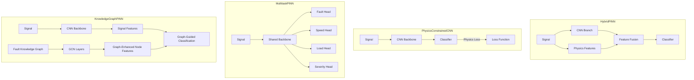

# Physics-Informed Neural Networks (PINN)

> Neural network architectures that incorporate bearing dynamics knowledge as constraints, features, or structural priors.

## Overview

This sub-module provides four distinct PINN architectures, each integrating physics knowledge differently:

1. **HybridPINN** — Dual-branch architecture that fuses CNN-learned features with handcrafted physics features
2. **PhysicsConstrainedCNN** — Standard CNN with physics-based loss penalties (no physics input branch)
3. **MultitaskPINN** — Multi-task learning with auxiliary physics-related regression tasks
4. **KnowledgeGraphPINN** — Graph neural network leveraging a fault relationship knowledge graph

All models use the same input format `[B, 1, T]` and output `[B, 11]` logits.

## Architecture Comparison



## Key Components

| Component                       | Description                                                | File                         |
| ------------------------------- | ---------------------------------------------------------- | ---------------------------- |
| `HybridPINN`                    | Dual-branch (data + physics) with fusion                   | `hybrid_pinn.py`             |
| `PhysicsConstraint`             | Encodes bearing dynamics as differentiable constraints     | `hybrid_pinn.py`             |
| `FeatureFusion`                 | Concat, cross-attention, or gated fusion                   | `hybrid_pinn.py`             |
| `PhysicsConstrainedCNN`         | CNN with frequency-consistency physics loss                | `physics_constrained_cnn.py` |
| `AdaptivePhysicsConstrainedCNN` | Auto-adjusts physics loss weight (linear/exponential/step) | `physics_constrained_cnn.py` |
| `MultitaskPINN`                 | Fault + speed + load + severity prediction                 | `multitask_pinn.py`          |
| `AdaptiveMultitaskPINN`         | Learnable task weights via uncertainty weighting           | `multitask_pinn.py`          |
| `KnowledgeGraphPINN`            | GCN over 11-node fault relationship graph                  | `knowledge_graph_pinn.py`    |
| `FaultKnowledgeGraph`           | Encodes fault type relationships as adjacency matrix       | `knowledge_graph_pinn.py`    |
| `GraphConvolutionLayer`         | GCN layer: H' = σ(A·H·W)                                   | `knowledge_graph_pinn.py`    |

## Physics Integration Approaches

### Approach 1: Feature-Level (HybridPINN)

Physics features (Sommerfeld number, fault frequencies, etc.) are extracted and fused with CNN features via:

- **Concatenation** — Simple concat + FC layers
- **Cross-Attention** — Attend between data and physics features
- **Gated Fusion** — Learnable gate controlling information flow

### Approach 2: Loss-Level (PhysicsConstrainedCNN)

No physics input. Instead, the loss function includes a physics penalty:

```
total_loss = data_loss + λ × physics_loss
```

The physics loss checks if predicted fault classes are consistent with dominant FFT frequencies.

### Approach 3: Task-Level (MultitaskPINN)

Shares a backbone across multiple tasks:

| Task                 | Type                        | Output  |
| -------------------- | --------------------------- | ------- |
| Fault classification | Classification (11 classes) | Logits  |
| Speed prediction     | Regression                  | RPM     |
| Load estimation      | Regression                  | Newtons |
| Severity assessment  | Classification (4 levels)   | Logits  |

### Approach 4: Structure-Level (KnowledgeGraphPINN)

Encodes fault relationships (physical causation, shared symptoms, co-occurrence) as a graph. Uses GCN layers to propagate information between related fault types.

## Quick Start

```python
from packages.core.models.pinn import (
    HybridPINN, create_hybrid_pinn,
    PhysicsConstrainedCNN, create_physics_constrained_cnn,
    MultitaskPINN, create_multitask_pinn,
    KnowledgeGraphPINN
)

# HybridPINN with gated fusion
model = create_hybrid_pinn(num_classes=11, fusion_type='gated')

# Physics-constrained CNN with adaptive weighting
model = create_physics_constrained_cnn(num_classes=11, adaptive=True)

# Multi-task PINN
model = create_multitask_pinn(num_fault_classes=11, adaptive=True)

# Knowledge Graph PINN
model = KnowledgeGraphPINN(num_classes=11, backbone='resnet18')
```

## Performance

> ⚠️ **Results pending.** Performance metrics below will be populated
> after experiments are run on the current codebase.

| Model                 | Accuracy    | F1 Score    | Physics Loss | Inference Time |
| --------------------- | ----------- | ----------- | ------------ | -------------- |
| HybridPINN            | `[PENDING]` | `[PENDING]` | `[PENDING]`  | `[PENDING]`    |
| PhysicsConstrainedCNN | `[PENDING]` | `[PENDING]` | `[PENDING]`  | `[PENDING]`    |
| MultitaskPINN         | `[PENDING]` | `[PENDING]` | `[PENDING]`  | `[PENDING]`    |
| KnowledgeGraphPINN    | `[PENDING]` | `[PENDING]` | `[PENDING]`  | `[PENDING]`    |

## Dependencies

- **Requires:** `packages.core.models.base_model`, `packages.core.models.resnet`, `packages.core.models.cnn`, `packages.core.models.physics`
- **Provides:** 6 PINN model classes + 3 support classes

## Related Documentation

- [Models README](../README.md) — Module overview
- [API Reference](../API.md) — Full API documentation
- `packages/core/models/physics/` — Bearing dynamics, fault signatures, operating conditions
