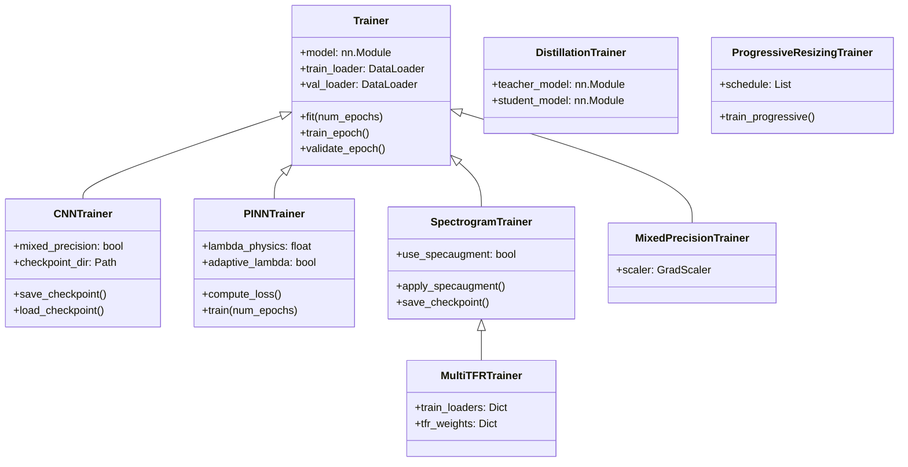

# Training Infrastructure

> Deep learning training framework for bearing fault diagnosis with physics-informed, CNN, spectrogram, and transformer model support.

## Overview

The training module provides a comprehensive infrastructure for training deep learning models for bearing fault diagnosis. It supports multiple training paradigms including standard supervised learning, physics-informed neural network (PINN) training, spectrogram-based training with SpecAugment, knowledge distillation, and progressive resizing. The module includes a callback system for extensibility, multiple loss functions (including physics-based constraints), configurable optimizers and learning rate schedulers, and three hyperparameter search strategies.

## Architecture



## Quick Start

```python
from training.trainer import Trainer
from training.callbacks import EarlyStopping, ModelCheckpoint
from training.losses import FocalLoss

# Create trainer
trainer = Trainer(
    model=model,
    train_loader=train_loader,
    val_loader=val_loader,
    optimizer=optimizer,
    criterion=FocalLoss(gamma=2.0),
    device='cuda',
    callbacks=[
        EarlyStopping(monitor='val_loss', patience=10),
        ModelCheckpoint(filepath='best_model.pt', monitor='val_loss'),
    ],
    mixed_precision=True
)

# Train
trainer.fit(num_epochs=100)
history = trainer.get_history()
```

## Key Components

### Trainers

| Trainer                      | Specialization                                                                         | File                        |
| ---------------------------- | -------------------------------------------------------------------------------------- | --------------------------- |
| `Trainer`                    | Base trainer with gradient accumulation, clipping, mixed precision, callbacks          | `trainer.py`                |
| `CNNTrainer`                 | CNN-optimized with FP16, checkpoint save/load, LR scheduling                           | `cnn_trainer.py`            |
| `PINNTrainer`                | Physics-informed training with combined classification + physics loss, adaptive lambda | `pinn_trainer.py`           |
| `SpectrogramTrainer`         | SpecAugment augmentation, spectrogram-specific checkpointing                           | `spectrogram_trainer.py`    |
| `MultiTFRTrainer`            | Multi-TFR (STFT, CWT, WVD) weighted training                                           | `spectrogram_trainer.py`    |
| `MixedPrecisionTrainer`      | Dedicated FP16 training with GradScaler                                                | `mixed_precision.py`        |
| `DistillationTrainer`        | Knowledge distillation (teacher → student)                                             | `knowledge_distillation.py` |
| `ProgressiveResizingTrainer` | Train with progressively longer signals                                                | `progressive_resizing.py`   |

### Loss Functions

| Loss                         | Purpose                                                    | File                         |
| ---------------------------- | ---------------------------------------------------------- | ---------------------------- |
| `FocalLoss`                  | Class imbalance handling via hard-example focus            | `losses.py`, `cnn_losses.py` |
| `LabelSmoothingCrossEntropy` | Prevents overconfident predictions                         | `losses.py`, `cnn_losses.py` |
| `PhysicsInformedLoss`        | Combined data + physics constraint loss                    | `losses.py`                  |
| `SupConLoss`                 | Supervised contrastive learning                            | `cnn_losses.py`              |
| `DistillationLoss`           | KL divergence soft-label + hard-label distillation         | `knowledge_distillation.py`  |
| `FrequencyConsistencyLoss`   | Penalizes fault-frequency inconsistency                    | `physics_loss_functions.py`  |
| `SommerfeldConsistencyLoss`  | Operating-condition severity consistency                   | `physics_loss_functions.py`  |
| `TemporalSmoothnessLoss`     | Penalizes erratic temporal prediction changes              | `physics_loss_functions.py`  |
| `PhysicalConstraintLoss`     | Combined physics constraint (freq + Sommerfeld + temporal) | `physics_loss_functions.py`  |

### Callback System

Two implementations exist: `callbacks.py` (base, integrated with `Trainer`) and `cnn_callbacks.py` (extended, with batch-level hooks for CNN training).

| Callback                                      | Purpose                                          | Module                              |
| --------------------------------------------- | ------------------------------------------------ | ----------------------------------- |
| `EarlyStopping` / `EarlyStoppingCallback`     | Stop on metric plateau                           | `callbacks.py` / `cnn_callbacks.py` |
| `ModelCheckpoint` / `ModelCheckpointCallback` | Save best model checkpoints                      | `callbacks.py` / `cnn_callbacks.py` |
| `LearningRateScheduler`                       | Wrap PyTorch schedulers as callbacks             | `callbacks.py`                      |
| `TensorBoardLogger`                           | Log metrics to TensorBoard                       | `callbacks.py`                      |
| `MLflowLogger`                                | Log metrics to MLflow                            | `callbacks.py`                      |
| `LearningRateMonitor`                         | Track LR per epoch                               | `cnn_callbacks.py`                  |
| `GradientMonitor`                             | Track gradient norms, detect vanishing/exploding | `cnn_callbacks.py`                  |
| `TimingCallback`                              | Profile epoch and batch times                    | `cnn_callbacks.py`                  |
| `MetricLogger`                                | Log metrics to JSON file                         | `cnn_callbacks.py`                  |
| `CallbackList`                                | Container for managing multiple callbacks        | `cnn_callbacks.py`                  |

### Optimizers

| Function / Class                    | Description                                                                            | File               |
| ----------------------------------- | -------------------------------------------------------------------------------------- | ------------------ |
| `create_optimizer()`                | Factory: `adamw`, `sgd`, `rmsprop`                                                     | `cnn_optimizer.py` |
| `create_adamw_optimizer()`          | AdamW with decoupled weight decay                                                      | `cnn_optimizer.py` |
| `create_sgd_optimizer()`            | SGD with Nesterov momentum                                                             | `cnn_optimizer.py` |
| `create_rmsprop_optimizer()`        | RMSprop adaptive LR                                                                    | `cnn_optimizer.py` |
| `OptimizerConfig`                   | Preset configs: `default`, `fast_convergence`, `strong_regularization`, `sgd_baseline` | `cnn_optimizer.py` |
| `get_parameter_groups()`            | Differential weight decay (skip bias/norms)                                            | `cnn_optimizer.py` |
| `create_optimizer()` _(deprecated)_ | Legacy wrapper, delegates to `cnn_optimizer`                                           | `optimizers.py`    |
| `create_scheduler()`                | Factory: `step`, `cosine`, `plateau`, `onecycle`, `cosine_restarts`                    | `optimizers.py`    |

### Learning Rate Schedulers

| Scheduler                                | Strategy                                       | File                        |
| ---------------------------------------- | ---------------------------------------------- | --------------------------- |
| `create_cosine_scheduler()`              | Cosine annealing                               | `cnn_schedulers.py`         |
| `create_cosine_warmrestarts_scheduler()` | Cosine with warm restarts                      | `cnn_schedulers.py`         |
| `create_onecycle_scheduler()`            | One-cycle super-convergence                    | `cnn_schedulers.py`         |
| `create_step_scheduler()`                | Step decay                                     | `cnn_schedulers.py`         |
| `create_exponential_scheduler()`         | Exponential decay                              | `cnn_schedulers.py`         |
| `create_plateau_scheduler()`             | ReduceLROnPlateau                              | `cnn_schedulers.py`         |
| `WarmupScheduler`                        | Linear warmup + base scheduler                 | `cnn_schedulers.py`         |
| `PolynomialLRScheduler`                  | Polynomial decay                               | `cnn_schedulers.py`         |
| `create_warmup_cosine_schedule()`        | Warmup + cosine (Transformer)                  | `transformer_schedulers.py` |
| `create_warmup_linear_schedule()`        | Warmup + linear decay (Transformer)            | `transformer_schedulers.py` |
| `create_noam_schedule()`                 | Noam schedule from "Attention Is All You Need" | `transformer_schedulers.py` |
| `WarmupCosineScheduler`                  | Stateful warmup-cosine class                   | `transformer_schedulers.py` |
| `get_scheduler()`                        | Factory for transformer schedulers             | `transformer_schedulers.py` |

### Hyperparameter Search

| Class                   | Strategy                                        | File                    |
| ----------------------- | ----------------------------------------------- | ----------------------- |
| `GridSearchOptimizer`   | Exhaustive grid search (sklearn `GridSearchCV`) | `grid_search.py`        |
| `RandomSearchOptimizer` | Random sampling (`RandomizedSearchCV`)          | `random_search.py`      |
| `BayesianOptimizer`     | Bayesian optimization (Optuna TPE sampler)      | `bayesian_optimizer.py` |

### Data Augmentation

| Component                                | Techniques                                                                                     | File                          |
| ---------------------------------------- | ---------------------------------------------------------------------------------------------- | ----------------------------- |
| Signal-level                             | CutMix, Mixup, adversarial (FGSM), time masking, Gaussian noise, amplitude scaling, time shift | `advanced_augmentation.py`    |
| `AutoAugment`                            | Learned augmentation policy with configurable operations                                       | `advanced_augmentation.py`    |
| `MixupAugmentation`                      | Mixup with Beta-distribution sampling                                                          | `advanced_augmentation.py`    |
| Patch-level                              | Patch dropout, patch mixup, temporal shift, cutout, permutation, jitter                        | `transformer_augmentation.py` |
| `PatchAugmentation`                      | Composable patch augmentation pipeline                                                         | `transformer_augmentation.py` |
| `SpectrogramTrainer.apply_specaugment()` | SpecAugment time/frequency masking                                                             | `spectrogram_trainer.py`      |

### Training Metrics

| Component                     | Description                       | File         |
| ----------------------------- | --------------------------------- | ------------ |
| `MetricsTracker`              | Batch-aggregating metrics tracker | `metrics.py` |
| `compute_accuracy()`          | Classification accuracy           | `metrics.py` |
| `compute_f1_score()`          | F1 score (macro/micro/weighted)   | `metrics.py` |
| `compute_confusion_matrix()`  | Confusion matrix                  | `metrics.py` |
| `compute_top_k_accuracy()`    | Top-k accuracy                    | `metrics.py` |
| `compute_per_class_metrics()` | Per-class precision, recall, F1   | `metrics.py` |

## API Summary

Full API reference with constructor signatures, method descriptions, and code examples is in [API.md](API.md).

## Dependencies

- **Requires:**
  - `torch`, `numpy`, `sklearn`, `scipy`, `optuna`, `tqdm`
  - `utils.constants` — `NUM_CLASSES`, `SIGNAL_LENGTH`
  - `utils.logging` — `get_logger()`
  - `packages.core.models.physics.bearing_dynamics` — `BearingDynamics` (for `physics_loss_functions.py`)
  - `packages.core.models.physics.fault_signatures` — `FaultSignatureDatabase` (for `physics_loss_functions.py`)
- **Provides:**
  - Trainer classes for all model training paradigms
  - Loss functions, callbacks, optimizers, schedulers
  - Hyperparameter search utilities
  - Data augmentation functions and pipelines

## Performance

> ⚠️ **Results pending.** Performance metrics below will be populated after experiments are run on the current codebase.

| Metric                                   | Value                                |
| ---------------------------------------- | ------------------------------------ |
| Training convergence speed               | `[PENDING — run experiment to fill]` |
| Mixed precision speedup                  | `[PENDING — run experiment to fill]` |
| Knowledge distillation compression ratio | `[PENDING — run experiment to fill]` |

## Testing

```bash
# Run individual module self-tests
python -m packages.core.training.cnn_trainer
python -m packages.core.training.cnn_losses
python -m packages.core.training.cnn_callbacks
python -m packages.core.training.cnn_optimizer
python -m packages.core.training.cnn_schedulers
python -m packages.core.training.pinn_trainer
```

## Related Documentation

- [Models (IDB 1.1)](../models/README.md) — Model architectures used by trainers
- [Evaluation (IDB 1.3)](../evaluation/README.md) — Post-training evaluation metrics
- [Features (IDB 1.4)](../features/README.md) — Feature extraction for classical models
- [Explainability (IDB 1.5)](../explainability/README.md) — Post-training model interpretation
