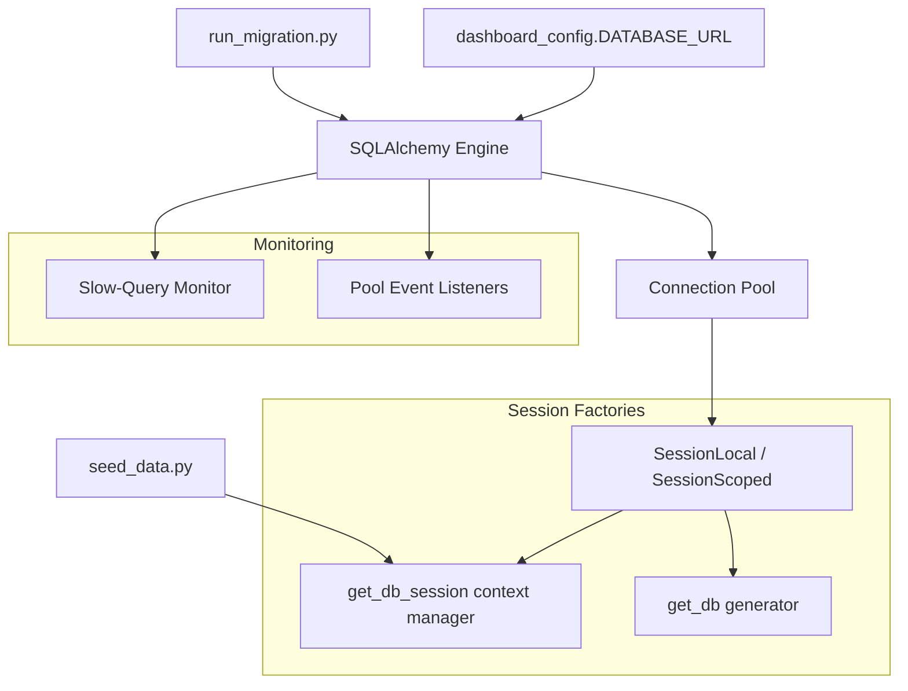

# Database

> Connection management, migrations, and seed data for the PFD Dashboard.

## Overview

The database sub-block provides the persistence layer for the PFD Fault Diagnosis Dashboard. It manages SQLAlchemy engine configuration, connection pooling, session lifecycle, schema migrations, and initial seed data. The system supports both **PostgreSQL** (production) and **SQLite** (development/testing) backends via SQLAlchemy's dialect abstraction.

All ORM models live in the sibling `models/` package (see [models/README.md](../models/README.md)). This package owns the infrastructure — connection creation, session factories, migration execution, and data seeding.

## Architecture



## Key Components

| Component              | Description                                                    | File               |
| ---------------------- | -------------------------------------------------------------- | ------------------ |
| `engine`               | SQLAlchemy engine with connection pool configuration           | `connection.py`    |
| `SessionLocal`         | Non-scoped session factory (autocommit=False, autoflush=False) | `connection.py`    |
| `SessionScoped`        | Thread-scoped session (wraps `SessionLocal`)                   | `connection.py`    |
| `get_db_session()`     | Context manager with auto-commit/rollback/close                | `connection.py`    |
| `get_db()`             | Generator-based session provider (dependency injection)        | `connection.py`    |
| `init_database()`      | Creates all tables via `Base.metadata.create_all()`            | `connection.py`    |
| `run_migration()`      | Executes a single SQL migration file                           | `run_migration.py` |
| `run_all_migrations()` | Runs all `.sql` files in `migrations/` in sorted order         | `run_migration.py` |
| `seed_initial_data()`  | Seeds default admin user and default dataset                   | `seed_data.py`     |

## Quick Start

### Initialize the Database

```python
from database.connection import init_database
init_database()  # Creates all tables from ORM models
```

### Use a Database Session

```python
from database.connection import get_db_session

with get_db_session() as session:
    users = session.query(User).all()
    # Auto-commits on success, auto-rollbacks on exception
```

### Run Migrations

```bash
# Run all pending migrations
python -m database.run_migration

# Run a specific migration
python -m database.run_migration --migration 001_add_api_keys.sql
```

### Seed Initial Data

```bash
python -m database.seed_data
```

This creates:

- A default `admin` user (username: `admin`, email: `admin@localhost`, role: `admin`)
- A default dataset entry pointing to the Phase 0 cache (if the cache file exists)

## Connection Pooling

Connection pool settings are configured at engine creation time in `connection.py`.

| Setting                 | PostgreSQL      | SQLite        |
| ----------------------- | --------------- | ------------- |
| `pool_pre_ping`         | `True`          | `True`        |
| `pool_recycle`          | `3600` (1 hour) | `3600`        |
| `pool_size`             | `30`            | N/A (default) |
| `max_overflow`          | `30`            | N/A (default) |
| `pool_timeout`          | `30` seconds    | N/A (default) |
| `max_identifier_length` | `128`           | N/A           |
| `echo`                  | `False`         | `False`       |

The pool is sized for ~16 peak concurrent connections (Dash/Plotly callback architecture) plus headroom.

## Performance Monitoring

The engine registers SQLAlchemy event listeners for query performance tracking:

- **`before_cursor_execute`** — Records query start time on the connection info dict.
- **`after_cursor_execute`** — Logs a warning for any query exceeding **1 second**.
- **`Pool.connect`** — Logs new database connections at DEBUG level.
- **`Pool.checkout`** — Hook for future pool utilization metrics.

## Migration Workflow

Migrations are raw SQL files stored in `database/migrations/` and executed sequentially by filename sort order.

### Available Migrations

| #   | File                                    | Purpose                                        |
| --- | --------------------------------------- | ---------------------------------------------- |
| 001 | `001_add_api_keys.sql`                  | API key tables and usage tracking              |
| 002 | `002_add_notification_preferences.sql`  | User notification preferences                  |
| 003 | `003_add_email_logs.sql`                | Email audit trail                              |
| 004 | `004_add_email_digest_queue.sql`        | Batched digest email queue                     |
| 005 | `005_add_webhook_configurations.sql`    | Webhook integration configs                    |
| 006 | `006_add_webhook_logs.sql`              | Webhook delivery logs                          |
| 007 | `007_add_tags_and_search.sql`           | Tags, experiment tags, saved searches          |
| 008 | `008_add_dataset_generation_import.sql` | Dataset generation/import job tracking         |
| 009 | `009_add_xai_indexes.sql`               | XAI explanation indexes                        |
| 010 | `010_add_2fa_sessions.sql`              | 2FA, session logs, login history, backup codes |

### Creating a New Migration

1. Create a new `.sql` file in `database/migrations/` with the next sequence number
2. Write idempotent SQL (use `IF NOT EXISTS` where possible)
3. Run: `python -m database.run_migration --migration NNN_description.sql`

## Dependencies

- **Requires:** `dashboard_config.DATABASE_URL`, `models.base.Base`, `utils.logger`
- **Provides:** `engine`, `SessionLocal`, `SessionScoped`, `get_db_session()`, `get_db()`, `init_database()`

## Configuration

The database URL is sourced from `dashboard_config.DATABASE_URL`. The engine auto-detects the backend dialect (PostgreSQL vs. SQLite) and applies appropriate pool settings.

## Related Documentation

- [Models README](../models/README.md) — ORM model catalog
- [Schema Guide](./SCHEMA_GUIDE.md) — ER diagram and table reference
