# Schema Guide

> Complete reference for all database tables, relationships, and indexing strategies.

## ER Diagram

```mermaid
erDiagram
    users ||--o{ api_keys : "has"
    users ||--o{ session_logs : "has"
    users ||--o{ notification_preferences : "has"
    users ||--o{ email_logs : "sent to"
    users ||--o{ email_digest_queue : "queued for"
    users ||--o{ webhook_configurations : "owns"
    users ||--o{ webhook_logs : "triggered by"
    users ||--o{ saved_searches : "owns"
    users ||--o{ system_logs : "performed by"

    datasets ||--o{ experiments : "used by"
    datasets ||--o{ signals : "contains"
    datasets ||--o{ nas_campaigns : "used by"

    experiments ||--o{ training_runs : "contains"
    experiments ||--o{ experiment_tags : "tagged with"
    experiments ||--o{ explanations : "explained by"

    hpo_campaigns ||--o{ experiments : "spawns"

    tags ||--o{ experiment_tags : "applied via"

    api_keys ||--o{ api_usage : "tracked by"
    api_keys ||--o{ api_request_logs : "logged by"

    webhook_configurations ||--o{ webhook_logs : "logged by"

    nas_campaigns ||--o{ nas_trials : "contains"

    users {
        int id PK
        string username UK
        string email UK
        string password_hash
        string role
        bool is_active
        string totp_secret
        bool totp_enabled
        datetime created_at
        datetime updated_at
    }

    datasets {
        int id PK
        string name UK
        string description
        int num_signals
        json fault_types
        json severity_levels
        string file_path
        json meta_data
        int created_by FK
        datetime created_at
        datetime updated_at
    }

    signals {
        int id PK
        int dataset_id FK
        string signal_id
        string fault_class
        string severity
        string file_path
        float rms
        float kurtosis
        float dominant_frequency
        datetime created_at
        datetime updated_at
    }

    experiments {
        int id PK
        string name UK
        string model_type
        int dataset_id FK
        enum status
        json config
        json hyperparameters
        json metrics
        int best_epoch
        int total_epochs
        float duration_seconds
        string model_path
        string onnx_path
        string results_dir
        text notes
        tsvector search_vector
        int created_by FK
        int hpo_campaign_id FK
        datetime created_at
        datetime updated_at
    }

    training_runs {
        int id PK
        int experiment_id FK
        int epoch
        float train_loss
        float val_loss
        float train_accuracy
        float val_accuracy
        float learning_rate
        float duration_seconds
        string checkpoint_path
        datetime created_at
        datetime updated_at
    }

    api_keys {
        int id PK
        int user_id FK
        string key_hash UK
        string name
        string prefix
        array scopes
        int rate_limit
        timestamp last_used_at
        bool is_active
        timestamp expires_at
        timestamp created_at
        timestamp updated_at
    }

    api_usage {
        int id PK
        int api_key_id FK
        string endpoint
        string method
        int status_code
        int response_time_ms
        timestamp timestamp
    }

    api_request_logs {
        int id PK
        string endpoint
        string method
        int status_code
        datetime request_time
        float response_time_ms
        int request_size_bytes
        int response_size_bytes
        string ip_address
        text user_agent
        int api_key_id FK
        text error_message
        json request_payload_sample
        json response_payload_sample
        datetime created_at
        datetime updated_at
    }

    api_metrics_summary {
        int id PK
        datetime period_start
        datetime period_end
        string aggregation_type
        int total_requests
        int successful_requests
        int failed_requests
        float avg_response_time_ms
        float p50_response_time_ms
        float p95_response_time_ms
        float p99_response_time_ms
        float requests_per_second
        float error_rate
        json endpoint_metrics
        datetime created_at
        datetime updated_at
    }

    notification_preferences {
        int id PK
        int user_id FK
        string event_type
        bool email_enabled
        bool in_app_enabled
        bool slack_enabled
        bool webhook_enabled
        string email_frequency
        datetime created_at
        datetime updated_at
    }

    email_logs {
        int id PK
        int user_id FK
        string recipient_email
        string event_type
        string subject
        string template_name
        json event_data
        string provider
        string message_id
        string status
        text error_message
        datetime sent_at
        datetime delivered_at
        datetime opened_at
        datetime clicked_at
        int retry_count
        datetime created_at
        datetime updated_at
    }

    email_digest_queue {
        int id PK
        int user_id FK
        string event_type
        json event_data
        datetime scheduled_for
        bool included_in_digest
        datetime created_at
        datetime updated_at
    }

    webhook_configurations {
        int id PK
        int user_id FK
        string provider_type
        text webhook_url
        string name
        text description
        bool is_active
        jsonb enabled_events
        jsonb settings
        datetime last_used_at
        text last_error
        int consecutive_failures
        datetime created_at
        datetime updated_at
    }

    webhook_logs {
        int id PK
        int webhook_config_id FK
        int user_id FK
        string event_type
        string provider_type
        text webhook_url
        jsonb payload
        string status
        int http_status_code
        text response_body
        text error_message
        int retry_count
        datetime sent_at
        datetime created_at
        datetime updated_at
    }

    tags {
        int id PK
        string name UK
        string slug UK
        string color
        int created_by FK
        int usage_count
        datetime created_at
        datetime updated_at
    }

    experiment_tags {
        int id PK
        int experiment_id FK
        int tag_id FK
        int added_by FK
        datetime created_at
        datetime updated_at
    }

    saved_searches {
        int id PK
        int user_id FK
        string name
        text query
        bool is_pinned
        int usage_count
        datetime last_used_at
        datetime created_at
        datetime updated_at
    }

    hpo_campaigns {
        int id PK
        string name UK
        enum method
        enum status
        string base_model_type
        int dataset_id FK
        json search_space
        json budget
        int trials_completed
        int trials_total
        int best_experiment_id FK
        float best_accuracy
        int created_by FK
        datetime created_at
        datetime updated_at
    }

    explanations {
        int id PK
        int experiment_id FK
        string signal_id
        string method
        json explanation_data
        string file_path
        datetime created_at
        datetime updated_at
    }

    system_logs {
        int id PK
        int user_id FK
        string action
        string status
        json details
        string error_message
        datetime created_at
        datetime updated_at
    }

    dataset_generations {
        int id PK
        string name
        json config
        enum status
        int num_signals
        int num_faults
        string output_path
        int progress
        string celery_task_id
        float duration_seconds
        datetime created_at
        datetime updated_at
    }

    dataset_imports {
        int id PK
        string name
        json config
        enum status
        int num_files
        int num_signals
        string output_path
        int progress
        string celery_task_id
        float duration_seconds
        datetime created_at
        datetime updated_at
    }

    session_logs {
        int id PK
        int user_id FK
        string session_token UK
        string ip_address
        string user_agent
        string device_type
        string browser
        string location
        datetime last_active
        bool is_active
        datetime logged_out_at
        datetime created_at
        datetime updated_at
    }

    login_history {
        int id PK
        int user_id FK
        string ip_address
        string user_agent
        string location
        string login_method
        bool success
        string failure_reason
        datetime timestamp
        datetime created_at
        datetime updated_at
    }

    backup_codes {
        int id PK
        int user_id FK
        string code_hash UK
        bool is_used
        datetime used_at
        string ip_address
        datetime created_at
        datetime updated_at
    }

    nas_campaigns {
        int id PK
        string name
        int dataset_id FK
        string search_algorithm
        int num_trials
        int max_epochs_per_trial
        json search_space_config
        string status
        int best_trial_id FK
        float best_accuracy
        string task_id
        text error_message
        datetime created_at
        datetime updated_at
    }

    nas_trials {
        int id PK
        int campaign_id FK
        int trial_number
        json architecture
        string architecture_hash
        float validation_accuracy
        float validation_loss
        float training_time
        int num_parameters
        bigint flops
        float model_size_mb
        json metrics
        datetime created_at
        datetime updated_at
    }
```

## Table Catalog

| Table                      | Model Class              | File                                | Key Columns                                                                                                                  |
| -------------------------- | ------------------------ | ----------------------------------- | ---------------------------------------------------------------------------------------------------------------------------- |
| `users`                    | `User`                   | `models/user.py`                    | `username` (unique), `email` (unique), `role`, `is_active`, `totp_enabled`                                                   |
| `datasets`                 | `Dataset`                | `models/dataset.py`                 | `name` (unique), `num_signals`, `fault_types` (JSON), `file_path`, FK → `users`                                              |
| `signals`                  | `Signal`                 | `models/signal.py`                  | `signal_id`, `fault_class`, `severity`, `rms`, `kurtosis`, FK → `datasets`                                                   |
| `experiments`              | `Experiment`             | `models/experiment.py`              | `name` (unique), `model_type`, `status` (enum), `config` (JSON), `metrics` (JSON), FK → `datasets`, `users`, `hpo_campaigns` |
| `training_runs`            | `TrainingRun`            | `models/training_run.py`            | `epoch`, `train_loss`, `val_loss`, `train_accuracy`, `val_accuracy`, FK → `experiments`                                      |
| `api_keys`                 | `APIKey`                 | `models/api_key.py`                 | `key_hash` (unique), `prefix`, `scopes` (array), `rate_limit`, `is_active`, FK → `users`                                     |
| `api_usage`                | `APIUsage`               | `models/api_key.py`                 | `endpoint`, `method`, `status_code`, `response_time_ms`, FK → `api_keys`                                                     |
| `api_request_logs`         | `APIRequestLog`          | `models/api_request_log.py`         | `endpoint`, `method`, `status_code`, `response_time_ms`, `ip_address`, FK → `api_keys`                                       |
| `api_metrics_summary`      | `APIMetricsSummary`      | `models/api_request_log.py`         | `period_start`, `aggregation_type`, `total_requests`, `avg_response_time_ms`, `p95_response_time_ms`                         |
| `notification_preferences` | `NotificationPreference` | `models/notification_preference.py` | `event_type`, `email_enabled`, `email_frequency`, FK → `users`, UQ(`user_id`, `event_type`)                                  |
| `email_logs`               | `EmailLog`               | `models/email_log.py`               | `recipient_email`, `event_type`, `status`, `sent_at`, FK → `users`                                                           |
| `email_digest_queue`       | `EmailDigestQueue`       | `models/email_digest_queue.py`      | `event_type`, `scheduled_for`, `included_in_digest`, FK → `users`                                                            |
| `webhook_configurations`   | `WebhookConfiguration`   | `models/webhook_configuration.py`   | `provider_type`, `webhook_url`, `is_active`, `enabled_events` (JSONB), FK → `users`, UQ(`user_id`, `webhook_url`)            |
| `webhook_logs`             | `WebhookLog`             | `models/webhook_log.py`             | `event_type`, `status`, `http_status_code`, FK → `webhook_configurations`, `users`                                           |
| `tags`                     | `Tag`                    | `models/tag.py`                     | `name` (unique), `slug` (unique), `color`, `usage_count`, FK → `users`                                                       |
| `experiment_tags`          | `ExperimentTag`          | `models/tag.py`                     | FK → `experiments`, `tags`, `users`, UQ(`experiment_id`, `tag_id`)                                                           |
| `saved_searches`           | `SavedSearch`            | `models/saved_search.py`            | `name`, `query`, `is_pinned`, `usage_count`, FK → `users`, UQ(`user_id`, `name`)                                             |
| `hpo_campaigns`            | `HPOCampaign`            | `models/hpo_campaign.py`            | `name` (unique), `method` (enum), `status` (enum), `search_space` (JSON), FK → `datasets`, `experiments`, `users`            |
| `explanations`             | `Explanation`            | `models/explanation.py`             | `signal_id`, `method`, `explanation_data` (JSON), FK → `experiments`                                                         |
| `system_logs`              | `SystemLog`              | `models/system_log.py`              | `action`, `status`, `details` (JSON), FK → `users`                                                                           |
| `dataset_generations`      | `DatasetGeneration`      | `models/dataset_generation.py`      | `name`, `status` (enum), `progress`, `celery_task_id`                                                                        |
| `dataset_imports`          | `DatasetImport`          | `models/dataset_import.py`          | `name`, `status` (enum), `progress`, `celery_task_id`                                                                        |
| `session_logs`             | `SessionLog`             | `models/session_log.py`             | `session_token` (unique), `device_type`, `is_active`, FK → `users`                                                           |
| `login_history`            | `LoginHistory`           | `models/login_history.py`           | `login_method`, `success`, `timestamp`, FK → `users`                                                                         |
| `backup_codes`             | `BackupCode`             | `models/backup_code.py`             | `code_hash` (unique), `is_used`, FK → `users`                                                                                |
| `nas_campaigns`            | `NASCampaign`            | `models/nas_campaign.py`            | `name`, `search_algorithm`, `status`, FK → `datasets`, `nas_trials`                                                          |
| `nas_trials`               | `NASTrial`               | `models/nas_campaign.py`            | `trial_number`, `architecture` (JSON), `validation_accuracy`, FK → `nas_campaigns`                                           |

## Relationships

### Foreign Key Map

| Source Table               | Column               | Target Table             | On Delete |
| -------------------------- | -------------------- | ------------------------ | --------- |
| `datasets`                 | `created_by`         | `users`                  | —         |
| `signals`                  | `dataset_id`         | `datasets`               | —         |
| `experiments`              | `dataset_id`         | `datasets`               | —         |
| `experiments`              | `created_by`         | `users`                  | —         |
| `experiments`              | `hpo_campaign_id`    | `hpo_campaigns`          | —         |
| `training_runs`            | `experiment_id`      | `experiments`            | —         |
| `api_keys`                 | `user_id`            | `users`                  | CASCADE   |
| `api_usage`                | `api_key_id`         | `api_keys`               | CASCADE   |
| `api_request_logs`         | `api_key_id`         | `api_keys`               | —         |
| `notification_preferences` | `user_id`            | `users`                  | CASCADE   |
| `email_logs`               | `user_id`            | `users`                  | SET NULL  |
| `email_digest_queue`       | `user_id`            | `users`                  | CASCADE   |
| `webhook_configurations`   | `user_id`            | `users`                  | CASCADE   |
| `webhook_logs`             | `webhook_config_id`  | `webhook_configurations` | CASCADE   |
| `webhook_logs`             | `user_id`            | `users`                  | SET NULL  |
| `tags`                     | `created_by`         | `users`                  | SET NULL  |
| `experiment_tags`          | `experiment_id`      | `experiments`            | CASCADE   |
| `experiment_tags`          | `tag_id`             | `tags`                   | CASCADE   |
| `experiment_tags`          | `added_by`           | `users`                  | SET NULL  |
| `saved_searches`           | `user_id`            | `users`                  | CASCADE   |
| `hpo_campaigns`            | `dataset_id`         | `datasets`               | —         |
| `hpo_campaigns`            | `best_experiment_id` | `experiments`            | —         |
| `hpo_campaigns`            | `created_by`         | `users`                  | —         |
| `explanations`             | `experiment_id`      | `experiments`            | —         |
| `system_logs`              | `user_id`            | `users`                  | —         |
| `session_logs`             | `user_id`            | `users`                  | —         |
| `login_history`            | `user_id`            | `users`                  | —         |
| `backup_codes`             | `user_id`            | `users`                  | CASCADE   |
| `nas_campaigns`            | `dataset_id`         | `datasets`               | CASCADE   |
| `nas_campaigns`            | `best_trial_id`      | `nas_trials`             | —         |
| `nas_trials`               | `campaign_id`        | `nas_campaigns`          | CASCADE   |

### ORM Relationships (back_populates / backref)

| Parent Model           | Attribute                  | Child Model              | Type                  |
| ---------------------- | -------------------------- | ------------------------ | --------------------- |
| `User`                 | `api_keys`                 | `APIKey`                 | One-to-Many (cascade) |
| `User`                 | `sessions`                 | `SessionLog`             | One-to-Many (cascade) |
| `User`                 | `notification_preferences` | `NotificationPreference` | One-to-Many (backref) |
| `User`                 | `email_logs`               | `EmailLog`               | One-to-Many (backref) |
| `User`                 | `digest_queue`             | `EmailDigestQueue`       | One-to-Many (backref) |
| `User`                 | `webhook_configurations`   | `WebhookConfiguration`   | One-to-Many (backref) |
| `User`                 | `webhook_logs`             | `WebhookLog`             | One-to-Many (backref) |
| `User`                 | `saved_searches`           | `SavedSearch`            | One-to-Many (backref) |
| `Dataset`              | `experiments`              | `Experiment`             | One-to-Many (backref) |
| `Dataset`              | `signals`                  | `Signal`                 | One-to-Many (backref) |
| `Dataset`              | `nas_campaigns`            | `NASCampaign`            | One-to-Many (backref) |
| `Experiment`           | `training_runs`            | `TrainingRun`            | One-to-Many (cascade) |
| `Experiment`           | `experiment_tags`          | `ExperimentTag`          | One-to-Many (backref) |
| `APIKey`               | `usage_records`            | `APIUsage`               | One-to-Many (cascade) |
| `APIKey`               | `request_logs`             | `APIRequestLog`          | One-to-Many           |
| `WebhookConfiguration` | `logs`                     | `WebhookLog`             | One-to-Many (backref) |
| `Tag`                  | `experiment_tags`          | `ExperimentTag`          | One-to-Many (cascade) |
| `NASCampaign`          | `trials`                   | `NASTrial`               | One-to-Many (cascade) |

## Indexing Strategy

### Column-Level Indexes

Most high-cardinality lookup columns have `index=True` at the column level:

- **Unique indexes:** `users.username`, `users.email`, `datasets.name`, `experiments.name`, `api_keys.key_hash`, `tags.name`, `tags.slug`, `session_logs.session_token`, `backup_codes.code_hash`
- **Foreign key indexes:** All FK columns are auto-indexed in PostgreSQL; many have explicit `index=True` for SQLite compatibility
- **Filter indexes:** `experiments.model_type`, `experiments.status`, `api_keys.is_active`, `api_keys.prefix`, `webhook_configurations.provider_type`, `webhook_configurations.is_active`

### Composite Indexes

| Table                 | Index Name                           | Columns                               | Purpose                              |
| --------------------- | ------------------------------------ | ------------------------------------- | ------------------------------------ |
| `training_runs`       | `ix_training_runs_experiment_epoch`  | `experiment_id`, `epoch`              | Ordered epoch queries per experiment |
| `email_digest_queue`  | `idx_digest_queue_user_scheduled`    | `user_id`, `scheduled_for`            | User-specific digest queries         |
| `email_digest_queue`  | `idx_digest_queue_included`          | `included_in_digest`, `scheduled_for` | Pending digest batch queries         |
| `email_digest_queue`  | `idx_digest_queue_event_scheduled`   | `event_type`, `scheduled_for`         | Event-type filtering                 |
| `api_metrics_summary` | `ix_api_metrics_summary_period_type` | `period_start`, `aggregation_type`    | Time-windowed metric queries         |
| `system_logs`         | `idx_system_log_time_status`         | `created_at`, `status`                | Time-based status filtering          |
| `system_logs`         | `idx_system_log_user_time`           | `user_id`, `created_at`               | User activity log queries            |
| `backup_codes`        | `ix_backup_codes_user_unused`        | `user_id`, `is_used`                  | Finding available codes for a user   |
| `nas_trials`          | `ix_nas_trials_campaign_trial`       | `campaign_id`, `trial_number`         | Ordered trial queries per campaign   |

### Unique Constraints

| Table                      | Constraint Name             | Columns                   |
| -------------------------- | --------------------------- | ------------------------- |
| `notification_preferences` | `uq_user_event_type`        | `user_id`, `event_type`   |
| `webhook_configurations`   | `uq_user_webhook_url`       | `user_id`, `webhook_url`  |
| `experiment_tags`          | `uq_experiment_tag`         | `experiment_id`, `tag_id` |
| `saved_searches`           | `uq_user_saved_search_name` | `user_id`, `name`         |

## Enumerations

| Enum Class                | Values                                                             | Used By                                      |
| ------------------------- | ------------------------------------------------------------------ | -------------------------------------------- |
| `ExperimentStatus`        | `pending`, `running`, `paused`, `completed`, `failed`, `cancelled` | `experiments.status`, `hpo_campaigns.status` |
| `HPOMethod`               | `grid_search`, `random_search`, `bayesian`, `hyperband`            | `hpo_campaigns.method`                       |
| `DatasetGenerationStatus` | `pending`, `running`, `completed`, `failed`, `cancelled`           | `dataset_generations.status`                 |
| `DatasetImportStatus`     | `pending`, `running`, `completed`, `failed`, `cancelled`           | `dataset_imports.status`                     |

## Related Documentation

- [Database README](./README.md) — Architecture, connections, migrations
- [Models README](../models/README.md) — ORM model catalog
