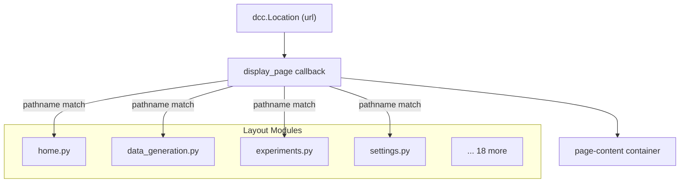

# Dashboard Layouts

> Page layout modules for the Plotly Dash application. Each module exports a `create_*_layout()` function that returns a Dash component tree.

## Overview

The `layouts/` directory contains 22 Python modules, each defining one page of the LSTM PFD Dashboard. Pages are rendered into the `page-content` container by the routing callback in `callbacks/__init__.py`, which maps URL pathnames to layout functions.

## Architecture

## Page Catalog

All routes verified from [`callbacks/__init__.py`](../callbacks/__init__.py).

### Data Management

| Route              | Layout File          | Entry Function                    | Description                                                                                                  |
| ------------------ | -------------------- | --------------------------------- | ------------------------------------------------------------------------------------------------------------ |
| `/`                | `home.py`            | `create_home_layout()`            | Dashboard overview — stat cards, quick actions, recent experiments, health gauge, dataset distribution chart |
| `/data-generation` | `data_generation.py` | `create_data_generation_layout()` | Synthetic signal generation and MAT file import                                                              |
| `/data-explorer`   | `data_explorer.py`   | `create_data_explorer_layout()`   | Interactive dataset browser with filtering and t-SNE                                                         |
| `/signal-viewer`   | `signal_viewer.py`   | `create_signal_viewer_layout()`   | Time/frequency/spectrogram signal analysis                                                                   |
| `/datasets`        | `datasets.py`        | `create_datasets_layout()`        | Dataset management (upload, version, list)                                                                   |

### ML Pipeline

| Route                      | Layout File                | Entry Function                                        | Description                                                             |
| -------------------------- | -------------------------- | ----------------------------------------------------- | ----------------------------------------------------------------------- |
| `/experiments`             | `experiments.py`           | `create_experiments_layout()`                         | Experiment history with search, filter, and multi-select for comparison |
| `/experiment/new`          | `experiment_wizard.py`     | `create_experiment_wizard_layout()`                   | Multi-step experiment creation wizard                                   |
| `/experiment/{id}/monitor` | `training_monitor.py`      | `create_training_monitor_layout(experiment_id)`       | Real-time training progress with loss/accuracy curves                   |
| `/experiment/{id}/results` | `experiment_results.py`    | `create_experiment_results_layout(experiment_id)`     | Post-training results — confusion matrix, per-class metrics             |
| `/compare?ids=1,2,3`       | `experiment_comparison.py` | `create_experiment_comparison_layout(experiment_ids)` | Side-by-side comparison of 2–3 experiments with statistical tests       |
| `/feature-engineering`     | `feature_engineering.py`   | `create_feature_engineering_layout()`                 | Feature engineering tools                                               |
| `/hpo/campaigns`           | `hpo_campaigns.py`         | `create_hpo_campaigns_layout()`                       | Hyperparameter optimization campaign management                         |
| `/nas`                     | `nas_dashboard.py`         | `create_nas_dashboard_layout()`                       | Neural Architecture Search dashboard                                    |

### Analytics

| Route               | Layout File               | Entry Function                         | Description                                 |
| ------------------- | ------------------------- | -------------------------------------- | ------------------------------------------- |
| `/xai`              | `xai_dashboard.py`        | `create_xai_dashboard_layout()`        | Explainability dashboard (SHAP, LIME, etc.) |
| `/visualization`    | `visualization.py`        | `create_visualization_layout()`        | Advanced result visualization               |
| `/evaluation`       | `evaluation_dashboard.py` | `create_evaluation_dashboard_layout()` | Model evaluation dashboard                  |
| `/testing`          | `testing_dashboard.py`    | `create_testing_dashboard_layout()`    | Testing & QA dashboard                      |
| `/model-comparison` | `model_comparison.py`     | `create_model_comparison_layout()`     | Statistical model comparison                |

### Production & System

| Route             | Layout File         | Entry Function                   | Description                                              |
| ----------------- | ------------------- | -------------------------------- | -------------------------------------------------------- |
| `/deployment`     | `deployment.py`     | `create_deployment_layout()`     | Deployment management dashboard                          |
| `/api-monitoring` | `api_monitoring.py` | `create_api_monitoring_layout()` | API monitoring (admin only)                              |
| `/system-health`  | `system_health.py`  | `create_system_health_layout()`  | Real-time CPU/memory/disk monitoring (admin only)        |
| `/settings`       | `settings.py`       | `create_settings_layout()`       | Application settings, API keys, notification preferences |

### Pages Without Registered Routes

The following layout files exist in the directory but are **not registered** in the routing callback:

| Layout File                  | Entry Function                            | Notes                                                |
| ---------------------------- | ----------------------------------------- | ---------------------------------------------------- |
| `email_digest_management.py` | `create_email_digest_management_layout()` | Email digest UI — may be embedded in settings        |
| `model_comparison.py`        | `create_model_comparison_layout()`        | No direct route; may be accessed via experiment flow |

## Layout Conventions

1. **Function naming**: Every layout module exports a `create_*_layout()` function
2. **Return type**: All functions return a `dbc.Container` (fluid) or `html.Div`
3. **Component IDs**: Use descriptive, hyphenated IDs (e.g., `home-total-signals`, `system-health-gauge`)
4. **Bootstrap Grid**: Use `dbc.Row` / `dbc.Col` for responsive layout
5. **Cards**: Wrap sections in `dbc.Card` with `className="shadow-sm"`
6. **Icons**: Font Awesome 6 via `html.I(className="fas fa-*")`

## Dependencies

- **Requires:** `dash`, `dash-bootstrap-components`, `components/` (sidebar, header, footer, cards, skeleton)
- **Provides:** Layout functions consumed by `callbacks/__init__.py` routing

## Related Documentation

- [Components README](../components/README.md) — Reusable UI components
- [UI Guide](../UI_GUIDE.md) — How to add new pages and components
- [Callbacks (IDB 2.3)](../callbacks/) — Callback registration and routing
- [Services (IDB 2.2)](../services/) — Backend services consumed by layouts
