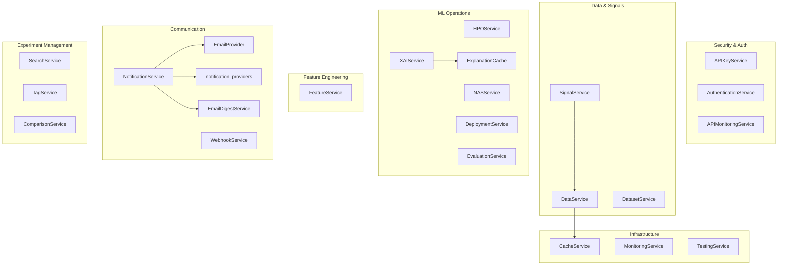

# Backend Services

> Centralized service layer providing business logic for the LSTM-PFD Dashboard Platform.

## Overview

The `packages/dashboard/services/` directory contains **24 service classes** (plus a `notification_providers` sub-package) that implement all backend business logic for the dashboard. Services follow a **static-method pattern** — most classes expose only `@staticmethod` methods, meaning no instantiation is required. The exceptions are `MonitoringService` (uses instance state for background thread management) and `EmailProvider` subclasses (use instance state for provider configuration).

Services act as the intermediary between callbacks/tasks (IDB 2.3, 2.4) and database models (IDB 4.1), encapsulating validation, error handling, and cross-cutting concerns like caching and logging.

## Architecture



## Service Catalog

| Service                 | File                        | Responsibility                                                                                            | Key Dependencies                                         |
| ----------------------- | --------------------------- | --------------------------------------------------------------------------------------------------------- | -------------------------------------------------------- |
| `APIKeyService`         | `api_key_service.py`        | API key generation, verification (bcrypt), revocation, usage logging                                      | `models.api_key`, `bcrypt`                               |
| `APIMonitoringService`  | `api_monitoring_service.py` | API request logging, latency percentiles, endpoint metrics, error logs                                    | `models.api_request_log`, `models.api_key`               |
| `AuthenticationService` | `authentication_service.py` | TOTP/2FA setup & verification, backup codes, sessions, login history                                      | `models.user`, rate-limit state                          |
| `CacheService`          | `cache_service.py`          | Redis get/set/delete/invalidate-pattern, cache stats                                                      | `redis`, `dashboard_config`                              |
| `ComparisonService`     | `comparison_service.py`     | Multi-experiment comparison, McNemar & Friedman tests, key-difference detection                           | `models.experiment`, `utils.statistical_tests`           |
| `DataService`           | `data_service.py`           | Dataset CRUD, signal loading from HDF5, dataset stats (cached)                                            | `models.dataset`, `h5py`, `CacheService`                 |
| `DatasetService`        | `dataset_service.py`        | Advanced dataset management — pagination, preview, export (HDF5/MAT/CSV), archival                        | `models.dataset`, `h5py`                                 |
| `DeploymentService`     | `deployment_service.py`     | Model export (ONNX), quantization (dynamic/static INT8, FP16), pruning, benchmarking                      | `torch`, `models.experiment`                             |
| `EmailDigestService`    | `email_digest_service.py`   | Digest queue stats, pending/history queries, trigger Celery processing                                    | `models.email_digest_queue`                              |
| `EmailProvider`         | `email_provider.py`         | Abstract email interface + `SendGridProvider`, `SMTPProvider`, `EmailProviderFactory`, `EmailRateLimiter` | `sendgrid`, `smtplib`                                    |
| `EvaluationService`     | `evaluation_service.py`     | ROC data, error analysis, architecture comparison, noise robustness testing, result caching               | `models.experiment`, `torch`                             |
| `ExplanationCache`      | `explanation_cache.py`      | DB-backed XAI explanation cache — store, retrieve, prune, statistics                                      | `models.explanation`                                     |
| `FeatureService`        | `feature_service.py`        | Feature extraction (time/freq/wavelet/bispectrum/envelope), importance, selection, correlation            | `models.dataset`, `h5py`, `numpy`                        |
| `HPOService`            | `hpo_service.py`            | HPO campaign CRUD, progress tracking, result export, parameter importance, research artifacts             | `models.hpo_campaign`, `models.experiment`               |
| `MonitoringService`     | `monitoring_service.py`     | System health (CPU/RAM/disk via `psutil`), background metrics collection, alerting                        | `psutil`, `models.system_log`                            |
| `NASService`            | `nas_service.py`            | NAS campaign creation, architecture sampling/hashing, best-architecture export (PyTorch/JSON)             | `models.nas_campaign`                                    |
| `NotificationService`   | `notification_service.py`   | Multi-channel event routing (toast, email, webhook), digest queuing, template rendering                   | `EmailProvider`, `notification_providers`, `redis`       |
| `SearchService`         | `search_service.py`         | Structured query parsing (`tag:`, `accuracy:>`, `status:`), SQL query building, ranking, saved searches   | `models.experiment`, `models.tag`, `models.saved_search` |
| `SignalService`         | `signal_service.py`         | FFT, spectrogram (STFT), basic statistical feature extraction                                             | `scipy`, `DataService`                                   |
| `TagService`            | `tag_service.py`            | Tag CRUD, experiment tagging (add/remove/bulk), autocomplete, popularity stats                            | `models.tag`, `models.experiment`                        |
| `TestingService`        | `testing_service.py`        | Programmatic pytest/coverage execution, benchmark runner, code quality checks (flake8/mypy)               | `subprocess`                                             |
| `WebhookService`        | `webhook_service.py`        | Webhook CRUD, toggle, test delivery, delivery logs, stats                                                 | `models.webhook_configuration`, `notification_providers` |
| `XAIService`            | `xai_service.py`            | SHAP, LIME, Integrated Gradients, Grad-CAM explanation generation via Phase 7 explainers                  | `torch`, `captum` (optional)                             |

### Sub-Package: `notification_providers/`

| Module                       | Responsibility                                                              |
| ---------------------------- | --------------------------------------------------------------------------- |
| `base.py`                    | `NotificationProvider` abstract base class, `NotificationMessage` dataclass |
| `factory.py`                 | `NotificationProviderFactory` — creates provider by type string             |
| `slack_notifier.py`          | Slack webhook integration with Block Kit formatting                         |
| `teams_notifier.py`          | Microsoft Teams webhook integration with Adaptive Cards                     |
| `custom_webhook_notifier.py` | Generic webhook delivery with retry logic                                   |

## Quick Start

```python
from services.data_service import DataService
from services.cache_service import CacheService

# Services use static methods — no instantiation required
datasets = DataService.list_datasets()
stats = DataService.get_dataset_stats(dataset_id=1)

# Cache operations
CacheService.set("my_key", {"data": 42}, ttl=300)
value = CacheService.get("my_key")
```

## Dependencies

- **Requires:**
  - Database models (`models.*`) — IDB 4.1
  - Database connection (`database.connection`) — IDB 4.1
  - Utility modules (`utils.logger`, `utils.exceptions`, `utils.constants`) — IDB 6.0
  - Configuration (`dashboard_config`) — IDB 4.4
  - Redis (for `CacheService`, `NotificationService`)
  - External: `torch`, `numpy`, `scipy`, `h5py`, `bcrypt`, `sendgrid`, `psutil`

- **Provides:**
  - Business logic API consumed by callbacks (IDB 2.3) and async tasks (IDB 2.4)
  - All data access is channelled through services — callbacks never query the DB directly

## Configuration

Services read configuration from `dashboard_config.py` (IDB 4.4), including:

- `REDIS_URL`, `CACHE_TTL_MEDIUM` — used by `CacheService`
- `STORAGE_RESULTS_DIR`, `FAULT_CLASSES` — used by `ComparisonService`
- `EMAIL_DIGEST_PAGE_SIZE` — used by `EmailDigestService`
- `DASH_APP_DIR` — used by `NotificationService`

## Related Documentation

- [Service Catalog](./SERVICE_CATALOG.md) — Detailed per-service reference
- [API Reference](./API.md) — Full method signatures and parameter tables
- [Callbacks](../callbacks/README.md) — IDB 2.3, primary consumer of services
- [Async Tasks](../tasks/README.md) — IDB 2.4, background consumers
- [Database Models](../database/README.md) — IDB 4.1, data layer
