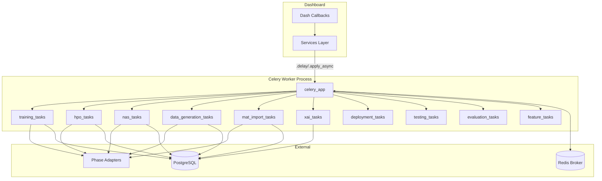

# Async Tasks

> Celery-based background task system for CPU/GPU-intensive dashboard operations.

## Overview

The `tasks/` package provides asynchronous background processing for the PFD Dashboard using [Celery](https://docs.celeryq.dev/). All long-running operations — model training, hyperparameter optimization, data generation, XAI explanation generation, deployment, testing, evaluation, and feature engineering — are executed as Celery tasks to keep the dashboard UI responsive.

The Celery application is initialized in `__init__.py` with Redis as both broker and result backend (configured via `dashboard_config`). Task autodiscovery registers all 10 task modules automatically.

## Architecture



## Task Catalog

| Task Name                          | Celery Signature              | Module                  | Purpose                                                                              |
| ---------------------------------- | ----------------------------- | ----------------------- | ------------------------------------------------------------------------------------ |
| `train_model_task`                 | `@celery_app.task(bind=True)` | `training_tasks`        | Train ML models (classical via Phase1Adapter, deep learning via DeepLearningAdapter) |
| `run_hpo_campaign_task`            | `@celery_app.task(bind=True)` | `hpo_tasks`             | Run Optuna-based hyperparameter optimization campaigns                               |
| `stop_hpo_campaign_task`           | `@celery_app.task`            | `hpo_tasks`             | Stop a running HPO campaign (non-bound)                                              |
| `run_nas_campaign_task`            | `@celery_app.task(bind=True)` | `nas_tasks`             | Run Neural Architecture Search campaigns                                             |
| `generate_dataset_task`            | `@celery_app.task(bind=True)` | `data_generation_tasks` | Generate synthetic vibration datasets via Phase0Adapter                              |
| `import_mat_dataset_task`          | `@celery_app.task(bind=True)` | `mat_import_tasks`      | Import MATLAB `.mat` files via Phase0Adapter                                         |
| `generate_explanation_task`        | `@celery_app.task(bind=True)` | `xai_tasks`             | Generate single-signal XAI explanation (SHAP, LIME, IG, Grad-CAM)                    |
| `generate_batch_explanations_task` | `@celery_app.task(bind=True)` | `xai_tasks`             | Generate explanations for multiple signals sequentially                              |
| `quantize_model_task`              | `@celery_app.task(bind=True)` | `deployment_tasks`      | Quantize models (dynamic, static, FP16)                                              |
| `export_onnx_task`                 | `@celery_app.task(bind=True)` | `deployment_tasks`      | Export models to ONNX format                                                         |
| `optimize_model_task`              | `@celery_app.task(bind=True)` | `deployment_tasks`      | Optimize models via pruning and layer fusion                                         |
| `benchmark_models_task`            | `@celery_app.task(bind=True)` | `deployment_tasks`      | Benchmark model variants (original, quantized, ONNX)                                 |
| `generate_roc_analysis_task`       | `@celery_app.task(bind=True)` | `evaluation_tasks`      | Generate ROC curve analysis for experiments                                          |
| `error_analysis_task`              | `@celery_app.task(bind=True)` | `evaluation_tasks`      | Perform error analysis on experiment predictions                                     |
| `architecture_comparison_task`     | `@celery_app.task(bind=True)` | `evaluation_tasks`      | Compare multiple model architectures                                                 |
| `extract_features_task`            | `@celery_app.task(bind=True)` | `feature_tasks`         | Extract features from dataset by domain                                              |
| `compute_importance_task`          | `@celery_app.task(bind=True)` | `feature_tasks`         | Compute feature importance scores                                                    |
| `select_features_task`             | `@celery_app.task(bind=True)` | `feature_tasks`         | Select features using variance/mutual-info methods                                   |
| `compute_correlation_task`         | `@celery_app.task(bind=True)` | `feature_tasks`         | Compute feature correlation matrix                                                   |
| `run_tests_task`                   | `@celery_app.task(bind=True)` | `testing_tasks`         | Run pytest test suites in background                                                 |
| `run_coverage_task`                | `@celery_app.task(bind=True)` | `testing_tasks`         | Run coverage analysis in background                                                  |
| `run_benchmarks_task`              | `@celery_app.task(bind=True)` | `testing_tasks`         | Run performance benchmarks                                                           |
| `run_quality_checks_task`          | `@celery_app.task(bind=True)` | `testing_tasks`         | Run code quality checks                                                              |

## Quick Start

```python
from tasks.training_tasks import train_model_task

# Launch a training task asynchronously
result = train_model_task.delay({
    "model_type": "lstm",
    "dataset_id": 1,
    "experiment_id": 42,
    "hyperparameters": {"learning_rate": 0.001, "num_epochs": 100},
})

# Check progress
info = result.info  # {'progress': 0.5, 'status': 'Training epoch 50/100'}
```

## Celery Configuration

Configured in `__init__.py` from `dashboard_config`:

| Setting          | Value            | Source                        |
| ---------------- | ---------------- | ----------------------------- |
| Broker           | Redis            | `CELERY_BROKER_URL`           |
| Result Backend   | Redis            | `CELERY_RESULT_BACKEND`       |
| Serializer       | JSON             | Hardcoded                     |
| Accepted Content | JSON             | Hardcoded                     |
| Timezone         | UTC              | Hardcoded                     |
| Eager Mode       | Off (toggleable) | `CELERY_ALWAYS_EAGER` env var |

### Autodiscovery

All 10 task modules are explicitly registered in the `include` parameter:

```python
celery_app = Celery(
    'tasks',
    broker=CELERY_BROKER_URL,
    backend=CELERY_RESULT_BACKEND,
    include=[
        'tasks.data_generation_tasks',
        'tasks.deployment_tasks',
        'tasks.evaluation_tasks',
        'tasks.feature_tasks',
        'tasks.hpo_tasks',
        'tasks.mat_import_tasks',
        'tasks.nas_tasks',
        'tasks.testing_tasks',
        'tasks.training_tasks',
        'tasks.xai_tasks',
    ]
)
```

## Task State Management

All bound tasks (`bind=True`) report progress via `self.update_state()`:

| State      | Meaning                                                |
| ---------- | ------------------------------------------------------ |
| `PENDING`  | Task not yet picked up by a worker                     |
| `PROGRESS` | Task is running; `meta` dict contains progress details |
| `SUCCESS`  | Task completed successfully                            |
| `FAILURE`  | Task raised an exception                               |

The `meta` dictionary typically contains:

- `progress` — numeric progress (0–1 float or 0–100 integer)
- `status` — human-readable status string
- Task-specific fields (e.g., `current_trial`, `total_trials` for HPO)

## Performance

> ⚠️ **Results pending.** Performance metrics below will be populated
> after experiments are run on the current codebase.

| Metric               | Value       |
| -------------------- | ----------- |
| Average task latency | `[PENDING]` |
| Task throughput      | `[PENDING]` |
| Worker concurrency   | `[PENDING]` |

## Dependencies

- **Requires:**
  - `celery` — task queue framework
  - `redis` — broker and result backend
  - `dashboard_config` — broker/backend URLs
  - `utils.logger` — structured logging
  - `database.connection` — SQLAlchemy session management
  - `services.*` — business logic delegates (HPOService, DeploymentService, etc.)
  - `integrations.*` — phase adapters (Phase0Adapter, Phase1Adapter, DeepLearningAdapter)
  - `models.*` — ORM models for DB status tracking
  - `services.notification_service` — email notifications on completion/failure
- **Provides:** Async task execution for all dashboard long-running operations

## Related Documentation

- [Backend Services](../services/README.md) — services layer that tasks delegate to
- [Database](../database/README.md) — ORM models used for status tracking
- [Integration Layer](../../../../integration/README.md) — phase adapters called by tasks
