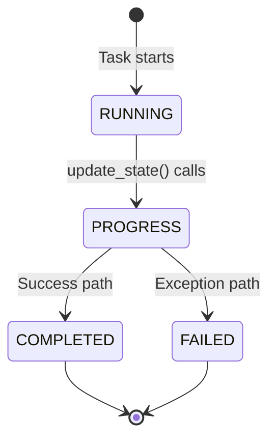

# Async Tasks — Developer Guide

> Patterns, conventions, and recipes for creating and managing Celery tasks.

## Creating a New Task

Every task module follows the same structure. Use this template:

```python
"""
{Description} Celery Tasks.
{One-line purpose}.
"""
from tasks import celery_app
from utils.logger import setup_logger
import traceback

logger = setup_logger(__name__)


@celery_app.task(bind=True)
def my_new_task(self, config: dict):
    """
    Task description.

    Args:
        config: Configuration dictionary
            - param1: Description
            - param2: Description

    Returns:
        Results dictionary
    """
    task_id = self.request.id
    logger.info(f"Starting my_new_task {task_id}")

    try:
        # 1. Report initial progress
        self.update_state(state='PROGRESS', meta={
            'progress': 0.1,
            'status': 'Initializing...'
        })

        # 2. Do work...
        result = do_something(config)

        # 3. Report near-completion
        self.update_state(state='PROGRESS', meta={
            'progress': 0.9,
            'status': 'Finalizing...'
        })

        logger.info(f"my_new_task {task_id} completed")
        return {"success": True, "data": result}

    except Exception as e:
        logger.error(f"my_new_task {task_id} failed: {e}", exc_info=True)
        return {
            "success": False,
            "error": str(e),
            "traceback": traceback.format_exc()
        }
```

### Registration

After creating the module, add it to the `include` list in `__init__.py`:

```python
include=[
    ...,
    'tasks.my_new_tasks',
]
```

## Task Patterns

### Pattern 1: Database Status Tracking

Tasks that track experiment/campaign status update the database at three points:



**Example** (from `training_tasks.py`):

```python
# 1. Mark as running at task start
with get_db_session() as session:
    experiment = session.query(Experiment).filter_by(id=experiment_id).first()
    if experiment:
        experiment.status = ExperimentStatus.RUNNING
        experiment.config["celery_task_id"] = task_id
        session.commit()

# 2. Update progress during execution
self.update_state(state='PROGRESS', meta={'progress': 0.5, 'status': 'Training...'})

# 3. Mark as completed/failed at end
with get_db_session() as session:
    experiment = session.query(Experiment).filter_by(id=experiment_id).first()
    if experiment:
        experiment.status = ExperimentStatus.COMPLETED  # or FAILED
        session.commit()
```

### Pattern 2: Progress Callbacks

Long-running operations (training, data generation, MAT import) use a nested callback function to pipe progress from the adapter/service back to Celery:

```python
def progress_callback(epoch, metrics):
    self.update_state(
        state='PROGRESS',
        meta={
            'epoch': epoch,
            'progress': epoch / total_epochs,
            **metrics
        }
    )
    # Optionally persist to database
    _save_training_run(experiment_id, epoch, metrics)

results = DeepLearningAdapter.train(config, progress_callback=progress_callback)
```

Tasks using this pattern:

- `train_model_task` — epoch-level callbacks
- `generate_dataset_task` — per-signal callbacks
- `import_mat_dataset_task` — per-file callbacks
- `run_hpo_campaign_task` — per-trial/epoch callbacks

### Pattern 3: Notification on Completion/Failure

Tasks that users launch directly emit email notifications via `NotificationService`:

```python
from services.notification_service import NotificationService, get_error_suggestion
from models.notification_preference import EventType

# On success:
NotificationService.emit_event(
    event_type=EventType.TRAINING_COMPLETE,
    user_id=experiment.created_by or 1,
    data={
        'experiment_id': experiment_id,
        'experiment_name': experiment.name,
        'accuracy': metrics.get('test_accuracy', 0),
        'duration': duration_str,
        'results_url': f"http://localhost:8050/experiments/{experiment_id}/results",
        'dashboard_url': 'http://localhost:8050'
    }
)

# On failure:
NotificationService.emit_event(
    event_type=EventType.TRAINING_FAILED,
    user_id=experiment.created_by or 1,
    data={
        'error_message': str(e),
        'error_suggestion': get_error_suggestion(str(e)),
        'error_details_url': f"http://localhost:8050/experiments/{experiment_id}/logs",
    }
)
```

Tasks with notifications: `train_model_task`, `generate_dataset_task`, `import_mat_dataset_task`, `generate_explanation_task`.

> **Note:** Several tasks currently reuse `EventType.TRAINING_COMPLETE` and `EventType.TRAINING_FAILED` for non-training events (data generation, XAI). This is intentional as dedicated event types have not been added yet.

### Pattern 4: Batch Processing

`generate_batch_explanations_task` demonstrates the batch pattern — iterating over items and calling the single-item task function directly (not via `.delay()`):

```python
for i, signal_id in enumerate(signal_ids):
    # Update aggregate progress
    self.update_state(state='PROGRESS', meta={
        'progress': int((i / total) * 100),
        'current': i + 1,
        'total': total,
        'status': f'Processing signal {i+1}/{total}'
    })

    # Call the single-item function directly (synchronous within this task)
    result = generate_explanation_task(individual_config)
    results.append(result)
```

### Pattern 5: Service Delegation

Most tasks delegate the actual computation to a service class, keeping the task function focused on progress reporting, DB status, and error handling:

| Task Module             | Delegates To                                |
| ----------------------- | ------------------------------------------- |
| `training_tasks`        | `Phase1Adapter`, `DeepLearningAdapter`      |
| `hpo_tasks`             | `HPOService`, `DeepLearningAdapter`, Optuna |
| `nas_tasks`             | `NASService`                                |
| `data_generation_tasks` | `Phase0Adapter`                             |
| `mat_import_tasks`      | `Phase0Adapter`                             |
| `xai_tasks`             | `XAIService`, `SignalLoader`                |
| `deployment_tasks`      | `DeploymentService`                         |
| `testing_tasks`         | `TestingService`                            |
| `evaluation_tasks`      | `EvaluationService`                         |
| `feature_tasks`         | `FeatureService`                            |

## Error Handling

### Standard Pattern

All tasks follow a consistent try/except structure:

1. **Try block:** Do work, report progress, return `{"success": True, ...}`
2. **Except block:**
   - Log the error with `exc_info=True`
   - Update database status to `FAILED` (if applicable)
   - Send failure notification (if applicable)
   - Either `raise` (to set Celery state to FAILURE) or return `{"success": False, "error": ..., "traceback": ...}`

> **Convention split:** Tasks that interact with database status tracking (`training_tasks`, `data_generation_tasks`, `mat_import_tasks`, `xai_tasks`) tend to `raise` after cleanup. Service-delegating tasks (`deployment_tasks`, `testing_tasks`, `evaluation_tasks`, `feature_tasks`) tend to return an error dict without raising.

### Nested Error Handling

Tasks with notification support wrap notification calls in their own try/except to prevent notification failures from masking the primary error:

```python
except Exception as e:
    # Primary error handling
    try:
        update_db_status_to_failed()
        try:
            send_failure_notification()
        except Exception as notif_error:
            logger.error(f"Failed to send notification: {notif_error}")
    except Exception as update_error:
        logger.error(f"Failed to update status: {update_error}")
    raise
```

## Debugging & Development

### Eager Mode

Set the `CELERY_ALWAYS_EAGER` environment variable to run tasks synchronously (no worker needed):

```bash
export CELERY_ALWAYS_EAGER=true
python app.py
```

This is configured in `__init__.py`:

```python
if os.getenv('CELERY_ALWAYS_EAGER', 'False').lower() == 'true':
    celery_app.conf.update(task_always_eager=True)
```

### Monitoring Task State

From the dashboard or a Python shell:

```python
from celery.result import AsyncResult
from tasks import celery_app

result = AsyncResult('task-uuid-here', app=celery_app)
print(result.state)   # PENDING, PROGRESS, SUCCESS, FAILURE
print(result.info)    # Meta dict with progress details
```

## Performance

> ⚠️ **Results pending.** Performance metrics below will be populated
> after experiments are run on the current codebase.

| Metric               | Value       |
| -------------------- | ----------- |
| Task execution times | `[PENDING]` |
| Task throughput      | `[PENDING]` |
| Worker memory usage  | `[PENDING]` |

## Related Documentation

- [README.md](./README.md) — task catalog and architecture overview
- [Backend Services](../services/README.md) — service classes that tasks delegate to
- [Database](../database/README.md) — ORM models for status tracking
